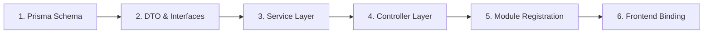

# QUY TRÌNH TẠO CRUD CHUẨN DỰ ÁN (STANDARD CRUD CREATION WORKFLOW)
## Tài liệu hướng dẫn AI & Developer phát triển tính năng mới
**Áp dụng cho:** Hệ sinh thái CEO 1983 (`ceo1983_project`) | **Entity tham chiếu mẫu:** `Sponsors` & `SponsorPackages`

---

## 1. TỔNG QUAN LUỒNG PHÁT TRIỂN (WORKFLOW OVERVIEW)

Khi nhận yêu cầu tạo một module CRUD cho một Entity mới (ví dụ: `News`, `Benefits`, `Testimonials`), AI hoặc Developer BẮT BUỘC tuân thủ đúng 6 bước theo thứ tự sau:



---

## 2. CHI TIẾT TỪNG BƯỚC THỰC HIỆN (STEP-BY-STEP IMPLEMENTATION)

### BƯỚC 1: Khai báo Model trong Prisma Schema
- **Vị trí file:** `packages/db/prisma/schema.prisma`
- **Quy tắc:**
  + Tên bảng chữ thường, số nhiều hoặc snake_case: `model sponsor_packages`, `model sponsors`.
  + Khóa chính dùng `UUID` với giá trị mặc định `@default(dbgenerated("gen_random_uuid()")) @db.Uuid`.
  + Có các trường dấu vết thời gian: `created_at` và `updated_at` kiểu `@db.Timestamptz(6)`.
  + Thiết lập quan hệ khóa ngoại (Foreign Keys) rõ ràng với `onDelete: Cascade` hoặc `NoAction`.

```prisma
// Example: packages/db/prisma/schema.prisma
model sponsor_packages {
  id                  String         @id @default(dbgenerated("gen_random_uuid()")) @db.Uuid
  association_id      String?        @db.Uuid
  tier                String         // 'platinum' | 'gold' | 'silver' | 'bronze'
  price               Decimal        @default(0) @db.Decimal
  benefits            Json?          @default("[]")
  available           Int            @default(0)
  sold                Int            @default(0)
  package_type        String?        @default("cash") // 'cash' | 'in_kind'
  in_kind_description String?
  created_at          DateTime       @default(now()) @db.Timestamptz(6)
  updated_at          DateTime       @default(now()) @db.Timestamptz(6)

  sponsors            sponsors[]

  @@map("sponsor_packages")
}
```

---

### BƯỚC 2: Định nghĩa DTO & Kiểu dữ liệu (Data Transfer Objects)
- **Vị trí file:** `apps/ceo1983_app_be/src/<module-name>/<module-name>.service.ts` (hoặc thư mục con `dto/`)
- **Quy tắc:**
  + Khai báo các class DTO cho Create và Update: `Create<Entity>Dto`, `Update<Entity>Dto`.
  + Sử dụng `export type` cho các enum / union strings.
  + Mọi trường bắt buộc phải có dấu chấm than `!`, trường không bắt buộc có dấu `?`.
  + Tuyệt đối KHÔNG dùng kiểu `any`.

```typescript
// Example: apps/ceo1983_app_be/src/sponsors/sponsors.service.ts
export type SponsorTier = 'platinum' | 'gold' | 'silver' | 'bronze';
export type PackageType = 'cash' | 'in_kind';

export class CreateSponsorPackageDto {
  tier!: SponsorTier;
  price!: number;
  benefits?: string[];
  available?: number;
  sold?: number;
  packageType?: PackageType;
  inKindDescription?: string;
}

export class UpdateSponsorPackageDto {
  tier?: SponsorTier;
  price?: number;
  benefits?: string[];
  available?: number;
  sold?: number;
  packageType?: PackageType;
  inKindDescription?: string;
}
```

---

### BƯỚC 3: Xây dựng Service Layer (Business Logic)
- **Vị trí file:** `apps/ceo1983_app_be/src/<module-name>/<module-name>.service.ts`
- **Quy tắc:**
  + Kế thừa và gắn decorator `@Injectable()`.
  + Inject `PrismaService` qua constructor: `constructor(private prisma: PrismaService) {}`.
  + Viết đầy đủ 5 phương thức CRUD cơ bản: `list()`, `getById(id)`, `create(dto)`, `update(id, dto)`, `delete(id)`.
  + Dùng tagged template queries `this.prisma.$queryRaw\`...\`` để tương thích với cơ sở dữ liệu có sẵn.
  + Kiểm tra sự tồn tại của dữ liệu và ném `NotFoundException`, `BadRequestException` khi vi phạm nghiệp vụ.
  + Chuyển đổi định dạng dữ liệu (Mapping) từ snake_case của DB sang camelCase của API response.

```typescript
// Example: apps/ceo1983_app_be/src/sponsors/sponsors.service.ts
import { Injectable, NotFoundException, BadRequestException } from '@nestjs/common';
import { PrismaService } from '../prisma/prisma.service';

@Injectable()
export class SponsorsService {
  constructor(private prisma: PrismaService) {}

  async listPackages() {
    try {
      const rows = await this.prisma.$queryRaw<any[]>`
        SELECT * FROM public.sponsor_packages
        ORDER BY created_at DESC
      `;
      return (rows || []).map((r) => ({
        id: r.id,
        tier: r.tier || 'bronze',
        price: Number(r.price ?? 0),
        benefits: Array.isArray(r.benefits) ? r.benefits : [],
        available: Number(r.available ?? 0),
        sold: Number(r.sold ?? 0),
        packageType: r.package_type || 'cash',
        inKindDescription: r.in_kind_description || '',
        createdAt: r.created_at,
        updatedAt: r.updated_at,
      }));
    } catch (err: unknown) {
      console.error('[SponsorsService] listPackages error:', err);
      return [];
    }
  }

  async getPackageById(id: string) {
    const rows = await this.prisma.$queryRaw<any[]>`
      SELECT * FROM public.sponsor_packages WHERE id = ${id}::uuid LIMIT 1
    `;
    if (!rows || rows.length === 0) {
      throw new NotFoundException(`Gói tài trợ với ID ${id} không tồn tại`);
    }
    const r = rows[0];
    return {
      id: r.id,
      tier: r.tier,
      price: Number(r.price ?? 0),
      benefits: Array.isArray(r.benefits) ? r.benefits : [],
      available: Number(r.available ?? 0),
      sold: Number(r.sold ?? 0),
      packageType: r.package_type,
      inKindDescription: r.in_kind_description,
    };
  }

  async createPackage(dto: CreateSponsorPackageDto) {
    const benefitsJson = JSON.stringify(dto.benefits || []);
    const rows = await this.prisma.$queryRaw<any[]>`
      INSERT INTO public.sponsor_packages 
        (tier, price, benefits, available, sold, package_type, in_kind_description)
      VALUES 
        (${dto.tier}, ${dto.price}, ${benefitsJson}::jsonb, ${dto.available ?? 0}, 0, ${dto.packageType || 'cash'}, ${dto.inKindDescription || null})
      RETURNING *
    `;
    return rows[0];
  }

  async updatePackage(id: string, dto: UpdateSponsorPackageDto) {
    await this.getPackageById(id); // Kiểm tra tồn tại trước khi cập nhật
    const benefitsJson = JSON.stringify(dto.benefits || []);
    const rows = await this.prisma.$queryRaw<any[]>`
      UPDATE public.sponsor_packages
      SET 
        tier = COALESCE(${dto.tier}, tier),
        price = COALESCE(${dto.price}, price),
        benefits = COALESCE(${benefitsJson}::jsonb, benefits),
        available = COALESCE(${dto.available}, available),
        package_type = COALESCE(${dto.packageType}, package_type),
        in_kind_description = COALESCE(${dto.inKindDescription}, in_kind_description),
        updated_at = NOW()
      WHERE id = ${id}::uuid
      RETURNING *
    `;
    return rows[0];
  }

  async deletePackage(id: string) {
    await this.getPackageById(id);
    await this.prisma.$queryRaw`DELETE FROM public.sponsor_packages WHERE id = ${id}::uuid`;
    return { success: true, message: `Đã xóa thành công gói tài trợ ${id}` };
  }
}
```

---

### BƯỚC 4: Xây dựng Controller Layer (HTTP Endpoints)
- **Vị trí file:** `apps/ceo1983_app_be/src/<module-name>/<module-name>.controller.ts`
- **Quy tắc:**
  + Controller chỉ làm nhiệm vụ tiếp nhận HTTP request và ủy quyền cho Service (Thin Controller).
  + Gắn `@UseGuards(JwtAuthGuard, RolesGuard)` ở cấp độ Controller.
  + Phân quyền cụ thể qua `@Roles('superadmin', 'adm', 'admin', 'bqt', 'btc')`.
  + Gắn `@UseInterceptors(DataScopeInterceptor)` và `@DataScope('entity')` nếu cần lọc dữ liệu theo phạm vi chi hội/ban.

```typescript
// Example: apps/ceo1983_app_be/src/sponsors/sponsors.controller.ts
import {
  Controller,
  Get,
  Post,
  Put,
  Delete,
  Body,
  Param,
  UseGuards,
  UseInterceptors,
} from '@nestjs/common';
import {
  SponsorsService,
  CreateSponsorPackageDto,
  UpdateSponsorPackageDto,
} from './sponsors.service';
import { JwtAuthGuard } from '../auth/jwt-auth.guard';
import { RolesGuard } from '../auth/roles.guard';
import { Roles } from '../auth/roles.decorator';

@Controller('sponsors')
@UseGuards(JwtAuthGuard, RolesGuard)
export class SponsorsController {
  constructor(private readonly sponsorsService: SponsorsService) {}

  @Get('packages')
  async listPackages() {
    return this.sponsorsService.listPackages();
  }

  @Get('packages/:id')
  async getPackageById(@Param('id') id: string) {
    return this.sponsorsService.getPackageById(id);
  }

  @Post('packages')
  @Roles('platform_admin', 'superadmin', 'adm', 'admin', 'bqt', 'btc')
  async createPackage(@Body() body: CreateSponsorPackageDto) {
    return this.sponsorsService.createPackage(body);
  }

  @Put('packages/:id')
  @Roles('platform_admin', 'superadmin', 'adm', 'admin', 'bqt', 'btc')
  async updatePackage(
    @Param('id') id: string,
    @Body() body: UpdateSponsorPackageDto,
  ) {
    return this.sponsorsService.updatePackage(id, body);
  }

  @Delete('packages/:id')
  @Roles('platform_admin', 'superadmin', 'adm', 'admin', 'bqt', 'btc')
  async deletePackage(@Param('id') id: string) {
    return this.sponsorsService.deletePackage(id);
  }
}
```

---

### BƯỚC 5: Đăng ký Module trong NestJS
- **Vị trí file:** `apps/ceo1983_app_be/src/<module-name>/<module-name>.module.ts` và `apps/ceo1983_app_be/src/app.module.ts`
- **Quy tắc:**
  + Tạo module import `PrismaModule` và export Service nếu cần dùng chung.
  + Đăng ký Module vào danh sách `imports` của `AppModule`.

```typescript
// Example: apps/ceo1983_app_be/src/sponsors/sponsors.module.ts
import { Module } from '@nestjs/common';
import { SponsorsController } from './sponsors.controller';
import { SponsorsService } from './sponsors.service';
import { PrismaModule } from '../prisma/prisma.module';

@Module({
  imports: [PrismaModule],
  controllers: [SponsorsController],
  providers: [SponsorsService],
  exports: [SponsorsService],
})
export class SponsorsModule {}
```

---

### BƯỚC 6: Tích hợp Frontend theo kiến trúc Đóng gói Chức năng (Feature-First Architecture)
- **Vị trí thư mục:** `apps/ceo1983_app_fe/src/features/<ten-chuc-nang>/`
- **Quy tắc bắt buộc:** Toàn bộ code liên quan đến chức năng phải gom vào đúng thư mục mang tên chức năng đó:
  + `api.ts`: Toàn bộ các hàm gọi API chuẩn RESTful APIs (`GET`, `POST`, `PUT`, `PATCH`, `DELETE`).
  + `types.ts`: Toàn bộ TypeScript interfaces, types, status enums của chức năng.
  + `components/`: Toàn bộ các UI component trực thuộc chức năng (Card, Board, Table, Form Modal, Detail Drawer).
  + `index.ts`: Barrel export toàn bộ API, Types, Components.
  + Route file: `apps/ceo1983_app_fe/src/routes/<ten-chuc-nang>.tsx` chỉ đóng vai trò page wrapper import từ `@/features/<ten-chuc-nang>`.
- **API Standard:** Sử dụng `fetchNestApi<T>` từ `@/lib/api-client` để tự động đính kèm JWT Bearer Token.
- **UI Standard:** Tuân thủ chuẩn màu CEO 1983 (Deep Cobalt Navy `#003B95`, Warm Amber Gold `#F59E0B`).

```tsx
// Cấu trúc thư mục chuẩn mẫu cho một chức năng:
// apps/ceo1983_app_fe/src/features/sponsors/
// ├── api.ts              # Các hàm RESTful API (list, create, update, delete)
// ├── types.ts            # Định nghĩa Interface & Types
// ├── components/         # SponsorCard.tsx, SponsorModal.tsx, SponsorTable.tsx
// └── index.ts            # export * from './api'; export * from './types'; export * from './components'

// Example Frontend Hook: apps/ceo1983_app_fe/src/features/sponsors/api.ts
import { useQuery, useMutation, useQueryClient } from "@tanstack/react-query";
import { fetchNestApi } from "@/lib/api-client";
import { toast } from "sonner";

export interface SponsorPackage {
  id: string;
  tier: string;
  price: number;
  benefits: string[];
  available: number;
  sold: number;
}

export function useSponsorPackages() {
  const queryClient = useQueryClient();

  const query = useQuery({
    queryKey: ["sponsor-packages"],
    queryFn: () => fetchNestApi<SponsorPackage[]>("/api/sponsors/packages"),
  });

  const createMutation = useMutation({
    mutationFn: (payload: Partial<SponsorPackage>) =>
      fetchNestApi("/api/sponsors/packages", {
        method: "POST",
        body: JSON.stringify(payload),
      }),
    onSuccess: () => {
      toast.success("Tạo gói tài trợ thành công!");
      queryClient.invalidateQueries({ queryKey: ["sponsor-packages"] });
    },
    onError: (err: any) => {
      toast.error(err.message || "Không thể tạo gói tài trợ");
    },
  });

  return { ...query, createPackage: createMutation.mutate };
}
```

---

## 3. CÁC TIÊU CHUẨN NÂNG CAO MỚI (ADVANCED PLATFORM STANDARDS)

### 3.1. Tiêu chuẩn 5 Dạng Hiển Thị (5 View Modes Standard)
Khi xây dựng hoặc nâng cấp các màn hình quản lý công việc, lịch trình, tiến độ (`tasks`, `projects`, `events`):
1. **Dạng bảng (Table View):** Hiển thị chi tiết theo cột, phân trang, lọc nhanh, hiển thị badge cuộc họp và hành động nhanh.
2. **Dạng lưới (Kanban / Grid View):** Bố cục flex trượt ngang chống dính chùm, thanh điều khiển **Zoom to / Zoom nhỏ (Kích thước)** 3 cấp độ (Thu nhỏ 280px, Tiêu chuẩn 345px, Phóng to 410px), thẻ card thoáng đãng, sắc nét.
3. **Dạng lịch (Calendar Month View):** Lưới lịch tháng tương tác, hiển thị sự kiện/deadline theo ngày, icon họp trực tuyến và nút thêm nhanh theo ngày.
4. **Biểu đồ Thống kê (Statistics Dashboard):** Dashboard phân tích chuyên sâu với Recharts (Donut cơ cấu trạng thái, Bar chart khối lượng theo ban, Area chart tiến độ TB, Bảng xếp hạng hiệu suất các ban và sub-tab Timeline Gantt).
5. **Dạng cây đơn vị (Org Unit / Department Hierarchy View):** Cây phân cấp các Ban chuyên môn (Ban Thiện Nguyện, Ban Truyền Thông, Ban Thành Viên, Ban Tài Chính...) kèm thống kê tổng thể và giao việc theo ban.

### 3.2. Tiêu chuẩn Quản Lý & Tích Hợp Cuộc Họp Trực Tuyến (Meetings Refactor)
Khi xây dựng hoặc nâng cấp phân hệ cuộc họp (`/meetings`) hoặc tích hợp họp vào công việc:
- **3 Nền tảng họp trực tuyến chuẩn:**
  1. **Zoom Meeting:** Prefix mặc định `https://zoom.us/j/`
  2. **Google Meet:** Prefix mặc định `https://meet.google.com/`
  3. **UniWork Meet:** Nền tảng làm việc số nội bộ `https://uni-hrm.ubos.vn/meet/`
- **Thẩm quyền tạo cuộc họp:** Giới hạn đúng 4 vai trò được phép tạo: **Chủ tịch**, **Tổng thư ký**, **Admin**, **Trưởng ban**. Bắt buộc lưu trữ thông tin người tạo (Tên, SĐT, Email).
- **Cơ chế xử lý Cuộc họp đột ngột quan trọng (Khẩn cấp) & Xung đột lịch:**
  + Đánh dấu cờ khẩn cấp (`isUrgent`) và lý do triệu tập đột xuất (`urgentReason`).
  + Nút **"Liên Hệ Điều Phối"**: Mở modal hiển thị ngay thông tin người tạo cuộc họp kèm gọi điện thoại nhanh (`tel:`) và gửi email (`mailto:`) để thống nhất điều phối.
  + Chức năng **"Sắp Xếp Lại Lịch Họp (Reschedule)"**: Cho phép người triệu tập/admin dời ngày/giờ họp và tự động phát thông báo broadcast điều chỉnh đến các bên.
  + Chức năng **"Xóa Cuộc Họp (Delete)"**: Nút xóa màu đỏ kèm modal xác nhận an toàn, thu hồi lịch và xóa vĩnh viễn khỏi hệ thống.

### 3.3. Tiêu chuẩn Ma Trận Phân Quyền Chuẩn RBAC (5 Roles x Feature Columns)
- **Tách biệt 2 Tab độc lập**, không gộp chung quản trị tài khoản vào ma trận vai trò:
  + **Tab 1: Ma Trận Phân Quyền 5 Cấp Bậc (Vai Trò x Chức Năng):**
    - **Dòng bên trái (Rows):** Đúng 5 vai trò chuẩn:
      1. `Quản trị`: Toàn quyền (Xem, Sửa, Xóa, Phân quyền).
      2. `Admin`: Quản trị vận hành (Xem, Sửa, Phân quyền).
      3. `Tổng thư ký`: Điều hành & Thư ký (Xem, Sửa).
      4. `Trưởng ban`: Quản lý chuyên ban (Xem, Sửa - gồm cả Ban Thiện Nguyện & An Sinh Xã Hội mới).
      5. `Hội viên`: Thành viên chính thức (Chỉ Xem).
    - **Cột bên trên (Columns):** Từng chức năng riêng lẻ (Hội viên, Sự kiện, Cuộc họp, Công việc, Thiện nguyện & An sinh, Tài chính, Giao thương, Bầu cử, Truyền thông, Hệ thống...).
    - **Ô giao điểm (Cells):** Render pill/checkbox thao tác trực quan tuân thủ đúng giới hạn quyền của từng vai trò.
  + **Tab 2: Phân Quyền Thao Tác Trực Tiếp Cho Từng Tài Khoản Cá Nhân.**

### 3.4. Nguyên Tắc Nghiêm Cấm Tuyệt Đối (Strict Prohibitions)
- ❌ **Không tự tiện fake dữ liệu:** Luôn dùng dữ liệu thực tế và logic hệ thống CEO 1983.
- ❌ **Không tự ý sửa bảng màu thương hiệu:** Chỉ dùng Deep Cobalt Navy (`#003B95`) và Warm Amber Gold (`#F59E0B`).

