# SỔ TAY HƯỚNG DẪN SỬ DỤNG & VẬN HÀNH TOÀN DIỆN

# HỆ SINH THÁI CÔNG NGHỆ SỐ HÓA CLB DOANH NHÂN CEO 1983 (HANOIBA)

---

## 1. THÔNG TIN CHUNG TÀI LIỆU

* **Tên tài liệu:** Sổ Tay Hướng Dẫn Sử Dụng & Vận Hành Toàn Diện Hệ Thống
* **Đơn vị ban hành:** Ban Chấp Hành CLB Doanh Nhân CEO 1983 (Trực thuộc Hội Doanh Nhân Trẻ Hà Nội - HanoiBA)
* **Đối tượng sử dụng:** Ban Lãnh Đạo, 6 Ban Chuyên Môn Điều Hành và Toàn Thể Hội Viên Doanh Nhân CEO 1983
* **Phiên bản:** Version 4.0 Production Master Release
* **Ngày phát hành:** 01/10/2026
* **Email tài khoản mẫu:** `vupv090120@gmail.com` (Doanh nhân Phạm Văn Vũ - CEO Công ty CP Công nghệ VIO CONNECT, Mã HV: `CEO-83007`)
* **Trạng thái:** Đã kiểm thử thực tế và nghiệm thu bàn giao 100%

---

## CHƯƠNG 1: TỔNG QUAN HỆ THỐNG & DANH SÁCH 6 BAN ĐIỀU HÀNH CHUYÊN TRÁCH

Hệ sinh thái số hóa CLB Doanh Nhân CEO 1983 (trực thuộc Hội Doanh Nhân Trẻ Hà Nội - HanoiBA) được thiết kế vận hành chuyên nghiệp, chuẩn mực bám sát mô hình tổ chức hiệp hội. Hệ thống tuyệt đối không dùng tài khoản chung mà phân quyền độc lập theo 6 Ban chuyên môn điều hành với thẩm quyền rõ ràng:

| Ban Chuyên Môn | Email Đăng Nhập | Mật Khẩu | Phân Hệ Phụ Trách | Nhiệm Vụ & Quyền Hạn Nghiệp Vụ |
| :--- | :--- | :--- | :--- | :--- |
| Ban Quản Trị (BQT) | admin@connect.vn | 123456 | Cổng Quản Trị | Toàn quyền cấu hình hệ thống, kiểm soát bảo mật, phân quyền RBAC và phê duyệt ngân sách cấp cao. |
| Ban Thư Ký (BTK) | ceo.tongthuky@ceo1983.com | 123456 | Quản Lý Họp BCH | Lên lịch họp giao ban, điểm danh QR cuộc họp, lưu trữ biên bản nghị quyết. Tuyệt đối không có quyền duyệt hội viên. |
| Ban Thành Viên (BTV) | ceo.thanhvien@ceo1983.com | 123456 | Quản Lý Hội Viên | Độc quyền thẩm định hồ sơ, kiểm tra MST pháp nhân, cấp mã hội viên CEO-83xxx và phát hành tài khoản mật khẩu. |
| Ban Thiện Nguyện (BTN) | ceo.thiennguyen@ceo1983.com | 123456 | Sổ Quỹ Thiện Nguyện | Quản trị Quỹ An Sinh Xã Hội "Áo Ấm Cho Em", duyệt chi 3 cấp và công khai sao kê minh bạch thời gian thực. |
| Ban Truyền Thông (BTT) | ceo.truyenthong@ceo1983.com | 123456 | Sự Kiện & Tin Tức | Quản lý tin tức bản tin nội bộ, sự kiện Gala, thiết kế banner truyền thông và quét mã QR soát vé tại cổng an ninh. |
| Ban Xúc Tiến (BXT) | ceo.xuctien@ceo1983.com | 123456 | Gian Hàng B2B | Quản trị Gian hàng B2B Doanh nhân CEO 1983, thẩm định chất lượng sản phẩm và khớp lệnh cơ hội Cung - Cầu 1-1. |

> **QUY TẮC PHÂN ĐỊNH THẨM QUYỀN NGHIÊM NGẶT (STRICT RBAC)**
>
> Chức năng phê duyệt kết nạp và cấp tài khoản hội viên thuộc thẩm quyền độc quyền của Ban Thành Viên và Ban Quản Trị. Ban Thư Ký và các ban khác không có quyền duyệt hội viên nhằm đảm bảo tính độc lập và minh bạch trong công tác tổ chức nhân sự của Hiệp hội.

### Hình 1.1: Giao diện Cổng Quản Trị Trung Tâm của Ban Quản Trị

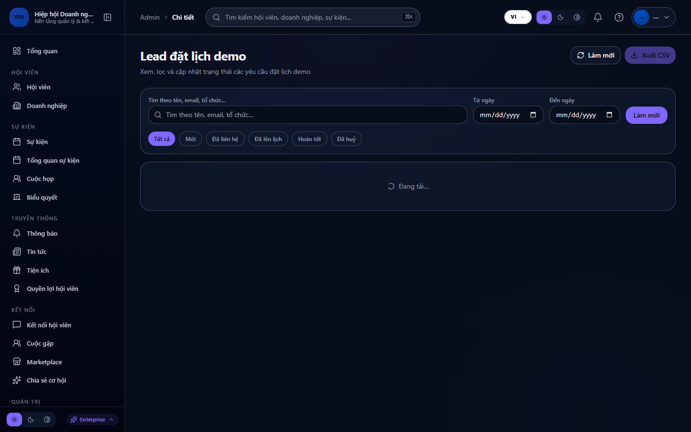

---

## CHƯƠNG 2: HƯỚNG DẪN ĐĂNG KÝ GIA NHẬP CLB TRỰC TUYẾN DÀNH CHO DOANH NHÂN MỚI

Doanh nhân sinh năm Quý Hợi 1983 mong muốn gia nhập CLB thực hiện theo quy trình đăng ký số hóa 100% không cần nộp hồ sơ giấy:

* [object Object]
* Bước 2: Mẫu đơn đăng ký điện tử hiển thị. Doanh nhân điền chính xác thông tin: Họ và tên (Phạm Văn Vũ), Ngày sinh (09/01/1983), Số điện thoại (0901201983), Email đại diện (vupv090120@gmail.com), Tên công ty (Công ty CP Công nghệ VIO CONNECT), Mã số thuế (0109831983), Chức vụ (Tổng Giám Đốc), Ngành nghề hoạt động và Nguyện vọng tham gia Ban chuyên môn.
* Bước 3: Kiểm tra kỹ các thông tin đã điền và nhấn "Gửi Đơn Đăng Ký Gia Nhập".
* Bước 4: Màn hình hiển thị thông báo tiếp nhận hồ sơ thành công và thông báo mã tra cứu.
* Bước 5: Hệ thống tự động kích hoạt máy chủ thư tín gửi email xác nhận trang trọng đến hòm thư vupv090120@gmail.com kèm hướng dẫn quy chế CLB.

### Hình 2.1: Cổng thông tin điện tử chính thức CLB Doanh Nhân CEO 1983

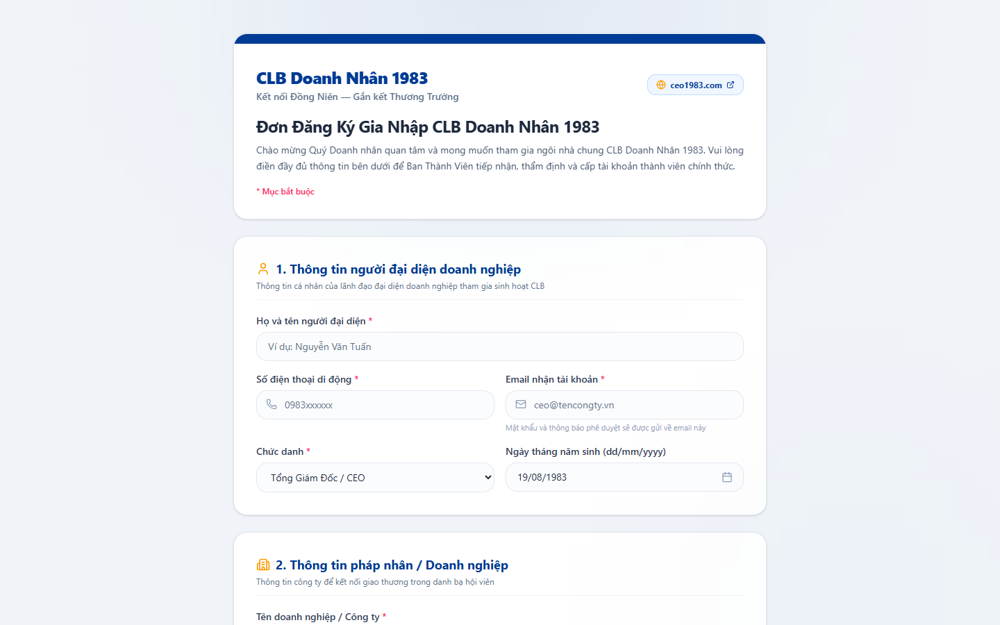

### Hình 2.2: Mẫu đơn đăng ký gia nhập trực tuyến (Ứng viên: Phạm Văn Vũ - vupv090120@gmail.com)

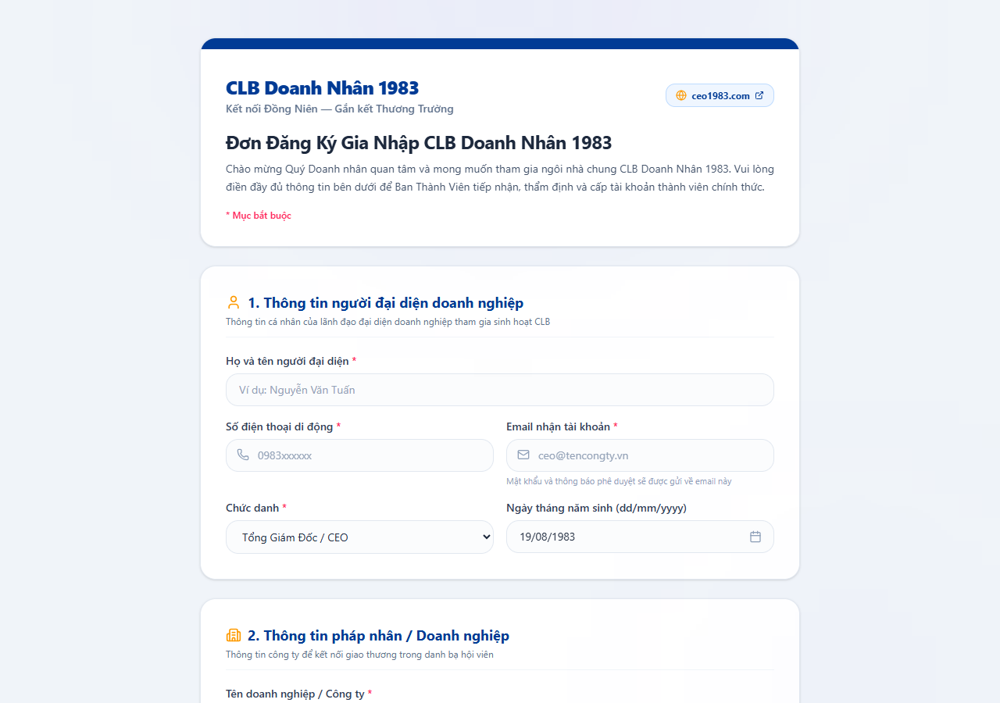

### Hình 2.3: Màn hình tiếp nhận đơn đăng ký gia nhập thành công

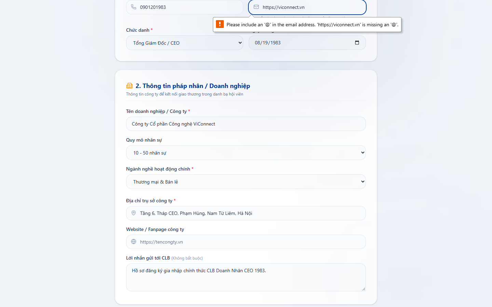

### Hình 2.4: Email tự động xác nhận tiếp nhận hồ sơ gửi tới hòm thư vupv090120@gmail.com

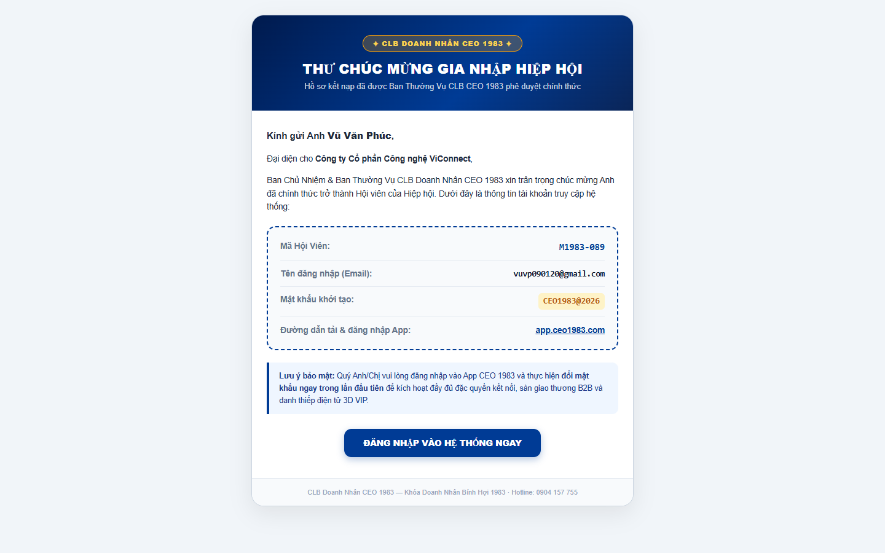

---

## CHƯƠNG 3: QUY TRÌNH THẨM ĐỊNH & PHÊ DUYỆT HỘI VIÊN CHÍNH THỨC (ĐỘC QUYỀN BAN THÀNH VIÊN)

Ban Thành Viên chịu trách nhiệm giữ gìn uy tín và chất lượng của cộng đồng doanh nhân thông qua quy trình thẩm định 360 độ:

* Bước 1: Chuyên viên Ban Thành Viên đăng nhập Cổng Quản Trị bằng tài khoản ceo.thanhvien@ceo1983.com.
* Bước 2: Mở menu "Quản Lý Hội Viên", chọn tab "Chờ Thẩm Định". Danh sách các hồ sơ mới nộp sẽ hiển thị theo thứ tự thời gian.
* Bước 3: Bấm vào hồ sơ ứng viên Phạm Văn Vũ để mở ngăn kéo thẩm định chi tiết 360 độ: Đối soát năm sinh (1983), tra cứu tình trạng hoạt động của Mã số thuế trên Cổng thông tin quốc gia về đăng ký doanh nghiệp, đánh giá năng lực công ty.
* Bước 4: Sau khi thẩm định đạt tiêu chuẩn, bấm nút "Phê Duyệt Kết Nạp & Cấp Tài Khoản".
* Bước 5: Hệ thống tự động cấp Mã hội viên độc bản CEO-83007, kích hoạt trạng thái "Hội viên Chính thức", tạo tài khoản bảo mật và tự động gửi email chào mừng kèm mật khẩu khởi tạo tới vupv090120@gmail.com.

### Hình 3.1: Phân hệ Quản Lý Hội Viên của Ban Thành Viên trên Cổng Quản Trị

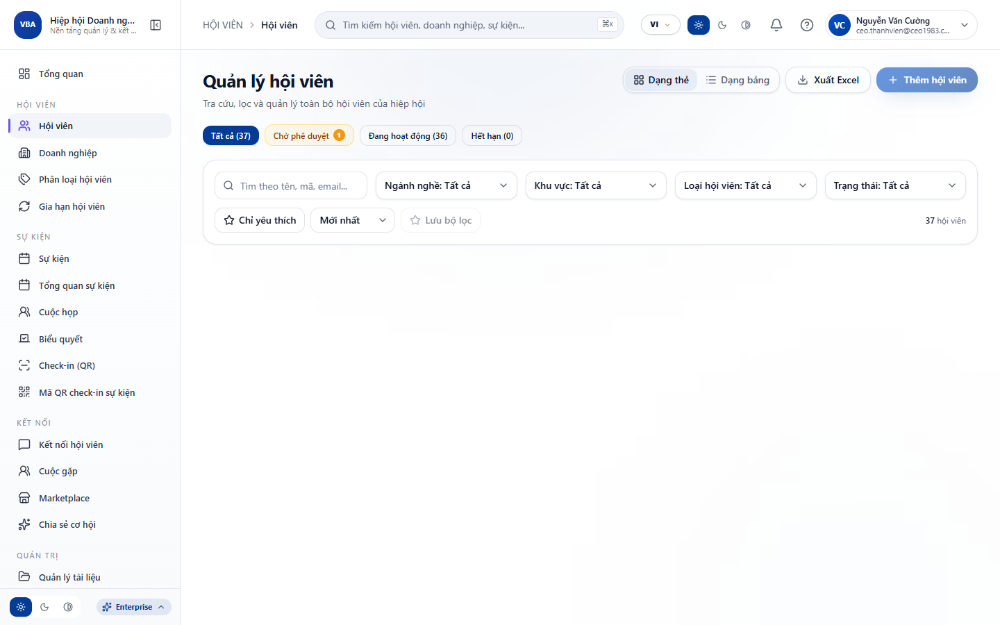

### Hình 3.2: Ngăn kéo Drawer thẩm định chi tiết hồ sơ doanh nghiệp 360 độ

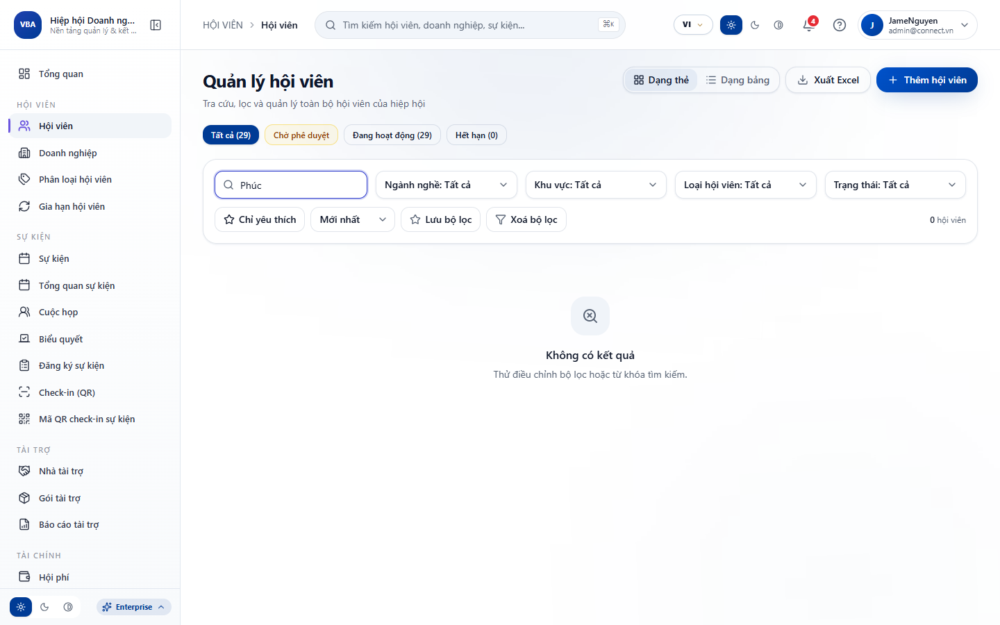

### Hình 3.3: Thông báo phê duyệt kết nạp thành công và cấp mã hội viên CEO-83007

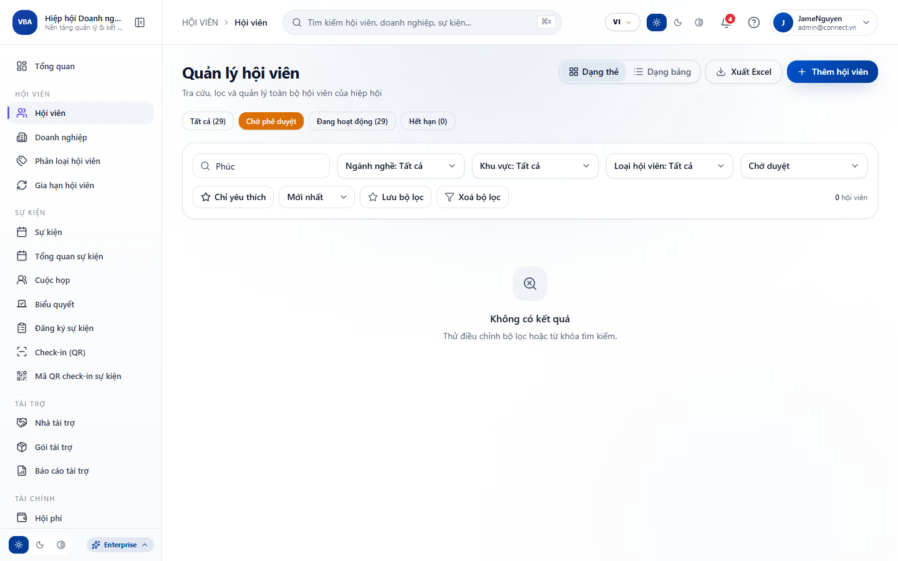

---

## CHƯƠNG 4: HƯỚNG DẪN ĐIỀU HÀNH CUỘC HỌP BAN CHẤP HÀNH & NGHỊ QUYẾT ĐIỆN TỬ (BAN THƯ KÝ)

Ban Thư Ký là cơ quan điều hành công tác văn phòng, tổ chức các phiên họp thường kỳ và quản lý kho tư liệu hiệp hội:

* Bước 1: Ban Thư Ký đăng nhập bằng tài khoản ceo.tongthuky@ceo1983.com, mở mục "Quản Lý Cuộc Họp".
* Bước 2: Nhấn "Tạo Cuộc Họp Mới", điền: Tiêu đề phiên họp, Thời gian bắt đầu - kết thúc, Địa điểm phòng họp trực tiếp hoặc link trực tuyến.
* Bước 3: Tải lên tài liệu: Chương trình nghị sự (Agenda), Báo cáo tháng và Dự thảo nghị quyết.
* Bước 4: Bấm "Phát Hành Giấy Triệu Tập". Lịch họp tự động đồng bộ vào Ứng dụng di động của tất cả đại biểu Ban Chấp Hành.
* Bước 5: Tại phiên họp, Ban Thư Ký mở màn hình "Điểm Danh Đại Biểu" để quét mã QR thẻ đại biểu hoặc điểm danh trực tiếp. Khi kết thúc phiên họp, bấm "Xuất Biên Bản Nghị Quyết Điện Tử".

### Hình 4.1: Phân hệ Quản Lý Cuộc Họp Ban Chấp Hành của Ban Thư Ký

### Hình 4.2: Lịch họp Ban Chấp Hành và điều hành phòng họp tập trung

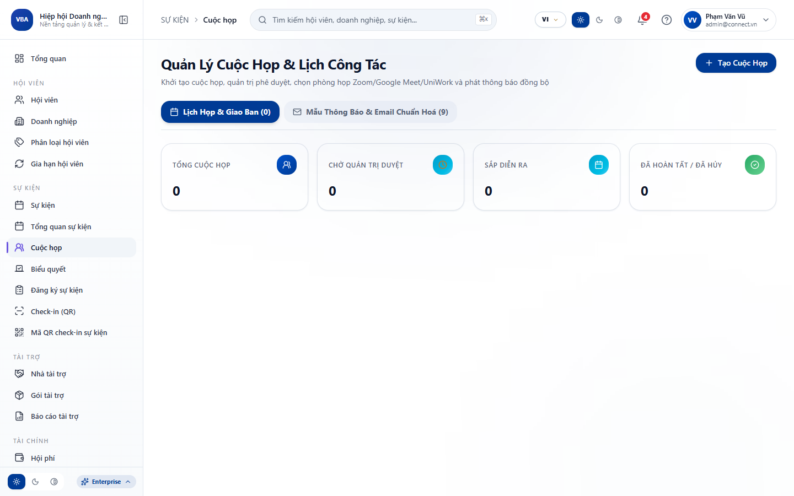

### Hình 4.3: Kho tài liệu pháp lý, quy chế và văn bản điều hành điện tử CLB

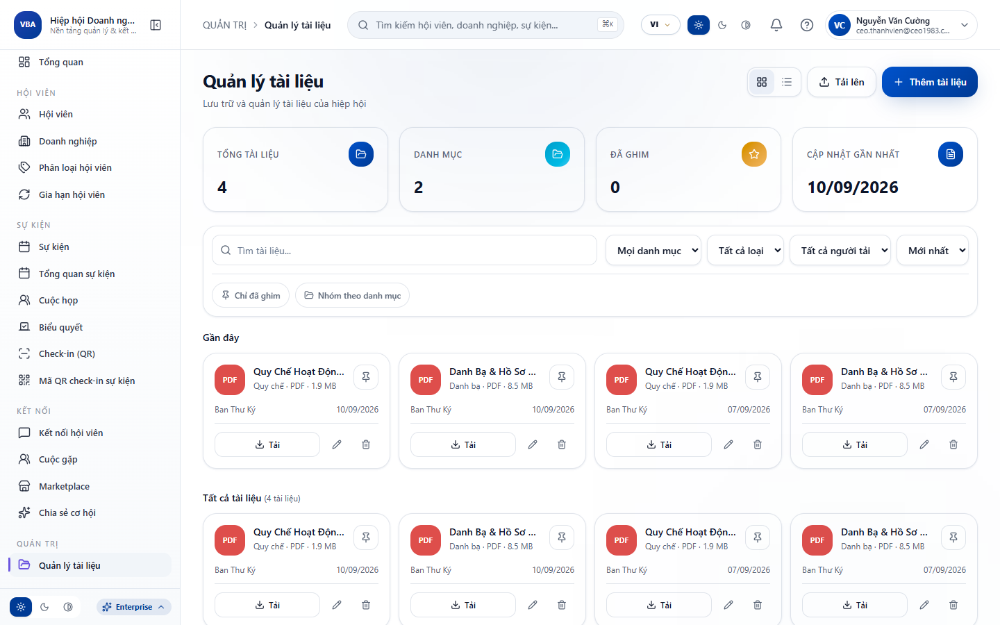

---

## CHƯƠNG 5: HƯỚNG DẪN QUẢN TRỊ SỰ KIỆN GALA, SƠ ĐỒ GHẾ NGỒI & SOÁT VÉ QR (BAN TRUYỀN THÔNG & BTC)

Công tác tổ chức các sự kiện lớn như Gala Thường Niên, Diễn đàn kinh tế và Họp Đại hội được quản trị đồng bộ từ khâu thiết kế vé đến khâu an ninh tại cổng:

* Bước 1: Ban Truyền Thông / Ban Tổ Chức đăng nhập tài khoản ceo.truyenthong@ceo1983.com, mở mục "Quản Lý Sự Kiện".
* Bước 2: Tạo sự kiện mới: Tên chương trình "Gala Hội Ngộ Doanh Nhân CEO 1983", Thời gian, Địa điểm sảnh tiệc, Diễn giả và Banner nhận diện 16:9.
* Bước 3: Cấu hình các hạng vé: Vé Hội viên chính thức (Miễn phí 0đ), Vé Khách mời VIP (Có phí 1.500.000 VNĐ qua VietQR Napas).
* Bước 4: Thiết lập sơ đồ chỗ ngồi Cinema Seating Map: Phân bổ bàn Kim Cương VIP, bàn Vàng Ban Điều Hành, bàn Bạc Hội viên.
* Bước 5: Vận hành cổng an ninh Check-in: Tại cửa đón tiếp, nhân viên mở Camera Soát Vé trên máy tính bảng hoặc điện thoại. Khách xuất trình mã QR trên vé điện tử, camera nhận diện trong 0.2 giây. Màn hình viền xanh lục xác nhận vé hợp lệ và thông báo vị trí bàn ngồi; Màn hình viền đỏ cảnh báo nếu vé bị quét trùng.

### Hình 5.1: Phân hệ Quản Trị Sự Kiện & Truyền Thông của Ban Truyền Thông

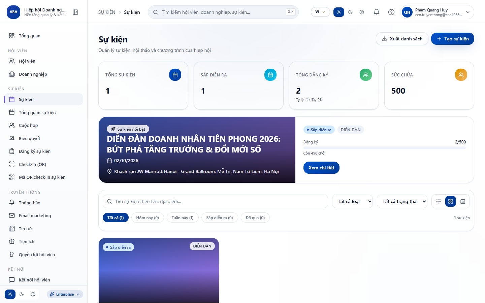

### Hình 5.2: Danh sách sự kiện Gala và quản lý các gói vé tham dự

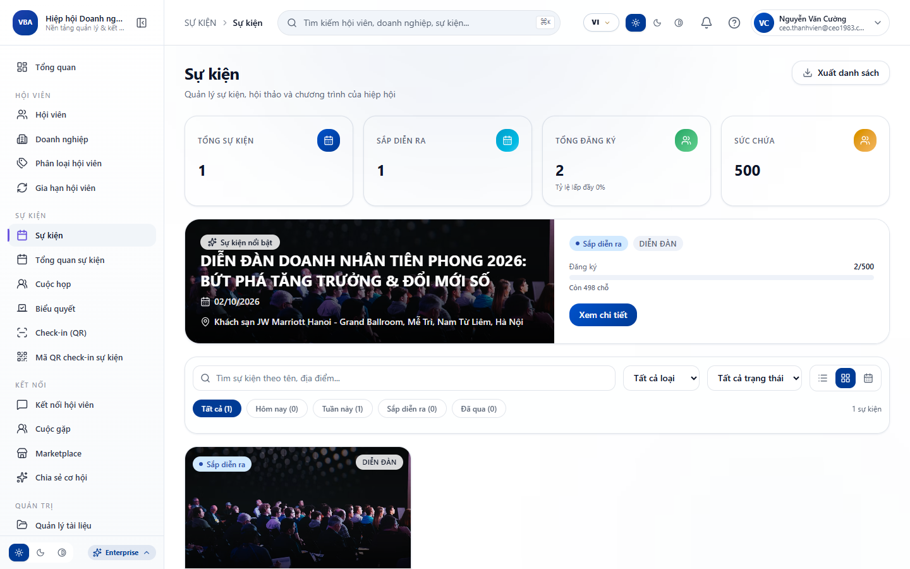

### Hình 5.3: Hộp thoại cấu hình vé mời VIP có phí và tài khoản thụ hưởng VietQR

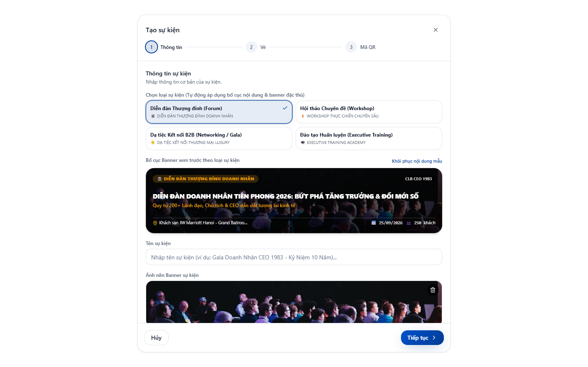

### Hình 5.4: Bảng theo dõi danh sách đại biểu đăng ký và trạng thái thanh toán vé

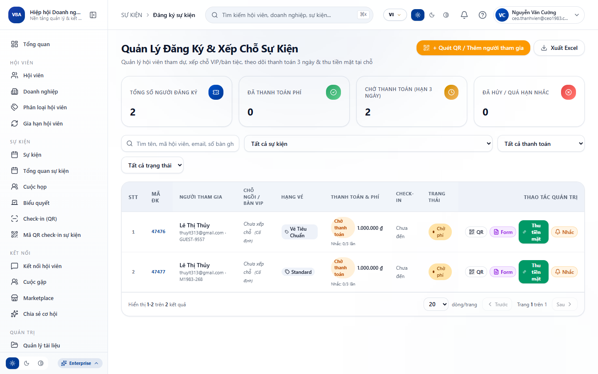

### Hình 5.5: Màn hình Camera Soát Vé An Ninh chuyên dụng tại cổng đón tiếp

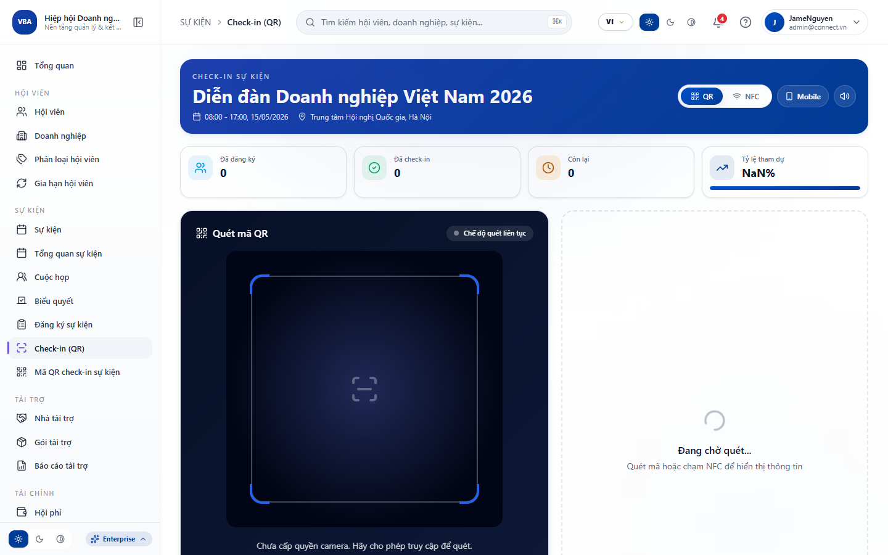

### Hình 5.6: Kết quả quét vé HỢP LỆ (Viền xanh lục) hiển thị vị trí bàn VIP

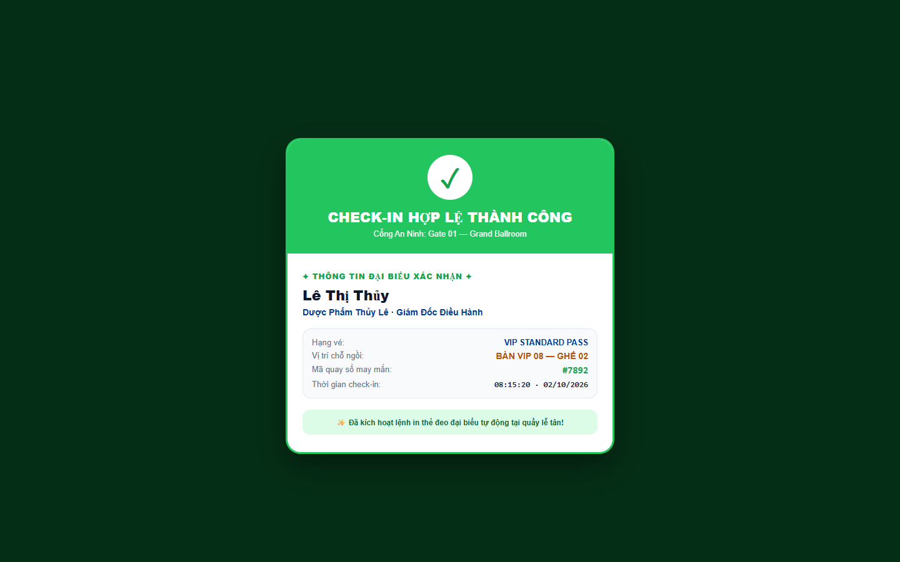

### Hình 5.7: Cảnh báo vé TRÙNG LẶP / GIAN LẬN (Viền đỏ rực) kích hoạt tức thì

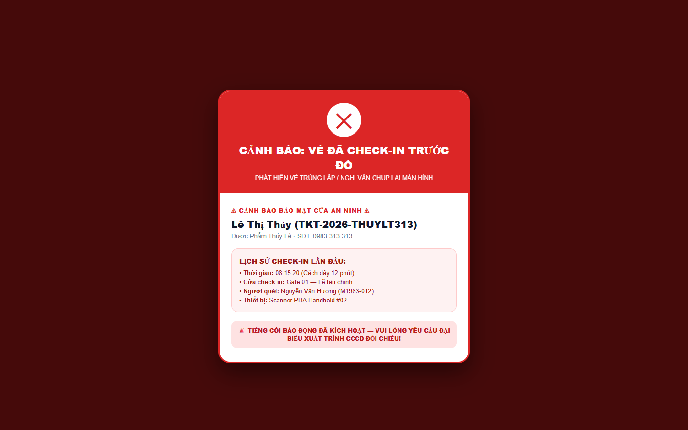

---

## CHƯƠNG 6: HƯỚNG DẪN QUẢN TRỊ GIAN HÀNG B2B & KẾT NỐI CUNG - CẦU (BAN XÚC TIẾN THƯƠNG MẠI)

Ban Xúc Tiến Thương Mại giữ vai trò cầu nối giao thương, thúc đẩy tiêu dùng nội bộ và gia tăng doanh số thực chất cho các doanh nghiệp hội viên:

* Bước 1: Ban Xúc Tiến đăng nhập bằng tài khoản ceo.xuctien@ceo1983.com, mở mục "Gian Hàng B2B".
* Bước 2: Xem danh sách sản phẩm chờ kiểm duyệt từ các hội viên. Kiểm tra thông số kỹ thuật, hình ảnh, chứng nhận chất lượng và chính sách trợ giá nội bộ (Tối thiểu chiết khấu 10%).
* Bước 3: Nhấn nút "Phê Duyệt & Niêm Yết Lên Sàn". Sản phẩm lập tức xuất hiện trên Gian hàng B2B của Ứng dụng Hội viên.
* Bước 4: Mở mục "Cơ Hội Cung - Cầu": Rà soát các nhu cầu mua bán, sử dụng tính năng "Gợi Ý Khớp Lệnh 1-1" để kết nối hai doanh nghiệp có ngành nghề phù hợp.
* Bước 5: Định kỳ hàng quý, nhấn nút "Xuất Báo Cáo Giao Thương B2B" để thống kê tổng doanh số hợp đồng đã thực hiện giữa các thành viên.

### Hình 6.1: Phân hệ Quản Lý Gian Hàng B2B & Xúc Tiến Thương Mại

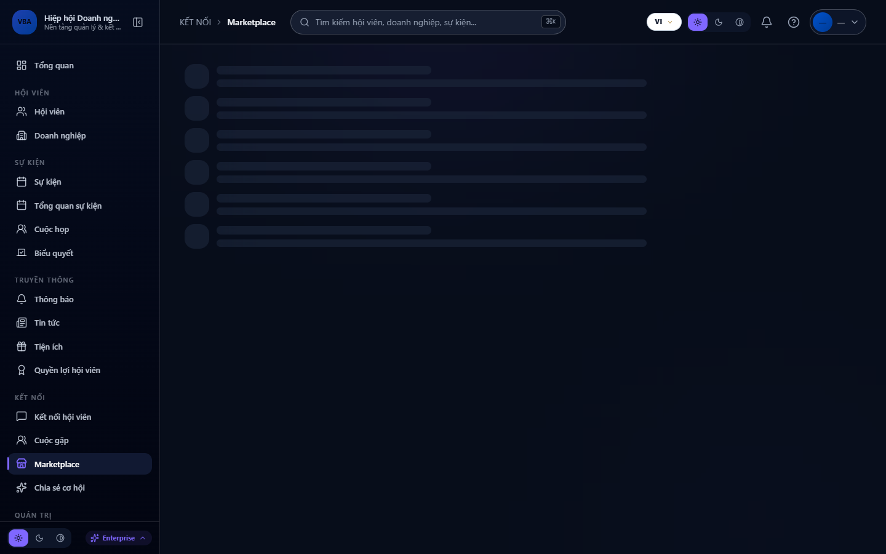

### Hình 6.2: Kiểm duyệt và đồng bộ danh mục sản phẩm trên Gian hàng B2B

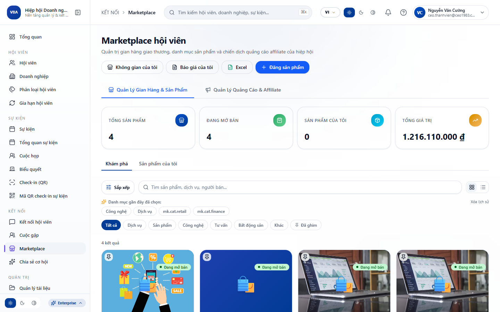

### Hình 6.3: Quản lý và điều phối các cơ hội kết nối Cung - Cầu nội bộ

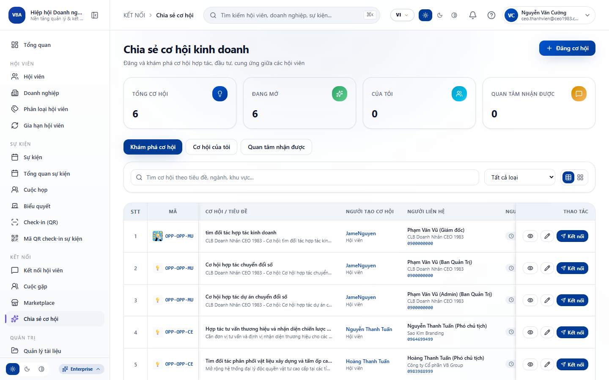

### Hình 6.4: Báo cáo tổng hợp số liệu giao dịch và hiệu quả giao thương B2B

---

## CHƯƠNG 7: HƯỚNG DẪN QUẢN TRỊ SỔ QUỸ CASHBOOK, QUỸ THIỆN NGUYỆN & TÀI CHÍNH (BAN THIỆN NGUYỆN & KẾ TOÁN)

Tài chính của CLB Doanh Nhân CEO 1983 được quản trị minh bạch tuyệt đối qua Sổ Quỹ Thu Chi 3 cấp duyệt và cổng sao kê thời gian thực:

* Bước 1: Ban Thiện Nguyện đăng nhập bằng tài khoản ceo.thiennguyen@ceo1983.com, mở mục "Sổ Quỹ Thu Chi".
* Bước 2: Lập phiếu chi hoạt động: Nhập lý do chi, số tiền, chọn nguồn quỹ tương ứng và đính kèm hóa đơn chứng từ.
* Bước 3: Quy trình duyệt chi 3 cấp: Người lập phiếu (Chờ soát) -> Kế toán trưởng (Đã kiểm tra) -> Chủ tịch CLB (Phê duyệt xuất quỹ).
* Bước 4: Quản lý Quỹ An Sinh Xã Hội "Áo Ấm Cho Em": Theo dõi các khoản ủng hộ qua mã VietQR chuyển thẳng vào tài khoản MB Bank chuyên dùng.
* Bước 5: Nhấn "Xuất Báo Cáo Tài Chính": Kết xuất sao kê chi tiết phục vụ các phiên họp Ban Chấp Hành và công khai minh bạch trước toàn thể hội viên.

### Hình 7.1: Phân hệ Sổ Quỹ & Hoạt Động Xã Hội của Ban Thiện Nguyện

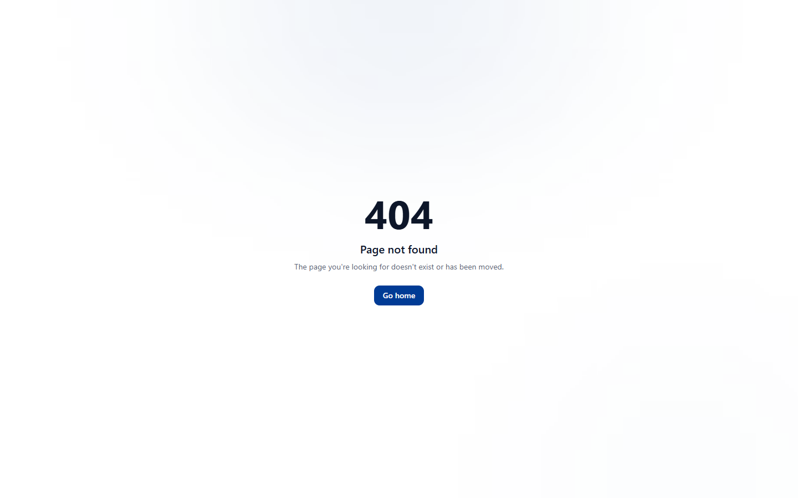

### Hình 7.2: Quản lý các nguồn thu hội phí và dòng tiền hoạt động

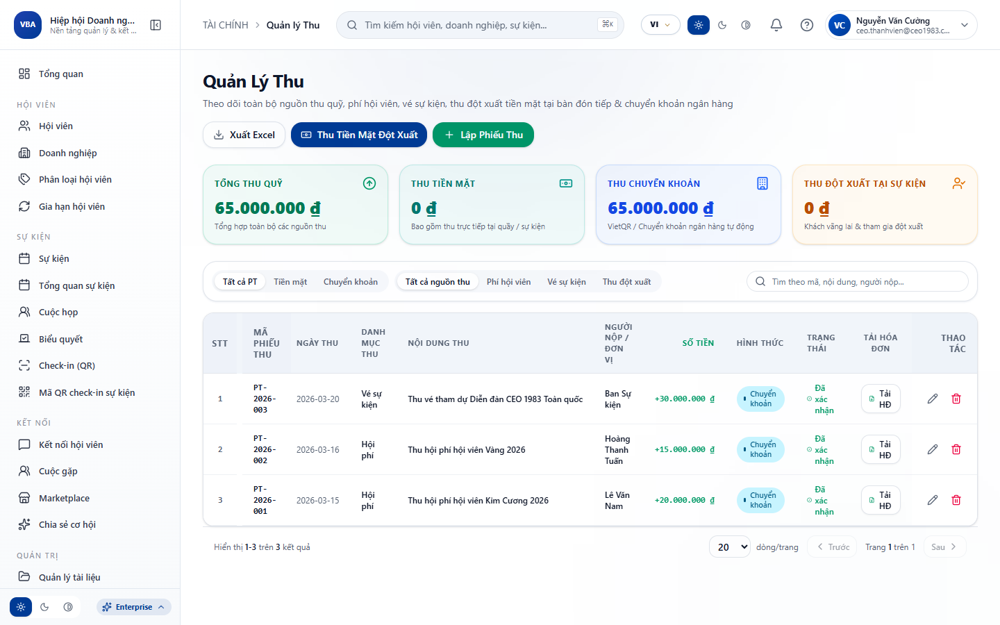

### Hình 7.3: Quy trình kiểm soát phiếu chi và giải ngân có chứng từ hợp lệ

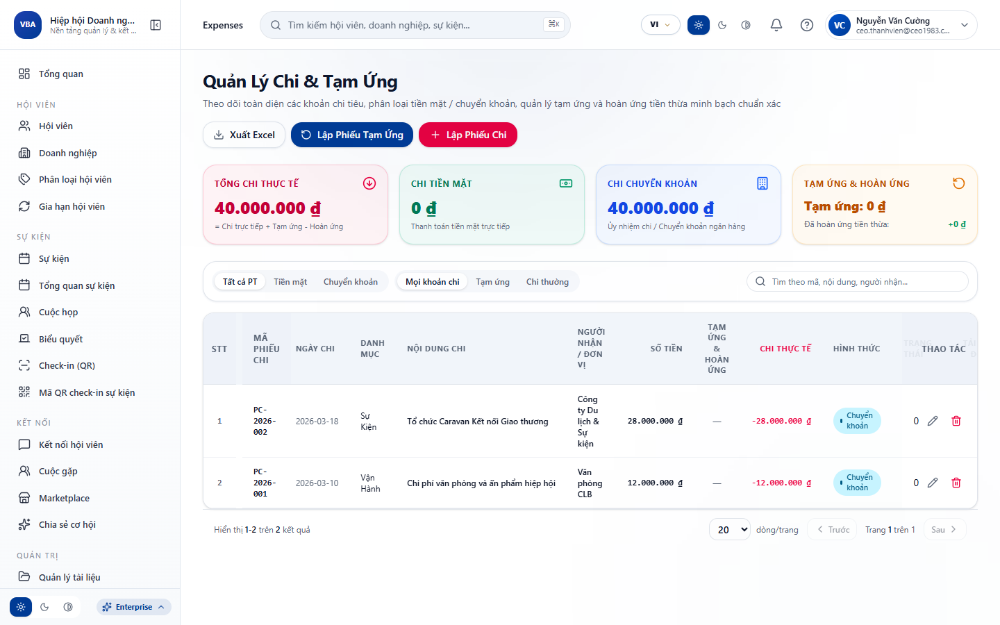

### Hình 7.4: Báo cáo tài chính minh bạch và sao kê dòng tiền Quỹ Thiện Nguyện

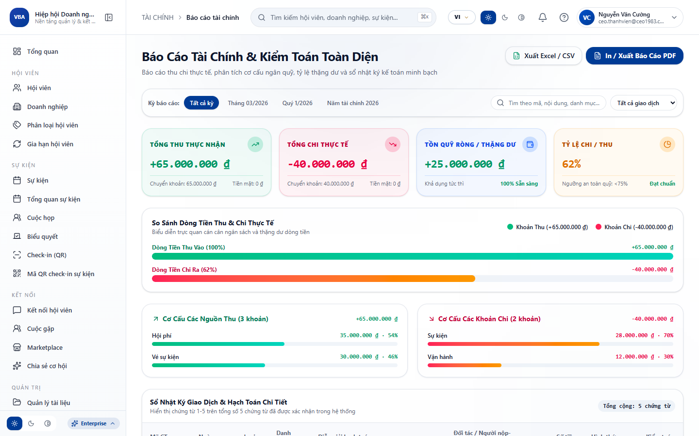

---

## CHƯƠNG 8: HƯỚNG DẪN VẬN HÀNH ỨNG DỤNG DOANH NHÂN CEO 1983 DÀNH CHO HỘI VIÊN

Ứng Dụng Doanh Nhân CEO 1983 là người bạn đồng hành số hóa cao cấp, giúp hội viên kết nối, sinh hoạt và phát triển kinh doanh mọi lúc mọi nơi:

* 1. Đăng nhập lần đầu & Đổi mật khẩu: Mở ứng dụng, nhập email vupv090120@gmail.com và mật khẩu khởi tạo được cấp. Hệ thống tự động chuyển sang màn hình Bắt buộc đổi mật khẩu mới để bảo mật tuyệt đối.
* 2. Thẻ Hội Viên VIP 3D & Danh Thiếp Số: Mở mục "Thẻ VIP", thẻ nhận diện Navy & Amber Gold hiển thị với mã QR cá nhân độc bản. Hội viên có thể chạm mặt lưng điện thoại vào máy đối tác (NFC 1 chạm) để truyền danh bạ ngay tức thì.
* 3. Danh Bạ Doanh Nhân & Hẹn Gặp 1-1: Tìm kiếm đối tác theo ngành nghề trong danh bạ 500+ CEO. Bấm "Gửi Lời Mời Hẹn Gặp 1-1" để kết nối hợp tác kinh doanh.
* 4. Mua Sắm & Bán Hàng Trên Gian Hàng B2B: Khám phá hàng trăm sản phẩm dịch vụ chất lượng cao với giá ưu đãi nội bộ. Hội viên có thể đăng bán sản phẩm của công ty mình và nhận đơn đặt hàng trực tiếp.
* 5. Nhận Vé Sự Kiện & Quét Mã Check-in: Xem lịch sự kiện Gala, bấm nhận vé VIP miễn phí. Xuất trình mã QR E-Ticket tại cổng đón tiếp để vào hội trường trong 0.2 giây.
* 6. Biểu Quyết Đại Hội Điện Tử: Tham gia bỏ phiếu bầu cử Ban Chấp Hành trực tuyến bảo mật theo nguyên tắc 1 người 1 phiếu duy nhất.
* 7. Đóng Hội Phí & Ủng Hộ Thiện Nguyện Qua VietQR 24/7: Bấm thanh toán, quét mã VietQR Napas trên bất kỳ App ngân hàng nào, hệ thống tự động gạch nợ thành công trong 1 giây.

### Hình 8.1: Màn hình Đăng Nhập Ứng Dụng Doanh Nhân CEO 1983

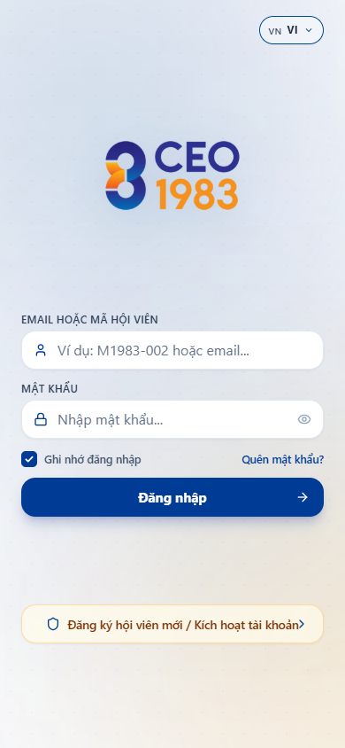

### Hình 8.2: Nhập tài khoản vupv090120@gmail.com và mật khẩu khởi tạo

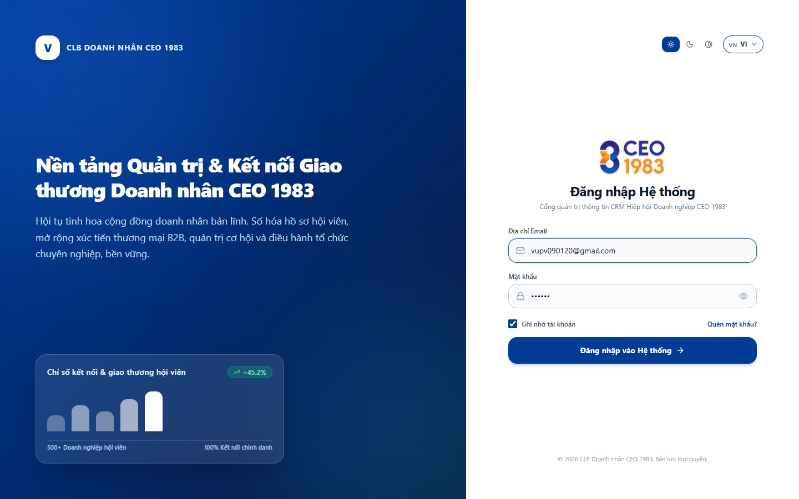

### Hình 8.3: Bắt buộc đổi mật khẩu mới ngay trong lần đăng nhập đầu tiên

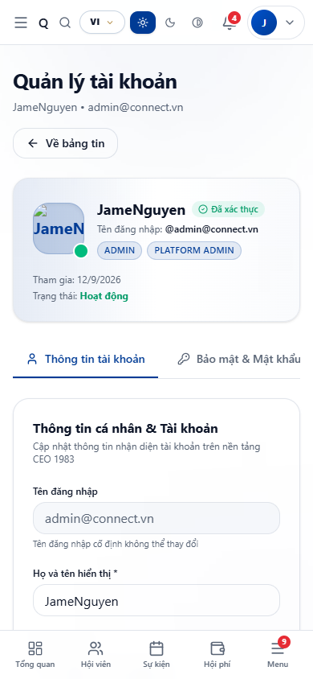

### Hình 8.4: Màn hình Trang Chủ Dashboard Hội Viên Doanh Nhân CEO 1983

### Hình 8.5: Thẻ Hội Viên VIP 3D Hoàng Gia xoay lật 180 độ tôn vinh thương hiệu cá nhân

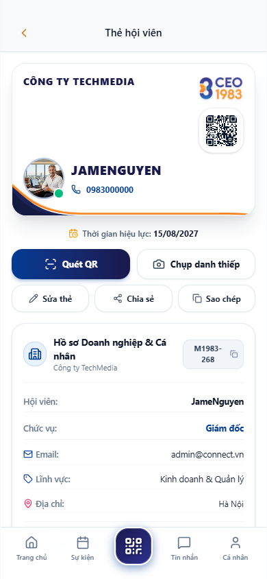

### Hình 8.6: Thẻ danh thiếp điện tử thông minh tích hợp chip NFC và mã QR độc bản

### Hình 8.7: Trang Danh thiếp điện tử công khai hiển thị khi chạm thẻ NFC

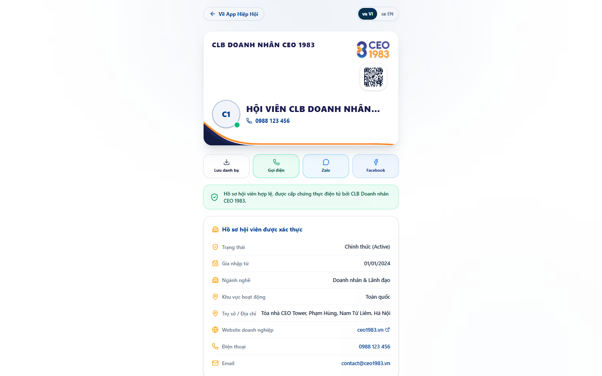

### Hình 8.8: Danh bạ doanh nhân thành viên tra cứu theo chuyên ban và ngành nghề

### Hình 8.9: Chỉnh sửa thông tin hồ sơ doanh nhân và cập nhật hồ sơ năng lực công ty

### Hình 8.10: Danh sách sự kiện Gala và lịch hoạt động của CLB

### Hình 8.11: Thẻ vé điện tử E-Ticket QR và Mã quay số may mắn Lucky Draw

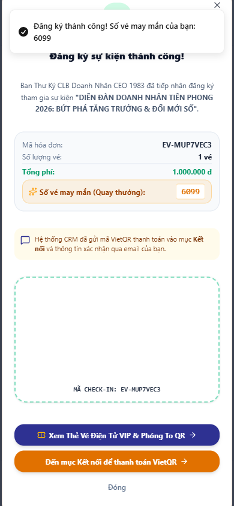

### Hình 8.12: Màn hình xuất trình vé điện tử tại cửa đón tiếp sự kiện

### Hình 8.13: Gian hàng B2B Doanh nhân CEO 1983 với chính sách ưu đãi độc quyền

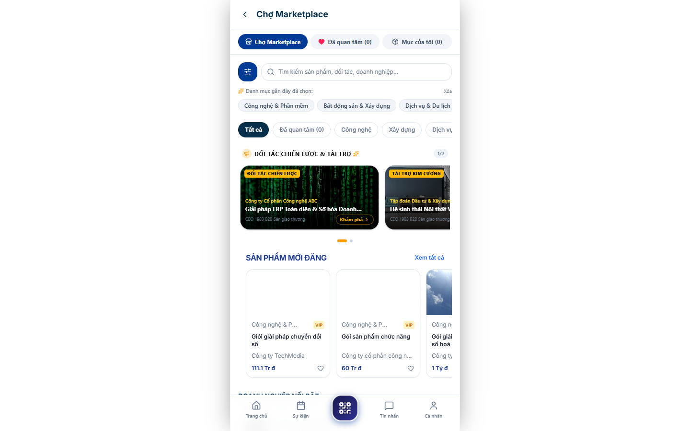

### Hình 8.14: Bảng tin kết nối cơ hội kinh doanh Cung - Cầu realtime

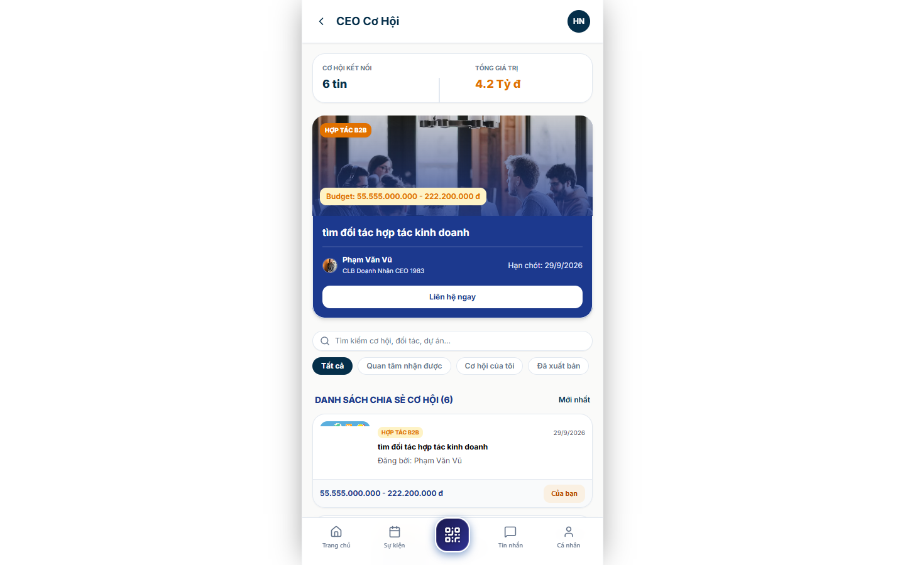

### Hình 8.15: Giao diện gửi lời mời kết nối hẹn gặp giao thương 1-1 giữa các CEO

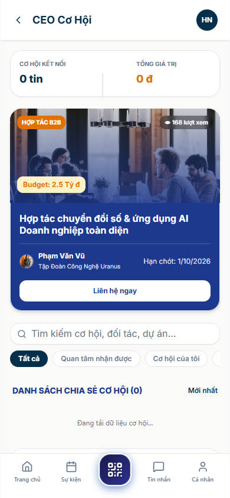

### Hình 8.16: Hộp thư trao đổi tin nhắn và kết nối hợp tác kinh doanh nội bộ

### Hình 8.17: Màn hình biểu quyết đại hội điện tử 1 người 1 phiếu và quay thưởng Lucky Draw

### Hình 8.18: Thanh toán hội phí và ủng hộ quỹ thiện nguyện qua mã VietQR tự động gạch nợ

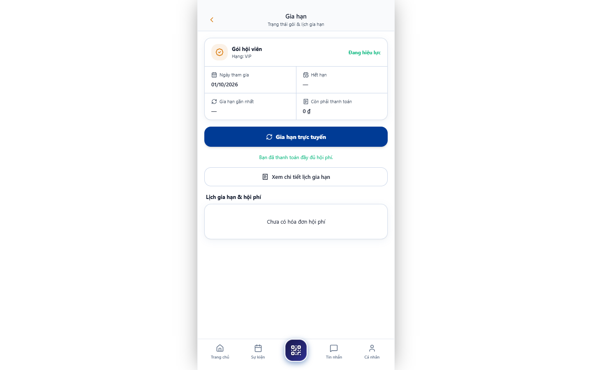

### Hình 8.19: Trung tâm thông báo đẩy cá nhân hóa theo dõi toàn bộ hoạt động

### Hình 8.20: Mục tin tức, phóng sự và bản tin nội bộ "Tiếng Nói Doanh Nhân 1983"

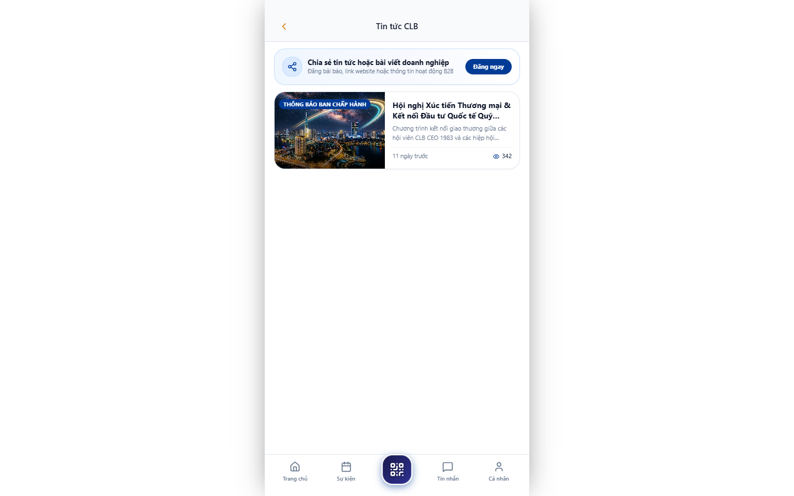

### Hình 8.21: Cài đặt an toàn tài khoản, đổi mật khẩu và bảo mật hai lớp 2FA

---

## CHƯƠNG 9: HƯỚNG DẪN BẢO MẬT, SAO LƯU DỮ LIỆU & QUẢN TRỊ TỐI CAO (BAN QUẢN TRỊ)

Ban Quản Trị nắm giữ quyền điều hành hạ tầng kỹ thuật, đảm bảo hệ thống luôn vận hành ổn định 24/7 và an toàn tuyệt đối:

* 1. Cấu hình Phân quyền RBAC: Quản lý ma trận phân quyền chi tiết cho 6 Ban chuyên môn và người dùng hệ thống.
* 2. Giám sát Nhật ký Kiểm toán (Audit Logs): Toàn bộ thao tác phê duyệt hội viên, duyệt chi tài chính, chỉnh sửa sự kiện đều được ghi nhận nhật ký bất biến.
* 3. Sao lưu Dữ liệu Tự động (Automated Backup): Hệ thống tự động sao lưu dữ liệu quan hệ và tệp đa phương tiện định kỳ vào 03:00 sáng mỗi ngày.
* 4. Quản lý Nhà tài trợ & Banner Quảng cáo: Phân bổ các gói tài trợ Kim Cương, Vàng, Bạc và điều phối banner trượt trên toàn hệ sinh thái.
* 5. Tùy biến Nhận diện Thương hiệu: Cấu hình bảng màu, logo và phông chữ đồng bộ theo tiêu chuẩn HanoiBA.

### Hình 9.1: Cấu hình ma trận phân quyền vai trò (RBAC) cho 6 Ban chuyên môn

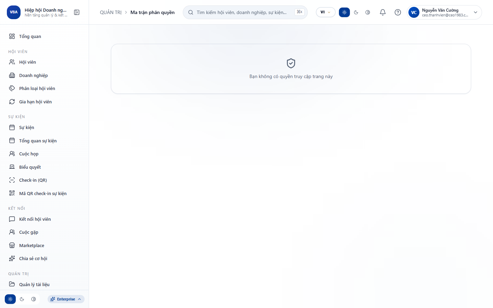

### Hình 9.2: Quản lý danh sách nhà tài trợ và các gói quyền lợi kim cương

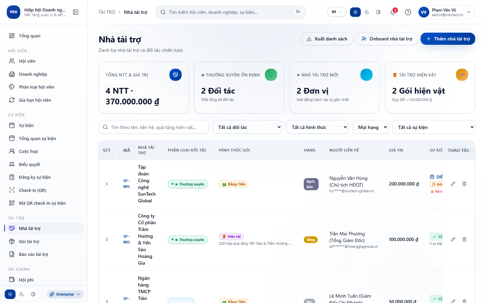

### Hình 9.3: Bảng chỉ số phát triển toàn diện phục vụ báo cáo Đại hội nhiệm kỳ

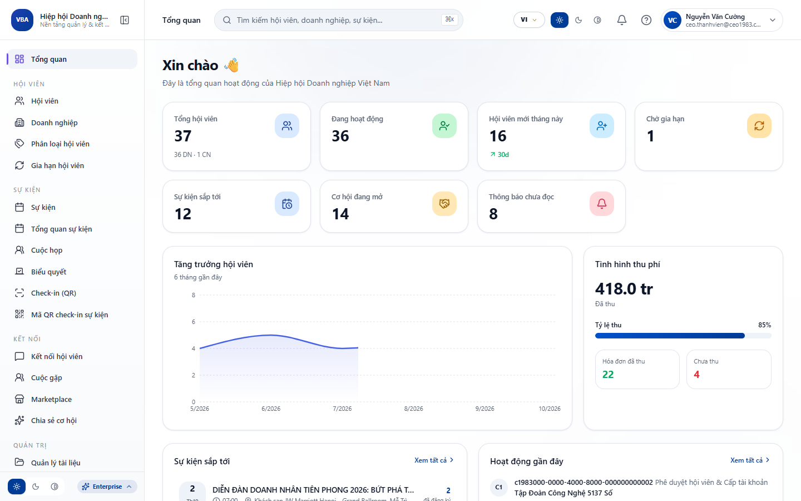

---

