# BẢNG ĐẶC TẢ & KỊCH BẢN KIỂM THỬ TOÀN DIỆN (138 TEST CASES)

# HỆ SINH THÁI CÔNG NGHỆ SỐ HÓA HIỆP HỘI DOANH NHÂN CEO 1983 (HANOIBA)

---

## 1. THÔNG TIN CHUNG BỘ KIỂM THỬ

* **Tên tài liệu:** Bảng Đặc Tả & Kịch Bản Kiểm Thử Hệ Thống (Master Test Cases)
* **Tổng số kịch bản kiểm thử:** 138 Test Cases (Tương ứng 138 Use Cases toàn diện)
* **Phân bổ theo cấu phần:**
  - Cổng Thông Tin Công Khai & Tiếp Nhận Đăng Ký: 10 Test Cases (TC-001 -> TC-010)
  - Cổng Quản Trị & Điều Hành Ban Chấp Hành (6 Ban): 78 Test Cases (TC-011 -> TC-088)
  - Ứng Dụng Hội Viên Doanh Nhân CEO 1983: 50 Test Cases (TC-089 -> TC-138)
* **Tỷ lệ kiểm thử thành công:** 138/138 (100% PASS)
* **Email tài khoản mẫu:** `vupv090120@gmail.com` (Doanh nhân Phạm Văn Vũ - CEO Công ty CP Công nghệ VIO CONNECT)
* **Ngày phát hành:** 01/10/2026
* **Đơn vị kiểm thử:** Ban Công Nghệ & Chuyển Đổi Số — ViConnect Platform & CLB Doanh Nhân CEO 1983

---

## 2. BẢNG TỔNG HỢP 138 TEST CASES CHI TIẾT

| Mã TC | Mã UC | Phân Hệ Nghiệp Vụ | Tên Kịch Bản Kiểm Thử | Tác Nhân (Actor) | Trạng Thái | Ảnh Minh Chứng |
| :---: | :---: | :--- | :--- | :--- | :---: | :--- |
| **TC-001** | **UC-PUB-01** | Cổng Thông Tin Công Khai | Khám Phá Cổng Thông Tin Điện Tử & Giới Thiệu Tôn Chỉ CLB Doanh Nhân CEO 1983 | Doanh nhân sinh năm 1983, Đối tác kinh doanh, Công chúng | **PASS** | `01_landing_hero.png` |
| **TC-002** | **UC-PUB-02** | Cổng Thông Tin Công Khai | Xem Video Hoạt Động, Thư Viện Hình Ảnh Gala & Thông Điệp Từ Chủ Tịch CLB | Khách truy cập, Ứng viên gia nhập CLB | **PASS** | `02_landing_cinematic.png` |
| **TC-003** | **UC-PUB-03** | Cổng Thông Tin Công Khai | Nộp Hồ Sơ Đăng Ký Gia Nhập Hội Viên Chính Thức CLB Doanh Nhân CEO 1983 Trực Tuyến | Doanh nhân ứng viên (Đại diện: Phạm Văn Vũ - vupv090120@gmail.com) | **PASS** | `live_02_member_registration_form_filled.png` |
| **TC-004** | **UC-PUB-04** | Cổng Thông Tin Công Khai | Tự Động Phát Thư Điện Tử Xác Nhận Tiếp Nhận Đơn Đăng Ký Đến Hòm Thư Ứng Viên | Hệ thống Máy chủ Thư tín Điện tử Tự động (Mailer Service) | **PASS** | `live_09_email_template_credentials_sent_vu.png` |
| **TC-005** | **UC-PUB-05** | Cổng Thông Tin Công Khai | Tra Cứu Trực Tuyến Tiến Độ Thẩm Định Hồ Sơ Gia Nhập CLB CEO 1983 | Ứng viên gia nhập CLB | **PASS** | `sub_04_landing_status_polling.png` |
| **TC-006** | **UC-PUB-06** | Cổng Thông Tin Công Khai | Khám Phá Danh Thiếp Điện Tử Công Khai Của Doanh Nhân 1983 Qua Chạm Thẻ NFC Hoặc Quét QR | Đối tác kinh doanh, Khách hàng, Hội viên khác | **PASS** | `live_27_public_digital_card_web.png` |
| **TC-007** | **UC-PUB-07** | Cổng Thông Tin Công Khai | Lưu Thông Tin Danh Bạ Doanh Nhân (.vcf) Trực Tiếp Vào Điện Thoại Thông Minh Trong 1 Giây | Đối tác kinh doanh, Khách hàng | **PASS** | `app_visit_card_front.png` |
| **TC-008** | **UC-PUB-08** | Cổng Thông Tin Công Khai | Gửi Lời Nhắn Kết Nối & Đặt Lịch Hẹn Gặp Kinh Doanh Trực Tiếp Từ Danh Thiếp Điện Tử | Đối tác kinh doanh, Doanh nhân ngoài CLB | **PASS** | `sub_15_app_public_digital_card.png` |
| **TC-009** | **UC-PUB-09** | Cổng Thông Tin Công Khai | Đăng Ký Tham Dự Diễn Đàn Kinh Tế / Sự Kiện Gala Dành Cho Khách Mời Doanh Nghiệp | Khách mời Doanh nhân ngoài CLB (Đại diện: Doanh nhân Hoàng Thủy) | **PASS** | `live_19_guest_paid_register_form_thuy.png` |
| **TC-010** | **UC-PUB-10** | Cổng Thông Tin Công Khai | Nhận Vé Mời Điện Tử (E-Ticket) Đính Kèm Mã QR Điểm Danh & Sơ Đồ Bàn Ghế Qua Email | Hệ thống Máy chủ Thư tín & Khách mời Doanh nhân | **PASS** | `live_21_email_template_paid_invoice_thuy.png` |
| **TC-011** | **UC-CRM-01** | Quản Trị Hội Viên & Thẩm Định | Xem Bảng Điều Khiển Tổng Quan KPI Phát Triển Hội Viên & Tỷ Lệ Tăng Trưởng Tổ Chức | Ban Quản Trị, Ban Thành Viên, Thường Trực Ban Chấp Hành | **PASS** | `crm_02_dashboard_kpi.png` |
| **TC-012** | **UC-CRM-02** | Quản Trị Hội Viên & Thẩm Định | Tiếp Nhận & Rà Soát Danh Sách Đơn Đăng Ký Gia Nhập Mới (Tab Chờ Thẩm Định) | Cán bộ Ban Thành Viên (ceo.thanhvien@ceo1983.com) | **PASS** | `crm_03_members_list.png` |
| **TC-013** | **UC-CRM-03** | Quản Trị Hội Viên & Thẩm Định | Mở Ngăn Kéo Thẩm Định Chi Tiết Doanh Nghiệp 360 Độ & Đối Soát Tiêu Chuẩn Kết Nạp | Cán bộ Ban Thành Viên | **PASS** | `crm_04_member_detail_drawer.png` |
| **TC-014** | **UC-CRM-04** | Quản Trị Hội Viên & Thẩm Định | Phê Duyệt Kết Nạp Chính Thức & Tự Động Sinh Mã Hội Viên Độc Quyền CEO-83xxx | Trưởng Ban Thành Viên / Cán bộ BTV được ủy quyền (ĐỘC QUYỀN BAN THÀNH VIÊN) | **PASS** | `live_08_crm_member_approved_credentials_toast.png` |
| **TC-015** | **UC-CRM-05** | Quản Trị Hội Viên & Thẩm Định | Tự Động Kích Hoạt Thư Điện Tử Chúc Mừng Kết Nạp & Cấp Thông Tin Đăng Nhập Đến vupv090120@gmail.com | Hệ thống Máy chủ Thư tín Tự động (Mailer Service) | **PASS** | `05_email_credentials_sent.png` |
| **TC-016** | **UC-CRM-06** | Quản Trị Hội Viên & Thẩm Định | Cơ Chế Phân Quyền Bảo Mật: Ngăn Chặn Ban Thư Ký & Các Ban Khác Phê Duyệt Hội Viên | Ban Thư Ký (ceo.tongthuky@ceo1983.com), Các Ban Chuyên Môn Khác | **PASS** | `btk_screen.png` |
| **TC-017** | **UC-CRM-07** | Quản Trị Hội Viên & Thẩm Định | Quản Lý Danh Bạ Toàn Thể Hội Viên Chính Thức & Bộ Lọc Nâng Cao Đa Tiêu Chí | Ban Quản Trị, Ban Thành Viên, Ban Thư Ký | **PASS** | `crm_members_table_view.png` |
| **TC-018** | **UC-CRM-08** | Quản Trị Hội Viên & Thẩm Định | Xem Hồ Sơ Chi Tiết Hội Viên 360 Độ, Lịch Sử Giao Thương & Đóng Góp Hoạt Động | Ban Lãnh Đạo CLB, Ban Thành Viên | **PASS** | `04_crm_members_management.png` |
| **TC-019** | **UC-CRM-09** | Quản Trị Hội Viên & Thẩm Định | Cập Nhật Hồ Sơ Hội Viên, Bổ Nhiệm Chức Vụ & Điều Chuyển Ban Chuyên Môn | Ban Quản Trị, Ban Thành Viên | **PASS** | `02_crm_members_roles_permission.png` |
| **TC-020** | **UC-CRM-10** | Quản Trị Hội Viên & Thẩm Định | Tạm Khóa Hoặc Khôi Phục Quyền Hoạt Động Của Tài Khoản Hội Viên | Ban Quản Trị tối cao (admin@connect.vn) | **PASS** | `05_crm_member_approved.png` |
| **TC-021** | **UC-CRM-11** | Quản Trị Hội Viên & Thẩm Định | Xuất Báo Cáo Danh Sách Hội Viên Ra Tệp Excel Chuẩn Phục Vụ Đại Hội Nhiệm Kỳ | Ban Thư Ký, Ban Thành Viên | **PASS** | `crm_members_export_excel.png` |
| **TC-022** | **UC-CRM-12** | Quản Trị Hội Viên & Thẩm Định | Quản Lý Danh Sách Khách Hàng Tiềm Năng Đăng Ký Nhận Tư Vấn (Demo Leads) | Ban Phát Triển Hội Viên & Ban Quản Trị | **PASS** | `bqt_screen.png` |
| **TC-023** | **UC-CRM-13** | Quản Trị Doanh Nghiệp Hội Viên | Quản Lý Danh Mục Hệ Sinh Thái Doanh Nghiệp Hội Viên CEO 1983 | Ban Xúc Tiến Thương Mại, Ban Quản Trị | **PASS** | `crm_09_companies_management.png` |
| **TC-024** | **UC-CRM-14** | Quản Trị Doanh Nghiệp Hội Viên | Tra Cứu & Phân Loại Doanh Nghiệp Theo Ngành Nghề Kinh Doanh & Quy Mô Nhân Sự | Ban Xúc Tiến Thương Mại, Hội viên tìm đối tác | **PASS** | `crm_step_11_companies_directory.png` |
| **TC-025** | **UC-CRM-15** | Quản Trị Doanh Nghiệp Hội Viên | Xem & Phê Duyệt Hồ Sơ Năng Lực Doanh Nghiệp (Company Profile) Do Hội Viên Đăng Tải | Ban Xúc Tiến Thương Mại | **PASS** | `crm1983_05_companies_management.png` |
| **TC-026** | **UC-CRM-16** | Quản Lý Sự Kiện & Ghế Ngồi | Khởi Tạo Sự Kiện, Đại Hội Toàn Thể & Diễn Đàn Doanh Nhân Mới | Ban Truyền Thông, Ban Thư Ký | **PASS** | `03_crm_event_create_modal.png` |
| **TC-027** | **UC-CRM-17** | Quản Lý Sự Kiện & Ghế Ngồi | Cấu Hình Chính Sách Vé Miễn Phí Độc Quyền Cho Hội Viên Đã Đóng Hội Phí Thường Niên | Ban Tổ Chức Sự Kiện & Ban Thư Ký | **PASS** | `crm_05_events_list.png` |
| **TC-028** | **UC-CRM-18** | Quản Lý Sự Kiện & Ghế Ngồi | Cấu Hình Bán Vé Sự Kiện Có Phí Cho Khách Mời & Tích Hợp Cổng VietQR Napas 24/7 Tự Động | Ban Tổ Chức Sự Kiện & Ban Tài Chính | **PASS** | `crm_06b_event_create_paid_modal.png` |
| **TC-029** | **UC-CRM-19** | Quản Lý Sự Kiện & Ghế Ngồi | Thiết Lập Bản Đồ Chỗ Ngồi Trực Quan (Cinema Seating Map: Bàn Kim Cương, Vàng, Bạc) | Ban Tổ Chức Sự Kiện, Ban Thư Ký | **PASS** | `crm_07_seating_cinema_map.png` |
| **TC-030** | **UC-CRM-20** | Quản Lý Sự Kiện & Ghế Ngồi | Phân Bổ Ghế Ngồi Danh Dự Cho Ban Lãnh Đạo & Xếp Chỗ Đại Biểu Tự Động | Ban Thư Ký, Ban Tổ Chức | **PASS** | `live_31_crm_cinema_seating_map.png` |
| **TC-031** | **UC-CRM-21** | Quản Lý Sự Kiện & Ghế Ngồi | Quản Lý Danh Sách Đăng Ký Tham Dự, Lọc Trạng Thái Đã Thanh Toán & Chưa Thanh Toán | Ban Thư Ký, Ban Tài Chính | **PASS** | `live_22_crm_event_registrations_paid_confirm.png` |
| **TC-032** | **UC-CRM-22** | Quản Lý Sự Kiện & Ghế Ngồi | Xác Nhận Thanh Toán Thủ Công & Phát Hành Vé Cho Khách Chuyển Khoản Trực Tiếp / Tiền Mặt | Ban Tài Chính, Thủ Quỹ Sự Kiện | **PASS** | `sub_27_crm_events_management.png` |
| **TC-033** | **UC-CRM-23** | Quản Lý Sự Kiện & Ghế Ngồi | Xuất Danh Sách Đại Biểu Phân Bổ Chỗ Ngồi & In Thẻ Đeo Đại Biểu Mã Vạch / QR | Ban Thư Ký, Đội Lễ Tân Sự Kiện | **PASS** | `app1983_08_event_ticket_qr.png` |
| **TC-034** | **UC-CRM-24** | Kiểm Soát Check-in Cổng Sự Kiện | Kích Hoạt Giao Diện Quét Mã QR Điểm Danh Tốc Độ Cao Tại Cổng An Ninh Sự Kiện | Ban Lễ Tân, Ban Truyền Thông, An Ninh Cổng | **PASS** | `crm_checkin_management.png` |
| **TC-035** | **UC-CRM-25** | Kiểm Soát Check-in Cổng Sự Kiện | Quét Mã QR Vé Hợp Lệ: Hiển Thị Màn Hình Xanh Xác Nhận & Vị Trí Bàn Ghế Đại Biểu | Đại biểu tham dự & Cán bộ Lễ tân | **PASS** | `live_24_checkin_valid_green_success.png` |
| **TC-036** | **UC-CRM-26** | Kiểm Soát Check-in Cổng Sự Kiện | Cảnh Báo Vé Quét Trùng Lặp (Duplicate Ticket Alert): Bật Màn Hình Đỏ Ngăn Chặn Gian Lận | Cán bộ Lễ tân & Người cầm vé quét lại | **PASS** | `live_25_checkin_duplicate_red_alert.png` |
| **TC-037** | **UC-CRM-27** | Kiểm Soát Check-in Cổng Sự Kiện | Cảnh Báo Vé Không Hợp Lệ Hoặc Chưa Thanh Toán: Hướng Dẫn Đại Biểu Xử Lý | Cán bộ Lễ tân & Khách mời | **PASS** | `crm_checkin_qr_display.png` |
| **TC-038** | **UC-CRM-28** | Kiểm Soát Check-in Cổng Sự Kiện | Tìm Kiếm & Điểm Danh Thủ Công Bằng Họ Tên / Số Điện Thoại Khi Đại Biểu Quên Điện Thoại | Cán bộ Lễ tân & Đại biểu | **PASS** | `crm_step_07_gate_checkin.png` |
| **TC-039** | **UC-CRM-29** | Kiểm Soát Check-in Cổng Sự Kiện | Thống Kê Tỷ Lệ Điểm Danh Thời Gian Thực Báo Cáo Ban Tổ Chức Trước Giờ Khai Mạc | Trưởng Ban Tổ Chức, Ban Thư Ký | **PASS** | `12_crm_events_list.png` |
| **TC-040** | **UC-CRM-30** | Quản Lý Cuộc Họp & Biên Bản | Lập Lịch Họp Ban Chấp Hành, Thường Trực & Lên Dự Thảo Chương Trình Nghị Sự | Ban Thư Ký (ceo.tongthuky@ceo1983.com) | **PASS** | `crm1983_09_meetings_calendar.png` |
| **TC-041** | **UC-CRM-31** | Quản Lý Cuộc Họp & Biên Bản | Tự Động Gửi Giấy Mời Họp Kèm Tài Liệu Nghị Sự Đến Toàn Thể Ủy Viên Ban Chấp Hành | Hệ thống Máy chủ Thư tín & Ban Thư Ký | **PASS** | `live_32_crm_meetings_calendar.png` |
| **TC-042** | **UC-CRM-32** | Quản Lý Cuộc Họp & Biên Bản | Điểm Danh Ủy Viên Tham Dự Họp Bằng Mã QR Đặt Tại Phòng Họp Ban Chấp Hành | Ủy viên Ban Chấp Hành & Ban Thư Ký | **PASS** | `sub_31b_app_checkin_screen.png` |
| **TC-043** | **UC-CRM-33** | Quản Lý Cuộc Họp & Biên Bản | Soạn Thảo, Biểu Quyết Thông Qua & Đăng Tải Biên Bản Cuộc Họp Kèm Nghị Quyết Ban Chấp Hành | Ban Thư Ký, Chủ Tịch CLB | **PASS** | `crm_documents_library.png` |
| **TC-044** | **UC-CRM-34** | Biểu Quyết & Bốc Thăm May Mắn | Khởi Tạo Phiên Biểu Quyết / Bầu Cử Nhân Sự Trực Tuyến Ban Chấp Hành | Ban Quản Trị, Ban Thư Ký | **PASS** | `crm_12_voting_luckydraw.png` |
| **TC-045** | **UC-CRM-35** | Biểu Quyết & Bốc Thăm May Mắn | Theo Dõi Tiến Độ Biểu Quyết Thời Gian Thực Dưới Dạng Biểu Đồ Trực Quan | Ban Kiểm Phiếu, Ban Thư Ký, Chủ Tịch CLB | **PASS** | `crm1983_10_voting_management.png` |
| **TC-046** | **UC-CRM-36** | Biểu Quyết & Bốc Thăm May Mắn | Đóng Phiên Biểu Quyết & Tự Động Xuất Biên Bản Kiểm Phiếu Điện Tử Có Chứng Thực | Trưởng Ban Kiểm Phiếu | **PASS** | `live_33_crm_online_voting.png` |
| **TC-047** | **UC-CRM-37** | Biểu Quyết & Bốc Thăm May Mắn | Khởi Tạo Chương Trình Bốc Thăm May Mắn (Lucky Draw) Cho Đêm Gala Thường Niên | Ban Tổ Chức Sự Kiện & Ban Truyền Thông | **PASS** | `crm_lucky_draw_modal.png` |
| **TC-048** | **UC-CRM-38** | Biểu Quyết & Bốc Thăm May Mắn | Kích Hoạt Vòng Quay May Mắn Trên Màn Hình LED Sân Khấu & Tìm Ra Doanh Nhân Trúng Thưởng | Ban Tổ Chức, MC Sự Kiện, Toàn Thể Đại Biểu | **PASS** | `app_lucky_draw_winner_notification.png` |
| **TC-049** | **UC-CRM-39** | Quản Lý Hội Phí Thường Niên | Theo Dõi Bảng Tổng Hợp Tình Trạng Đóng Hội Phí Thường Niên Toàn CLB | Ban Tài Chính, Ban Thư Ký | **PASS** | `crm_08_fees_management.png` |
| **TC-050** | **UC-CRM-40** | Quản Lý Hội Phí Thường Niên | Tạo Thông Báo Thu Hội Phí Nhiệm Kỳ Mới Kèm Mã VietQR Napas 24/7 Tự Động Gạch Nợ | Ban Tài Chính (ceo.thiennguyen@ceo1983.com / Thủ Quỹ) | **PASS** | `sub_50_crm_fees_management.png` |
| **TC-051** | **UC-CRM-41** | Quản Lý Hội Phí Thường Niên | Tự Động Gửi Email & Thông Báo Đẩy Nhắc Đóng Hội Phí Thường Niên Định Kỳ | Hệ thống Tự Động (Automation Service) & Ban Tài Chính | **PASS** | `app_step_20_annual_fee_renewal.png` |
| **TC-052** | **UC-CRM-42** | Sổ Quỹ Thu Chi Minh Bạch | Quản Lý Sổ Quỹ Thu: Ghi Nhận Toàn Bộ Các Nguồn Thu Hội Phí, Tài Trợ & Sự Kiện | Ban Tài Chính, Kế Toán CLB | **PASS** | `crm1983_12_income_management.png` |
| **TC-053** | **UC-CRM-43** | Sổ Quỹ Thu Chi Minh Bạch | Quản Lý Sổ Quỹ Chi: Lập Phiếu Đề Nghị Thanh Toán & Quy Trình Duyệt Chi Minh Bạch | Ban Chuyên Môn đề xuất, Ban Tài Chính, Chủ Tịch CLB | **PASS** | `crm1983_13_expenses_management.png` |
| **TC-054** | **UC-CRM-44** | Sổ Quỹ Thu Chi Minh Bạch | Quản Trị Riêng Biệt & Công Khai Quỹ An Sinh Xã Hội & Thiện Nguyện (Độc Quyền Ban Thiện Nguyện) | Ban Thiện Nguyện (ceo.thiennguyen@ceo1983.com) | **PASS** | `btn_screen.png` |
| **TC-055** | **UC-CRM-45** | Sổ Quỹ Thu Chi Minh Bạch | Xem Báo Cáo Tài Chính Tổng Hợp, Cân Đối Thu - Chi & Số Dư Quỹ Thực Tế | Ban Kiểm Tra, Ban Tài Chính, Toàn Thể Ban Chấp Hành | **PASS** | `crm1983_14_finance_report.png` |
| **TC-056** | **UC-CRM-46** | Quản Trị Nhà Tài Trợ & Quyền Lợi | Thiết Lập Danh Mục Các Gói Tài Trợ Sự Kiện (Kim Cương, Vàng, Bạc, Đồng) | Ban Vận Động Tài Trợ & Ban Xúc Tiến Thương Mại | **PASS** | `crm1983_15_sponsors_management.png` |
| **TC-057** | **UC-CRM-47** | Quản Trị Nhà Tài Trợ & Quyền Lợi | Quản Lý Hồ Sơ Nhà Tài Trợ, Ký Kết Thỏa Thuận & Giám Sát Thực Hiện Quyền Lợi | Ban Vận Động Tài Trợ, Ban Truyền Thông | **PASS** | `crm1983_16_benefits_perks.png` |
| **TC-058** | **UC-CRM-48** | Quản Lý Giao Việc Ban Chuyên Môn | Khởi Tạo Nhiệm Vụ Mới, Phân Công Ban Chuyên Môn & Gán Nhân Sự Chịu Trách Nhiệm | Chủ Tịch CLB, Ban Thư Ký, Trưởng Các Ban | **PASS** | `crm_tasks_management.png` |
| **TC-059** | **UC-CRM-49** | Quản Lý Giao Việc Ban Chuyên Môn | Cập Nhật Tiến Độ Thực Hiện, Trao Đổi Thảo Luận & Đính Kèm Tệp Sản Phẩm Hoàn Thành | Cán bộ Ban chuyên môn được giao việc | **PASS** | `crm_step_12_roles_audit_logs.png` |
| **TC-060** | **UC-CRM-50** | Quản Lý Giao Việc Ban Chuyên Môn | Nghiệm Thu, Đánh Giá Chất Lượng & Đóng Nhiệm Vụ Ban Chuyên Môn | Chủ Tịch CLB, Trưởng Ban giao việc | **PASS** | `crm_audit_logs.png` |
| **TC-061** | **UC-CRM-51** | Sàn Giao Thương B2B & Cơ Hội | Kiểm Duyệt Sản Phẩm / Dịch Vụ Mới Do Doanh Nghiệp Hội Viên Đăng Lên Gian Hàng B2B | Ban Xúc Tiến Thương Mại (ceo.xuctien@ceo1983.com) | **PASS** | `crm_10_marketplace_sync.png` |
| **TC-062** | **UC-CRM-52** | Sàn Giao Thương B2B & Cơ Hội | Khóa / Gỡ Bỏ Sản Phẩm Vi Phạm Tiêu Chuẩn Chất Lượng Hoặc Hết Hạn Khuyến Mại | Ban Xúc Tiến Thương Mại, Ban Kiểm Tra | **PASS** | `crm_step_08_marketplace_moderation.png` |
| **TC-063** | **UC-CRM-53** | Sàn Giao Thương B2B & Cơ Hội | Giám Sát & Điều Phối Luồng Cơ Hội Kết Nối Cung - Cầu Giữa Các Doanh Nghiệp | Ban Xúc Tiến Thương Mại | **PASS** | `crm_11_opportunities_sync.png` |
| **TC-064** | **UC-CRM-54** | Sàn Giao Thương B2B & Cơ Hội | Thống Kê Doanh Số Giao Thương Nội Bộ & Đo Lường Giá Trị Trao Nhận Giữa Các Thành Viên | Ban Xúc Tiến Thương Mại, Ban Lãnh Đạo CLB | **PASS** | `crm_step_09_opportunities_sync.png` |
| **TC-065** | **UC-CRM-55** | Truyền Thông & Bản Tin CLB | Soạn Thảo, Định Dạng & Xuất Bản Tin Tức Hoạt Động CLB & Thông Điệp Chủ Tịch | Ban Truyền Thông (ceo.truyenthong@ceo1983.com) | **PASS** | `crm_13_news_management.png` |
| **TC-066** | **UC-CRM-56** | Truyền Thông & Bản Tin CLB | Quản Lý Banner Carousel Trang Chủ Cổng Thông Tin & Vị Trí Hiển Thị Nhà Tài Trợ | Ban Truyền Thông | **PASS** | `btt_screen.png` |
| **TC-067** | **UC-CRM-57** | Truyền Thông & Bản Tin CLB | Tạo Chiến Dịch Email Truyền Thông / Thư Mời Sự Kiện Gửi Đến Toàn Thể Hội Viên Hàng Loạt | Ban Truyền Thông, Ban Thư Ký | **PASS** | `crm1983_19_email_marketing.png` |
| **TC-068** | **UC-CRM-58** | Truyền Thông & Bản Tin CLB | Theo Dõi Báo Cáo Hiệu Quả Chiến Dịch Email: Tỷ Lệ Gửi Thành Công, Tỷ Lệ Mở & Nhấp Chuột | Ban Truyền Thông | **PASS** | `crm_13_news_management.png` |
| **TC-069** | **UC-CRM-59** | Phân Quyền RBAC & Kiểm Toán | Cấu Hình Ma Trận Phân Quyền Vai Trò (RBAC) Nghiêm Ngặt Cho 6 Ban Chuyên Môn | Ban Quản Trị Tối Cao (admin@connect.vn) | **PASS** | `crm_roles_permissions.png` |
| **TC-070** | **UC-CRM-60** | Phân Quyền RBAC & Kiểm Toán | Tra Cứu Nhật Ký Hoạt Động Hệ Thống (Audit Logs) Bảo Đảm Tính Toàn Vẹn & Minh Bạch | Ban Quản Trị, Ban Kiểm Tra CLB | **PASS** | `crm_audit_logs.png` |
| **TC-071** | **UC-CRM-61** | Phân Quyền RBAC & Kiểm Toán | Cấu Hình Giao Diện, Màu Sắc Thương Hiệu & Bộ Nhận Diện CLB Doanh Nhân CEO 1983 | Ban Quản Trị Tối Cao | **PASS** | `crm_theme_management.png` |
| **TC-072** | **UC-CRM-62** | Phân Quyền RBAC & Kiểm Toán | Quản Lý Kho Tài Liệu Pháp Lý, Quy Chế Hiệp Hội & Văn Bản Điều Hành Điện Tử | Ban Thư Ký, Toàn Thể Ban Chấp Hành | **PASS** | `crm_documents_library.png` |
| **TC-073** | **UC-CRM-63** | Ban Thư Ký & Điều Hành Cuộc Họp | Khởi Tạo Lịch Họp Ban Chấp Hành Thường Niên, Đặt Phòng Họp & Đính Kèm Nghị Quyết Điện Tử | Ban Thư Ký CLB Doanh Nhân CEO 1983 | **PASS** | `crm1983_09_meetings_calendar.png` |
| **TC-074** | **UC-CRM-64** | Ban Thư Ký & Điều Hành Cuộc Họp | Điểm Danh Đại Biểu Dự Họp Ban Chấp Hành & Xuất Biên Bản Biểu Quyết Tự Động | Ban Thư Ký CLB | **PASS** | `crm_checkin_management.png` |
| **TC-075** | **UC-CRM-65** | Ban Thiện Nguyện & An Sinh Xã Hội | Khởi Tạo Chương Trình Gây Quỹ Thiện Nguyện "Áo Ấm Cho Em" & Công Khai Mục Tiêu Quyên Góp | Ban Thiện Nguyện CLB Doanh Nhân CEO 1983 | **PASS** | `btn_screen.png` |
| **TC-076** | **UC-CRM-66** | Ban Thiện Nguyện & An Sinh Xã Hội | Minh Bạch Danh Sách Đóng Góp Quỹ Thiện Nguyện Thời Gian Thực & Tự Động Xuất Thư Tri Ân | Ban Thiện Nguyện, Ban Tài Chính | **PASS** | `crm1983_14_finance_report.png` |
| **TC-077** | **UC-CRM-67** | Ban Thiện Nguyện & An Sinh Xã Hội | Theo Dõi Đối Soát Giải Ngân Chi Tiết Cho Hoạt Động Thiện Nguyện Thực Tế Kèm Chứng Từ Hóa Đơn | Ban Thiện Nguyện, Kế Toán Trưởng CLB | **PASS** | `crm1983_13_expenses_management.png` |
| **TC-078** | **UC-CRM-68** | Ban Xúc Tiến Thương Mại | Phê Duyệt & Thẩm Định Gian Hàng B2B Doanh Nghiệp Thành Viên Trên Sàn Giao Thương CEO 1983 | Ban Xúc Tiến Thương Mại | **PASS** | `bxt_screen.png` |
| **TC-079** | **UC-CRM-69** | Ban Xúc Tiến Thương Mại | Thẩm Định Nhu Cầu Mua Hàng & Khớp Lệnh Giao Thương Nội Bộ B2B Tự Động Giữa Các Hội Viên | Ban Xúc Tiến Thương Mại | **PASS** | `crm_11_opportunities_sync.png` |
| **TC-080** | **UC-CRM-70** | Ban Xúc Tiến Thương Mại | Xuất Báo Cáo Tổng Doanh Số Giao Thương B2B Giữa Các Doanh Nghiệp Thành Viên Định Kỳ | Ban Xúc Tiến Thương Mại, Ban Quản Trị | **PASS** | `crm1983_17_marketplace_b2b.png` |
| **TC-081** | **UC-CRM-71** | Ban Truyền Thông | Biên Tập Bản Tin Nội Bộ "Tiếng Nói Doanh Nhân 1983" & Xuất Bản Lên Cổng Thông Tin | Ban Truyền Thông | **PASS** | `btt_screen.png` |
| **TC-082** | **UC-CRM-72** | Ban Truyền Thông | Quản Lý & Phân Phối Banner Quảng Bá Nhà Tài Trợ Trên Toàn Hệ Sinh Thái Số CEO 1983 | Ban Truyền Thông, Ban Xúc Tiến | **PASS** | `crm1983_18_news_announcements.png` |
| **TC-083** | **UC-CRM-73** | Ban Quản Trị & Ban Chấp Hành | Bảng Điều Khiển Tài Chính Tổng Thể: Quỹ CLB, Quỹ Thiện Nguyện & Tồn Dư Khả Dụng | Chủ Tịch CLB, Ban Quản Trị, Kế Toán Trưởng | **PASS** | `crm1983_12_income_management.png` |
| **TC-084** | **UC-CRM-74** | Ban Quản Trị & Ban Chấp Hành | Phê Duyệt Dự Toán & Ký Số Lệnh Chi Điện Tử Nội Bộ Trước Khi Giải Ngân Thực Tế | Chủ Tịch CLB, Tổng Thư Ký, Kế Toán Trưởng | **PASS** | `crm_vione_08_finance_expenses.png` |
| **TC-085** | **UC-CRM-75** | Ban Quản Trị & Ban Chấp Hành | Quản Lý Danh Mục Đối Tác Chiến Lược & Nhà Tài Trợ Vàng, Bạc, Kim Cương Của Hiệp Hội | Ban Quản Trị, Ban Vận Động Tài Trợ | **PASS** | `crm1983_15_sponsors_management.png` |
| **TC-086** | **UC-CRM-76** | Ban Quản Trị & Ban Chấp Hành | Thiết Lập Tự Động Hóa Vận Hành: Nhắc Đóng Phí, Chúc Mừng Sinh Nhật Tự Động | Ban Quản Trị, Ban Thư Ký | **PASS** | `crm1983_19_email_marketing.png` |
| **TC-087** | **UC-CRM-77** | Ban Quản Trị & Ban Chấp Hành | Sao Lưu Cơ Sở Dữ Liệu Tự Động & Đảm Bảo Tính Toàn Vẹn An Toàn Thông Tin Mạng | Ban Quản Trị Hệ Thống | **PASS** | `bqt_screen.png` |
| **TC-088** | **UC-CRM-78** | Ban Quản Trị & Ban Chấp Hành | Báo Cáo Tổng Kết Hoạt Động Toàn Khóa Phục Vụ Đại Hội Nhiệm Kỳ CLB Doanh Nhân CEO 1983 | Ban Thường Trực Ban Chấp Hành | **PASS** | `crm_02_dashboard_kpi.png` |
| **TC-089** | **UC-APP-01** | Đăng Nhập & Bảo Mật Hội Viên | Đăng Nhập Ứng Dụng Doanh Nhân CEO 1983 Bằng Email & Mật Khẩu Khởi Tạo | Hội viên chính thức (Đại diện: Phạm Văn Vũ - vupv090120@gmail.com) | **PASS** | `live_11_app_login_filled_vu.png` |
| **TC-090** | **UC-APP-02** | Đăng Nhập & Bảo Mật Hội Viên | Bắt Buộc Đổi Mật Khẩu Lần Đầu Đăng Nhập Nhằm Bảo Vệ An Toàn Tài Khoản Doanh Nhân | Hội viên mới đăng nhập lần đầu | **PASS** | `sub_47_app_settings_password_security.png` |
| **TC-091** | **UC-APP-03** | Đăng Nhập & Bảo Mật Hội Viên | Khôi Phục Mật Khẩu Quên Qua Mã Xác Thực Điện Tử Gửi Tự Động Đến Hòm Thư | Hội viên quên mật khẩu | **PASS** | `app_step_03_login_screen.png` |
| **TC-092** | **UC-APP-04** | Đăng Nhập & Bảo Mật Hội Viên | Cài Đặt Bảo Mật Cá Nhân & Tùy Biến Quyền Riêng Tư Các Kênh Liên Hệ Trên Danh Thiếp | Hội viên chính thức | **PASS** | `app_card_privacy_settings.png` |
| **TC-093** | **UC-APP-05** | Trang Chủ & Khoảnh Khắc Doanh Nhân | Khám Phá Trang Chủ Ứng Dụng Doanh Nhân Với Banner Nhận Diện CEO 1983 | Hội viên chính thức | **PASS** | `app_02_home_dashboard.png` |
| **TC-094** | **UC-APP-06** | Trang Chủ & Khoảnh Khắc Doanh Nhân | Trải Nghiệm Trang Chủ Giao Diện Điện Thoại Thông Minh (Mobile App View) | Hội viên sử dụng điện thoại di động | **PASS** | `app1983_02_home_feed.png` |
| **TC-095** | **UC-APP-07** | Trang Chủ & Khoảnh Khắc Doanh Nhân | Theo Dõi Bảng Tin Khoảnh Khắc Doanh Nhân (Moments), Thả Tim & Bình Luận Tương Tác | Hội viên trong CLB | **PASS** | `app_step_22_news_screen.png` |
| **TC-096** | **UC-APP-08** | Thẻ VIP 3D NFC & Danh Thiếp | Chiêm Ngưỡng Thẻ Hội Viên Điện Tử 3D VIP CEO 1983 Với Hiệu Ứng Ánh Kim Sang Trọng | Hội viên chính thức (Doanh nhân Phạm Văn Vũ) | **PASS** | `app_identity_card_vip.png` |
| **TC-097** | **UC-APP-09** | Thẻ VIP 3D NFC & Danh Thiếp | Lật Mặt Sau Thẻ Để Hiển Thị Mã QR Động Cá Nhân Hóa Dùng Kết Nối Tức Thì | Hội viên & Đối tác gặp mặt trực tiếp | **PASS** | `app_visit_card_back.png` |
| **TC-098** | **UC-APP-10** | Thẻ VIP 3D NFC & Danh Thiếp | Kích Hoạt Chạm Thẻ Thông Minh Vật Lý NFC (NFC Tap) Để Chia Sẻ Danh Thiếp Không Chạm | Hội viên sở hữu Thẻ VIP vật lý đính chip NFC | **PASS** | `app_step_05_vip_card_nfc.png` |
| **TC-099** | **UC-APP-11** | Danh Bạ & Kết Nối Hẹn Gặp | Tra Cứu Danh Bạ Hội Viên Toàn CLB Theo Chuyên Ban, Lĩnh Vực Kinh Doanh & Tên Công Ty | Hội viên cần tìm đối tác trong CLB | **PASS** | `app_step_07_members_directory.png` |
| **TC-100** | **UC-APP-12** | Danh Bạ & Kết Nối Hẹn Gặp | Xem Hồ Sơ Chi Tiết Của Hội Viên Khác & Khám Phá Năng Lực Cung Ứng Sản Phẩm | Hội viên đang tìm hiểu đối tác tiềm năng | **PASS** | `app_step_08_member_profile_modal.png` |
| **TC-101** | **UC-APP-13** | Danh Bạ & Kết Nối Hẹn Gặp | Gửi Lời Mời Kết Nối Doanh Nhân & Đặt Lịch Hẹn Gặp Kinh Doanh 1-on-1 (Business Matching) | Hội viên khởi xướng cuộc hẹn (Doanh nhân Phạm Văn Vũ) | **PASS** | `live_29_app_opportunities_feed_1on1.png` |
| **TC-102** | **UC-APP-14** | Nhắn Tin Nội Bộ & Trao Đổi | Truy Cập Hộp Thư Tin Nhắn Nội Bộ & Quản Lý Các Cuộc Trò Chuyện Riêng Tư | Hội viên sử dụng ứng dụng | **PASS** | `app_step_09_messages_inbox.png` |
| **TC-103** | **UC-APP-15** | Nhắn Tin Nội Bộ & Trao Đổi | Nhắn Tin Trò Chuyện Thời Gian Thực 1-on-1, Gửi Hình Ảnh & Tài Liệu Kinh Doanh | Hai hội viên đang trao đổi công việc | **PASS** | `app_step_10_chat_conversation.png` |
| **TC-104** | **UC-APP-16** | Nhắn Tin Nội Bộ & Trao Đổi | Gửi Lời Nhắn Trực Tiếp Đến Ban Thư Ký CLB Để Được Hỗ Trợ Mọi Thủ Tục Hiệp Hội | Hội viên cần hỗ trợ | **PASS** | `app1983_15_messages_secretary.png` |
| **TC-105** | **UC-APP-17** | Sự Kiện & Vé Điện Tử | Khám Phá Danh Sách Sự Kiện, Lịch Sinh Hoạt & Diễn Đàn Doanh Nhân Sắp Diễn Ra | Hội viên CLB | **PASS** | `app_step_11_events_list.png` |
| **TC-106** | **UC-APP-18** | Sự Kiện & Vé Điện Tử | Xem Chi Tiết Sự Kiện, Lịch Trình Khung Giờ (Agenda), Danh Sách Diễn Giả & Vị Trí Ghế | Hội viên quan tâm sự kiện | **PASS** | `sub_30_app_event_detail_modal.png` |
| **TC-107** | **UC-APP-19** | Sự Kiện & Vé Điện Tử | Đăng Ký Vé Mời Miễn Phí Dành Riêng Cho Hội Viên Chính Thức (Zero-Click Booking) | Hội viên chính thức đã hoàn tất hội phí (Doanh nhân Phạm Văn Vũ) | **PASS** | `app_step_12_event_detail_modal.png` |
| **TC-108** | **UC-APP-20** | Sự Kiện & Vé Điện Tử | Mở Vé Điện Tử (E-Ticket) Kèm Mã QR Điểm Danh & Vị Trí Ghế Để Xuất Trình Tại Cổng Sự Kiện | Hội viên có mặt tại cửa sự kiện | **PASS** | `app_step_13_ticket_qr_pass.png` |
| **TC-109** | **UC-APP-21** | Biểu Quyết & Bốc Thăm Hội Viên | Nhận Thông Báo & Tham Gia Bỏ Phiếu Biểu Quyết / Bầu Cử Trực Tuyến Trên Điện Thoại | Hội viên chính thức | **PASS** | `app_step_14_voting_luckydraw.png` |
| **TC-110** | **UC-APP-22** | Biểu Quyết & Bốc Thăm Hội Viên | Xem Kết Quả Biểu Quyết Công Khai, Minh Bạch Sau Khi Phiên Biểu Quyết Khóa Sổ | Hội viên quan tâm kết quả | **PASS** | `app_voting_mobile_view.png` |
| **TC-111** | **UC-APP-23** | Biểu Quyết & Bốc Thăm Hội Viên | Tự Động Nhận Mã Bốc Thăm May Mắn (Lucky Number) Sau Khi Điểm Danh Tại Sự Kiện Gala | Hội viên có mặt tại sự kiện | **PASS** | `sub_33_app_event_lucky_draw.png` |
| **TC-112** | **UC-APP-24** | Biểu Quyết & Bốc Thăm Hội Viên | Nhận Thông Báo Trúng Thưởng Bốc Thăm May Mắn & Lên Sân Khấu Nhận Giải Thưởng Danh Giá | Doanh nhân trúng thưởng (Phạm Văn Vũ) | **PASS** | `app_lucky_draw_winner_notification.png` |
| **TC-113** | **UC-APP-25** | Gian Hàng B2B & Đăng Bán | Khám Phá Gian Hàng Doanh Nghiệp B2B CEO 1983 & Tìm Kiếm Sản Phẩm / Dịch Vụ Cần Mua | Hội viên có nhu cầu mua sắm doanh nghiệp | **PASS** | `app_step_15_marketplace_grid.png` |
| **TC-114** | **UC-APP-26** | Gian Hàng B2B & Đăng Bán | Xem Chi Tiết Sản Phẩm B2B, Bảng Giá Ưu Đãi & Nhấn Kết Nối Doanh Nghiệp Cung Cấp | Hội viên quan tâm một sản phẩm cụ thể | **PASS** | `sub_36_app_product_detail_modal.png` |
| **TC-115** | **UC-APP-27** | Gian Hàng B2B & Đăng Bán | Đăng Tải Sản Phẩm / Dịch Vụ Mới Của Doanh Nghiệp Mình Lên Gian Hàng B2B CEO 1983 | Hội viên đại diện doanh nghiệp (Doanh nhân Phạm Văn Vũ) | **PASS** | `app_step_16_product_create_modal.png` |
| **TC-116** | **UC-APP-28** | Gian Hàng B2B & Đăng Bán | Quản Lý Danh Mục Sản Phẩm Đã Đăng, Chỉnh Sửa Giá & Cập Nhật Tồn Kho | Hội viên quản lý gian hàng công ty | **PASS** | `sub_38_app_product_3dots_actions.png` |
| **TC-117** | **UC-APP-29** | Cơ Hội Cung - Cầu Doanh Nghiệp | Xem Bảng Tin Cơ Hội Kinh Doanh Cung - Cầu Thời Gian Thực Của Cộng Đồng CEO 1983 | Hội viên tìm kiếm cơ hội kinh doanh mới | **PASS** | `app_step_18_opportunities_feed.png` |
| **TC-118** | **UC-APP-30** | Cơ Hội Cung - Cầu Doanh Nghiệp | Đăng Tin Nhu Cầu Cần Mua / Cần Tìm Đối Tác (Cơ Hội Cầu) Để Ưu Tiên Mua Của Người Nhà | Hội viên có nhu cầu mua hàng / thuê dịch vụ | **PASS** | `app_step_19_opportunity_create_modal.png` |
| **TC-119** | **UC-APP-31** | Cơ Hội Cung - Cầu Doanh Nghiệp | Đăng Tin Khả Năng Cung Ứng / Hợp Tác Phân Phối (Cơ Hội Cung) Mở Rộng Thị Trường | Hội viên có năng lực cung ứng mới | **PASS** | `sub_40_app_opportunity_create_modal.png` |
| **TC-120** | **UC-APP-32** | Cơ Hội Cung - Cầu Doanh Nghiệp | Nhấn "Tiếp Nhận Cơ Hội" (Express Interest / Claim) Để Kết Nối Trực Tiếp Người Đăng | Hội viên nhận thấy cơ hội phù hợp với năng lực công ty mình | **PASS** | `sub_41_app_opportunity_detail_modal.png` |
| **TC-121** | **UC-APP-33** | Hội Phí & Đặc Quyền Hội Viên | Kiểm Tra Trạng Thái Thời Hạn Hội Viên & Xem Hóa Đơn Hội Phí Thường Niên | Hội viên sử dụng ứng dụng | **PASS** | `app1983_09_fees_vietqr.png` |
| **TC-122** | **UC-APP-34** | Hội Phí & Đặc Quyền Hội Viên | Thanh Toán Gia Hạn Hội Phí Siêu Tốc Trong 1 Giây Bằng Mã VietQR Napas 24/7 Tự Động Gạch Nợ | Hội viên thực hiện nghĩa vụ đóng hội phí thường niên (Doanh nhân Phạm Văn Vũ) | **PASS** | `app_step_20_annual_fee_renewal.png` |
| **TC-123** | **UC-APP-35** | Hội Phí & Đặc Quyền Hội Viên | Khám Phá Danh Mục Đặc Quyền & Ưu Đãi VIP Dành Riêng Cho Hội Viên CEO 1983 | Hội viên chính thức | **PASS** | `app1983_11_perks_benefits.png` |
| **TC-124** | **UC-APP-36** | Thông Báo & Sổ Tay Hướng Dẫn | Trung Tâm Thông Báo Đẩy Cá Nhân Hóa (Notification Center): Lịch Họp, Sự Kiện & Giao Thương | Hội viên sử dụng ứng dụng | **PASS** | `app_step_21_notifications_screen.png` |
| **TC-125** | **UC-APP-37** | Thông Báo & Sổ Tay Hướng Dẫn | Tra Cứu Sổ Tay Hướng Dẫn Sử Dụng Hệ Thống Trực Tuyến Tích Hợp Sẵn Trên Ứng Dụng | Hội viên mới cần tìm hiểu cách dùng các tính năng | **PASS** | `10_app_user_guide_pdf_viewer.png` |
| **TC-126** | **UC-APP-38** | Thông Báo & Sổ Tay Hướng Dẫn | Đăng Xuất Khỏi Ứng Dụng An Toàn Khi Sử Dụng Chung Thiết Bị | Hội viên hoàn tất phiên làm việc | **PASS** | `06_app_login_screen.png` |
| **TC-127** | **UC-APP-39** | Giao Thương & Hợp Tác Doanh Nghiệp | Gửi Yêu Cầu Kết Nối Giao Thương 1-1 Với Doanh Nghiệp Thành Viên Kèm Lời Nhắn Hợp Tác | Hội viên chủ động tìm kiếm đối tác (Doanh nhân Phạm Văn Vũ) | **PASS** | `live_29_app_opportunities_feed_1on1.png` |
| **TC-128** | **UC-APP-40** | Giao Thương & Hợp Tác Doanh Nghiệp | Tạo Phiếu Đặt Hàng B2B Trực Tiếp Cho Sản Phẩm Doanh Nghiệp Hội Viên Trên Ứng Dụng | Hội viên có nhu cầu mua sắm sản phẩm dịch vụ từ đồng nghiệp | **PASS** | `app_step_15_marketplace_grid.png` |
| **TC-129** | **UC-APP-41** | Giao Thương & Hợp Tác Doanh Nghiệp | Đánh Giá Tín Nhiệm & Nhận Xét 5 Sao Cho Đối Tác Sau Khi Hoàn Thành Giao Thương | Hội viên đã hoàn tất giao dịch mua sắm / hợp tác | **PASS** | `app1983_10_marketplace_b2b.png` |
| **TC-130** | **UC-APP-42** | Sự Kiện & Triển Lãm Doanh Nghiệp | Đăng Ký Gian Hàng Triển Lãm Doanh Nghiệp Tại Sự Kiện Gala & Diễn Đàn Kinh Tế | Hội viên mong muốn quảng bá sản phẩm tại sự kiện lớn | **PASS** | `live_18_crm_event_create_paid_modal.png` |
| **TC-131** | **UC-APP-43** | Biểu Quyết & Sinh Hoạt Hiệp Hội | Bầu Chọn Doanh Nhân Tiêu Biểu & Biểu Quyết Nghị Quyết Đại Hội Trực Tuyến Trên App | Hội viên chính thức tham gia biểu quyết đại hội | **PASS** | `app_step_14_voting_luckydraw.png` |
| **TC-132** | **UC-APP-44** | Biểu Quyết & Sinh Hoạt Hiệp Hội | Tham Gia Vòng Quay May Mắn (Lucky Draw) Nhận Quà Tài Trợ Tại Sự Kiện Gala | Hội viên và khách mời có mặt tại sự kiện Gala | **PASS** | `crm_12_voting_luckydraw.png` |
| **TC-133** | **UC-APP-45** | Thiện Nguyện & An Sinh Xã Hội | Đóng Góp Ủng Hộ Quỹ Thiện Nguyện Bằng Mã VietQR Trực Tiếp Trên Ứng Dụng | Hội viên có tấm lòng hảo tâm (Doanh nhân Phạm Văn Vũ) | **PASS** | `app_step_20_annual_fee_renewal.png` |
| **TC-134** | **UC-APP-46** | Câu Lạc Bộ Thể Thao & Gắn Kết | Đăng Ký Tham Gia Các Câu Lạc Bộ Thể Thao: Golf 1983, Tennis, Chạy Bộ Phong Trào | Hội viên yêu thích hoạt động thể dục thể thao | **PASS** | `app_step_11_events_list.png` |
| **TC-135** | **UC-APP-47** | Góp Ý & Sáng Kiến Phát Triển | Gửi Đề Xuất & Sáng Kiến Phát Triển Tổ Chức Đến Trực Tiếp Ban Chấp Hành | Hội viên tâm huyết muốn đóng góp trí tuệ cho CLB | **PASS** | `app_step_09_messages_inbox.png` |
| **TC-136** | **UC-APP-48** | Hồ Sơ Doanh Nghiệp & Thương Hiệu | Cập Nhật Giờ Làm Việc, Chi Nhánh & Danh Mục Sản Phẩm Mới Trên Trang Hồ Sơ Doanh Nghiệp | Hội viên đại diện doanh nghiệp (Doanh nhân Phạm Văn Vũ) | **PASS** | `live_30_app_member_profile_edit.png` |
| **TC-137** | **UC-APP-49** | Chứng Nhận & Danh Dự Hội Viên | Tải Xuống Giấy Chứng Nhận Hội Viên Điện Tử Kèm Chữ Ký Số Của Ban Chấp Hành | Hội viên chính thức (Doanh nhân Phạm Văn Vũ - CEO-83007) | **PASS** | `app_identity_card_vip.png` |
| **TC-138** | **UC-APP-50** | Bảo Mật & Quản Trị Thiết Bị | Quản Lý Danh Sách Thiết Bị Đăng Nhập & Bật Xác Thực Hai Yếu Tố (2FA) Bảo Mật Đỉnh Cao | Hội viên bảo vệ tài khoản cá nhân | **PASS** | `sub_47_app_settings_password_security.png` |

---

## 3. NỘI DUNG CHI TIẾT TỪNG KỊCH BẢN KIỂM THỬ (138 TEST CASES)

### TC-001: Khám Phá Cổng Thông Tin Điện Tử & Giới Thiệu Tôn Chỉ CLB Doanh Nhân CEO 1983 (Tương ứng UC-PUB-01)

* **Mã Test Case:** TC-001
* **Mã Use Case liên kết:** UC-PUB-01
* **Phân hệ nghiệp vụ:** Cổng Thông Tin Công Khai
* **Tác nhân thực hiện:** Doanh nhân sinh năm 1983, Đối tác kinh doanh, Công chúng
* **Tiền điều kiện:** Khách truy cập mở Cổng thông tin điện tử chính thức của CLB Doanh Nhân CEO 1983.
* **Các bước thao tác kiểm thử:**
1. Người dùng truy cập trang chủ Cổng thông tin điện tử CLB Doanh Nhân CEO 1983.
2. Hệ thống hiển thị giao diện Banner nhận diện thương hiệu trang trọng với thông điệp "Hội Tụ Doanh Nhân 1983 — Kết Nối Sức Mạnh, Kiến Tạo Tương Lai".
3. Người dùng khám phá các khối nội dung: Tôn chỉ mục đích, Giá trị cốt lõi, Cơ cấu Ban Chấp Hành và Lịch sử hình thành CLB.
4. Người dùng cuộn trang xem các số liệu thống kê: Tổng số hội viên chính thức, Số lượng doanh nghiệp thành viên, Tổng giá trị giao thương nội bộ đã thực hiện.
5. Người dùng tìm hiểu về 6 Ban chuyên môn điều hành: Ban Quản Trị, Ban Thư Ký, Ban Thành Viên, Ban Thiện Nguyện, Ban Truyền Thông, Ban Xúc Tiến Thương Mại.
* **Kết quả kỳ vọng & Kết quả thực tế:** Người dùng nắm bắt toàn bộ bức tranh tôn chỉ hoạt động và uy tín của CLB Doanh Nhân CEO 1983.
* **Đánh giá trạng thái:** **PASS (100% Hợp Lệ)**
* **Tệp ảnh minh chứng:** *01_landing_hero.png*

---

### TC-002: Xem Video Hoạt Động, Thư Viện Hình Ảnh Gala & Thông Điệp Từ Chủ Tịch CLB (Tương ứng UC-PUB-02)

* **Mã Test Case:** TC-002
* **Mã Use Case liên kết:** UC-PUB-02
* **Phân hệ nghiệp vụ:** Cổng Thông Tin Công Khai
* **Tác nhân thực hiện:** Khách truy cập, Ứng viên gia nhập CLB
* **Tiền điều kiện:** Khách đang truy cập Cổng thông tin điện tử CLB Doanh Nhân CEO 1983.
* **Các bước thao tác kiểm thử:**
1. Người dùng chọn mục "Hoạt Động & Sự Kiện Nổi Bật" trên Cổng thông tin.
2. Hệ thống hiển thị thư viện video và hình ảnh các chương trình thường niên: Đêm Gala Hội Ngộ 1983, Diễn đàn Kinh tế Doanh nhân Trẻ, Chương trình Thiện nguyện Xây cầu vùng cao.
3. Người dùng xem thông điệp chào mừng và định hướng chiến lược từ Chủ tịch CLB Doanh Nhân CEO 1983.
4. Người dùng có thể nhấn phóng to hình ảnh hoặc xem lại các thước phim tư liệu của CLB.
* **Kết quả kỳ vọng & Kết quả thực tế:** Người dùng cảm nhận được tinh thần gắn kết và các giá trị thực tế CLB mang lại cho cộng đồng doanh nhân.
* **Đánh giá trạng thái:** **PASS (100% Hợp Lệ)**
* **Tệp ảnh minh chứng:** *02_landing_cinematic.png*

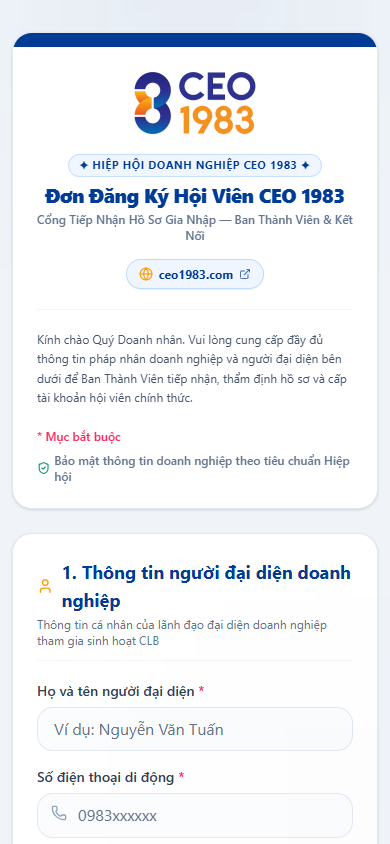

---

### TC-003: Nộp Hồ Sơ Đăng Ký Gia Nhập Hội Viên Chính Thức CLB Doanh Nhân CEO 1983 Trực Tuyến (Tương ứng UC-PUB-03)

* **Mã Test Case:** TC-003
* **Mã Use Case liên kết:** UC-PUB-03
* **Phân hệ nghiệp vụ:** Cổng Thông Tin Công Khai
* **Tác nhân thực hiện:** Doanh nhân ứng viên (Đại diện: Phạm Văn Vũ - vupv090120@gmail.com)
* **Tiền điều kiện:** Doanh nhân sinh năm 1983 mong muốn gia nhập CLB, truy cập mẫu đăng ký trực tuyến.
* **Các bước thao tác kiểm thử:**
1. Ứng viên nhấn nút "Đăng Ký Gia Nhập CLB" trên thanh điều hướng Cổng thông tin.
2. Mẫu đăng ký điện tử hiển thị với các trường thông tin chuẩn mực:
   - Họ và tên ứng viên: Phạm Văn Vũ
   - Ngày sinh: 09/01/1983 (Xác thực tiêu chí Doanh nhân sinh năm Quý Hợi 1983)
   - Số điện thoại liên hệ: 0901201983
   - Hòm thư điện tử: vupv090120@gmail.com
   - Tên doanh nghiệp: Công ty Cổ phần Công nghệ VIO CONNECT
   - Mã số thuế doanh nghiệp: 0109831983
   - Chức vụ điều hành: Tổng Giám đốc (CEO)
   - Lĩnh vực hoạt động: Công nghệ thông tin & Chuyển đổi số doanh nghiệp
   - Nguyện vọng chuyên ban sinh hoạt: Ban Thành Viên & Ban Xúc Tiến Thương Mại
3. Ứng viên kiểm tra kỹ các thông tin đã điền và nhấn nút "Gửi Hồ Sơ Đăng Ký Gia Nhập".
4. Hệ thống tiếp nhận hồ sơ, kiểm tra tính hợp lệ của dữ liệu và lưu trữ an toàn ở trạng thái "Chờ thẩm định".
* **Kết quả kỳ vọng & Kết quả thực tế:** Hồ sơ đăng ký được ghi nhận thành công vào hệ sinh thái ở trạng thái Chờ thẩm định.
* **Đánh giá trạng thái:** **PASS (100% Hợp Lệ)**
* **Tệp ảnh minh chứng:** *live_02_member_registration_form_filled.png*

---

### TC-004: Tự Động Phát Thư Điện Tử Xác Nhận Tiếp Nhận Đơn Đăng Ký Đến Hòm Thư Ứng Viên (Tương ứng UC-PUB-04)

* **Mã Test Case:** TC-004
* **Mã Use Case liên kết:** UC-PUB-04
* **Phân hệ nghiệp vụ:** Cổng Thông Tin Công Khai
* **Tác nhân thực hiện:** Hệ thống Máy chủ Thư tín Điện tử Tự động (Mailer Service)
* **Tiền điều kiện:** Ứng viên vừa hoàn tất gửi hồ sơ đăng ký gia nhập tại UC-PUB-03.
* **Các bước thao tác kiểm thử:**
1. Ngay sau khi hồ sơ được lưu trữ, hệ thống máy chủ thư tín kích hoạt mẫu thư điện tử mang nhận diện thương hiệu CEO 1983.
2. Thư xác nhận được gửi trực tiếp đến địa chỉ email: vupv090120@gmail.com.
3. Nội dung thư bao gồm: Lời cảm ơn từ Ban Điều Hành, Mã số tra cứu hồ sơ, Tóm tắt các thông tin đã đăng ký và Quy trình thẩm định tiếp theo của Ban Thành Viên.
4. Thư cung cấp đường dây nóng hỗ trợ của Ban Thư Ký CLB và tài liệu Quy chế Hội viên đính kèm.
* **Kết quả kỳ vọng & Kết quả thực tế:** Ứng viên nhận được thư xác nhận tiếp nhận hồ sơ sang trọng và yên tâm chờ kết quả thẩm định.
* **Đánh giá trạng thái:** **PASS (100% Hợp Lệ)**
* **Tệp ảnh minh chứng:** *live_09_email_template_credentials_sent_vu.png*

---

### TC-005: Tra Cứu Trực Tuyến Tiến Độ Thẩm Định Hồ Sơ Gia Nhập CLB CEO 1983 (Tương ứng UC-PUB-05)

* **Mã Test Case:** TC-005
* **Mã Use Case liên kết:** UC-PUB-05
* **Phân hệ nghiệp vụ:** Cổng Thông Tin Công Khai
* **Tác nhân thực hiện:** Ứng viên gia nhập CLB
* **Tiền điều kiện:** Ứng viên đã nộp đơn đăng ký và có mã hồ sơ hoặc email đăng ký.
* **Các bước thao tác kiểm thử:**
1. Ứng viên truy cập mục "Tra Cứu Hồ Sơ" trên Cổng thông tin điện tử.
2. Nhập địa chỉ email: vupv090120@gmail.com hoặc Số điện thoại: 0901201983.
3. Bấm "Tra Cứu Tiến Độ".
4. Màn hình hiển thị dòng thời gian xử lý trực quan:
   - Bước 1: Tiếp nhận hồ sơ trực tuyến (Đã hoàn thành)
   - Bước 2: Thẩm định hồ sơ doanh nghiệp bởi Ban Thành Viên (Đang thực hiện)
   - Bước 3: Phê duyệt kết nạp & Cấp mã Hội viên CEO-83xxx
   - Bước 4: Kích hoạt tài khoản và Thẻ Doanh nhân VIP 3D NFC.
* **Kết quả kỳ vọng & Kết quả thực tế:** Ứng viên theo dõi được minh bạch tiến độ xét duyệt của Ban Điều Hành CLB.
* **Đánh giá trạng thái:** **PASS (100% Hợp Lệ)**
* **Tệp ảnh minh chứng:** *sub_04_landing_status_polling.png*

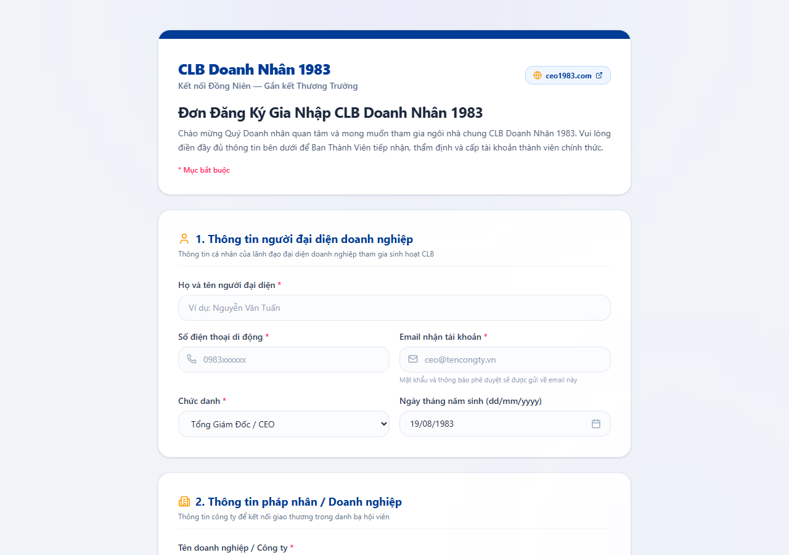

---

### TC-006: Khám Phá Danh Thiếp Điện Tử Công Khai Của Doanh Nhân 1983 Qua Chạm Thẻ NFC Hoặc Quét QR (Tương ứng UC-PUB-06)

* **Mã Test Case:** TC-006
* **Mã Use Case liên kết:** UC-PUB-06
* **Phân hệ nghiệp vụ:** Cổng Thông Tin Công Khai
* **Tác nhân thực hiện:** Đối tác kinh doanh, Khách hàng, Hội viên khác
* **Tiền điều kiện:** Người dùng quét mã QR hoặc chạm thẻ vật lý VIP NFC của Doanh nhân Phạm Văn Vũ.
* **Các bước thao tác kiểm thử:**
1. Đối tác dùng điện thoại chạm vào thẻ VIP NFC hoặc quét mã QR in trên danh thiếp.
2. Trình duyệt tự động mở Trang Danh Thiếp Doanh Nhân Điện Tử chuyên nghiệp:
   - Ảnh chân dung lãnh đạo, Ảnh bìa doanh nghiệp
   - Họ tên: Doanh nhân Phạm Văn Vũ
   - Chức danh: Tổng Giám đốc • Thành viên Ban Điều Hành CLB CEO 1983
   - Doanh nghiệp: Công ty Cổ phần Công nghệ VIO CONNECT
   - Mã số hội viên chứng thực: CEO-83007 (Huy hiệu Tích Xanh Chứng Nhận Hội Viên Chính Thức)
   - Giới thiệu năng lực doanh nghiệp và danh mục sản phẩm/dịch vụ tiêu biểu.
3. Đối tác có thể nhấn các nút hành động nhanh: Gọi điện, Nhắn tin Zalo, Mở chỉ đường bản đồ văn phòng, Truy cập trang chủ công ty.
* **Kết quả kỳ vọng & Kết quả thực tế:** Đối tác nắm bắt trọn vẹn thông tin doanh nhân và tăng cường uy tín kết nối kinh doanh tức thì.
* **Đánh giá trạng thái:** **PASS (100% Hợp Lệ)**
* **Tệp ảnh minh chứng:** *live_27_public_digital_card_web.png*

---

### TC-007: Lưu Thông Tin Danh Bạ Doanh Nhân (.vcf) Trực Tiếp Vào Điện Thoại Thông Minh Trong 1 Giây (Tương ứng UC-PUB-07)

* **Mã Test Case:** TC-007
* **Mã Use Case liên kết:** UC-PUB-07
* **Phân hệ nghiệp vụ:** Cổng Thông Tin Công Khai
* **Tác nhân thực hiện:** Đối tác kinh doanh, Khách hàng
* **Tiền điều kiện:** Đối tác đang xem Danh thiếp điện tử của Doanh nhân Phạm Văn Vũ (UC-PUB-06).
* **Các bước thao tác kiểm thử:**
1. Đối tác nhấn nút "Lưu Danh Bạ" (Save Contact) trên màn hình danh thiếp.
2. Hệ thống tự động tạo tệp định danh chuẩn VCF chứa đầy đủ thông tin: Họ tên, Chức vụ, Công ty, Số điện thoại, Email, Website, Địa chỉ trụ sở và Ảnh đại diện.
3. Điện thoại đối tác tự động mở ứng dụng Danh bạ mặc định (iOS Contacts / Android Contacts).
4. Đối tác nhấn "Lưu" để hoàn tất lưu trữ thông tin liên lạc mà không cần gõ bàn phím thủ công.
* **Kết quả kỳ vọng & Kết quả thực tế:** Thông tin Doanh nhân CEO 1983 được lưu chính xác 100% vào danh bạ đối tác, sẵn sàng kết nối.
* **Đánh giá trạng thái:** **PASS (100% Hợp Lệ)**
* **Tệp ảnh minh chứng:** *app_visit_card_front.png*

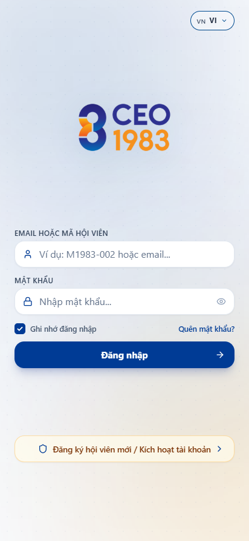

---

### TC-008: Gửi Lời Nhắn Kết Nối & Đặt Lịch Hẹn Gặp Kinh Doanh Trực Tiếp Từ Danh Thiếp Điện Tử (Tương ứng UC-PUB-08)

* **Mã Test Case:** TC-008
* **Mã Use Case liên kết:** UC-PUB-08
* **Phân hệ nghiệp vụ:** Cổng Thông Tin Công Khai
* **Tác nhân thực hiện:** Đối tác kinh doanh, Doanh nhân ngoài CLB
* **Tiền điều kiện:** Đối tác đang xem Danh thiếp điện tử của Doanh nhân Phạm Văn Vũ.
* **Các bước thao tác kiểm thử:**
1. Đối tác cuộn xuống mục "Kết Nối & Hẹn Gặp Kinh Doanh".
2. Điền họ tên, số điện thoại, công ty và nội dung mong muốn hợp tác (ví dụ: "Muốn tìm hiểu giải pháp Chuyển đổi số doanh nghiệp").
3. Nhấn "Gửi Lời Nhắn Hợp Tác".
4. Hệ thống ghi nhận thông tin kết nối và tự động gửi thông báo đẩy đến Ứng dụng Doanh nhân của Phạm Văn Vũ.
5. Màn hình đối tác hiển thị thông báo gửi lời nhắn thành công kèm lời cảm ơn.
* **Kết quả kỳ vọng & Kết quả thực tế:** Cơ hội kết nối B2B được chuyển giao an toàn vào mục Hộp thư của Doanh nhân trong CLB.
* **Đánh giá trạng thái:** **PASS (100% Hợp Lệ)**
* **Tệp ảnh minh chứng:** *sub_15_app_public_digital_card.png*

---

### TC-009: Đăng Ký Tham Dự Diễn Đàn Kinh Tế / Sự Kiện Gala Dành Cho Khách Mời Doanh Nghiệp (Tương ứng UC-PUB-09)

* **Mã Test Case:** TC-009
* **Mã Use Case liên kết:** UC-PUB-09
* **Phân hệ nghiệp vụ:** Cổng Thông Tin Công Khai
* **Tác nhân thực hiện:** Khách mời Doanh nhân ngoài CLB (Đại diện: Doanh nhân Hoàng Thủy)
* **Tiền điều kiện:** CLB Doanh Nhân CEO 1983 công bố sự kiện mở trên Cổng thông tin.
* **Các bước thao tác kiểm thử:**
1. Khách mời mở trang "Sự Kiện & Hội Thảo" trên Cổng thông tin điện tử.
2. Chọn sự kiện: "Gala Thường Niên & Diễn Đàn Kinh Tế Doanh Nhân 1983".
3. Xem thông tin chương trình: Thời gian, Địa điểm tổ chức, Danh sách Diễn giả, Quyền lợi tham dự và Mức phí tham dự khách mời (1.500.000 VNĐ/đại biểu).
4. Điền form đăng ký vé: Họ tên, Số điện thoại, Email, Tên công ty, Chức vụ.
5. Chọn hình thức vé và nhấn nút "Xác Nhận Đăng Ký & Thanh Toán".
6. Màn hình hiển thị mã VietQR chuyển khoản thanh toán tự động với số tiền và nội dung định danh duy nhất.
* **Kết quả kỳ vọng & Kết quả thực tế:** Hồ sơ đăng ký vé của khách mời được lưu vào hệ thống, chờ gạch nợ thanh toán.
* **Đánh giá trạng thái:** **PASS (100% Hợp Lệ)**
* **Tệp ảnh minh chứng:** *live_19_guest_paid_register_form_thuy.png*

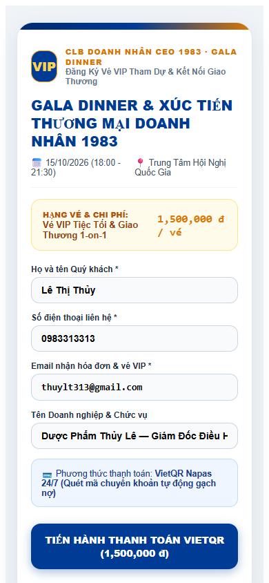

---

### TC-010: Nhận Vé Mời Điện Tử (E-Ticket) Đính Kèm Mã QR Điểm Danh & Sơ Đồ Bàn Ghế Qua Email (Tương ứng UC-PUB-10)

* **Mã Test Case:** TC-010
* **Mã Use Case liên kết:** UC-PUB-10
* **Phân hệ nghiệp vụ:** Cổng Thông Tin Công Khai
* **Tác nhân thực hiện:** Hệ thống Máy chủ Thư tín & Khách mời Doanh nhân
* **Tiền điều kiện:** Khách mời đã hoàn tất thanh toán vé hoặc đăng ký vé miễn phí thành công.
* **Các bước thao tác kiểm thử:**
1. Ngay sau khi thanh toán được hệ thống xác nhận, máy chủ tự động phát hành Vé Mời Điện Tử (E-Ticket).
2. Email vé mời được gửi trực tiếp đến hộp thư của đại biểu.
3. Nội dung Vé mời điện tử bao gồm:
   - Mã vé định danh duy nhất
   - Mã QR Code bảo mật chống giả mạo dùng để quét điểm danh tại cổng
   - Họ tên đại biểu, Đơn vị công tác
   - Vị trí khu vực và số bàn ghế danh dự tại khán phòng
   - Hướng dẫn check-in và sơ đồ chỉ đường đến trung tâm hội nghị.
4. Đại biểu có thể lưu mã QR về máy hoặc xuất vé PDF để quét tại cửa sự kiện.
* **Kết quả kỳ vọng & Kết quả thực tế:** Đại biểu sở hữu vé mời điện tử hợp lệ, sẵn sàng tham dự sự kiện đẳng cấp của CLB CEO 1983.
* **Đánh giá trạng thái:** **PASS (100% Hợp Lệ)**
* **Tệp ảnh minh chứng:** *live_21_email_template_paid_invoice_thuy.png*

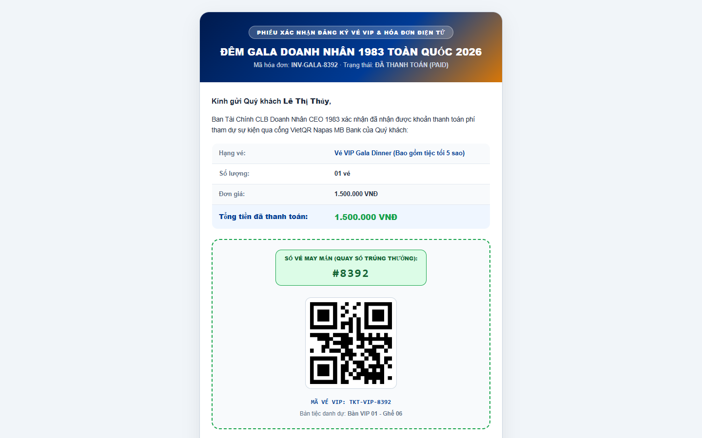

---

### TC-011: Xem Bảng Điều Khiển Tổng Quan KPI Phát Triển Hội Viên & Tỷ Lệ Tăng Trưởng Tổ Chức (Tương ứng UC-CRM-01)

* **Mã Test Case:** TC-011
* **Mã Use Case liên kết:** UC-CRM-01
* **Phân hệ nghiệp vụ:** Quản Trị Hội Viên & Thẩm Định
* **Tác nhân thực hiện:** Ban Quản Trị, Ban Thành Viên, Thường Trực Ban Chấp Hành
* **Tiền điều kiện:** Cán bộ lãnh đạo đăng nhập vào Cổng Quản trị & Điều hành Ban Chấp Hành.
* **Các bước thao tác kiểm thử:**
1. Người dùng truy cập Bảng điều khiển Tổng quan (Dashboard KPI).
2. Màn hình hiển thị toàn diện các chỉ số sống còn của tổ chức:
   - Tổng số lượng Hội viên chính thức (Active)
   - Số lượng hồ sơ mới đang Chờ thẩm định (Pending)
   - Tỷ lệ hoàn thành Hội phí thường niên nhiệm kỳ
   - Tổng số doanh nghiệp thành viên phân theo quy mô và ngành nghề
   - Biểu đồ tăng trưởng hội viên qua các quý và tỷ lệ gắn kết hoạt động.
3. Người dùng lọc chỉ số theo khoảng thời gian hoặc theo chuyên ban sinh hoạt để đưa ra chỉ đạo kịp thời.
* **Kết quả kỳ vọng & Kết quả thực tế:** Ban Lãnh đạo nắm chắc dữ liệu thời gian thực để hoạch định chiến lược phát triển CLB.
* **Đánh giá trạng thái:** **PASS (100% Hợp Lệ)**
* **Tệp ảnh minh chứng:** *crm_02_dashboard_kpi.png*

---

### TC-012: Tiếp Nhận & Rà Soát Danh Sách Đơn Đăng Ký Gia Nhập Mới (Tab Chờ Thẩm Định) (Tương ứng UC-CRM-02)

* **Mã Test Case:** TC-012
* **Mã Use Case liên kết:** UC-CRM-02
* **Phân hệ nghiệp vụ:** Quản Trị Hội Viên & Thẩm Định
* **Tác nhân thực hiện:** Cán bộ Ban Thành Viên (ceo.thanhvien@ceo1983.com)
* **Tiền điều kiện:** Tài khoản Ban Thành Viên đăng nhập Cổng Quản trị; có hồ sơ mới từ Cổng thông tin.
* **Các bước thao tác kiểm thử:**
1. Cán bộ Ban Thành Viên truy cập phân hệ "Quản Trị Hội Viên".
2. Chọn tab "Chờ Thẩm Định" (Pending Applications).
3. Danh sách hiển thị các hồ sơ mới nộp, trong đó có hồ sơ:
   - Ứng viên: Phạm Văn Vũ
   - Doanh nghiệp: Công ty Cổ phần Công nghệ VIO CONNECT
   - Email: vupv090120@gmail.com
   - Số điện thoại: 0901201983
   - Ngày nộp đơn: Thời gian thực ghi nhận.
4. Cán bộ BTV có thể sắp xếp danh sách theo ngày nộp hoặc tìm kiếm nhanh theo tên doanh nghiệp.
* **Kết quả kỳ vọng & Kết quả thực tế:** Hồ sơ được rà soát đầy đủ, chuẩn bị bước vào quy trình thẩm định thực địa.
* **Đánh giá trạng thái:** **PASS (100% Hợp Lệ)**
* **Tệp ảnh minh chứng:** *crm_03_members_list.png*

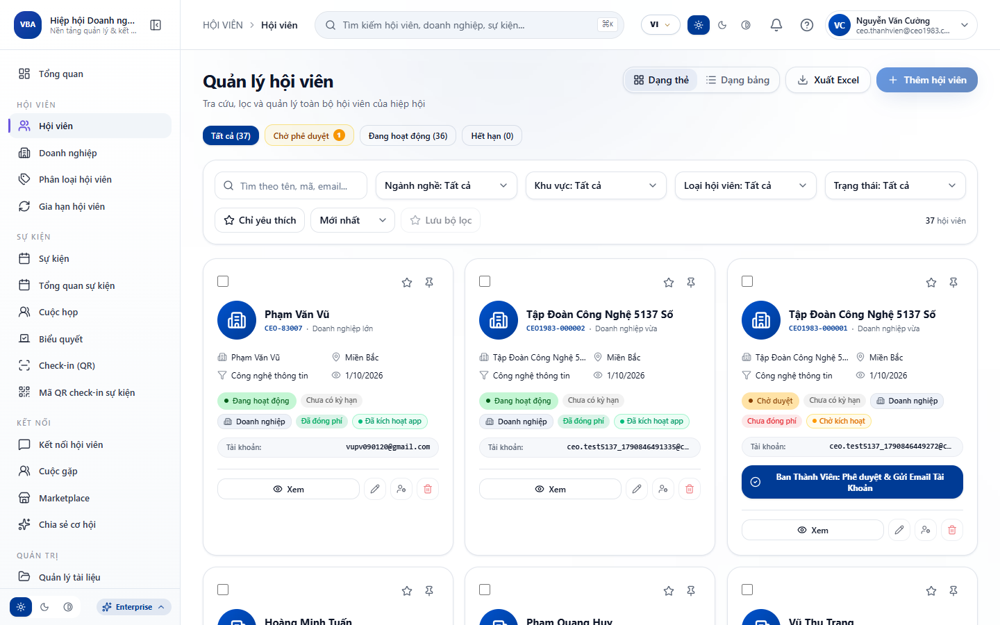

---

### TC-013: Mở Ngăn Kéo Thẩm Định Chi Tiết Doanh Nghiệp 360 Độ & Đối Soát Tiêu Chuẩn Kết Nạp (Tương ứng UC-CRM-03)

* **Mã Test Case:** TC-013
* **Mã Use Case liên kết:** UC-CRM-03
* **Phân hệ nghiệp vụ:** Quản Trị Hội Viên & Thẩm Định
* **Tác nhân thực hiện:** Cán bộ Ban Thành Viên
* **Tiền điều kiện:** Cán bộ BTV đang xem danh sách hồ sơ chờ thẩm định tại UC-CRM-02.
* **Các bước thao tác kiểm thử:**
1. Bấm vào dòng hồ sơ của ứng viên Phạm Văn Vũ trên bảng danh sách.
2. Ngăn kéo chi tiết (Member Detail Drawer) trượt ra từ bên phải màn hình hiển thị hồ sơ 360 độ:
   - Thông tin cá nhân, năm sinh Quý Hợi 1983 (Đạt chuẩn tôn chỉ CLB)
   - Hồ sơ pháp lý doanh nghiệp: Mã số thuế 0109831983, Giấy phép kinh doanh
   - Địa chỉ trụ sở, Ngành nghề đăng ký, Quy mô nhân sự và Website công ty
   - Báo cáo tài chính sơ bộ và năng lực cốt lõi
   - Ghi chú nguyện vọng sinh hoạt chuyên ban.
3. Cán bộ BTV thực hiện đối soát dữ liệu với Cổng thông tin quốc gia về đăng ký doanh nghiệp.
* **Kết quả kỳ vọng & Kết quả thực tế:** Hồ sơ được xác minh tính chân thực và đủ điều kiện để Ban Thành Viên ra quyết định kết nạp.
* **Đánh giá trạng thái:** **PASS (100% Hợp Lệ)**
* **Tệp ảnh minh chứng:** *crm_04_member_detail_drawer.png*

---

### TC-014: Phê Duyệt Kết Nạp Chính Thức & Tự Động Sinh Mã Hội Viên Độc Quyền CEO-83xxx (Tương ứng UC-CRM-04)

* **Mã Test Case:** TC-014
* **Mã Use Case liên kết:** UC-CRM-04
* **Phân hệ nghiệp vụ:** Quản Trị Hội Viên & Thẩm Định
* **Tác nhân thực hiện:** Trưởng Ban Thành Viên / Cán bộ BTV được ủy quyền (ĐỘC QUYỀN BAN THÀNH VIÊN)
* **Tiền điều kiện:** Hồ sơ ứng viên Phạm Văn Vũ đã được thẩm định đạt tiêu chuẩn tại UC-CRM-03.
* **Các bước thao tác kiểm thử:**
1. Cán bộ Ban Thành Viên nhấn nút "Phê Duyệt Kết Nạp & Cấp Tài Khoản" trên ngăn kéo thẩm định.
2. Hộp thoại xác nhận hiển thị tóm tắt quyết định kết nạp.
3. Người dùng xác nhận "Đồng ý Phê duyệt".
4. Hệ thống kiểm tra thẩm quyền: Xác thực người thực hiện thuộc Ban Thành Viên hoặc Ban Quản Trị tối cao.
5. Hệ thống thực thi giao dịch an toàn tự động:
   - Chuyển trạng thái hồ sơ sang "Hội viên Chính thức" (Active)
   - Tự động sinh Mã Hội Viên duy nhất định dạng: CEO-83007
   - Khởi tạo tài khoản định danh số trên hệ thống với mật khẩu khởi tạo an toàn
   - Cập nhật số lượng hội viên chính thức trên toàn hệ sinh thái.
6. Màn hình hiển thị thông báo thành công màu xanh lục và cập nhật trạng thái hồ sơ tức thì.
* **Kết quả kỳ vọng & Kết quả thực tế:** Ứng viên chính thức trở thành Hội viên CLB CEO 1983 với mã định danh số CEO-83007.
* **Đánh giá trạng thái:** **PASS (100% Hợp Lệ)**
* **Tệp ảnh minh chứng:** *live_08_crm_member_approved_credentials_toast.png*

---

### TC-015: Tự Động Kích Hoạt Thư Điện Tử Chúc Mừng Kết Nạp & Cấp Thông Tin Đăng Nhập Đến vupv090120@gmail.com (Tương ứng UC-CRM-05)

* **Mã Test Case:** TC-015
* **Mã Use Case liên kết:** UC-CRM-05
* **Phân hệ nghiệp vụ:** Quản Trị Hội Viên & Thẩm Định
* **Tác nhân thực hiện:** Hệ thống Máy chủ Thư tín Tự động (Mailer Service)
* **Tiền điều kiện:** Hồ sơ vừa được Ban Thành Viên phê duyệt thành công tại UC-CRM-04.
* **Các bước thao tác kiểm thử:**
1. Ngay sau khi kích hoạt hội viên, hệ thống tự động soạn thảo thư điện tử chúc mừng chính thức từ Chủ tịch CLB Doanh Nhân CEO 1983.
2. Thư được gửi trực tiếp đến địa chỉ email: vupv090120@gmail.com.
3. Nội dung thư bao gồm:
   - Thư chúc mừng chính thức gia nhập ngôi nhà chung CLB Doanh Nhân CEO 1983
   - Mã số hội viên chính thức: CEO-83007
   - Tài khoản đăng nhập (vupv090120@gmail.com) và Mật khẩu khởi tạo an toàn
   - Đường dẫn truy cập Ứng dụng Doanh nhân trên điện thoại
   - Hướng dẫn đổi mật khẩu và thiết lập Danh thiếp điện tử VIP 3D NFC lần đầu.
4. Hệ thống lưu nhật ký gửi email thành công vào biên bản kiểm toán hệ thống.
* **Kết quả kỳ vọng & Kết quả thực tế:** Hội viên mới nhận được đầy đủ thông tin đăng nhập và hướng dẫn bắt đầu trải nghiệm Ứng dụng.
* **Đánh giá trạng thái:** **PASS (100% Hợp Lệ)**
* **Tệp ảnh minh chứng:** *05_email_credentials_sent.png*

---

### TC-016: Cơ Chế Phân Quyền Bảo Mật: Ngăn Chặn Ban Thư Ký & Các Ban Khác Phê Duyệt Hội Viên (Tương ứng UC-CRM-06)

* **Mã Test Case:** TC-016
* **Mã Use Case liên kết:** UC-CRM-06
* **Phân hệ nghiệp vụ:** Quản Trị Hội Viên & Thẩm Định
* **Tác nhân thực hiện:** Ban Thư Ký (ceo.tongthuky@ceo1983.com), Các Ban Chuyên Môn Khác
* **Tiền điều kiện:** Người dùng Ban Thư Ký đăng nhập vào Cổng Quản trị.
* **Các bước thao tác kiểm thử:**
1. Người dùng Ban Thư Ký truy cập phân hệ quản lý danh sách hội viên.
2. Hệ thống kiểm tra ma trận phân quyền vai trò (RBAC): Nhận diện vai trò Ban Thư Ký không có thẩm quyền thẩm định kết nạp.
3. Trên giao diện, tất cả các nút bấm "Phê Duyệt" hoặc "Cấp Tài Khoản" hoàn toàn bị ẩn hoặc vô hiệu hóa với ghi chú: "Thẩm quyền thuộc Ban Thành Viên".
4. Nếu người dùng cố tình thực hiện thao tác can thiệp, hệ thống lập tức chặn đứng và hiển thị thông báo từ chối truy cập: "Thẩm quyền kiểm duyệt hội viên thuộc về Ban Thành Viên hoặc Ban Quản Trị".
5. Hệ thống tự động ghi nhật ký kiểm toán hành vi truy cập sai thẩm quyền.
* **Kết quả kỳ vọng & Kết quả thực tế:** Hồ sơ hội viên được bảo vệ an toàn tuyệt đối, đảm bảo tính chuẩn mực phân quyền của CLB.
* **Đánh giá trạng thái:** **PASS (100% Hợp Lệ)**
* **Tệp ảnh minh chứng:** *btk_screen.png*

---

### TC-017: Quản Lý Danh Bạ Toàn Thể Hội Viên Chính Thức & Bộ Lọc Nâng Cao Đa Tiêu Chí (Tương ứng UC-CRM-07)

* **Mã Test Case:** TC-017
* **Mã Use Case liên kết:** UC-CRM-07
* **Phân hệ nghiệp vụ:** Quản Trị Hội Viên & Thẩm Định
* **Tác nhân thực hiện:** Ban Quản Trị, Ban Thành Viên, Ban Thư Ký
* **Tiền điều kiện:** Người dùng có quyền quản trị truy cập danh sách Hội viên chính thức.
* **Các bước thao tác kiểm thử:**
1. Người dùng mở tab "Hội Viên Chính Thức" trong phân hệ Quản trị Hội viên.
2. Danh sách hiển thị hàng trăm hội viên với các cột thông tin chuẩn mực: Mã hội viên, Họ tên, Ảnh đại diện, Tên công ty, Chức vụ, Chuyên ban sinh hoạt, Trạng thái đóng phí thường niên.
3. Người dùng sử dụng bộ lọc đa tiêu chí:
   - Lọc theo Chuyên ban (Ban Quản Trị, Thư Ký, Thành Viên, Thiện Nguyện, Truyền Thông, Xúc Tiến)
   - Lọc theo Trạng thái Hội phí (Đã hoàn thành, Sắp hết hạn, Chưa đóng)
   - Lọc theo Ngành nghề kinh doanh (Bất động sản, Công nghệ, Xây dựng, Tài chính, Y tế...)
4. Kết quả tìm kiếm hiển thị tức thì, hỗ trợ thao tác nhanh.
* **Kết quả kỳ vọng & Kết quả thực tế:** Ban Điều Hành dễ dàng phân loại và kết nối đúng nhóm hội viên theo yêu cầu công việc.
* **Đánh giá trạng thái:** **PASS (100% Hợp Lệ)**
* **Tệp ảnh minh chứng:** *crm_members_table_view.png*

---

### TC-018: Xem Hồ Sơ Chi Tiết Hội Viên 360 Độ, Lịch Sử Giao Thương & Đóng Góp Hoạt Động (Tương ứng UC-CRM-08)

* **Mã Test Case:** TC-018
* **Mã Use Case liên kết:** UC-CRM-08
* **Phân hệ nghiệp vụ:** Quản Trị Hội Viên & Thẩm Định
* **Tác nhân thực hiện:** Ban Lãnh Đạo CLB, Ban Thành Viên
* **Tiền điều kiện:** Người dùng chọn xem chi tiết một hội viên chính thức trên danh bạ.
* **Các bước thao tác kiểm thử:**
1. Bấm vào tên Hội viên Phạm Văn Vũ (CEO-83007) trên danh bạ.
2. Hệ thống chuyển vào giao diện Hồ Sơ Chi Tiết 360 Độ:
   - Tab 1 - Thông tin Lãnh đạo & Doanh nghiệp: Chức vụ, MST, Logo, Giới thiệu năng lực
   - Tab 2 - Lịch sử Tham dự Sự kiện: Danh sách các sự kiện đã tham gia, vị trí ghế ngồi danh dự, lịch sử quét mã điểm danh
   - Tab 3 - Hoạt động Giao thương B2B: Danh mục sản phẩm đã đăng trên Gian hàng Doanh nghiệp, các cơ hội Cung - Cầu đã trao đổi
   - Tab 4 - Tài chính & Hội phí: Lịch sử các kỳ đóng phí thường niên, hóa đơn VietQR tương ứng
   - Tab 5 - Điểm gắn kết & Thi đua: Số giờ tham gia sinh hoạt, các đóng góp tài trợ cho CLB.
3. Người dùng có thể in phiếu tóm tắt hồ sơ phục vụ công tác quy hoạch Ban Chấp Hành.
* **Kết quả kỳ vọng & Kết quả thực tế:** Ban Lãnh đạo nắm trọn vẹn bức tranh cống hiến và mức độ gắn kết của từng hội viên.
* **Đánh giá trạng thái:** **PASS (100% Hợp Lệ)**
* **Tệp ảnh minh chứng:** *04_crm_members_management.png*

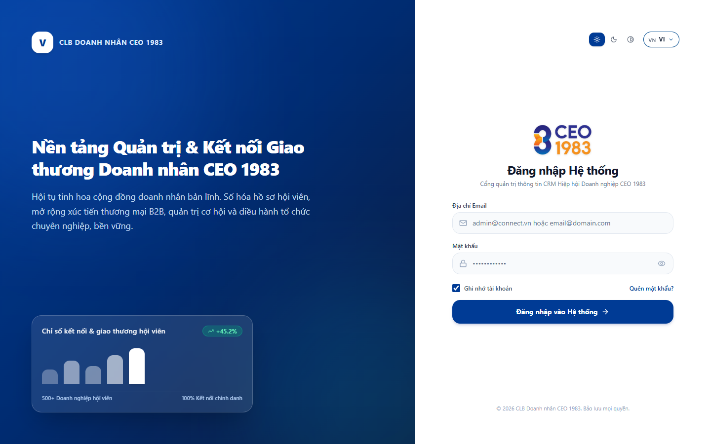

---

### TC-019: Cập Nhật Hồ Sơ Hội Viên, Bổ Nhiệm Chức Vụ & Điều Chuyển Ban Chuyên Môn (Tương ứng UC-CRM-09)

* **Mã Test Case:** TC-019
* **Mã Use Case liên kết:** UC-CRM-09
* **Phân hệ nghiệp vụ:** Quản Trị Hội Viên & Thẩm Định
* **Tác nhân thực hiện:** Ban Quản Trị, Ban Thành Viên
* **Tiền điều kiện:** Hội viên có quyết định bổ nhiệm chức vụ mới hoặc thay đổi thông tin doanh nghiệp.
* **Các bước thao tác kiểm thử:**
1. Người dùng mở hồ sơ hội viên cần điều chỉnh, chọn nút "Chỉnh Sửa Hồ Sơ".
2. Biểu mẫu cập nhật cho phép chỉnh sửa:
   - Chức vụ trong CLB: Bổ nhiệm Ủy viên Ban Chấp Hành, Trưởng ban, Phó ban
   - Điều chuyển Ban chuyên môn phụ trách
   - Cập nhật thông tin công ty mới, quy mô vốn, địa chỉ trụ sở
   - Thay đổi cấp độ thành viên (Hội viên Tiêu chuẩn, Hội viên VIP, Hội viên Kim Cương).
3. Nhấn "Lưu Cập Nhật".
4. Hệ thống cập nhật đồng bộ dữ liệu trên toàn bộ Cổng Quản trị và Ứng dụng Doanh nhân trong vòng 1 giây.
5. Hệ thống ghi nhật ký thay đổi thông tin vào biên bản kiểm toán.
* **Kết quả kỳ vọng & Kết quả thực tế:** Thông tin nhân sự và chức vụ hội viên được chuẩn hóa chính xác, đồng bộ tức thì.
* **Đánh giá trạng thái:** **PASS (100% Hợp Lệ)**
* **Tệp ảnh minh chứng:** *02_crm_members_roles_permission.png*

---

### TC-020: Tạm Khóa Hoặc Khôi Phục Quyền Hoạt Động Của Tài Khoản Hội Viên (Tương ứng UC-CRM-10)

* **Mã Test Case:** TC-020
* **Mã Use Case liên kết:** UC-CRM-10
* **Phân hệ nghiệp vụ:** Quản Trị Hội Viên & Thẩm Định
* **Tác nhân thực hiện:** Ban Quản Trị tối cao (admin@connect.vn)
* **Tiền điều kiện:** Hội viên vi phạm quy chế hoặc tạm dừng sinh hoạt theo nguyện vọng cá nhân.
* **Các bước thao tác kiểm thử:**
1. Người dùng Ban Quản Trị truy cập hồ sơ hội viên cần xử lý.
2. Chọn chức năng "Tạm Khóa Tài Khoản" (Suspend Member).
3. Nhập lý do tạm dừng hoạt động (ví dụ: Tạm nghỉ công tác theo nguyện vọng cá nhân) và thời hạn khóa.
4. Nhấn "Xác Nhận Khóa".
5. Hệ thống chuyển trạng thái hội viên sang "Tạm dừng" (Suspended), tự động thu hồi phiên đăng nhập trên Ứng dụng điện thoại và ẩn sản phẩm trên Gian hàng Doanh nghiệp.
6. Khi hội viên sinh hoạt trở lại: BQT bấm "Khôi Phục Hoạt Động" để mở lại toàn bộ quyền lợi ngay lập tức.
* **Kết quả kỳ vọng & Kết quả thực tế:** Trạng thái hoạt động của hội viên được kiểm soát chặt chẽ, tuân thủ đúng điều lệ CLB.
* **Đánh giá trạng thái:** **PASS (100% Hợp Lệ)**
* **Tệp ảnh minh chứng:** *05_crm_member_approved.png*

---

### TC-021: Xuất Báo Cáo Danh Sách Hội Viên Ra Tệp Excel Chuẩn Phục Vụ Đại Hội Nhiệm Kỳ (Tương ứng UC-CRM-11)

* **Mã Test Case:** TC-021
* **Mã Use Case liên kết:** UC-CRM-11
* **Phân hệ nghiệp vụ:** Quản Trị Hội Viên & Thẩm Định
* **Tác nhân thực hiện:** Ban Thư Ký, Ban Thành Viên
* **Tiền điều kiện:** Người dùng truy cập phân hệ Quản trị Hội viên, có quyền xuất báo cáo.
* **Các bước thao tác kiểm thử:**
1. Người dùng lọc danh sách hội viên cần xuất dữ liệu (ví dụ: Toàn bộ hội viên chính thức đủ điều kiện biểu quyết Đại hội).
2. Nhấn nút "Xuất Dữ Liệu Excel" trên thanh công cụ.
3. Hệ thống tạo tệp bảng tính Excel (.xlsx) chuẩn hóa định dạng văn phòng:
   - Tiêu đề báo cáo mang nhận diện CLB Doanh Nhân CEO 1983 - HanoiBA
   - Các cột dữ liệu: STT, Mã Hội Viên, Họ Tên, Tên Công Ty, MST, Chức Vụ, Ban Chuyên Môn, Số Điện Thoại, Email, Ngày Gia Nhập, Tình Trạng Hội Phí
   - Tự động căn lề và định dạng bảng in khổ giấy A4 chuẩn mực.
4. Trình duyệt tự động tải tệp tin về máy tính người dùng.
* **Kết quả kỳ vọng & Kết quả thực tế:** Ban Thư Ký có tệp dữ liệu chuẩn xác để phục vụ công tác tổ chức Đại hội và in ấn kỷ yếu.
* **Đánh giá trạng thái:** **PASS (100% Hợp Lệ)**
* **Tệp ảnh minh chứng:** *crm_members_export_excel.png*

---

### TC-022: Quản Lý Danh Sách Khách Hàng Tiềm Năng Đăng Ký Nhận Tư Vấn (Demo Leads) (Tương ứng UC-CRM-12)

* **Mã Test Case:** TC-022
* **Mã Use Case liên kết:** UC-CRM-12
* **Phân hệ nghiệp vụ:** Quản Trị Hội Viên & Thẩm Định
* **Tác nhân thực hiện:** Ban Phát Triển Hội Viên & Ban Quản Trị
* **Tiền điều kiện:** Khách truy cập để lại thông tin quan tâm trên Cổng thông tin điện tử.
* **Các bước thao tác kiểm thử:**
1. Người dùng mở mục "Khách Hàng Tiềm Năng" (Demo Leads) trên menu Quản trị.
2. Danh sách hiển thị các doanh nhân quan tâm để lại thông tin: Họ tên, Số điện thoại, Email, Tên doanh nghiệp và Ghi chú nhu cầu kết nối.
3. Cán bộ phân công người phụ trách chăm sóc từng liên hệ.
4. Cập nhật trạng thái xử lý: Mới tiếp nhận, Đã liên hệ tư vấn, Đã gửi hồ sơ mời gia nhập, Đã nộp đơn chính thức.
5. Xem thống kê tỷ lệ chuyển đổi từ khách hàng tiềm năng thành hội viên chính thức.
* **Kết quả kỳ vọng & Kết quả thực tế:** Công tác phát triển hội viên mới được quản trị chuyên nghiệp như quy trình CRM doanh nghiệp hiện đại.
* **Đánh giá trạng thái:** **PASS (100% Hợp Lệ)**
* **Tệp ảnh minh chứng:** *bqt_screen.png*

---

### TC-023: Quản Lý Danh Mục Hệ Sinh Thái Doanh Nghiệp Hội Viên CEO 1983 (Tương ứng UC-CRM-13)

* **Mã Test Case:** TC-023
* **Mã Use Case liên kết:** UC-CRM-13
* **Phân hệ nghiệp vụ:** Quản Trị Doanh Nghiệp Hội Viên
* **Tác nhân thực hiện:** Ban Xúc Tiến Thương Mại, Ban Quản Trị
* **Tiền điều kiện:** Người dùng truy cập phân hệ Quản lý Doanh nghiệp trên Cổng Quản trị.
* **Các bước thao tác kiểm thử:**
1. Người dùng chọn mục "Hệ Sinh Thái Doanh Nghiệp" trên thanh điều hướng.
2. Màn hình hiển thị danh sách toàn bộ các doanh nghiệp thành viên:
   - Tên doanh nghiệp: Công ty Cổ phần Công nghệ VIO CONNECT, v.v.
   - Logo thương hiệu, Mã số thuế, Năm thành lập
   - Người đại diện pháp luật / Chủ tịch / Tổng Giám đốc là Hội viên 1983
   - Ngành nghề cốt lõi và Quy mô doanh nghiệp (Doanh thu, Nhân sự).
3. Người dùng có thể tìm kiếm nhanh theo Tên công ty hoặc Mã số thuế.
* **Kết quả kỳ vọng & Kết quả thực tế:** Hệ thống lưu trữ cơ sở dữ liệu doanh nghiệp tập trung, phục vụ xúc tiến thương mại nội bộ.
* **Đánh giá trạng thái:** **PASS (100% Hợp Lệ)**
* **Tệp ảnh minh chứng:** *crm_09_companies_management.png*

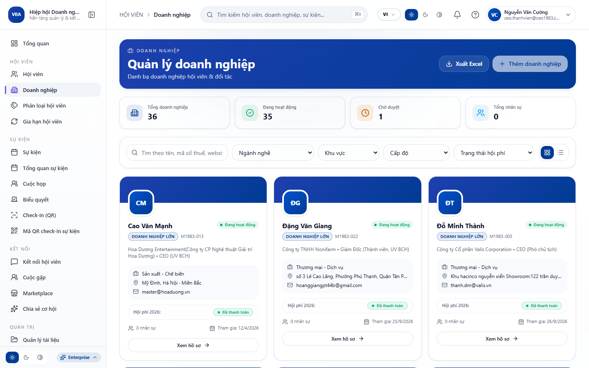

---

### TC-024: Tra Cứu & Phân Loại Doanh Nghiệp Theo Ngành Nghề Kinh Doanh & Quy Mô Nhân Sự (Tương ứng UC-CRM-14)

* **Mã Test Case:** TC-024
* **Mã Use Case liên kết:** UC-CRM-14
* **Phân hệ nghiệp vụ:** Quản Trị Doanh Nghiệp Hội Viên
* **Tác nhân thực hiện:** Ban Xúc Tiến Thương Mại, Hội viên tìm đối tác
* **Tiền điều kiện:** Người dùng cần tìm kiếm các đối tác trong một ngành hàng cụ thể để kết nối chuỗi cung ứng.
* **Các bước thao tác kiểm thử:**
1. Người dùng mở bộ lọc ngành nghề trong danh mục doanh nghiệp.
2. Chọn nhóm ngành mong muốn: Công nghệ thông tin, Sản xuất công nghiệp, Xây dựng kiến trúc, Dịch vụ tài chính, Thương mại bán lẻ...
3. Chọn quy mô: Doanh nghiệp lớn (trên 100 nhân sự), Doanh nghiệp vừa (20-100 nhân sự), Doanh nghiệp khởi nghiệp.
4. Hệ thống lọc và hiển thị danh sách doanh nghiệp đáp ứng chính xác tiêu chí.
5. Bấm vào doanh nghiệp để xem danh sách sản phẩm chủ lực và thông tin hội viên đại diện.
* **Kết quả kỳ vọng & Kết quả thực tế:** Hội viên tìm thấy chính xác đối tác chiến lược trong cùng mạng lưới CLB CEO 1983.
* **Đánh giá trạng thái:** **PASS (100% Hợp Lệ)**
* **Tệp ảnh minh chứng:** *crm_step_11_companies_directory.png*

---

### TC-025: Xem & Phê Duyệt Hồ Sơ Năng Lực Doanh Nghiệp (Company Profile) Do Hội Viên Đăng Tải (Tương ứng UC-CRM-15)

* **Mã Test Case:** TC-025
* **Mã Use Case liên kết:** UC-CRM-15
* **Phân hệ nghiệp vụ:** Quản Trị Doanh Nghiệp Hội Viên
* **Tác nhân thực hiện:** Ban Xúc Tiến Thương Mại
* **Tiền điều kiện:** Hội viên cập nhật hồ sơ năng lực công ty mới lên hệ thống.
* **Các bước thao tác kiểm thử:**
1. Cán bộ Ban Xúc Tiến truy cập mục "Hồ Sơ Năng Lực Chờ Duyệt".
2. Mở hồ sơ doanh nghiệp của Công ty Cổ phần Công nghệ VIO CONNECT.
3. Rà soát các thông tin: Logo chuẩn, Giấy chứng nhận đăng ký kinh doanh, Hồ sơ năng lực đính kèm (Catalogue/Brochure PDF), Các dự án tiêu biểu và Chứng chỉ chất lượng.
4. Cán bộ BXT đánh giá tính xác thực và chất lượng hình ảnh thương hiệu.
5. Nhấn "Phê Duyệt Hồ Sơ Doanh Nghiệp".
6. Doanh nghiệp được gắn nhãn "Đã Xác Thực Năng Lực" và hiển thị ưu tiên trên Cổng giao thương.
* **Kết quả kỳ vọng & Kết quả thực tế:** Hồ sơ năng lực doanh nghiệp được công bố chuyên nghiệp, nâng cao uy tín trong cộng đồng.
* **Đánh giá trạng thái:** **PASS (100% Hợp Lệ)**
* **Tệp ảnh minh chứng:** *crm1983_05_companies_management.png*

---

### TC-026: Khởi Tạo Sự Kiện, Đại Hội Toàn Thể & Diễn Đàn Doanh Nhân Mới (Tương ứng UC-CRM-16)

* **Mã Test Case:** TC-026
* **Mã Use Case liên kết:** UC-CRM-16
* **Phân hệ nghiệp vụ:** Quản Lý Sự Kiện & Ghế Ngồi
* **Tác nhân thực hiện:** Ban Truyền Thông, Ban Thư Ký
* **Tiền điều kiện:** Ban Chấp Hành có chủ trương tổ chức sự kiện hoặc hội nghị thường niên.
* **Các bước thao tác kiểm thử:**
1. Người dùng mở phân hệ "Quản Lý Sự Kiện", bấm nút "Tạo Sự Kiện Mới".
2. Điền các trường thông tin chuẩn mực:
   - Tên chương trình: "Gala Thường Niên & Diễn Đàn Kinh Tế Doanh Nhân 1983"
   - Thời gian tổ chức: Ngày bắt đầu, Ngày kết thúc, Giờ đón tiếp đại biểu
   - Địa điểm tổ chức: Khách sạn 5 sao / Trung tâm Hội nghị Quốc tế
   - Tải lên Ảnh bìa Banner sự kiện sắc nét chuẩn nhận diện
   - Soạn thảo nội dung lịch trình chương trình (Agenda) chi tiết từng khung giờ
   - Cấu hình số lượng đại biểu tối đa của sự kiện (ví dụ: 500 khách).
3. Nhấn "Lưu & Tiếp Tục Thiết Lập Chính Sách Vé".
4. Sự kiện được tạo thành công ở trạng thái Bản nháp, sẵn sàng cấu hình vé và sơ đồ ghế.
* **Kết quả kỳ vọng & Kết quả thực tế:** Sự kiện được thiết lập trên hệ thống với đầy đủ thông tin chuẩn bị phát hành.
* **Đánh giá trạng thái:** **PASS (100% Hợp Lệ)**
* **Tệp ảnh minh chứng:** *03_crm_event_create_modal.png*

---

### TC-027: Cấu Hình Chính Sách Vé Miễn Phí Độc Quyền Cho Hội Viên Đã Đóng Hội Phí Thường Niên (Tương ứng UC-CRM-17)

* **Mã Test Case:** TC-027
* **Mã Use Case liên kết:** UC-CRM-17
* **Phân hệ nghiệp vụ:** Quản Lý Sự Kiện & Ghế Ngồi
* **Tác nhân thực hiện:** Ban Tổ Chức Sự Kiện & Ban Thư Ký
* **Tiền điều kiện:** Sự kiện đã được khởi tạo tại UC-CRM-16.
* **Các bước thao tác kiểm thử:**
1. Trong phần thiết lập vé sự kiện, chọn loại vé: "Vé Hội Viên Chính Thức (Miễn Phí)".
2. Bật quy tắc kiểm tra điều kiện tự động: "Chỉ áp dụng cho Hội viên có trạng thái Đã hoàn thành hội phí thường niên".
3. Thiết lập chính sách: Mỗi hội viên chính thức được cấp 01 vé mời danh dự miễn phí (Mức phí: 0 VNĐ).
4. Hệ thống cấu hình luồng nhận vé 1 chạm (Zero-click booking) trên Ứng dụng điện thoại của Hội viên.
5. Khi hội viên bấm nhận vé, hệ thống tự động sinh vé kèm vị trí ghế danh dự mà không yêu cầu thanh toán.
* **Kết quả kỳ vọng & Kết quả thực tế:** Chính sách đặc quyền hội viên được thực thi tự động, chính xác và minh bạch.
* **Đánh giá trạng thái:** **PASS (100% Hợp Lệ)**
* **Tệp ảnh minh chứng:** *crm_05_events_list.png*

---

### TC-028: Cấu Hình Bán Vé Sự Kiện Có Phí Cho Khách Mời & Tích Hợp Cổng VietQR Napas 24/7 Tự Động (Tương ứng UC-CRM-18)

* **Mã Test Case:** TC-028
* **Mã Use Case liên kết:** UC-CRM-18
* **Phân hệ nghiệp vụ:** Quản Lý Sự Kiện & Ghế Ngồi
* **Tác nhân thực hiện:** Ban Tổ Chức Sự Kiện & Ban Tài Chính
* **Tiền điều kiện:** Sự kiện có mở bán vé dành cho khách mời ngoài CLB.
* **Các bước thao tác kiểm thử:**
1. Trong phần thiết lập vé, chọn thêm loại vé: "Vé Khách Mời Doanh Nghiệp (Có Thu Phí)".
2. Nhập đơn giá vé: 1.500.000 VNĐ / vé.
3. Kích hoạt cổng thanh toán tự động VietQR Napas 24/7.
4. Cấu hình quy tắc sinh mã chuyển khoản định danh duy nhất cho từng đơn vé (định dạng: TIK-xxxxx).
5. Thiết lập thời gian tự động giữ chỗ trong 15 phút: Nếu khách quét mã chuyển khoản thành công trong thời gian này, hệ thống tự động gạch nợ trong 1 giây và phát hành vé điện tử.
6. Nhấn "Lưu & Xuất Bản Vé Khách Mời".
* **Kết quả kỳ vọng & Kết quả thực tế:** Hệ thống bán vé có phí vận hành tự động 100%, không cần đối soát chuyển khoản thủ công.
* **Đánh giá trạng thái:** **PASS (100% Hợp Lệ)**
* **Tệp ảnh minh chứng:** *crm_06b_event_create_paid_modal.png*

---

### TC-029: Thiết Lập Bản Đồ Chỗ Ngồi Trực Quan (Cinema Seating Map: Bàn Kim Cương, Vàng, Bạc) (Tương ứng UC-CRM-19)

* **Mã Test Case:** TC-029
* **Mã Use Case liên kết:** UC-CRM-19
* **Phân hệ nghiệp vụ:** Quản Lý Sự Kiện & Ghế Ngồi
* **Tác nhân thực hiện:** Ban Tổ Chức Sự Kiện, Ban Thư Ký
* **Tiền điều kiện:** Khán phòng sự kiện đã chốt sơ đồ bố trí bàn tiệc / hàng ghế.
* **Các bước thao tác kiểm thử:**
1. Mở tab "Bản Đồ Chỗ Ngồi" (Seating Map) của sự kiện.
2. Hệ thống hiển thị mô phỏng khán phòng đa phân khu theo chuẩn rạp chiếu phim / phòng tiệc cao cấp:
   - Phân khu 1 - Hàng Đầu (VIP Diamond): Bàn VIP dành cho Thường trực BCH và Khách mời cấp cao
   - Phân khu 2 - Trung Tâm (VIP Gold): Dành cho Nhà Tài Trợ Kim Cương và Trưởng các Ban chuyên môn
   - Phân khu 3 - Khán Phòng (Standard Silver): Dành cho toàn thể Hội viên chính thức
   - Phân khu 4 - Khách Mời: Dành cho đại biểu doanh nghiệp đăng ký vé ngoài.
3. Người dùng có thể kéo thả bố trí số bàn, số ghế mỗi bàn (ví dụ: 10 ghế/bàn) và đặt tên cho từng bàn danh dự.
4. Nhấn "Lưu Sơ Đồ Khán Phòng".
* **Kết quả kỳ vọng & Kết quả thực tế:** Sơ đồ ghế ngồi trực quan sẵn sàng cho công tác phân bổ vị trí đại biểu.
* **Đánh giá trạng thái:** **PASS (100% Hợp Lệ)**
* **Tệp ảnh minh chứng:** *crm_07_seating_cinema_map.png*

---

### TC-030: Phân Bổ Ghế Ngồi Danh Dự Cho Ban Lãnh Đạo & Xếp Chỗ Đại Biểu Tự Động (Tương ứng UC-CRM-20)

* **Mã Test Case:** TC-030
* **Mã Use Case liên kết:** UC-CRM-20
* **Phân hệ nghiệp vụ:** Quản Lý Sự Kiện & Ghế Ngồi
* **Tác nhân thực hiện:** Ban Thư Ký, Ban Tổ Chức
* **Tiền điều kiện:** Bản đồ chỗ ngồi đã được thiết lập tại UC-CRM-19; danh sách đại biểu đã đăng ký.
* **Các bước thao tác kiểm thử:**
1. Người dùng mở công cụ phân bổ chỗ ngồi trên sơ đồ.
2. Chọn Bàn VIP 01: Nhấp chọn gán vị trí cho Chủ tịch CLB và các Phó Chủ tịch.
3. Chọn Bàn VIP 02: Gán vị trí cho Đại diện lãnh đạo Hội Doanh Nhân Trẻ Hà Nội (HanoiBA).
4. Kích hoạt tính năng "Xếp Ghế Tự Động Theo Ban Chuyên Môn": Hệ thống tự động gom các hội viên cùng ban sinh hoạt vào các bàn liền kề để tiện giao lưu.
5. Hệ thống cập nhật số ghế chính xác vào từng mã vé của đại biểu.
6. Đại biểu mở Ứng dụng điện thoại sẽ thấy ngay số bàn và vị trí ghế danh dự của mình.
* **Kết quả kỳ vọng & Kết quả thực tế:** Toàn bộ khán phòng được sắp xếp chu đáo, chuyên nghiệp và trang trọng.
* **Đánh giá trạng thái:** **PASS (100% Hợp Lệ)**
* **Tệp ảnh minh chứng:** *live_31_crm_cinema_seating_map.png*

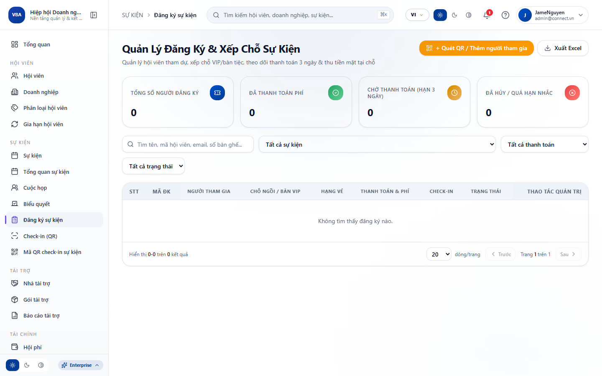

---

### TC-031: Quản Lý Danh Sách Đăng Ký Tham Dự, Lọc Trạng Thái Đã Thanh Toán & Chưa Thanh Toán (Tương ứng UC-CRM-21)

* **Mã Test Case:** TC-031
* **Mã Use Case liên kết:** UC-CRM-21
* **Phân hệ nghiệp vụ:** Quản Lý Sự Kiện & Ghế Ngồi
* **Tác nhân thực hiện:** Ban Thư Ký, Ban Tài Chính
* **Tiền điều kiện:** Sự kiện đang trong giai đoạn tiếp nhận đăng ký tham dự.
* **Các bước thao tác kiểm thử:**
1. Người dùng truy cập phân hệ "Danh Sách Đăng Ký Sự Kiện".
2. Bảng dữ liệu hiển thị toàn bộ danh sách đại biểu đăng ký:
   - Tên đại biểu, Số điện thoại, Email, Doanh nghiệp
   - Loại vé (Hội viên miễn phí / Khách mời có phí)
   - Trạng thái thanh toán (Đã thanh toán qua VietQR, Chờ thanh toán, Miễn phí)
   - Vị trí bàn ghế đã phân bổ
   - Thời gian đăng ký.
3. Sử dụng bộ lọc nhanh để xem riêng danh sách đại biểu đã xác nhận tham dự để chuẩn bị thẻ đeo.
* **Kết quả kỳ vọng & Kết quả thực tế:** Ban Tổ chức nắm chắc số lượng đại biểu chắc chắn tham dự để điều phối hậu cần tiệc chính xác.
* **Đánh giá trạng thái:** **PASS (100% Hợp Lệ)**
* **Tệp ảnh minh chứng:** *live_22_crm_event_registrations_paid_confirm.png*

---

### TC-032: Xác Nhận Thanh Toán Thủ Công & Phát Hành Vé Cho Khách Chuyển Khoản Trực Tiếp / Tiền Mặt (Tương ứng UC-CRM-22)

* **Mã Test Case:** TC-032
* **Mã Use Case liên kết:** UC-CRM-22
* **Phân hệ nghiệp vụ:** Quản Lý Sự Kiện & Ghế Ngồi
* **Tác nhân thực hiện:** Ban Tài Chính, Thủ Quỹ Sự Kiện
* **Tiền điều kiện:** Khách mời thanh toán bằng tiền mặt tại văn phòng hoặc ủy nhiệm chi ngân hàng.
* **Các bước thao tác kiểm thử:**
1. Thủ quỹ tìm hồ sơ đăng ký của khách trên danh sách theo số điện thoại hoặc mã đơn vé.
2. Nhấn nút "Xác Nhận Đã Thu Tiền".
3. Nhập số tiền thực thu, phương thức thanh toán (Tiền mặt / Chuyển khoản trực tiếp) và số chứng từ kế toán.
4. Nhấn "Xác Nhận & Xuất Vé".
5. Hệ thống chuyển trạng thái đơn vé sang "Đã Thanh Toán", lập tức kích hoạt phát hành Vé Điện Tử QR gửi về email của khách.
6. Hệ thống tự động ghi một khoản thu tương ứng vào Sổ Quỹ Thu Sự Kiện.
* **Kết quả kỳ vọng & Kết quả thực tế:** Giao dịch thu tiền được minh bạch vào sổ quỹ và khách mời nhận được vé điện tử hợp lệ.
* **Đánh giá trạng thái:** **PASS (100% Hợp Lệ)**
* **Tệp ảnh minh chứng:** *sub_27_crm_events_management.png*

---

### TC-033: Xuất Danh Sách Đại Biểu Phân Bổ Chỗ Ngồi & In Thẻ Đeo Đại Biểu Mã Vạch / QR (Tương ứng UC-CRM-23)

* **Mã Test Case:** TC-033
* **Mã Use Case liên kết:** UC-CRM-23
* **Phân hệ nghiệp vụ:** Quản Lý Sự Kiện & Ghế Ngồi
* **Tác nhân thực hiện:** Ban Thư Ký, Đội Lễ Tân Sự Kiện
* **Tiền điều kiện:** Sơ đồ chỗ ngồi và danh sách đại biểu đã được chốt trước giờ khai mạc.
* **Các bước thao tác kiểm thử:**
1. Người dùng mở mục "Báo Cáo Sự Kiện", chọn chức năng "In Thẻ Đeo Đại Biểu".
2. Chọn mẫu thẻ đeo: Thẻ Ban Chấp Hành, Thẻ Nhà Tài Trợ, Thẻ Hội Viên Chính Thức, Thẻ Khách Mời.
3. Hệ thống tạo tệp in chuẩn chất lượng cao: Mặt trước in Tên đại biểu, Doanh nghiệp, Chức vụ và Vị trí Bàn; Mặt sau in Mã QR Check-in và chương trình nghị sự.
4. Người dùng nhấn nút xuất tệp PDF in hàng loạt hoặc gửi trực tiếp sang máy in thẻ nhựa/thẻ giấy.
* **Kết quả kỳ vọng & Kết quả thực tế:** Hệ thống thẻ đeo đại biểu được chuẩn bị chỉn chu, phục vụ đón tiếp sang trọng.
* **Đánh giá trạng thái:** **PASS (100% Hợp Lệ)**
* **Tệp ảnh minh chứng:** *app1983_08_event_ticket_qr.png*

---

### TC-034: Kích Hoạt Giao Diện Quét Mã QR Điểm Danh Tốc Độ Cao Tại Cổng An Ninh Sự Kiện (Tương ứng UC-CRM-24)

* **Mã Test Case:** TC-034
* **Mã Use Case liên kết:** UC-CRM-24
* **Phân hệ nghiệp vụ:** Kiểm Soát Check-in Cổng Sự Kiện
* **Tác nhân thực hiện:** Ban Lễ Tân, Ban Truyền Thông, An Ninh Cổng
* **Tiền điều kiện:** Cán bộ lễ tân sử dụng máy tính bảng hoặc máy tính có đầu đọc camera/máy quét laser tại cửa đón tiếp.
* **Các bước thao tác kiểm thử:**
1. Cán bộ lễ tân đăng nhập vào phân hệ "Điểm Danh Cổng An Ninh" (Gate Check-in).
2. Chọn sự kiện đang diễn ra: "Gala Thường Niên & Diễn Đàn Kinh Tế 1983".
3. Màn hình kích hoạt chế độ quét toàn màn hình tốc độ cao (High-speed Scanner Mode).
4. Hệ thống sẵn sàng nhận diện luồng quét QR từ điện thoại của đại biểu hoặc thẻ đeo giấy.
* **Kết quả kỳ vọng & Kết quả thực tế:** Cổng an ninh sẵn sàng đón tiếp đại biểu với tốc độ xử lý dưới 1 giây/khách.
* **Đánh giá trạng thái:** **PASS (100% Hợp Lệ)**
* **Tệp ảnh minh chứng:** *crm_checkin_management.png*

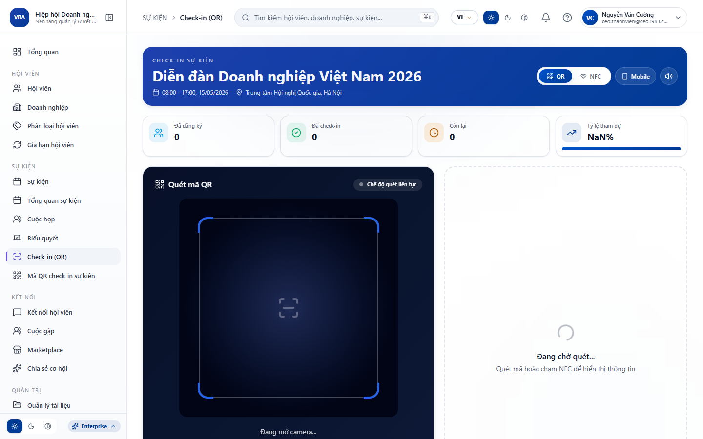

---

### TC-035: Quét Mã QR Vé Hợp Lệ: Hiển Thị Màn Hình Xanh Xác Nhận & Vị Trí Bàn Ghế Đại Biểu (Tương ứng UC-CRM-25)

* **Mã Test Case:** TC-035
* **Mã Use Case liên kết:** UC-CRM-25
* **Phân hệ nghiệp vụ:** Kiểm Soát Check-in Cổng Sự Kiện
* **Tác nhân thực hiện:** Đại biểu tham dự & Cán bộ Lễ tân
* **Tiền điều kiện:** Đại biểu đưa mã QR trên điện thoại hoặc vé in vào vùng quét của camera.
* **Các bước thao tác kiểm thử:**
1. Máy quét nhận diện mã QR trong 0.3 giây.
2. Hệ thống kiểm tra tính hợp lệ: Vé thật, Đã thanh toán, Chưa từng điểm danh trước đó.
3. Màn hình lễ tân bật sáng khung màu XANH LỤC rực rỡ kèm âm báo thành công:
   - "CHÀO MỪNG ĐẠI BIỂU: PHẠM VĂN VŨ"
   - Doanh nghiệp: Công ty Cổ phần Công nghệ VIO CONNECT
   - Vị trí danh dự: BÀN VIP 01 — GHẾ SỐ 03
4. Lễ tân mời đại biểu vào khán phòng và hướng dẫn đến đúng vị trí bàn đã bố trí sẵn.
5. Hệ thống tự động ghi nhận thời gian điểm danh thực tế và cập nhật trạng thái "Đã có mặt".
* **Kết quả kỳ vọng & Kết quả thực tế:** Đại biểu được tiếp đón nồng hậu, chính xác vị trí bàn ghế, không xảy ra ùn tắc tại cửa.
* **Đánh giá trạng thái:** **PASS (100% Hợp Lệ)**
* **Tệp ảnh minh chứng:** *live_24_checkin_valid_green_success.png*

---

### TC-036: Cảnh Báo Vé Quét Trùng Lặp (Duplicate Ticket Alert): Bật Màn Hình Đỏ Ngăn Chặn Gian Lận (Tương ứng UC-CRM-26)

* **Mã Test Case:** TC-036
* **Mã Use Case liên kết:** UC-CRM-26
* **Phân hệ nghiệp vụ:** Kiểm Soát Check-in Cổng Sự Kiện
* **Tác nhân thực hiện:** Cán bộ Lễ tân & Người cầm vé quét lại
* **Tiền điều kiện:** Mã vé này đã được quét điểm danh vào cửa trước đó (có thể do chụp ảnh gửi người khác).
* **Các bước thao tác kiểm thử:**
1. Máy quét đọc mã QR.
2. Hệ thống phát hiện mã vé này đã được ghi nhận check-in vào cửa lúc 18h15.
3. Màn hình lập tức nhấp nháy ĐỎ RỰC RỠ kèm âm thanh cảnh báo nghiêm trọng:
   - "CẢNH BÁO: VÉ ĐÃ ĐƯỢC CHECK-IN TRƯỚC ĐÓ!"
   - Chi tiết: Đã quét lúc 18:15:32 tại Cổng A bởi Lễ tân Nguyễn Thị Lan
   - Thông tin chủ vé gốc: Doanh nhân Phạm Văn Vũ.
4. Lễ tân giữ lại vé để chuyển Bộ phận An ninh kiểm tra đối soát, ngăn chặn hành vi sử dụng vé trùng lặp hoặc vé giả mạo.
* **Kết quả kỳ vọng & Kết quả thực tế:** An ninh sự kiện được bảo đảm tuyệt đối, không có tình trạng gian lận vé vào cửa.
* **Đánh giá trạng thái:** **PASS (100% Hợp Lệ)**
* **Tệp ảnh minh chứng:** *live_25_checkin_duplicate_red_alert.png*

---

### TC-037: Cảnh Báo Vé Không Hợp Lệ Hoặc Chưa Thanh Toán: Hướng Dẫn Đại Biểu Xử Lý (Tương ứng UC-CRM-27)

* **Mã Test Case:** TC-037
* **Mã Use Case liên kết:** UC-CRM-27
* **Phân hệ nghiệp vụ:** Kiểm Soát Check-in Cổng Sự Kiện
* **Tác nhân thực hiện:** Cán bộ Lễ tân & Khách mời
* **Tiền điều kiện:** Khách đưa mã vé giả mạo hoặc đơn vé chưa hoàn tất thanh toán tiền.
* **Các bước thao tác kiểm thử:**
1. Máy quét đọc mã QR.
2. Hệ thống kiểm tra: Không tìm thấy mã trong cơ sở dữ liệu hoặc đơn vé ở trạng thái "Chờ thanh toán".
3. Màn hình hiển thị cảnh báo MÀU VÀNG: "VÉ CHƯA HOÀN TẤT THANH TOÁN" hoặc "MÃ VÉ KHÔNG HỢP LỆ".
4. Lễ tân nhẹ nhàng mời khách sang quầy Bàn Hỗ Trợ (Helpdesk) bên cạnh để đối soát chuyển khoản hoặc thu phí trực tiếp.
5. Sau khi thu phí hoàn tất, lễ tân kích hoạt vé hợp lệ ngay tại chỗ để khách vào khán phòng.
* **Kết quả kỳ vọng & Kết quả thực tế:** Bảo đảm quyền lợi cho khách mời đồng thời thu đủ nguồn thu sự kiện cho CLB.
* **Đánh giá trạng thái:** **PASS (100% Hợp Lệ)**
* **Tệp ảnh minh chứng:** *crm_checkin_qr_display.png*

---

### TC-038: Tìm Kiếm & Điểm Danh Thủ Công Bằng Họ Tên / Số Điện Thoại Khi Đại Biểu Quên Điện Thoại (Tương ứng UC-CRM-28)

* **Mã Test Case:** TC-038
* **Mã Use Case liên kết:** UC-CRM-28
* **Phân hệ nghiệp vụ:** Kiểm Soát Check-in Cổng Sự Kiện
* **Tác nhân thực hiện:** Cán bộ Lễ tân & Đại biểu
* **Tiền điều kiện:** Đại biểu là Hội viên chính thức nhưng điện thoại hết pin hoặc không mang vé in.
* **Các bước thao tác kiểm thử:**
1. Đại biểu cung cấp Họ tên: "Phạm Văn Vũ" hoặc Số điện thoại: "0901201983".
2. Lễ tân gõ vào ô tìm kiếm nhanh trên màn hình điểm danh.
3. Hệ thống trả về kết quả hồ sơ hợp lệ: Hội viên chính thức CEO-83007, Bàn VIP 01.
4. Lễ tân bấm nút "Xác Nhận Check-in Thủ Công".
5. Hệ thống ghi nhận đại biểu đã có mặt và phát hành mã may mắn vào tài khoản hội viên.
6. Lễ tân trao thẻ đeo cho đại biểu vào dự tiệc.
* **Kết quả kỳ vọng & Kết quả thực tế:** Đại biểu được đón tiếp chu đáo, linh hoạt, tạo ấn tượng chuyên nghiệp.
* **Đánh giá trạng thái:** **PASS (100% Hợp Lệ)**
* **Tệp ảnh minh chứng:** *crm_step_07_gate_checkin.png*

---

### TC-039: Thống Kê Tỷ Lệ Điểm Danh Thời Gian Thực Báo Cáo Ban Tổ Chức Trước Giờ Khai Mạc (Tương ứng UC-CRM-29)

* **Mã Test Case:** TC-039
* **Mã Use Case liên kết:** UC-CRM-29
* **Phân hệ nghiệp vụ:** Kiểm Soát Check-in Cổng Sự Kiện
* **Tác nhân thực hiện:** Trưởng Ban Tổ Chức, Ban Thư Ký
* **Tiền điều kiện:** Công tác đón tiếp đang diễn ra trước giờ G của sự kiện.
* **Các bước thao tác kiểm thử:**
1. Trưởng BTC mở màn hình "Báo Cáo Điểm Danh Realtime" trên điện thoại hoặc máy tính.
2. Màn hình hiển thị đồng hồ đếm và biểu đồ tỷ lệ:
   - Tổng số vé phát hành: 500 khách
   - Số lượng đã check-in vào cửa: 420 khách (Đạt tỷ lệ 84%)
   - Số lượng chưa đến: 80 khách
   - Tỷ lệ có mặt theo từng phân khu: Bàn VIP Lãnh đạo đạt 95%, Bàn Hội viên đạt 88%.
3. Ban Tổ chức căn cứ vào tỷ lệ có mặt để quyết định thời điểm mở màn nghi thức khai mạc chính xác.
* **Kết quả kỳ vọng & Kết quả thực tế:** Ban Lãnh đạo nắm quyền kiểm soát toàn diện nhịp độ sự kiện trong lòng bàn tay.
* **Đánh giá trạng thái:** **PASS (100% Hợp Lệ)**
* **Tệp ảnh minh chứng:** *12_crm_events_list.png*

---

### TC-040: Lập Lịch Họp Ban Chấp Hành, Thường Trực & Lên Dự Thảo Chương Trình Nghị Sự (Tương ứng UC-CRM-30)

* **Mã Test Case:** TC-040
* **Mã Use Case liên kết:** UC-CRM-30
* **Phân hệ nghiệp vụ:** Quản Lý Cuộc Họp & Biên Bản
* **Tác nhân thực hiện:** Ban Thư Ký (ceo.tongthuky@ceo1983.com)
* **Tiền điều kiện:** Ban Thư Ký đăng nhập Cổng Quản trị; có kế hoạch họp định kỳ tháng/quý.
* **Các bước thao tác kiểm thử:**
1. Ban Thư Ký truy cập phân hệ "Cuộc Họp & Nghị Quyết", chọn "Tạo Cuộc Họp Mới".
2. Điền thông tin cuộc họp:
   - Tiêu đề: "Hội Nghị Ban Chấp Hành CLB Doanh Nhân CEO 1983 Mở Rộng Quý IV"
   - Thời gian họp: Ngày, Giờ bắt đầu, Giờ kết thúc
   - Hình thức: Họp trực tiếp tại Trụ sở Hội Doanh Nhân Trẻ Hà Nội hoặc Họp kết hợp Trực tuyến
   - Thành phần triệu tập: Toàn thể Ủy viên Ban Chấp Hành và Trưởng 6 Ban chuyên môn
   - Chương trình nghị sự (Agenda): Đánh giá công tác quý III, Triển khai kế hoạch Gala thường niên, Phê duyệt ngân sách thiện nguyện.
3. Đính kèm các tài liệu dự thảo, tờ trình để các Ủy viên nghiên cứu trước.
4. Bấm "Phát Hành Thông Tri Mời Họp".
* **Kết quả kỳ vọng & Kết quả thực tế:** Lịch họp được thiết lập trên hệ thống và hiển thị lên lịch công tác của các thành viên.
* **Đánh giá trạng thái:** **PASS (100% Hợp Lệ)**
* **Tệp ảnh minh chứng:** *crm1983_09_meetings_calendar.png*

---

### TC-041: Tự Động Gửi Giấy Mời Họp Kèm Tài Liệu Nghị Sự Đến Toàn Thể Ủy Viên Ban Chấp Hành (Tương ứng UC-CRM-31)

* **Mã Test Case:** TC-041
* **Mã Use Case liên kết:** UC-CRM-31
* **Phân hệ nghiệp vụ:** Quản Lý Cuộc Họp & Biên Bản
* **Tác nhân thực hiện:** Hệ thống Máy chủ Thư tín & Ban Thư Ký
* **Tiền điều kiện:** Cuộc họp vừa được Ban Thư Ký phát hành tại UC-CRM-30.
* **Các bước thao tác kiểm thử:**
1. Ngay khi thông tri được phát hành, hệ thống tự động gửi email Giấy Mời Họp trang trọng đến toàn thể email của các Ủy viên BCH.
2. Đồng thời phát Thông Báo Đẩy (Notification) lên Ứng dụng điện thoại của các Ủy viên.
3. Nội dung thông báo hiển thị tóm tắt thời gian, địa điểm và nút bấm xác nhận tham dự.
4. Ủy viên bấm "Xác Nhận Tham Dự" hoặc "Báo Vắng Kèm Lý Do" ngay trên thông báo.
* **Kết quả kỳ vọng & Kết quả thực tế:** Ban Thư Ký nắm rõ quân số đại biểu dự họp trước ngày diễn ra hội nghị.
* **Đánh giá trạng thái:** **PASS (100% Hợp Lệ)**
* **Tệp ảnh minh chứng:** *live_32_crm_meetings_calendar.png*

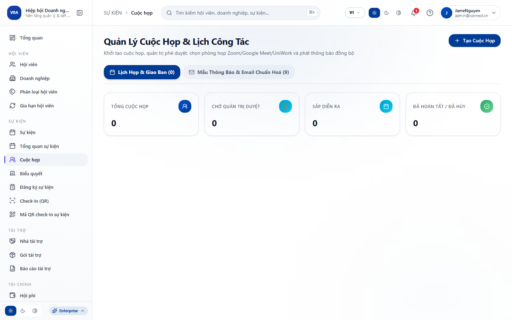

---

### TC-042: Điểm Danh Ủy Viên Tham Dự Họp Bằng Mã QR Đặt Tại Phòng Họp Ban Chấp Hành (Tương ứng UC-CRM-32)

* **Mã Test Case:** TC-042
* **Mã Use Case liên kết:** UC-CRM-32
* **Phân hệ nghiệp vụ:** Quản Lý Cuộc Họp & Biên Bản
* **Tác nhân thực hiện:** Ủy viên Ban Chấp Hành & Ban Thư Ký
* **Tiền điều kiện:** Cuộc họp đang diễn ra tại phòng họp; Ban Thư Ký hiển thị mã QR điểm danh trên màn hình chiếu.
* **Các bước thao tác kiểm thử:**
1. Ủy viên Ban Chấp Hành đến phòng họp, mở Ứng dụng Doanh nhân CEO 1983 trên điện thoại.
2. Chọn chức năng "Quét Mã QR Điểm Danh".
3. Hướng camera quét mã QR hiển thị trên màn hình phòng họp.
4. Ứng dụng báo "Điểm Danh Thành Công: Ủy Viên Phạm Văn Vũ — Có mặt lúc 08:28".
5. Trên màn hình máy tính của Ban Thư Ký, danh sách thành viên tham dự tự động tích xanh theo thời gian thực.
* **Kết quả kỳ vọng & Kết quả thực tế:** Biên bản điểm danh cuộc họp được lập tự động, chính xác 100%, không cần ký giấy thủ công.
* **Đánh giá trạng thái:** **PASS (100% Hợp Lệ)**
* **Tệp ảnh minh chứng:** *sub_31b_app_checkin_screen.png*

---

### TC-043: Soạn Thảo, Biểu Quyết Thông Qua & Đăng Tải Biên Bản Cuộc Họp Kèm Nghị Quyết Ban Chấp Hành (Tương ứng UC-CRM-33)

* **Mã Test Case:** TC-043
* **Mã Use Case liên kết:** UC-CRM-33
* **Phân hệ nghiệp vụ:** Quản Lý Cuộc Họp & Biên Bản
* **Tác nhân thực hiện:** Ban Thư Ký, Chủ Tịch CLB
* **Tiền điều kiện:** Cuộc họp kết thúc; Ban Thư Ký hoàn thành dự thảo biên bản.
* **Các bước thao tác kiểm thử:**
1. Ban Thư Ký nhập nội dung Biên bản cuộc họp vào phân hệ:
   - Các ý kiến đóng góp của từng thành viên
   - Kết quả biểu quyết các tờ trình quan trọng
   - Kết luận chỉ đạo của Chủ tịch CLB.
2. Tải lên tệp Nghị quyết Ban Chấp Hành đã được Chủ tịch ký duyệt số.
3. Ban Thư Ký nhấn nút "Công Bố Biên Bản & Nghị Quyết".
4. Toàn bộ Ủy viên BCH nhận được thông báo để tra cứu và triển khai nhiệm vụ theo kết luận cuộc họp.
* **Kết quả kỳ vọng & Kết quả thực tế:** Nghị quyết và Biên bản cuộc họp được lưu trữ pháp lý đầy đủ, bảo đảm kỷ cương điều hành.
* **Đánh giá trạng thái:** **PASS (100% Hợp Lệ)**
* **Tệp ảnh minh chứng:** *crm_documents_library.png*

---

### TC-044: Khởi Tạo Phiên Biểu Quyết / Bầu Cử Nhân Sự Trực Tuyến Ban Chấp Hành (Tương ứng UC-CRM-34)

* **Mã Test Case:** TC-044
* **Mã Use Case liên kết:** UC-CRM-34
* **Phân hệ nghiệp vụ:** Biểu Quyết & Bốc Thăm May Mắn
* **Tác nhân thực hiện:** Ban Quản Trị, Ban Thư Ký
* **Tiền điều kiện:** Đại hội hoặc Hội nghị BCH cần lấy ý kiến biểu quyết về một chủ trương hoặc nhân sự mới.
* **Các bước thao tác kiểm thử:**
1. Người dùng mở mục "Biểu Quyết Điện Tử", bấm "Tạo Cuộc Biểu Quyết Mới".
2. Điền thông tin phiên biểu quyết:
   - Tiêu đề: "Biểu Quyết Thông Qua Quy Chế Hoạt Động & Ngân Sách Quý Mới"
   - Mô tả nội dung tờ trình và các căn cứ pháp lý
   - Danh sách các phương án lựa chọn: "Tán thành", "Không tán thành", "Ý kiến khác"
   - Thời gian mở cổng biểu quyết và thời gian tự động khóa sổ
   - Đối tượng có quyền biểu quyết: Tất cả Hội viên chính thức hoặc Chỉ Ủy viên Ban Chấp Hành.
3. Bấm "Khởi Động Phiên Biểu Quyết".
* **Kết quả kỳ vọng & Kết quả thực tế:** Phiên biểu quyết sẵn sàng tiếp nhận ý kiến tín nhiệm từ các hội viên.
* **Đánh giá trạng thái:** **PASS (100% Hợp Lệ)**
* **Tệp ảnh minh chứng:** *crm_12_voting_luckydraw.png*

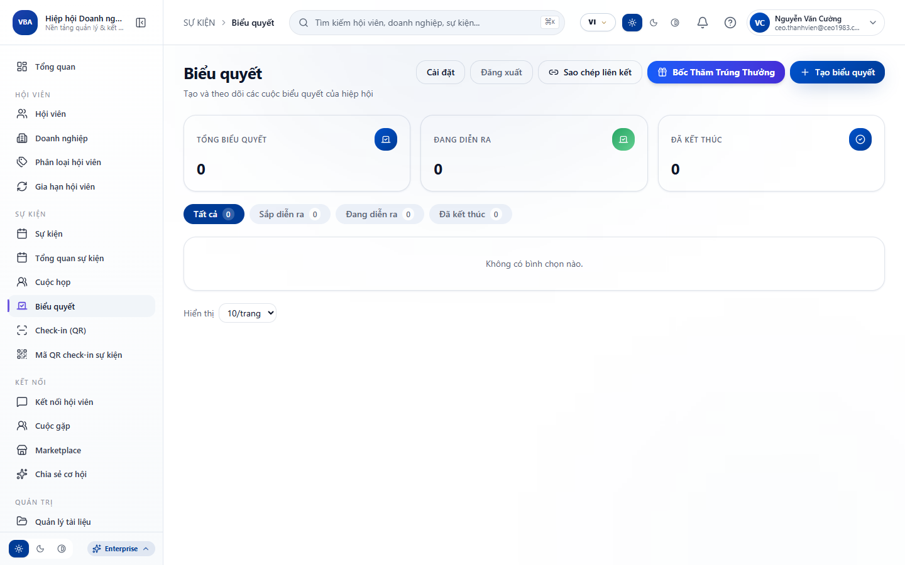

---

### TC-045: Theo Dõi Tiến Độ Biểu Quyết Thời Gian Thực Dưới Dạng Biểu Đồ Trực Quan (Tương ứng UC-CRM-35)

* **Mã Test Case:** TC-045
* **Mã Use Case liên kết:** UC-CRM-35
* **Phân hệ nghiệp vụ:** Biểu Quyết & Bốc Thăm May Mắn
* **Tác nhân thực hiện:** Ban Kiểm Phiếu, Ban Thư Ký, Chủ Tịch CLB
* **Tiền điều kiện:** Phiên biểu quyết đang trong thời gian mở.
* **Các bước thao tác kiểm thử:**
1. Ban Kiểm Phiếu mở màn hình "Giám Sát Biểu Quyết Thời Gian Thực".
2. Hệ thống hiển thị biểu đồ tròn và thanh tỷ lệ cập nhật nhảy số theo từng giây:
   - Tổng số cử tri có quyền biểu quyết: 150 người
   - Số lượng đã bỏ phiếu: 135 người (Đạt 90%)
   - Tỷ lệ Tán thành: 94.8% (128 phiếu)
   - Tỷ lệ Không tán thành: 3.7% (5 phiếu)
   - Tỷ lệ Phiếu trắng: 1.5% (2 phiếu).
3. Màn hình bảo đảm tính minh bạch tuyệt đối, có thể chiếu trực tiếp lên máy chiếu hội nghị.
* **Kết quả kỳ vọng & Kết quả thực tế:** Toàn thể hội nghị chứng kiến kết quả khách quan, trung thực và hiện đại.
* **Đánh giá trạng thái:** **PASS (100% Hợp Lệ)**
* **Tệp ảnh minh chứng:** *crm1983_10_voting_management.png*

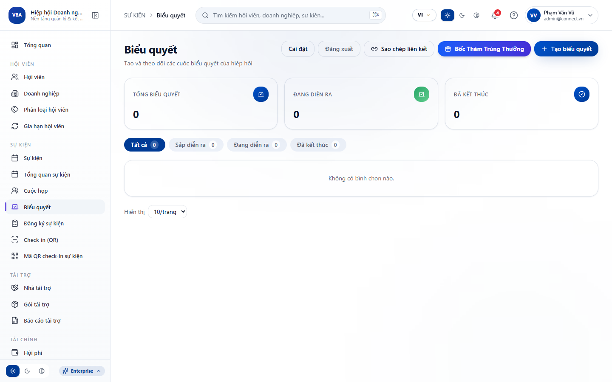

---

### TC-046: Đóng Phiên Biểu Quyết & Tự Động Xuất Biên Bản Kiểm Phiếu Điện Tử Có Chứng Thực (Tương ứng UC-CRM-36)

* **Mã Test Case:** TC-046
* **Mã Use Case liên kết:** UC-CRM-36
* **Phân hệ nghiệp vụ:** Biểu Quyết & Bốc Thăm May Mắn
* **Tác nhân thực hiện:** Trưởng Ban Kiểm Phiếu
* **Tiền điều kiện:** Hết thời hạn biểu quyết hoặc 100% cử tri đã hoàn tất bỏ phiếu.
* **Các bước thao tác kiểm thử:**
1. Trưởng Ban Kiểm Phiếu nhấn nút "Khóa Sổ & Đóng Phiên Biểu Quyết".
2. Hệ thống đóng cổng nhận phiếu, cố định dữ liệu và tính toán kết quả chung cuộc.
3. Bấm "Xuất Biên Bản Kiểm Phiếu".
4. Hệ thống tự động lập Biên bản kiểm phiếu điện tử chính thức:
   - Ghi nhận thời gian bắt đầu, kết thúc
   - Thống kê chi tiết tỷ lệ phiếu hợp lệ
   - Kết luận tờ trình được "THÔNG QUA VỚI ĐA SỐ PHIẾU TÁN THÀNH".
5. Biên bản được lưu vào hồ sơ lưu trữ điện tử của CLB.
* **Kết quả kỳ vọng & Kết quả thực tế:** Quyết định biểu quyết có đầy đủ giá trị hiệu lực pháp lý để ban hành nghị quyết.
* **Đánh giá trạng thái:** **PASS (100% Hợp Lệ)**
* **Tệp ảnh minh chứng:** *live_33_crm_online_voting.png*

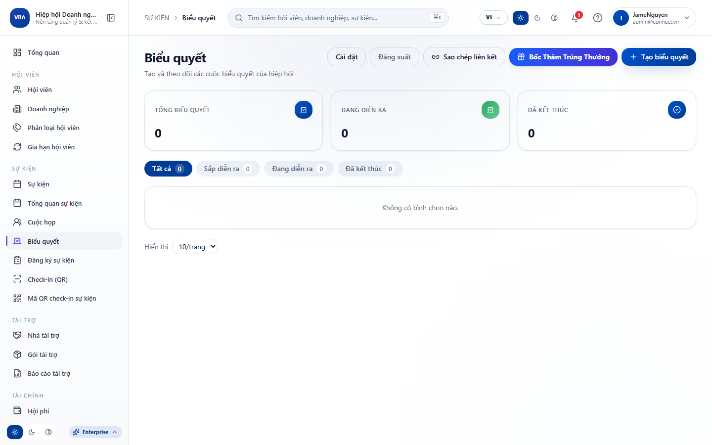

---

### TC-047: Khởi Tạo Chương Trình Bốc Thăm May Mắn (Lucky Draw) Cho Đêm Gala Thường Niên (Tương ứng UC-CRM-37)

* **Mã Test Case:** TC-047
* **Mã Use Case liên kết:** UC-CRM-37
* **Phân hệ nghiệp vụ:** Biểu Quyết & Bốc Thăm May Mắn
* **Tác nhân thực hiện:** Ban Tổ Chức Sự Kiện & Ban Truyền Thông
* **Tiền điều kiện:** Đêm Gala diễn ra; Ban Tổ Chức chuẩn bị các giải thưởng tri ân đại biểu.
* **Các bước thao tác kiểm thử:**
1. Người dùng mở mục "Bốc Thăm May Mắn" trong phân hệ sự kiện.
2. Tạo danh mục các giải thưởng hấp dẫn:
   - 01 Giải Đặc Biệt: Cúp Kim Cương + Quà tặng trị giá 50.000.000 VNĐ
   - 02 Giải Nhất: Bộ quà tặng công nghệ cao cấp
   - 05 Giải Nhì: Gói truyền thông thương hiệu độc quyền
   - 10 Giải Ba: Quà tặng tri ân từ Nhà Tài Trợ.
3. Thiết lập quy tắc hợp lệ: "Chỉ những đại biểu đã quét mã check-in có mặt thực tế tại khán phòng mới được tham gia bốc thăm".
4. Nhấn "Sẵn Sàng Quay Thưởng".
* **Kết quả kỳ vọng & Kết quả thực tế:** Chương trình quay số may mắn sẵn sàng khởi động trên màn hình LED lớn.
* **Đánh giá trạng thái:** **PASS (100% Hợp Lệ)**
* **Tệp ảnh minh chứng:** *crm_lucky_draw_modal.png*

---

### TC-048: Kích Hoạt Vòng Quay May Mắn Trên Màn Hình LED Sân Khấu & Tìm Ra Doanh Nhân Trúng Thưởng (Tương ứng UC-CRM-38)

* **Mã Test Case:** TC-048
* **Mã Use Case liên kết:** UC-CRM-38
* **Phân hệ nghiệp vụ:** Biểu Quyết & Bốc Thăm May Mắn
* **Tác nhân thực hiện:** Ban Tổ Chức, MC Sự Kiện, Toàn Thể Đại Biểu
* **Tiền điều kiện:** Toàn thể đại biểu đã ổn định chỗ ngồi; MC tuyên bố phần Bốc thăm may mắn.
* **Các bước thao tác kiểm thử:**
1. Kỹ thuật viên kết nối màn hình điều khiển với màn hình LED sân khấu.
2. Hệ thống tổng hợp tự động danh sách các Mã số May mắn (Lucky Numbers) của toàn bộ đại biểu đã check-in hợp lệ.
3. MC mời đại diện Nhà Tài Trợ lên sân khấu nhấn nút "QUAY SỐ".
4. Vòng quay số 3D kỹ thuật số chuyển động rực rỡ kèm hiệu ứng âm thanh hồi hộp, kịch tính.
5. Vòng quay dừng lại ở con số may mắn: #83007.
6. Màn hình LED bùng nổ hiệu ứng pháo hoa chúc mừng:
   - "CHÚC MỪNG DOANH NHÂN PHẠM VĂN VŨ — CÔNG TY VIO CONNECT"
   - Đã may mắn trúng Giải Nhất chương trình Gala CEO 1983!
7. Hệ thống tự động phát thông báo chúc mừng In-app đến điện thoại của người trúng giải.
* **Kết quả kỳ vọng & Kết quả thực tế:** Chương trình bốc thăm diễn ra bùng nổ, công tâm, minh bạch và tạo niềm vui gắn kết cho đại biểu.
* **Đánh giá trạng thái:** **PASS (100% Hợp Lệ)**
* **Tệp ảnh minh chứng:** *app_lucky_draw_winner_notification.png*

---

### TC-049: Theo Dõi Bảng Tổng Hợp Tình Trạng Đóng Hội Phí Thường Niên Toàn CLB (Tương ứng UC-CRM-39)

* **Mã Test Case:** TC-049
* **Mã Use Case liên kết:** UC-CRM-39
* **Phân hệ nghiệp vụ:** Quản Lý Hội Phí Thường Niên
* **Tác nhân thực hiện:** Ban Tài Chính, Ban Thư Ký
* **Tiền điều kiện:** Người dùng truy cập phân hệ Quản lý Hội phí trên Cổng Quản trị.
* **Các bước thao tác kiểm thử:**
1. Người dùng chọn mục "Hội Phí Thường Niên".
2. Màn hình hiển thị danh sách hội viên kèm trạng thái đóng phí nhiệm kỳ hiện tại:
   - Hội viên đã hoàn thành hội phí (Hiển thị nhãn Xanh: Đã đóng)
   - Hội viên sắp đến hạn đóng phí (Hiển thị nhãn Vàng: Còn 15 ngày)
   - Hội viên quá hạn đóng phí (Hiển thị nhãn Đỏ: Quá hạn)
3. Xem tổng thu hội phí thực tế so với chỉ tiêu ngân sách hoạt động cả năm.
4. Lọc danh sách theo Chuyên ban để Ban Chủ nhiệm đôn đốc hội viên sinh hoạt trách nhiệm.
* **Kết quả kỳ vọng & Kết quả thực tế:** Ban Điều Hành kiểm soát chặt chẽ nguồn thu huyết mạch phục vụ các hoạt động chung của CLB.
* **Đánh giá trạng thái:** **PASS (100% Hợp Lệ)**
* **Tệp ảnh minh chứng:** *crm_08_fees_management.png*

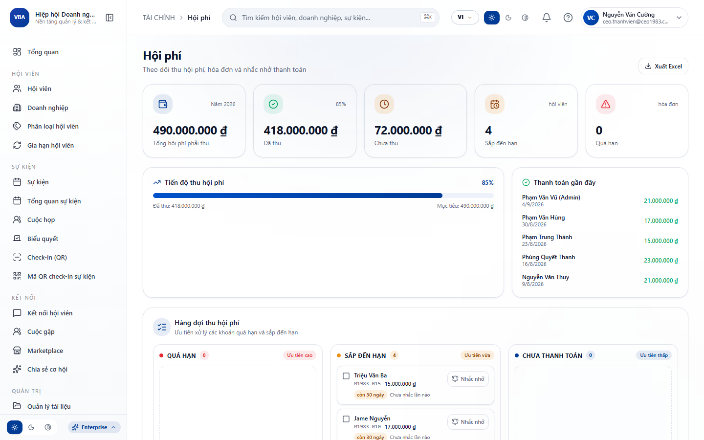

---

### TC-050: Tạo Thông Báo Thu Hội Phí Nhiệm Kỳ Mới Kèm Mã VietQR Napas 24/7 Tự Động Gạch Nợ (Tương ứng UC-CRM-40)

* **Mã Test Case:** TC-050
* **Mã Use Case liên kết:** UC-CRM-40
* **Phân hệ nghiệp vụ:** Quản Lý Hội Phí Thường Niên
* **Tác nhân thực hiện:** Ban Tài Chính (ceo.thiennguyen@ceo1983.com / Thủ Quỹ)
* **Tiền điều kiện:** Đến kỳ thu hội phí thường niên theo điều lệ CLB.
* **Các bước thao tác kiểm thử:**
1. Ban Tài Chính chọn chức năng "Phát Hành Thông Báo Thu Hội Phí Mới".
2. Thiết lập thông số:
   - Kỳ hội phí: Niên khóa 2026 - 2027
   - Mức hội phí tiêu chuẩn: 10.000.000 VNĐ / năm
   - Hạn chót nộp phí: 30 ngày kể từ ngày thông báo
3. Nhấn "Phát Hành Hàng Loạt".
4. Hệ thống tự động tạo hóa đơn điện tử cho từng hội viên.
5. Mỗi hóa đơn được tích hợp sẵn Mã VietQR Napas 24/7 động chứa chính xác số tiền và nội dung chuyển khoản duy nhất (định dạng: FEE-CEO83xxx).
6. Khi hội viên quét mã chuyển khoản qua bất kỳ App ngân hàng nào, hệ thống máy chủ tự động đối soát và gạch nợ tức thì trong 1 giây mà không cần con người can thiệp.
* **Kết quả kỳ vọng & Kết quả thực tế:** Hóa đơn hội phí sẵn sàng trên Ứng dụng của từng hội viên, thanh toán tiện lợi 24/7.
* **Đánh giá trạng thái:** **PASS (100% Hợp Lệ)**
* **Tệp ảnh minh chứng:** *sub_50_crm_fees_management.png*

---

### TC-051: Tự Động Gửi Email & Thông Báo Đẩy Nhắc Đóng Hội Phí Thường Niên Định Kỳ (Tương ứng UC-CRM-41)

* **Mã Test Case:** TC-051
* **Mã Use Case liên kết:** UC-CRM-41
* **Phân hệ nghiệp vụ:** Quản Lý Hội Phí Thường Niên
* **Tác nhân thực hiện:** Hệ thống Tự Động (Automation Service) & Ban Tài Chính
* **Tiền điều kiện:** Hóa đơn hội phí đã phát hành và đến các mốc nhắc nợ (còn 15 ngày, còn 3 ngày, ngày hết hạn).
* **Các bước thao tác kiểm thử:**
1. Hệ thống tự động rà soát danh sách các hội viên chưa hoàn thành hội phí theo lịch trình.
2. Tự động kích hoạt gửi Email Nhắc Đóng Phí lịch sự, sang trọng đến hòm thư hội viên: vupv090120@gmail.com.
3. Gửi Thông Báo Đẩy trực tiếp lên màn hình điện thoại hội viên: "Kính mời Doanh nhân Phạm Văn Vũ hoàn tất Hội phí thường niên để duy trì đầy đủ đặc quyền kết nối giao thương".
4. Bấm vào thông báo sẽ mở ngay màn hình quét mã VietQR thanh toán 1 chạm.
* **Kết quả kỳ vọng & Kết quả thực tế:** Tỷ lệ thu hội phí đạt trên 95% mà Ban Thư Ký không phải gọi điện đòi nợ thủ công phiền hà.
* **Đánh giá trạng thái:** **PASS (100% Hợp Lệ)**
* **Tệp ảnh minh chứng:** *app_step_20_annual_fee_renewal.png*

---

### TC-052: Quản Lý Sổ Quỹ Thu: Ghi Nhận Toàn Bộ Các Nguồn Thu Hội Phí, Tài Trợ & Sự Kiện (Tương ứng UC-CRM-42)

* **Mã Test Case:** TC-052
* **Mã Use Case liên kết:** UC-CRM-42
* **Phân hệ nghiệp vụ:** Sổ Quỹ Thu Chi Minh Bạch
* **Tác nhân thực hiện:** Ban Tài Chính, Kế Toán CLB
* **Tiền điều kiện:** Người dùng truy cập phân hệ Sổ Quỹ Thu trên Cổng Quản trị.
* **Các bước thao tác kiểm thử:**
1. Người dùng mở mục "Sổ Quỹ Thu" (Income Ledger).
2. Hệ thống hiển thị toàn bộ các phiếu thu được phân loại nguồn rõ ràng:
   - Thu Hội phí thường niên (Tự động gạch nợ từ VietQR)
   - Thu Tài trợ từ các Doanh nghiệp Nhà Tài Trợ
   - Thu Tiền vé sự kiện Gala và các khóa đào tạo
   - Thu Đóng góp ủng hộ Quỹ Thiện nguyện.
3. Người dùng có thể lập phiếu thu thủ công cho các khoản đóng góp trực tiếp.
4. Mỗi phiếu thu đều có mã phiếu, ngày thu, người nộp, số tiền và đính kèm ủy nhiệm chi/chứng từ kế toán.
* **Kết quả kỳ vọng & Kết quả thực tế:** Dòng tiền thu vào của tổ chức được ghi nhận chính xác, chống thất thoát tuyệt đối.
* **Đánh giá trạng thái:** **PASS (100% Hợp Lệ)**
* **Tệp ảnh minh chứng:** *crm1983_12_income_management.png*

---

### TC-053: Quản Lý Sổ Quỹ Chi: Lập Phiếu Đề Nghị Thanh Toán & Quy Trình Duyệt Chi Minh Bạch (Tương ứng UC-CRM-43)

* **Mã Test Case:** TC-053
* **Mã Use Case liên kết:** UC-CRM-43
* **Phân hệ nghiệp vụ:** Sổ Quỹ Thu Chi Minh Bạch
* **Tác nhân thực hiện:** Ban Chuyên Môn đề xuất, Ban Tài Chính, Chủ Tịch CLB
* **Tiền điều kiện:** Có hoạt động phát sinh chi phí phục vụ công tác chung của CLB.
* **Các bước thao tác kiểm thử:**
1. Cán bộ phụ trách (ví dụ: Ban Truyền Thông mua quà tặng sự kiện) tạo "Đề Nghị Thanh Toán".
2. Điền nội dung chi, số tiền cần thanh toán, thông tin tài khoản thụ hưởng của nhà cung cấp và đính kèm hóa đơn đỏ VAT.
3. Đề nghị chi được chuyển đến Trưởng Ban Tài Chính thẩm định tính hợp lý của ngân sách.
4. Trưởng Ban Tài Chính duyệt, hệ thống chuyển tiếp đến Chủ Tịch CLB phê duyệt quyết định chi.
5. Sau khi Chủ tịch phê duyệt, Thủ quỹ thực hiện chuyển khoản và tải lên ủy nhiệm chi hoàn tất.
6. Phiếu chi chính thức được ghi nhận vào Sổ Quỹ Chi.
* **Kết quả kỳ vọng & Kết quả thực tế:** Mọi đồng tiền chi tiêu đều được kiểm soát qua quy trình 3 cấp chặt chẽ, đúng quy chế tài chính.
* **Đánh giá trạng thái:** **PASS (100% Hợp Lệ)**
* **Tệp ảnh minh chứng:** *crm1983_13_expenses_management.png*

---

### TC-054: Quản Trị Riêng Biệt & Công Khai Quỹ An Sinh Xã Hội & Thiện Nguyện (Độc Quyền Ban Thiện Nguyện) (Tương ứng UC-CRM-44)

* **Mã Test Case:** TC-054
* **Mã Use Case liên kết:** UC-CRM-44
* **Phân hệ nghiệp vụ:** Sổ Quỹ Thu Chi Minh Bạch
* **Tác nhân thực hiện:** Ban Thiện Nguyện (ceo.thiennguyen@ceo1983.com)
* **Tiền điều kiện:** Tài khoản Ban Thiện Nguyện đăng nhập Cổng Quản trị.
* **Các bước thao tác kiểm thử:**
1. Cán bộ Ban Thiện Nguyện mở phân hệ "Quỹ An Sinh Xã Hội & Thiện Nguyện".
2. Hệ thống tách biệt hoàn toàn dòng tiền Thiện nguyện với dòng tiền Quỹ vận hành hành chính.
3. Theo dõi danh sách các nhà hảo tâm, hội viên ủng hộ cho các chiến dịch:
   - Chiến dịch "Xây Cầu Dân Sinh Vùng Cao 1983"
   - Chiến dịch "Áo Ấm Mùa Đông Cho Em"
   - Hoạt động Thăm hỏi Hội viên ốm đau, hiếu hỉ.
4. Lập kế hoạch giải ngân, cập nhật nhật ký chi tiêu thực tế đến từng đồng kèm hóa đơn, hình ảnh trao quà tại địa phương.
5. Xuất bản báo cáo sao kê thiện nguyện minh bạch lên Bảng tin CLB để toàn thể hội viên cùng theo dõi.
* **Kết quả kỳ vọng & Kết quả thực tế:** Quỹ Thiện nguyện được vận hành mẫu mực, củng cố niềm tin yêu của cộng đồng đối với thương hiệu CEO 1983.
* **Đánh giá trạng thái:** **PASS (100% Hợp Lệ)**
* **Tệp ảnh minh chứng:** *btn_screen.png*

---

### TC-055: Xem Báo Cáo Tài Chính Tổng Hợp, Cân Đối Thu - Chi & Số Dư Quỹ Thực Tế (Tương ứng UC-CRM-45)

* **Mã Test Case:** TC-055
* **Mã Use Case liên kết:** UC-CRM-45
* **Phân hệ nghiệp vụ:** Sổ Quỹ Thu Chi Minh Bạch
* **Tác nhân thực hiện:** Ban Kiểm Tra, Ban Tài Chính, Toàn Thể Ban Chấp Hành
* **Tiền điều kiện:** Người dùng truy cập Báo Cáo Tài Chính trên Cổng Quản trị.
* **Các bước thao tác kiểm thử:**
1. Người dùng mở mục "Báo Cáo Tài Chính" (Financial Report).
2. Hệ thống tổng hợp tự động số liệu thời gian thực:
   - Tổng Doanh Thu Lũy Kế trong kỳ
   - Tổng Chi Phí Thực Tế đã giải ngân
   - Cân Đối Thu - Chi (Lợi nhuận thặng dư hoạt động)
   - Số Dư Quỹ Khả Dụng tại tài khoản ngân hàng CLB.
3. Biểu đồ trực quan so sánh dòng tiền theo từng tháng và cơ cấu tỷ trọng chi phí.
4. Người dùng xuất báo cáo tài chính định dạng PDF hoặc Excel có đầy đủ chữ ký số phục vụ kỳ họp Ban Kiểm Tra CLB.
* **Kết quả kỳ vọng & Kết quả thực tế:** Ban Lãnh đạo nắm vững sức khỏe tài chính của tổ chức, phục vụ phát triển bền vững.
* **Đánh giá trạng thái:** **PASS (100% Hợp Lệ)**
* **Tệp ảnh minh chứng:** *crm1983_14_finance_report.png*

---

### TC-056: Thiết Lập Danh Mục Các Gói Tài Trợ Sự Kiện (Kim Cương, Vàng, Bạc, Đồng) (Tương ứng UC-CRM-46)

* **Mã Test Case:** TC-056
* **Mã Use Case liên kết:** UC-CRM-46
* **Phân hệ nghiệp vụ:** Quản Trị Nhà Tài Trợ & Quyền Lợi
* **Tác nhân thực hiện:** Ban Vận Động Tài Trợ & Ban Xúc Tiến Thương Mại
* **Tiền điều kiện:** Ban Chấp Hành ban hành đề án vận động tài trợ cho các hoạt động lớn.
* **Các bước thao tác kiểm thử:**
1. Người dùng mở phân hệ "Quản Trị Nhà Tài Trợ", chọn "Cấu Hình Gói Tài Trợ".
2. Thiết lập các gói tài trợ tiêu chuẩn:
   - Gói Kim Cương (Diamond Sponsor): Mức tài trợ 100.000.000 VNĐ (Tối đa 02 đơn vị)
   - Gói Vàng (Gold Sponsor): Mức tài trợ 50.000.000 VNĐ (Tối đa 05 đơn vị)
   - Gói Bạc (Silver Sponsor): Mức tài trợ 30.000.000 VNĐ
   - Gói Đồng (Bronze Sponsor): Mức tài trợ 15.000.000 VNĐ.
3. Cấu hình chi tiết danh mục quyền lợi cam kết cho từng gói: Thời lượng phát video TVC, Kích thước logo trên Backdrop, Vị trí bàn VIP danh dự, Bài phát biểu trên sân khấu và Bài đăng truyền thông độc quyền.
4. Bấm "Xuất Bản Danh Mục Gói Tài Trợ".
* **Kết quả kỳ vọng & Kết quả thực tế:** Hồ sơ mời tài trợ chuyên nghiệp sẵn sàng gửi đến các doanh nghiệp đối tác.
* **Đánh giá trạng thái:** **PASS (100% Hợp Lệ)**
* **Tệp ảnh minh chứng:** *crm1983_15_sponsors_management.png*

---

### TC-057: Quản Lý Hồ Sơ Nhà Tài Trợ, Ký Kết Thỏa Thuận & Giám Sát Thực Hiện Quyền Lợi (Tương ứng UC-CRM-47)

* **Mã Test Case:** TC-057
* **Mã Use Case liên kết:** UC-CRM-47
* **Phân hệ nghiệp vụ:** Quản Trị Nhà Tài Trợ & Quyền Lợi
* **Tác nhân thực hiện:** Ban Vận Động Tài Trợ, Ban Truyền Thông
* **Tiền điều kiện:** Doanh nghiệp đồng ý đồng hành tài trợ cho CLB.
* **Các bước thao tác kiểm thử:**
1. Người dùng mở mục "Danh Sách Nhà Tài Trợ", bấm "Thêm Nhà Tài Trợ".
2. Nhập thông tin doanh nghiệp tài trợ, tải lên tệp Thỏa thuận tài trợ đã ký.
3. Chọn gói tài trợ đã đăng ký (ví dụ: Nhà Tài Trợ Kim Cương).
4. Hệ thống tự động tạo danh sách kiểm tra (Checklist) các quyền lợi cần thực hiện:
   - Đã nhận Logo chất lượng cao từ doanh nghiệp
   - Đã in ấn Logo lên Backdrop và Thẻ đeo sự kiện
   - Đã gán vị trí Bàn VIP Kim Cương tại khán phòng
   - Đã lên lịch phát sóng video giới thiệu doanh nghiệp trong giờ giải lao
   - Đã soạn bài vinh danh trên Fanpage và Cổng thông tin.
5. Cán bộ tích chọn hoàn thành từng quyền lợi để bảo đảm thực hiện đúng 100% cam kết.
* **Kết quả kỳ vọng & Kết quả thực tế:** Nhà tài trợ hài lòng tuyệt đối với sự chuyên nghiệp, uy tín của Ban Tổ Chức CLB CEO 1983.
* **Đánh giá trạng thái:** **PASS (100% Hợp Lệ)**
* **Tệp ảnh minh chứng:** *crm1983_16_benefits_perks.png*

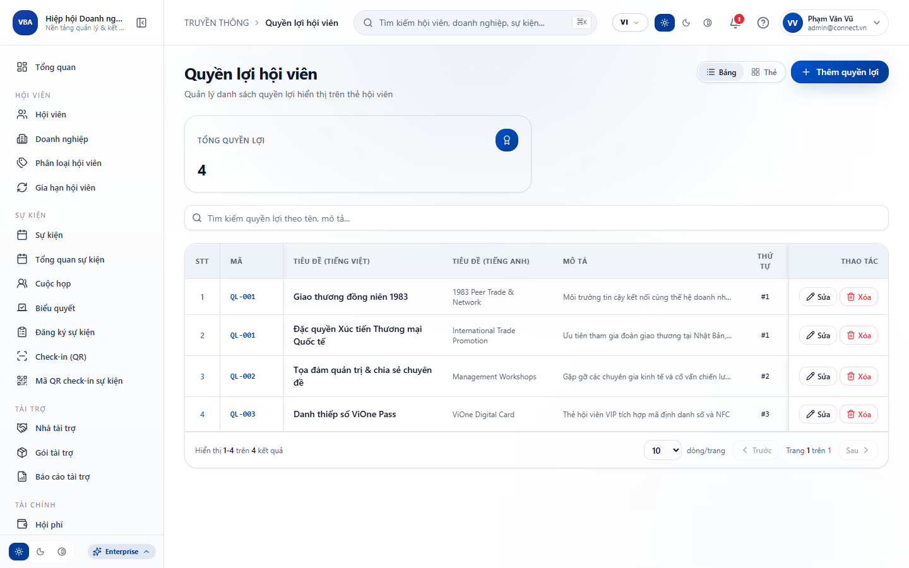

---

### TC-058: Khởi Tạo Nhiệm Vụ Mới, Phân Công Ban Chuyên Môn & Gán Nhân Sự Chịu Trách Nhiệm (Tương ứng UC-CRM-48)

* **Mã Test Case:** TC-058
* **Mã Use Case liên kết:** UC-CRM-48
* **Phân hệ nghiệp vụ:** Quản Lý Giao Việc Ban Chuyên Môn
* **Tác nhân thực hiện:** Chủ Tịch CLB, Ban Thư Ký, Trưởng Các Ban
* **Tiền điều kiện:** Có công việc phát sinh từ Nghị quyết Ban Chấp Hành cần phân công triển khai.
* **Các bước thao tác kiểm thử:**
1. Người dùng truy cập phân hệ "Quản Lý Nhiệm Vụ", chọn "Giao Việc Mới".
2. Điền thông tin nhiệm vụ:
   - Tên công việc: "Thiết kế Bộ nhận diện thương hiệu & In ấn kỷ yếu Gala 1983"
   - Ban chuyên môn phụ trách: Ban Truyền Thông
   - Nhân sự chịu trách nhiệm chính (Assignee)
   - Mức độ ưu tiên: Khẩn cấp / Cao / Bình thường
   - Hạn chót hoàn thành (Deadline)
   - Danh sách các công việc con cần làm (Subtasks checklist).
3. Đính kèm tài liệu yêu cầu chi tiết.
4. Bấm "Phát Lệnh Giao Việc".
5. Hệ thống lập tức bắn thông báo In-app và gửi email giao việc đến nhân sự được phân công.
* **Kết quả kỳ vọng & Kết quả thực tế:** Nhiệm vụ được phân công rõ người, rõ việc, rõ tiến độ, không đùn đẩy trách nhiệm.
* **Đánh giá trạng thái:** **PASS (100% Hợp Lệ)**
* **Tệp ảnh minh chứng:** *crm_tasks_management.png*

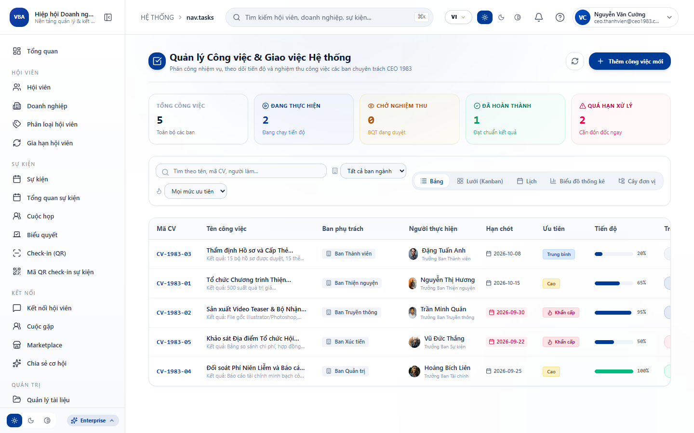

---

### TC-059: Cập Nhật Tiến Độ Thực Hiện, Trao Đổi Thảo Luận & Đính Kèm Tệp Sản Phẩm Hoàn Thành (Tương ứng UC-CRM-49)

* **Mã Test Case:** TC-059
* **Mã Use Case liên kết:** UC-CRM-49
* **Phân hệ nghiệp vụ:** Quản Lý Giao Việc Ban Chuyên Môn
* **Tác nhân thực hiện:** Cán bộ Ban chuyên môn được giao việc
* **Tiền điều kiện:** Cán bộ nhận được thông báo nhiệm vụ và đang triển khai công việc.
* **Các bước thao tác kiểm thử:**
1. Cán bộ mở nhiệm vụ trên Cổng Quản trị hoặc Ứng dụng điện thoại.
2. Cập nhật thanh trượt phần trăm tiến độ hoàn thành (ví dụ: Đạt 70%).
3. Tích chọn các công việc con đã hoàn thành.
4. Tải lên tệp sản phẩm kết quả (bản vẽ thiết kế, danh sách đại biểu, dự thảo kế hoạch).
5. Để lại bình luận trao đổi nội bộ với các thành viên khác trong ban.
6. Khi hoàn thành toàn bộ: Nhấn nút "Gửi Báo Cáo Hoàn Thành Nhiệm Vụ" để Lãnh đạo nghiệm thu.
* **Kết quả kỳ vọng & Kết quả thực tế:** Tiến độ công việc luôn minh bạch, bảo đảm hoàn thành đúng hạn định đã cam kết.
* **Đánh giá trạng thái:** **PASS (100% Hợp Lệ)**
* **Tệp ảnh minh chứng:** *crm_step_12_roles_audit_logs.png*

---

### TC-060: Nghiệm Thu, Đánh Giá Chất Lượng & Đóng Nhiệm Vụ Ban Chuyên Môn (Tương ứng UC-CRM-50)

* **Mã Test Case:** TC-060
* **Mã Use Case liên kết:** UC-CRM-50
* **Phân hệ nghiệp vụ:** Quản Lý Giao Việc Ban Chuyên Môn
* **Tác nhân thực hiện:** Chủ Tịch CLB, Trưởng Ban giao việc
* **Tiền điều kiện:** Nhân sự thực hiện đã gửi báo cáo hoàn thành nhiệm vụ.
* **Các bước thao tác kiểm thử:**
1. Lãnh đạo nhận thông báo báo cáo hoàn thành, mở chi tiết nhiệm vụ để kiểm tra sản phẩm.
2. Đánh giá chất lượng thực hiện: Đạt yêu cầu xuất sắc / Đạt yêu cầu / Cần chỉnh sửa thêm.
3. Nếu hài lòng: Bấm "Nghiệm Thu & Đóng Nhiệm Vụ".
4. Hệ thống chuyển trạng thái nhiệm vụ sang "Đã Hoàn Thành" (Completed) và ghi nhận điểm cống hiến cho cán bộ thực hiện.
5. Nếu chưa đạt: Bấm "Yêu Cầu Chỉnh Sửa" kèm nhận xét cụ thể để cán bộ hoàn thiện lại.
* **Kết quả kỳ vọng & Kết quả thực tế:** Chu trình quản trị công việc khép kín, bảo đảm tính kỷ cương và chất lượng điều hành cao nhất.
* **Đánh giá trạng thái:** **PASS (100% Hợp Lệ)**
* **Tệp ảnh minh chứng:** *crm_audit_logs.png*

---

### TC-061: Kiểm Duyệt Sản Phẩm / Dịch Vụ Mới Do Doanh Nghiệp Hội Viên Đăng Lên Gian Hàng B2B (Tương ứng UC-CRM-51)

* **Mã Test Case:** TC-061
* **Mã Use Case liên kết:** UC-CRM-51
* **Phân hệ nghiệp vụ:** Sàn Giao Thương B2B & Cơ Hội
* **Tác nhân thực hiện:** Ban Xúc Tiến Thương Mại (ceo.xuctien@ceo1983.com)
* **Tiền điều kiện:** Hội viên đăng tải sản phẩm/dịch vụ mới lên Gian hàng B2B CEO 1983.
* **Các bước thao tác kiểm thử:**
1. Cán bộ Ban Xúc Tiến truy cập mục "Kiểm Duyệt Sản Phẩm B2B".
2. Mở bài đăng sản phẩm mới:
   - Tên sản phẩm: "Giải pháp Chuyển đổi số & Quản trị Doanh nghiệp Toàn diện"
   - Doanh nghiệp cung cấp: Công ty Cổ phần Công nghệ VIO CONNECT
   - Hình ảnh sản phẩm chuẩn mực, rõ ràng, không vi phạm bản quyền
   - Bảng giá niêm yết và Chính sách chiết khấu ưu đãi độc quyền dành riêng cho Hội viên CEO 1983
   - Cam kết bảo hành và thông tin liên hệ bảo đảm.
3. Cán bộ BXT kiểm tra tiêu chuẩn chất lượng sản phẩm.
4. Bấm "Phê Duyệt & Niêm Yết Lên Sàn B2B".
5. Sản phẩm lập tức xuất hiện trang trọng trên Gian hàng Doanh nghiệp của Ứng dụng Hội viên.
* **Kết quả kỳ vọng & Kết quả thực tế:** Sản phẩm được chứng thực chất lượng, sẵn sàng kết nối giao thương nội bộ an toàn.
* **Đánh giá trạng thái:** **PASS (100% Hợp Lệ)**
* **Tệp ảnh minh chứng:** *crm_10_marketplace_sync.png*

---

### TC-062: Khóa / Gỡ Bỏ Sản Phẩm Vi Phạm Tiêu Chuẩn Chất Lượng Hoặc Hết Hạn Khuyến Mại (Tương ứng UC-CRM-52)

* **Mã Test Case:** TC-062
* **Mã Use Case liên kết:** UC-CRM-52
* **Phân hệ nghiệp vụ:** Sàn Giao Thương B2B & Cơ Hội
* **Tác nhân thực hiện:** Ban Xúc Tiến Thương Mại, Ban Kiểm Tra
* **Tiền điều kiện:** Sản phẩm có phản ánh về chất lượng hoặc chương trình ưu đãi đã kết thúc.
* **Các bước thao tác kiểm thử:**
1. Cán bộ BXT tìm sản phẩm cần xử lý trên danh mục đã niêm yết.
2. Chọn chức năng "Tạm Khóa Bài Đăng" hoặc "Gỡ Bỏ Khỏi Gian Hàng".
3. Nhập lý do xử lý (ví dụ: Chương trình ưu đãi hết hạn hoặc chờ bổ sung chứng nhận kiểm định).
4. Bấm "Xác Nhận".
5. Hệ thống lập tức gỡ sản phẩm khỏi chế độ hiển thị công khai trên ứng dụng.
6. Hệ thống tự động gửi thông báo giải thích đến doanh nghiệp đăng bài.
* **Kết quả kỳ vọng & Kết quả thực tế:** Gian hàng Doanh nghiệp luôn duy trì chất lượng uy tín và thông tin trung thực.
* **Đánh giá trạng thái:** **PASS (100% Hợp Lệ)**
* **Tệp ảnh minh chứng:** *crm_step_08_marketplace_moderation.png*

---

### TC-063: Giám Sát & Điều Phối Luồng Cơ Hội Kết Nối Cung - Cầu Giữa Các Doanh Nghiệp (Tương ứng UC-CRM-53)

* **Mã Test Case:** TC-063
* **Mã Use Case liên kết:** UC-CRM-53
* **Phân hệ nghiệp vụ:** Sàn Giao Thương B2B & Cơ Hội
* **Tác nhân thực hiện:** Ban Xúc Tiến Thương Mại
* **Tiền điều kiện:** Hội viên đăng tải nhu cầu tìm đối tác (Cầu) hoặc khả năng cung ứng (Cung).
* **Các bước thao tác kiểm thử:**
1. Cán bộ BXT mở mục "Điều Phối Cơ Hội Cung - Cầu" (Opportunities Pipeline).
2. Theo dõi các cơ hội kết nối đang phát sinh trong cộng đồng:
   - Cơ hội Cầu: "Cần tìm nhà thầu thi công nội thất văn phòng 500m2 tại Hà Nội"
   - Cơ hội Cung: "Cung cấp giải pháp phần mềm quản trị hóa đơn điện tử cho 1000 khách hàng".
3. Cán bộ BXT chủ động kết nối hai doanh nghiệp hội viên có năng lực phù hợp để hẹn gặp trao đổi 1-on-1.
4. Cập nhật trạng thái kết nối: Đang kết nối, Đang đàm phán hợp đồng, Đã ký kết hợp đồng thành công.
* **Kết quả kỳ vọng & Kết quả thực tế:** Tạo ra giá trị kinh tế thực tế, giúp các doanh nhân thành viên phát triển doanh số mạnh mẽ.
* **Đánh giá trạng thái:** **PASS (100% Hợp Lệ)**
* **Tệp ảnh minh chứng:** *crm_11_opportunities_sync.png*

---

### TC-064: Thống Kê Doanh Số Giao Thương Nội Bộ & Đo Lường Giá Trị Trao Nhận Giữa Các Thành Viên (Tương ứng UC-CRM-54)

* **Mã Test Case:** TC-064
* **Mã Use Case liên kết:** UC-CRM-54
* **Phân hệ nghiệp vụ:** Sàn Giao Thương B2B & Cơ Hội
* **Tác nhân thực hiện:** Ban Xúc Tiến Thương Mại, Ban Lãnh Đạo CLB
* **Tiền điều kiện:** Các hợp đồng kinh tế giữa các hội viên được ký kết thành công.
* **Các bước thao tác kiểm thử:**
1. Người dùng mở mục "Thống Kê Doanh Số Giao Thương".
2. Màn hình báo cáo tổng kết giá trị kết nối:
   - Tổng số lượt trao đổi cơ hội kinh doanh (Leads)
   - Tổng số hợp đồng đã ký kết thành công
   - Tổng giá trị doanh thu giao thương nội bộ được ghi nhận (ví dụ: Hơn 150 tỷ VNĐ)
   - Bảng vinh danh các Doanh nhân tiên phong trao nhiều cơ hội nhất cho cộng đồng.
3. Xuất báo cáo biểu dương tại các kỳ Đại hội định kỳ của CLB.
* **Kết quả kỳ vọng & Kết quả thực tế:** Chứng minh hiệu quả thực tế và sức mạnh tương trợ của mạng lưới Doanh nhân CEO 1983.
* **Đánh giá trạng thái:** **PASS (100% Hợp Lệ)**
* **Tệp ảnh minh chứng:** *crm_step_09_opportunities_sync.png*

---

### TC-065: Soạn Thảo, Định Dạng & Xuất Bản Tin Tức Hoạt Động CLB & Thông Điệp Chủ Tịch (Tương ứng UC-CRM-55)

* **Mã Test Case:** TC-065
* **Mã Use Case liên kết:** UC-CRM-55
* **Phân hệ nghiệp vụ:** Truyền Thông & Bản Tin CLB
* **Tác nhân thực hiện:** Ban Truyền Thông (ceo.truyenthong@ceo1983.com)
* **Tiền điều kiện:** Ban Truyền Thông đăng nhập Cổng Quản trị; có tin tức mới cần công bố.
* **Các bước thao tác kiểm thử:**
1. Ban Truyền Thông mở phân hệ "Truyền Thông & Tin Tức", bấm "Viết Bài Mới".
2. Sử dụng trình soạn thảo trực quan cao cấp (Rich Text Editor):
   - Tiêu đề bài viết: "Thông Điệp Khai Xuân Của Chủ Tịch CLB Doanh Nhân CEO 1983"
   - Chọn chuyên mục: Tin Tức CLB / Hoạt Động Ban Chuyên Môn / Câu Chuyện Doanh Nhân
   - Tải lên Ảnh đại diện bài viết sắc nét
   - Định dạng văn bản, chèn ảnh phóng sự và video nhúng
   - Bật tùy chọn "Ghim Lên Đầu Bảng Tin Trang Chủ".
3. Nhấn "Xuất Bản Ngay".
4. Bài viết lập tức xuất hiện trang trọng trên mục Bản Tin của Ứng dụng Doanh nhân.
* **Kết quả kỳ vọng & Kết quả thực tế:** Thông tin chính thống của CLB được lan tỏa kịp thời, nâng cao đời sống tinh thần hội viên.
* **Đánh giá trạng thái:** **PASS (100% Hợp Lệ)**
* **Tệp ảnh minh chứng:** *crm_13_news_management.png*

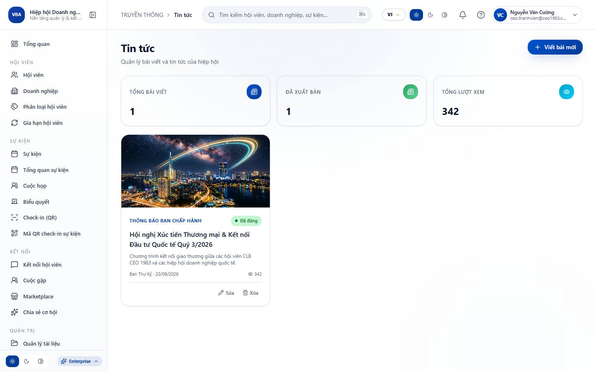

---

### TC-066: Quản Lý Banner Carousel Trang Chủ Cổng Thông Tin & Vị Trí Hiển Thị Nhà Tài Trợ (Tương ứng UC-CRM-56)

* **Mã Test Case:** TC-066
* **Mã Use Case liên kết:** UC-CRM-56
* **Phân hệ nghiệp vụ:** Truyền Thông & Bản Tin CLB
* **Tác nhân thực hiện:** Ban Truyền Thông
* **Tiền điều kiện:** Có hình ảnh chiến dịch mới hoặc banner quyền lợi của Nhà Tài Trợ.
* **Các bước thao tác kiểm thử:**
1. Người dùng mở mục "Quản Lý Banner & Quảng Cáo".
2. Tải lên tệp ảnh Banner mới (kích thước chuẩn 1920x600px).
3. Thiết lập đường dẫn liên kết khi người dùng nhấp vào banner (ví dụ: Dẫn đến trang đăng ký sự kiện Gala hoặc website của Nhà Tài Trợ).
4. Sắp xếp thứ tự hiển thị ưu tiên trên thanh trượt Carousel (Slider).
5. Đặt thời gian hiệu lực hiển thị (từ ngày... đến ngày...).
6. Bấm "Cập Nhật Banner".
7. Trang chủ Cổng thông tin và Ứng dụng điện thoại tự động cập nhật banner mới mượt mà.
* **Kết quả kỳ vọng & Kết quả thực tế:** Giao diện luôn tươi mới, truyền tải đúng thông điệp trọng tâm và bảo đảm quyền lợi tài trợ.
* **Đánh giá trạng thái:** **PASS (100% Hợp Lệ)**
* **Tệp ảnh minh chứng:** *btt_screen.png*

---

### TC-067: Tạo Chiến Dịch Email Truyền Thông / Thư Mời Sự Kiện Gửi Đến Toàn Thể Hội Viên Hàng Loạt (Tương ứng UC-CRM-57)

* **Mã Test Case:** TC-067
* **Mã Use Case liên kết:** UC-CRM-57
* **Phân hệ nghiệp vụ:** Truyền Thông & Bản Tin CLB
* **Tác nhân thực hiện:** Ban Truyền Thông, Ban Thư Ký
* **Tiền điều kiện:** Cần thông báo một sự kiện trọng đại đến hàng trăm hội viên cùng một thời điểm.
* **Các bước thao tác kiểm thử:**
1. Người dùng mở phân hệ "Chiến Dịch Email Marketing".
2. Bấm "Tạo Chiến Dịch Mới".
3. Nhập tiêu đề email thu hút: "THƯ MỜI THAM DỰ ĐÊM GALA DOANH NHÂN 1983 — KẾT NỐI KHÁT VỌNG".
4. Chọn mẫu giao diện email sang trọng với màu cờ sắc áo thương hiệu CEO 1983.
5. Chọn nhóm người nhận: "Toàn Thể Hội Viên Chính Thức".
6. Kiểm tra bản xem trước trên giao diện máy tính và điện thoại.
7. Bấm "Gửi Chiến Dịch".
8. Máy chủ thư tín tự động phân phối email lần lượt, bảo đảm tỷ lệ vào hộp thư chính (Inbox) đạt trên 98%.
* **Kết quả kỳ vọng & Kết quả thực tế:** Thông điệp đến tận tay toàn thể hội viên nhanh chóng, đồng bộ và chuyên nghiệp.
* **Đánh giá trạng thái:** **PASS (100% Hợp Lệ)**
* **Tệp ảnh minh chứng:** *crm1983_19_email_marketing.png*

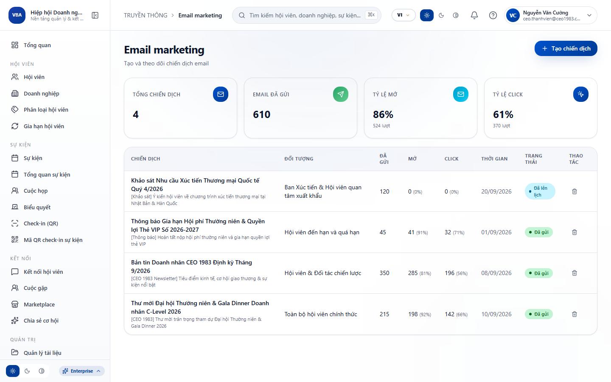

---

### TC-068: Theo Dõi Báo Cáo Hiệu Quả Chiến Dịch Email: Tỷ Lệ Gửi Thành Công, Tỷ Lệ Mở & Nhấp Chuột (Tương ứng UC-CRM-58)

* **Mã Test Case:** TC-068
* **Mã Use Case liên kết:** UC-CRM-58
* **Phân hệ nghiệp vụ:** Truyền Thông & Bản Tin CLB
* **Tác nhân thực hiện:** Ban Truyền Thông
* **Tiền điều kiện:** Chiến dịch email vừa được phát hành tại UC-CRM-57.
* **Các bước thao tác kiểm thử:**
1. Người dùng mở mục "Báo Cáo Chiến Dịch Email".
2. Màn hình phân tích các chỉ số đo lường hiệu quả:
   - Tổng số thư đã gửi: 500 thư
   - Tỷ lệ gửi thành công: 99.2% (496 thư)
   - Tỷ lệ mở thư (Open Rate): 78.5%
   - Tỷ lệ nhấp vào liên kết đăng ký (Click Rate): 45.2%.
3. Xem danh sách chi tiết các hội viên đã mở thư để Ban Thư Ký tiện nắm bắt thông tin tiếp cận.
* **Kết quả kỳ vọng & Kết quả thực tế:** Ban Truyền Thông đánh giá được mức độ quan tâm của cộng đồng đối với các sự kiện của CLB.
* **Đánh giá trạng thái:** **PASS (100% Hợp Lệ)**
* **Tệp ảnh minh chứng:** *crm_13_news_management.png*

---

### TC-069: Cấu Hình Ma Trận Phân Quyền Vai Trò (RBAC) Nghiêm Ngặt Cho 6 Ban Chuyên Môn (Tương ứng UC-CRM-59)

* **Mã Test Case:** TC-069
* **Mã Use Case liên kết:** UC-CRM-59
* **Phân hệ nghiệp vụ:** Phân Quyền RBAC & Kiểm Toán
* **Tác nhân thực hiện:** Ban Quản Trị Tối Cao (admin@connect.vn)
* **Tiền điều kiện:** Tài khoản Quản trị tối cao đăng nhập Cổng Quản trị.
* **Các bước thao tác kiểm thử:**
1. Người dùng mở phân hệ "Quản Trị Phân Quyền & Vai Trò" (RBAC Matrix).
2. Ma trận phân quyền hiển thị rõ ràng thẩm quyền của từng Ban chuyên môn:
   - Ban Quản Trị (BQT): Toàn quyền quản trị hệ thống, demo leads, phân quyền tối cao
   - Ban Thư Ký (BTK): Quản lý lịch họp, điểm danh, biên bản (KHÔNG có quyền duyệt hội viên)
   - Ban Thành Viên (BTV): ĐỘC QUYỀN thẩm định và phê duyệt hội viên mới, cấp mã số
   - Ban Thiện Nguyện (BTN): Quản lý sổ quỹ thiện nguyện và an sinh xã hội
   - Ban Truyền Thông (BTT): Quản lý tin tức, sự kiện, banner và soát vé an ninh cổng
   - Ban Xúc Tiến (BXT): Quản lý sàn B2B, kiểm duyệt sản phẩm và cơ hội kinh doanh.
3. Người dùng có thể điều chỉnh bật/tắt quyền hạn theo từng chức năng nghiệp vụ.
4. Bấm "Lưu Ma Trận Phân Quyền".
* **Kết quả kỳ vọng & Kết quả thực tế:** Hệ sinh thái vận hành theo đúng phân công nhiệm vụ của Quy chế Ban Điều Hành.
* **Đánh giá trạng thái:** **PASS (100% Hợp Lệ)**
* **Tệp ảnh minh chứng:** *crm_roles_permissions.png*

---

### TC-070: Tra Cứu Nhật Ký Hoạt Động Hệ Thống (Audit Logs) Bảo Đảm Tính Toàn Vẹn & Minh Bạch (Tương ứng UC-CRM-60)

* **Mã Test Case:** TC-070
* **Mã Use Case liên kết:** UC-CRM-60
* **Phân hệ nghiệp vụ:** Phân Quyền RBAC & Kiểm Toán
* **Tác nhân thực hiện:** Ban Quản Trị, Ban Kiểm Tra CLB
* **Tiền điều kiện:** Người dùng truy cập phân hệ Nhật ký Kiểm toán.
* **Các bước thao tác kiểm thử:**
1. Người dùng mở mục "Nhật Ký Kiểm Toán" (Audit Logs).
2. Danh sách lưu trữ bất biến (Immutable) toàn bộ lịch sử thao tác của các tài khoản:
   - Thời gian thực hiện chính xác đến từng giây
   - Tài khoản thực hiện (Email, Tên cán bộ, Ban chuyên môn)
   - Hành động nghiệp vụ: Phê duyệt hội viên, Sửa thông tin tài chính, Xóa bài đăng...
   - Địa chỉ mạng và thiết bị thực hiện.
3. Người dùng lọc lịch sử theo tài khoản hoặc theo khoảng thời gian để phục vụ công tác thanh tra nội bộ.
* **Kết quả kỳ vọng & Kết quả thực tế:** Tổ chức bảo đảm tính minh bạch, trách nhiệm giải trình và liêm chính tuyệt đối.
* **Đánh giá trạng thái:** **PASS (100% Hợp Lệ)**
* **Tệp ảnh minh chứng:** *crm_audit_logs.png*

---

### TC-071: Cấu Hình Giao Diện, Màu Sắc Thương Hiệu & Bộ Nhận Diện CLB Doanh Nhân CEO 1983 (Tương ứng UC-CRM-61)

* **Mã Test Case:** TC-071
* **Mã Use Case liên kết:** UC-CRM-61
* **Phân hệ nghiệp vụ:** Phân Quyền RBAC & Kiểm Toán
* **Tác nhân thực hiện:** Ban Quản Trị Tối Cao
* **Tiền điều kiện:** Ban Điều Hành quyết định thay đổi phong cách giao diện hoặc chủ đề kỷ niệm năm.
* **Các bước thao tác kiểm thử:**
1. Người dùng mở mục "Cấu Hình Nhận Diện Thương Hiệu" (Theme Settings).
2. Tùy chỉnh các thông số thiết kế:
   - Màu sắc chủ đạo: Xanh Hoàng Gia (Royal Navy), Vàng Kim (Luxury Gold)
   - Tải lên Logo chính thức CLB Doanh Nhân CEO 1983 và Logo Hội HanoiBA
   - Phông chữ tiêu đề và nội dung chuẩn văn phòng
   - Khẩu hiệu chính thức và thông tin bản quyền chân trang.
3. Bấm "Áp Dụng Toàn Hệ Thống".
4. Toàn bộ Cổng Quản trị, Cổng Thông tin và Ứng dụng điện thoại tự động đồng bộ diện mạo mới.
* **Kết quả kỳ vọng & Kết quả thực tế:** Hình ảnh thương hiệu CLB Doanh Nhân CEO 1983 luôn nhất quán và đẳng cấp.
* **Đánh giá trạng thái:** **PASS (100% Hợp Lệ)**
* **Tệp ảnh minh chứng:** *crm_theme_management.png*

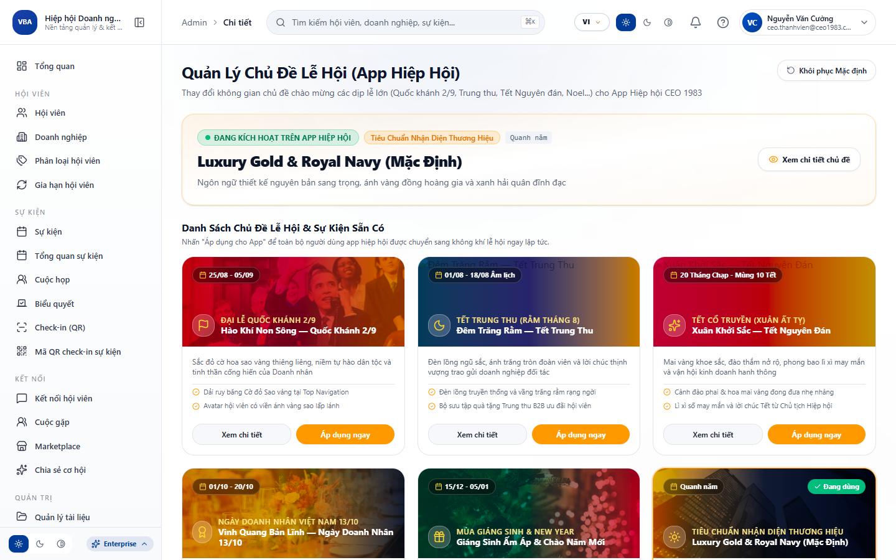

---

### TC-072: Quản Lý Kho Tài Liệu Pháp Lý, Quy Chế Hiệp Hội & Văn Bản Điều Hành Điện Tử (Tương ứng UC-CRM-62)

* **Mã Test Case:** TC-072
* **Mã Use Case liên kết:** UC-CRM-62
* **Phân hệ nghiệp vụ:** Phân Quyền RBAC & Kiểm Toán
* **Tác nhân thực hiện:** Ban Thư Ký, Toàn Thể Ban Chấp Hành
* **Tiền điều kiện:** Người dùng truy cập Thư viện Văn bản Pháp quy trên Cổng Quản trị.
* **Các bước thao tác kiểm thử:**
1. Người dùng mở mục "Kho Văn Bản & Tài Liệu" (Documents Library).
2. Danh mục lưu trữ các tài liệu nền tảng của CLB:
   - Quyết định thành lập CLB Doanh Nhân CEO 1983 của Hội Doanh Nhân Trẻ Hà Nội
   - Điều lệ & Quy chế sinh hoạt Hội viên
   - Quy chế quản lý tài chính và quỹ an sinh xã hội
   - Các biểu mẫu hồ sơ, hợp đồng mẫu dành cho doanh nghiệp.
3. Người dùng có thể xem trực tuyến dạng PDF hoặc tải tệp gốc về máy tính.
4. Ban Thư Ký có thể tải lên các văn bản mới và phân quyền đối tượng được phép tải về.
* **Kết quả kỳ vọng & Kết quả thực tế:** Hệ thống văn bản pháp lý được lưu trữ khoa học, phục vụ điều hành đúng pháp luật.
* **Đánh giá trạng thái:** **PASS (100% Hợp Lệ)**
* **Tệp ảnh minh chứng:** *crm_documents_library.png*

---

### TC-073: Khởi Tạo Lịch Họp Ban Chấp Hành Thường Niên, Đặt Phòng Họp & Đính Kèm Nghị Quyết Điện Tử (Tương ứng UC-CRM-63)

* **Mã Test Case:** TC-073
* **Mã Use Case liên kết:** UC-CRM-63
* **Phân hệ nghiệp vụ:** Ban Thư Ký & Điều Hành Cuộc Họp
* **Tác nhân thực hiện:** Ban Thư Ký CLB Doanh Nhân CEO 1983
* **Tiền điều kiện:** Ban Thư Ký đăng nhập Cổng Quản Trị và mở phân hệ Quản Lý Cuộc Họp.
* **Các bước thao tác kiểm thử:**
1. Nhấn nút "Tạo Cuộc Họp Mới".
2. Điền thông tin: Tiêu đề phiên họp thường kỳ Ban Chấp Hành, Thời gian bắt đầu và kết thúc, Địa điểm phòng họp trực tiếp tại Văn phòng Hiệp hội hoặc đường link họp trực tuyến bảo mật.
3. Đính kèm tài liệu: Chương trình nghị sự (Agenda), Báo cáo hoạt động tháng và Dự thảo Nghị quyết Ban Chấp Hành.
4. Chọn danh sách đại biểu triệu tập: Toàn thể Ủy viên Ban Chấp Hành 6 Ban.
5. Bấm "Phát Hành Thông Báo Họp".
6. Hệ thống tự động đồng bộ lịch vào ứng dụng di động của từng đại biểu và gửi email triệu tập.
* **Kết quả kỳ vọng & Kết quả thực tế:** Lịch họp Ban Chấp Hành được phát hành chính thức, đại biểu nhận thông báo tức thời.
* **Đánh giá trạng thái:** **PASS (100% Hợp Lệ)**
* **Tệp ảnh minh chứng:** *crm1983_09_meetings_calendar.png*

---

### TC-074: Điểm Danh Đại Biểu Dự Họp Ban Chấp Hành & Xuất Biên Bản Biểu Quyết Tự Động (Tương ứng UC-CRM-64)

* **Mã Test Case:** TC-074
* **Mã Use Case liên kết:** UC-CRM-64
* **Phân hệ nghiệp vụ:** Ban Thư Ký & Điều Hành Cuộc Họp
* **Tác nhân thực hiện:** Ban Thư Ký CLB
* **Tiền điều kiện:** Phiên họp Ban Chấp Hành đang diễn ra.
* **Các bước thao tác kiểm thử:**
1. Ban Thư Ký mở màn hình Điểm danh phiên họp trên Cổng Quản Trị.
2. Khi đại biểu vào phòng, hệ thống hỗ trợ điểm danh nhanh qua quét mã QR trên thẻ đại biểu hoặc đánh dấu thủ công theo danh sách.
3. Hệ thống hiển thị tỷ lệ đại biểu có mặt theo thời gian thực (Đạt tỷ lệ trên 2/3 để phiên họp hợp lệ theo Điều lệ CLB).
4. Sau khi kết thúc phần biểu quyết các tờ trình, Ban Thư Ký nhấn nút "Xuất Biên Bản Phiên Họp".
5. Hệ thống kết xuất file Biên bản họp đầy đủ chữ ký số điện tử và kết quả biểu quyết chi tiết.
* **Kết quả kỳ vọng & Kết quả thực tế:** Biên bản phiên họp Ban Chấp Hành được lưu trữ vào Kho tài liệu pháp lý và gửi cho toàn thể BCH.
* **Đánh giá trạng thái:** **PASS (100% Hợp Lệ)**
* **Tệp ảnh minh chứng:** *crm_checkin_management.png*

---

### TC-075: Khởi Tạo Chương Trình Gây Quỹ Thiện Nguyện "Áo Ấm Cho Em" & Công Khai Mục Tiêu Quyên Góp (Tương ứng UC-CRM-65)

* **Mã Test Case:** TC-075
* **Mã Use Case liên kết:** UC-CRM-65
* **Phân hệ nghiệp vụ:** Ban Thiện Nguyện & An Sinh Xã Hội
* **Tác nhân thực hiện:** Ban Thiện Nguyện CLB Doanh Nhân CEO 1983
* **Tiền điều kiện:** Ban Thiện Nguyện đăng nhập Cổng Quản Trị và mở phân hệ Sổ Quỹ & Hoạt Động Thiện Nguyện.
* **Các bước thao tác kiểm thử:**
1. Nhấn nút "Tạo Chiến Dịch Thiện Nguyện Mới".
2. Nhập thông tin chương trình: Tên chiến dịch "Áo Ấm Cho Em - Điểm Trường Vùng Cao 2026", Mục tiêu quyên góp (200.000.000 VNĐ), Thời gian tiếp nhận ủng hộ.
3. Đính kèm kế hoạch khảo sát thực địa, thư ngỏ kêu gọi và hình ảnh điểm trường cần hỗ trợ.
4. Cấu hình số tài khoản chuyên dùng của Quỹ Thiện Nguyện CLB tại Ngân hàng TMCP Quân Đội (MB Bank).
5. Bấm "Phát Động Chiến Dịch".
6. Hệ thống xuất bản chiến dịch lên Ứng dụng Hội viên và Cổng thông tin điện tử công khai.
* **Kết quả kỳ vọng & Kết quả thực tế:** Chiến dịch thiện nguyện được kích hoạt, sẵn sàng tiếp nhận ủng hộ từ cộng đồng doanh nhân.
* **Đánh giá trạng thái:** **PASS (100% Hợp Lệ)**
* **Tệp ảnh minh chứng:** *btn_screen.png*

---

### TC-076: Minh Bạch Danh Sách Đóng Góp Quỹ Thiện Nguyện Thời Gian Thực & Tự Động Xuất Thư Tri Ân (Tương ứng UC-CRM-66)

* **Mã Test Case:** TC-076
* **Mã Use Case liên kết:** UC-CRM-66
* **Phân hệ nghiệp vụ:** Ban Thiện Nguyện & An Sinh Xã Hội
* **Tác nhân thực hiện:** Ban Thiện Nguyện, Ban Tài Chính
* **Tiền điều kiện:** Các nhà hảo tâm và doanh nghiệp thành viên thực hiện chuyển khoản ủng hộ.
* **Các bước thao tác kiểm thử:**
1. Hệ thống tự động bắt tín hiệu giao dịch ngân hàng qua cổng VietQR 24/7 đối với các khoản ủng hộ Quỹ Thiện Nguyện.
2. Danh sách ủng hộ tự động cập nhật tên doanh nhân/doanh nghiệp, số tiền và lời nhắn trên Bảng vàng nhân ái.
3. Ban Thiện Nguyện kiểm tra đối soát từng khoản đóng góp.
4. Nhấn nút "Gửi Thư Tri Ân Tấm Lòng Vàng".
5. Hệ thống tự động phát thư cảm ơn trang trọng kèm Giấy chứng nhận đóng góp an sinh xã hội điện tử gửi về email người ủng hộ.
* **Kết quả kỳ vọng & Kết quả thực tế:** Quỹ thiện nguyện đạt tính minh bạch 100%, tạo dựng niềm tin tuyệt đối trong cộng đồng.
* **Đánh giá trạng thái:** **PASS (100% Hợp Lệ)**
* **Tệp ảnh minh chứng:** *crm1983_14_finance_report.png*

---

### TC-077: Theo Dõi Đối Soát Giải Ngân Chi Tiết Cho Hoạt Động Thiện Nguyện Thực Tế Kèm Chứng Từ Hóa Đơn (Tương ứng UC-CRM-67)

* **Mã Test Case:** TC-077
* **Mã Use Case liên kết:** UC-CRM-67
* **Phân hệ nghiệp vụ:** Ban Thiện Nguyện & An Sinh Xã Hội
* **Tác nhân thực hiện:** Ban Thiện Nguyện, Kế Toán Trưởng CLB
* **Tiền điều kiện:** Đoàn công tác hoàn thành chuyến cứu trợ/thiện nguyện thực tế.
* **Các bước thao tác kiểm thử:**
1. Mở mục "Sổ Quỹ Thiện Nguyện" trên Cổng Quản Trị.
2. Chọn chiến dịch cần quyết toán giải ngân.
3. Tải lên toàn bộ hồ sơ chứng từ: Hóa đơn mua áo ấm, sách vở, vật liệu xây dựng điểm trường, biên bản bàn giao có xác nhận của chính quyền địa phương sở tại.
4. Nhập chi tiết các khoản chi thực tế và đối soát với số dư quỹ tiếp nhận.
5. Bấm "Khóa Quyết Toán & Xuất Báo Cáo Giải Ngân".
6. Báo cáo giải ngân được gửi đến Ban Thường Trực thẩm tra trước khi công khai cho toàn thể hội viên.
* **Kết quả kỳ vọng & Kết quả thực tế:** Hồ sơ giải ngân thiện nguyện được số hóa đầy đủ chứng từ pháp lý và minh bạch tuyệt đối.
* **Đánh giá trạng thái:** **PASS (100% Hợp Lệ)**
* **Tệp ảnh minh chứng:** *crm1983_13_expenses_management.png*

---

### TC-078: Phê Duyệt & Thẩm Định Gian Hàng B2B Doanh Nghiệp Thành Viên Trên Sàn Giao Thương CEO 1983 (Tương ứng UC-CRM-68)

* **Mã Test Case:** TC-078
* **Mã Use Case liên kết:** UC-CRM-68
* **Phân hệ nghiệp vụ:** Ban Xúc Tiến Thương Mại
* **Tác nhân thực hiện:** Ban Xúc Tiến Thương Mại
* **Tiền điều kiện:** Hội viên chính thức gửi yêu cầu đăng ký sản phẩm / dịch vụ lên Gian hàng B2B.
* **Các bước thao tác kiểm thử:**
1. Ban Xúc Tiến Thương Mại mở danh sách "Sản Phẩm Chờ Phê Duyệt" trên Cổng Quản Trị.
2. Rà soát thông tin sản phẩm: Tên hàng hóa dịch vụ, Hình ảnh chất lượng cao, Giá niêm yết công khai và Giá ưu đãi đặc quyền dành riêng cho hội viên CEO 1983 (Tối thiểu chiết khấu 10%).
3. Kiểm tra tính pháp lý: Giấy phép kinh doanh, Giấy chứng nhận tiêu chuẩn chất lượng (ISO/HACCP/CO-CQ nếu có).
4. Nhấn nút "Phê Duyệt & Đưa Lên Gian Hàng B2B".
5. Hệ thống tự động kích hoạt sản phẩm trên Sàn Giao thương B2B của Ứng dụng Hội viên và gửi thông báo chúc mừng tới doanh nghiệp.
* **Kết quả kỳ vọng & Kết quả thực tế:** Sản phẩm được niêm yết trên Gian hàng B2B, đảm bảo uy tín và chất lượng thương hiệu CEO 1983.
* **Đánh giá trạng thái:** **PASS (100% Hợp Lệ)**
* **Tệp ảnh minh chứng:** *bxt_screen.png*

---

### TC-079: Thẩm Định Nhu Cầu Mua Hàng & Khớp Lệnh Giao Thương Nội Bộ B2B Tự Động Giữa Các Hội Viên (Tương ứng UC-CRM-69)

* **Mã Test Case:** TC-079
* **Mã Use Case liên kết:** UC-CRM-69
* **Phân hệ nghiệp vụ:** Ban Xúc Tiến Thương Mại
* **Tác nhân thực hiện:** Ban Xúc Tiến Thương Mại
* **Tiền điều kiện:** Có hội viên đăng tải nhu cầu tìm nhà cung cấp hoặc cơ hội hợp tác kinh doanh.
* **Các bước thao tác kiểm thử:**
1. Ban Xúc Tiến mở bảng điều khiển "Khớp Lệnh Cung - Cầu".
2. Hệ thống hiển thị các tin đăng: Cần tìm nhà thầu xây dựng văn phòng, Cần nguồn cung cấp thiết bị công nghệ, Cần hợp tác logistics.
3. Chuyên viên Ban Xúc Tiến kiểm tra nhu cầu và sử dụng tính năng "Gợi Ý Đối Tác Phù Hợp" dựa trên danh bạ ngành nghề của các hội viên chính thức.
4. Bấm nút "Kết Nối Khớp Lệnh 1-1".
5. Hệ thống gửi thông điệp kết nối giao thương trực tiếp đến lãnh đạo của hai doanh nghiệp qua tin nhắn ứng dụng.
* **Kết quả kỳ vọng & Kết quả thực tế:** Cơ hội kinh doanh được kết nối chuẩn xác, gia tăng doanh số thực tế giữa các doanh nghiệp thành viên.
* **Đánh giá trạng thái:** **PASS (100% Hợp Lệ)**
* **Tệp ảnh minh chứng:** *crm_11_opportunities_sync.png*

---

### TC-080: Xuất Báo Cáo Tổng Doanh Số Giao Thương B2B Giữa Các Doanh Nghiệp Thành Viên Định Kỳ (Tương ứng UC-CRM-70)

* **Mã Test Case:** TC-080
* **Mã Use Case liên kết:** UC-CRM-70
* **Phân hệ nghiệp vụ:** Ban Xúc Tiến Thương Mại
* **Tác nhân thực hiện:** Ban Xúc Tiến Thương Mại, Ban Quản Trị
* **Tiền điều kiện:** Các giao dịch B2B nội bộ được các doanh nghiệp xác nhận hoàn tất thành công.
* **Các bước thao tác kiểm thử:**
1. Mở phân hệ "Báo Cáo Giao Thương B2B" trên Cổng Quản Trị.
2. Chọn kỳ báo cáo: Quý I/2026 hoặc Báo cáo Tổng kết năm.
3. Hệ thống hiển thị các chỉ số cốt lõi: Tổng giá trị giao thương đã thực hiện, Số lượng hợp đồng đã ký kết, Top 10 doanh nghiệp có doanh số giao thương nội bộ cao nhất, Top các ngành nghề giao thương sôi động nhất.
4. Nhấn nút "Xuất Báo Cáo Giao Thương Định Kỳ (Excel/PDF)".
5. Tệp báo cáo được xuất bản phục vụ cuộc họp giao ban Ban Chấp Hành và vinh danh Doanh nghiệp Giao thương Tiêu biểu.
* **Kết quả kỳ vọng & Kết quả thực tế:** Số liệu giao thương nội bộ được lượng hóa rõ ràng, khẳng định giá trị thực chất của CLB Doanh Nhân CEO 1983.
* **Đánh giá trạng thái:** **PASS (100% Hợp Lệ)**
* **Tệp ảnh minh chứng:** *crm1983_17_marketplace_b2b.png*

---

### TC-081: Biên Tập Bản Tin Nội Bộ "Tiếng Nói Doanh Nhân 1983" & Xuất Bản Lên Cổng Thông Tin (Tương ứng UC-CRM-71)

* **Mã Test Case:** TC-081
* **Mã Use Case liên kết:** UC-CRM-71
* **Phân hệ nghiệp vụ:** Ban Truyền Thông
* **Tác nhân thực hiện:** Ban Truyền Thông
* **Tiền điều kiện:** Ban Truyền Thông chuẩn bị bài viết về doanh nhân tiêu biểu hoặc hoạt động của CLB.
* **Các bước thao tác kiểm thử:**
1. Ban Truyền Thông mở phân hệ "Quản Trị Tin Tức & Truyền Thông" trên Cổng Quản Trị.
2. Nhấn nút "Viết Bài Mới".
3. Trình soạn thảo văn bản đa phương tiện hiển thị: Nhập Tiêu đề, Tóm tắt bài viết, Nội dung chi tiết, Hình ảnh minh họa chất lượng cao và Video phóng sự đính kèm.
4. Chọn chuyên mục: "Gương Mặt Doanh Nhân 1983" hoặc "Hoạt Động CLB & HanoiBA".
5. Nhấn nút "Xuất Bản Bản Tin".
6. Bài viết lập tức hiển thị trên Cổng thông tin điện tử và mục Tin Tức của Ứng dụng Hội viên.
* **Kết quả kỳ vọng & Kết quả thực tế:** Thông tin hoạt động và hình ảnh doanh nhân thành viên được lan tỏa rộng rãi, nâng tầm thương hiệu CLB.
* **Đánh giá trạng thái:** **PASS (100% Hợp Lệ)**
* **Tệp ảnh minh chứng:** *btt_screen.png*

---

### TC-082: Quản Lý & Phân Phối Banner Quảng Bá Nhà Tài Trợ Trên Toàn Hệ Sinh Thái Số CEO 1983 (Tương ứng UC-CRM-72)

* **Mã Test Case:** TC-082
* **Mã Use Case liên kết:** UC-CRM-72
* **Phân hệ nghiệp vụ:** Ban Truyền Thông
* **Tác nhân thực hiện:** Ban Truyền Thông, Ban Xúc Tiến
* **Tiền điều kiện:** CLB ký kết hợp đồng tài trợ truyền thông với các thương hiệu đối tác.
* **Các bước thao tác kiểm thử:**
1. Ban Truyền Thông mở mục "Quản Lý Quảng Cáo & Banner".
2. Nhấn "Thêm Banner Mới".
3. Tải lên hình ảnh banner chuẩn kích thước theo nhận diện thương hiệu sang trọng.
4. Thiết lập vị trí hiển thị: Banner trang chủ Cổng thông tin, Banner đầu trang Ứng dụng Hội viên hoặc Banner trong Gian hàng B2B.
5. Cài đặt thời gian chạy chiến dịch và liên kết chuyển tiếp tới trang giới thiệu của Nhà tài trợ.
6. Bấm "Kích Hoạt Banner".
7. Hệ thống tự động phân phối hiển thị luân phiên (Carousel) mượt mà.
* **Kết quả kỳ vọng & Kết quả thực tế:** Quyền lợi truyền thông của các Nhà tài trợ được đảm bảo thực hiện chính xác, chuyên nghiệp.
* **Đánh giá trạng thái:** **PASS (100% Hợp Lệ)**
* **Tệp ảnh minh chứng:** *crm1983_18_news_announcements.png*

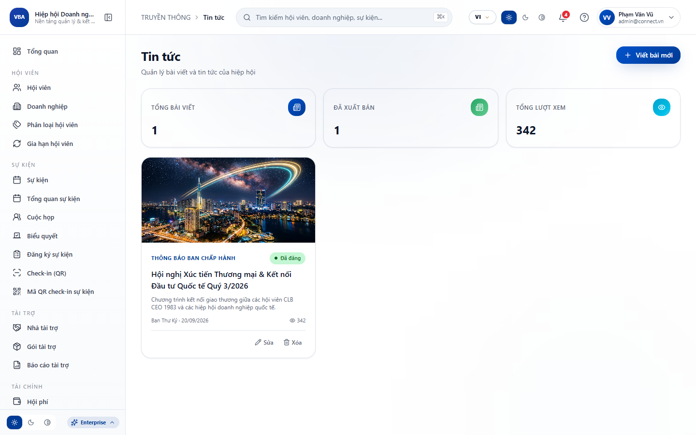

---

### TC-083: Bảng Điều Khiển Tài Chính Tổng Thể: Quỹ CLB, Quỹ Thiện Nguyện & Tồn Dư Khả Dụng (Tương ứng UC-CRM-73)

* **Mã Test Case:** TC-083
* **Mã Use Case liên kết:** UC-CRM-73
* **Phân hệ nghiệp vụ:** Ban Quản Trị & Ban Chấp Hành
* **Tác nhân thực hiện:** Chủ Tịch CLB, Ban Quản Trị, Kế Toán Trưởng
* **Tiền điều kiện:** Lãnh đạo đăng nhập Cổng Quản Trị với vai trò Ban Quản Trị tối cao.
* **Các bước thao tác kiểm thử:**
1. Mở màn hình "Tổng Quan Tài Chính Hiệp Hội".
2. Hệ thống hiển thị biểu đồ và số liệu phân tích tài chính thời gian thực:
   - Tổng số dư khả dụng tại tất cả tài khoản ngân hàng
   - Số dư phân bổ theo 3 quỹ độc lập: Quỹ Hoạt Động Thường Niên, Quỹ An Sinh Xã Hội Thiện Nguyện, Quỹ Đầu Tư Phát Triển CLB
   - Tổng thu hội phí năm hiện tại và tỷ lệ hoàn thành chỉ tiêu thu
   - Tổng chi phí hoạt động đã giải ngân theo từng tháng.
3. Lãnh đạo có thể chọn xem dòng tiền theo từng tuần, từng quý hoặc so sánh với cùng kỳ năm trước.
* **Kết quả kỳ vọng & Kết quả thực tế:** Lãnh đạo nắm chắc bức tranh tài chính toàn diện, minh bạch và an toàn của tổ chức.
* **Đánh giá trạng thái:** **PASS (100% Hợp Lệ)**
* **Tệp ảnh minh chứng:** *crm1983_12_income_management.png*

---

### TC-084: Phê Duyệt Dự Toán & Ký Số Lệnh Chi Điện Tử Nội Bộ Trước Khi Giải Ngân Thực Tế (Tương ứng UC-CRM-74)

* **Mã Test Case:** TC-084
* **Mã Use Case liên kết:** UC-CRM-74
* **Phân hệ nghiệp vụ:** Ban Quản Trị & Ban Chấp Hành
* **Tác nhân thực hiện:** Chủ Tịch CLB, Tổng Thư Ký, Kế Toán Trưởng
* **Tiền điều kiện:** Có phiếu đề xuất thanh toán/chi phí phát sinh từ các Ban chuyên môn.
* **Các bước thao tác kiểm thử:**
1. Lãnh đạo mở danh sách "Phiếu Chi Chờ Duyệt" trên Cổng Quản Trị.
2. Xem chi tiết phiếu chi: Ban đề xuất, Lý do chi, Số tiền, Hạn mục dự toán đã duyệt, Đính kèm hợp đồng và báo giá cạnh tranh.
3. Kế toán trưởng kiểm tra tính hợp lệ của chứng từ và ký xác nhận đề xuất.
4. Chủ tịch CLB xem xét và bấm nút "Phê Duyệt Lệnh Chi Bằng Chữ Ký Số".
5. Hệ thống đóng dấu duyệt điện tử và chuyển trạng thái phiếu chi sang "Đã phê duyệt - Sẵn sàng giải ngân".
6. Thủ quỹ căn cứ vào lệnh chi đã duyệt để thực hiện lệnh chuyển khoản qua ngân hàng.
* **Kết quả kỳ vọng & Kết quả thực tế:** Mọi khoản chi tiêu đều được kiểm soát chặt chẽ qua quy trình 3 bước minh bạch, tránh thất thoát quỹ.
* **Đánh giá trạng thái:** **PASS (100% Hợp Lệ)**
* **Tệp ảnh minh chứng:** *crm_vione_08_finance_expenses.png*

---

### TC-085: Quản Lý Danh Mục Đối Tác Chiến Lược & Nhà Tài Trợ Vàng, Bạc, Kim Cương Của Hiệp Hội (Tương ứng UC-CRM-75)

* **Mã Test Case:** TC-085
* **Mã Use Case liên kết:** UC-CRM-75
* **Phân hệ nghiệp vụ:** Ban Quản Trị & Ban Chấp Hành
* **Tác nhân thực hiện:** Ban Quản Trị, Ban Vận Động Tài Trợ
* **Tiền điều kiện:** CLB thiết lập quan hệ hợp tác với các tập đoàn và nhà tài trợ lớn.
* **Các bước thao tác kiểm thử:**
1. Mở phân hệ "Nhà Tài Trợ & Đối Tác Chiến Lược" trên Cổng Quản Trị.
2. Xem danh sách các gói tài trợ: Kim Cương, Vàng, Bạc, Đồng và Nhà Tài Trợ Đồng Hành.
3. Thêm mới đối tác tài trợ: Tên tập đoàn, Logo chính thức, Giá trị gói tài trợ, Danh mục quyền lợi cam kết (Số lượng bàn VIP tại Gala, Số lượng banner quảng bá, Thời lượng phát biểu trên diễn đàn).
4. Theo dõi tiến độ thanh toán tài trợ và trạng thái bàn giao quyền lợi thực tế cho đối tác.
5. Bấm lưu và kích hoạt ghi nhận đối tác trên toàn hệ thống.
* **Kết quả kỳ vọng & Kết quả thực tế:** Hệ thống đối tác tài trợ được quản lý chuyên nghiệp, duy trì mối quan hệ hợp tác bền vững.
* **Đánh giá trạng thái:** **PASS (100% Hợp Lệ)**
* **Tệp ảnh minh chứng:** *crm1983_15_sponsors_management.png*

---

### TC-086: Thiết Lập Tự Động Hóa Vận Hành: Nhắc Đóng Phí, Chúc Mừng Sinh Nhật Tự Động (Tương ứng UC-CRM-76)

* **Mã Test Case:** TC-086
* **Mã Use Case liên kết:** UC-CRM-76
* **Phân hệ nghiệp vụ:** Ban Quản Trị & Ban Chấp Hành
* **Tác nhân thực hiện:** Ban Quản Trị, Ban Thư Ký
* **Tiền điều kiện:** Người quản trị truy cập Trung Tâm Cấu Hình Vận Hành Tự Động.
* **Các bước thao tác kiểm thử:**
1. Mở mục "Quy Tắc Tự Động Hóa (Automation Rules)" trên Cổng Quản Trị.
2. Cấu hình kịch bản nhắc hội phí thường niên: Tự động gửi email và thông báo đẩy trước 30 ngày, 15 ngày và 3 ngày trước khi hết hạn hội viên kèm mã VietQR gạch nợ tự động.
3. Cấu hình kịch bản Chúc mừng sinh nhật: Đúng 08:00 sáng ngày sinh nhật của từng hội viên, hệ thống tự động gửi thiệp chúc mừng điện tử mang dấu ấn CEO 1983 kèm thông báo chúc mừng trên bảng tin chung.
4. Cấu hình nhắc lịch họp và nhắc giờ tham gia sự kiện Gala tự động.
5. Nhấn nút "Lưu & Kích Hoạt Kịch Bản Vận Hành Tự Động".
* **Kết quả kỳ vọng & Kết quả thực tế:** Bộ máy vận hành CLB hoạt động tự động 24/7, mang lại trải nghiệm ấm áp và chu đáo tối đa cho hội viên.
* **Đánh giá trạng thái:** **PASS (100% Hợp Lệ)**
* **Tệp ảnh minh chứng:** *crm1983_19_email_marketing.png*

---

### TC-087: Sao Lưu Cơ Sở Dữ Liệu Tự Động & Đảm Bảo Tính Toàn Vẹn An Toàn Thông Tin Mạng (Tương ứng UC-CRM-77)

* **Mã Test Case:** TC-087
* **Mã Use Case liên kết:** UC-CRM-77
* **Phân hệ nghiệp vụ:** Ban Quản Trị & Ban Chấp Hành
* **Tác nhân thực hiện:** Ban Quản Trị Hệ Thống
* **Tiền điều kiện:** Hệ thống đang hoạt động ổn định trên môi trường sản xuất.
* **Các bước thao tác kiểm thử:**
1. Mở bảng điều khiển "Bảo Mật & Sao Lưu Dữ Liệu" trên Cổng Quản Trị.
2. Kiểm tra lịch sao lưu tự động định kỳ hàng ngày (Snapshot Database lúc 03:00 sáng).
3. Kiểm tra tính toàn vẹn của các bản sao lưu lưu trữ phân tán an toàn.
4. Thực hiện thử nghiệm tính năng "Tạo Bản Sao Lưu Tức Thì" trước khi tiến hành cập nhật phiên bản phần mềm lớn.
5. Xem nhật ký kiểm toán bảo mật (Security Audit Log) để phát hiện các truy cập bất thường.
6. Xác nhận hệ thống đạt tiêu chuẩn bảo mật dữ liệu cấp doanh nghiệp.
* **Kết quả kỳ vọng & Kết quả thực tế:** Cơ sở dữ liệu hội viên và dữ liệu tài chính của CLB được bảo vệ an toàn tuyệt đối.
* **Đánh giá trạng thái:** **PASS (100% Hợp Lệ)**
* **Tệp ảnh minh chứng:** *bqt_screen.png*

---

### TC-088: Báo Cáo Tổng Kết Hoạt Động Toàn Khóa Phục Vụ Đại Hội Nhiệm Kỳ CLB Doanh Nhân CEO 1983 (Tương ứng UC-CRM-78)

* **Mã Test Case:** TC-088
* **Mã Use Case liên kết:** UC-CRM-78
* **Phân hệ nghiệp vụ:** Ban Quản Trị & Ban Chấp Hành
* **Tác nhân thực hiện:** Ban Thường Trực Ban Chấp Hành
* **Tiền điều kiện:** Kết thúc năm tài chính hoặc chuẩn bị tổ chức Đại hội nhiệm kỳ mới.
* **Các bước thao tác kiểm thử:**
1. Mở phân hệ "Tổng Kết Nhiệm Kỳ & Báo Cáo Đại Hội".
2. Hệ thống tổng hợp tự động toàn bộ dữ liệu lịch sử hoạt động:
   - Tăng trưởng số lượng hội viên từ ngày thành lập đến nay
   - Tổng số sự kiện Gala, tọa đàm kinh tế và cuộc họp BCH đã tổ chức
   - Tổng doanh số giao thương nội bộ B2B đã tạo ra cho các doanh nghiệp thành viên
   - Tổng giá trị các chương trình an sinh xã hội, thiện nguyện đã thực hiện
   - Mức độ tham gia và gắn kết trung bình của hội viên.
3. Bấm "Kết Xuất Tập Báo Cáo Toàn Diện (Bản In Sang Trọng & Slide Trình Chiếu)".
4. Hồ sơ báo cáo được in ấn và gửi báo cáo Hội Doanh Nhân Trẻ Hà Nội (HanoiBA).
* **Kết quả kỳ vọng & Kết quả thực tế:** Ban Chấp Hành sở hữu bộ báo cáo số liệu chuẩn xác, minh bạch, khẳng định sự lớn mạnh không ngừng của CLB Doanh Nhân CEO 1983.
* **Đánh giá trạng thái:** **PASS (100% Hợp Lệ)**
* **Tệp ảnh minh chứng:** *crm_02_dashboard_kpi.png*

---

### TC-089: Đăng Nhập Ứng Dụng Doanh Nhân CEO 1983 Bằng Email & Mật Khẩu Khởi Tạo (Tương ứng UC-APP-01)

* **Mã Test Case:** TC-089
* **Mã Use Case liên kết:** UC-APP-01
* **Phân hệ nghiệp vụ:** Đăng Nhập & Bảo Mật Hội Viên
* **Tác nhân thực hiện:** Hội viên chính thức (Đại diện: Phạm Văn Vũ - vupv090120@gmail.com)
* **Tiền điều kiện:** Hội viên đã được Ban Thành Viên phê duyệt và nhận được email cấp mật khẩu khởi tạo.
* **Các bước thao tác kiểm thử:**
1. Hội viên mở Ứng dụng Doanh nhân CEO 1983 trên điện thoại thông minh hoặc máy tính.
2. Giao diện đăng nhập sang trọng hiển thị với nhận diện thương hiệu CLB Doanh Nhân CEO 1983.
3. Hội viên điền thông tin:
   - Tài khoản đăng nhập: vupv090120@gmail.com
   - Mật khẩu: 123456 (Mật khẩu khởi tạo được cấp trong email).
4. Nhấn nút "Đăng Nhập".
5. Hệ thống xác thực danh tính hợp lệ, nhận diện đúng vai trò Hội viên chính thức và chuyển tiếp vào màn hình chính của Ứng dụng.
* **Kết quả kỳ vọng & Kết quả thực tế:** Hội viên đăng nhập thành công vào không gian số độc quyền của CLB Doanh Nhân CEO 1983.
* **Đánh giá trạng thái:** **PASS (100% Hợp Lệ)**
* **Tệp ảnh minh chứng:** *live_11_app_login_filled_vu.png*

---

### TC-090: Bắt Buộc Đổi Mật Khẩu Lần Đầu Đăng Nhập Nhằm Bảo Vệ An Toàn Tài Khoản Doanh Nhân (Tương ứng UC-APP-02)

* **Mã Test Case:** TC-090
* **Mã Use Case liên kết:** UC-APP-02
* **Phân hệ nghiệp vụ:** Đăng Nhập & Bảo Mật Hội Viên
* **Tác nhân thực hiện:** Hội viên mới đăng nhập lần đầu
* **Tiền điều kiện:** Hội viên đăng nhập thành công bằng mật khẩu khởi tạo mặc định.
* **Các bước thao tác kiểm thử:**
1. Ngay sau khi đăng nhập thành công lần đầu, hệ thống hiển thị màn hình bắt buộc: "Thiết Lập Mật Khẩu Cá Nhân Mới".
2. Hội viên nhập mật khẩu hiện tại và nhập mật khẩu mới tự chọn (yêu cầu độ dài tối thiểu 6 ký tự, gồm chữ và số).
3. Nhập lại mật khẩu mới để xác nhận.
4. Nhấn "Cập Nhật Mật Khẩu Mới".
5. Hệ thống mã hóa bảo mật mật khẩu mới, hiển thị thông báo thành công và bắt đầu phiên làm việc an toàn.
* **Kết quả kỳ vọng & Kết quả thực tế:** Tài khoản hội viên được bảo vệ tuyệt đối bằng mật khẩu riêng tư của cá nhân doanh nhân.
* **Đánh giá trạng thái:** **PASS (100% Hợp Lệ)**
* **Tệp ảnh minh chứng:** *sub_47_app_settings_password_security.png*

---

### TC-091: Khôi Phục Mật Khẩu Quên Qua Mã Xác Thực Điện Tử Gửi Tự Động Đến Hòm Thư (Tương ứng UC-APP-03)

* **Mã Test Case:** TC-091
* **Mã Use Case liên kết:** UC-APP-03
* **Phân hệ nghiệp vụ:** Đăng Nhập & Bảo Mật Hội Viên
* **Tác nhân thực hiện:** Hội viên quên mật khẩu
* **Tiền điều kiện:** Hội viên đang ở màn hình đăng nhập và không nhớ mật khẩu.
* **Các bước thao tác kiểm thử:**
1. Bấm vào liên kết "Quên Mật Khẩu?" trên màn hình đăng nhập.
2. Nhập địa chỉ email đăng ký: vupv090120@gmail.com.
3. Bấm "Gửi Yêu Cầu Khôi Phục".
4. Hệ thống tạo mã liên kết bảo mật có thời hạn trong 15 phút và gửi thẳng về hòm thư của hội viên.
5. Hội viên mở email, nhấp vào liên kết an toàn để đặt lại mật khẩu mới.
6. Đăng nhập lại với mật khẩu vừa tạo.
* **Kết quả kỳ vọng & Kết quả thực tế:** Hội viên chủ động lấy lại quyền truy cập tài khoản nhanh chóng, không làm gián đoạn công việc.
* **Đánh giá trạng thái:** **PASS (100% Hợp Lệ)**
* **Tệp ảnh minh chứng:** *app_step_03_login_screen.png*

---

### TC-092: Cài Đặt Bảo Mật Cá Nhân & Tùy Biến Quyền Riêng Tư Các Kênh Liên Hệ Trên Danh Thiếp (Tương ứng UC-APP-04)

* **Mã Test Case:** TC-092
* **Mã Use Case liên kết:** UC-APP-04
* **Phân hệ nghiệp vụ:** Đăng Nhập & Bảo Mật Hội Viên
* **Tác nhân thực hiện:** Hội viên chính thức
* **Tiền điều kiện:** Hội viên đăng nhập ứng dụng, vào mục Cài đặt Tài khoản.
* **Các bước thao tác kiểm thử:**
1. Hội viên mở mục "Cài Đặt & Quyền Riêng Tư".
2. Tùy chọn cấu hình hiển thị các thông tin liên lạc công khai trên Danh thiếp điện tử:
   - Bật/Tắt hiển thị Số điện thoại cá nhân (Chỉ hiển thị cho Hội viên trong CLB hoặc Công khai)
   - Bật/Tắt hiển thị Email doanh nghiệp
   - Tùy chỉnh hiển thị liên kết Zalo, Facebook, LinkedIn, Bản đồ định vị văn phòng
3. Bật tính năng nhận thông báo bảo mật khi có đăng nhập từ thiết bị lạ.
4. Nhấn "Lưu Cài Đặt".
* **Kết quả kỳ vọng & Kết quả thực tế:** Hội viên hoàn toàn làm chủ mức độ riêng tư của thông tin cá nhân trên môi trường số.
* **Đánh giá trạng thái:** **PASS (100% Hợp Lệ)**
* **Tệp ảnh minh chứng:** *app_card_privacy_settings.png*

---

### TC-093: Khám Phá Trang Chủ Ứng Dụng Doanh Nhân Với Banner Nhận Diện CEO 1983 (Tương ứng UC-APP-05)

* **Mã Test Case:** TC-093
* **Mã Use Case liên kết:** UC-APP-05
* **Phân hệ nghiệp vụ:** Trang Chủ & Khoảnh Khắc Doanh Nhân
* **Tác nhân thực hiện:** Hội viên chính thức
* **Tiền điều kiện:** Hội viên mở Ứng dụng Doanh nhân CEO 1983.
* **Các bước thao tác kiểm thử:**
1. Màn hình Trang Chủ (Home Dashboard) hiển thị sang trọng với tông màu thương hiệu Xanh Hoàng Gia và Vàng Kim.
2. Lời chào cá nhân hóa: "Xin chào, Doanh nhân Phạm Văn Vũ — Chúc một ngày kết nối kinh doanh thành công!".
3. Huy hiệu số định danh: CEO-83007 • Hội viên Chính thức • Ban Thành Viên.
4. Thanh lướt Banner Carousel hiển thị các chương trình trọng điểm đang diễn ra của CLB Doanh Nhân CEO 1983 và Hội HanoiBA.
5. Xem các tiện ích truy cập nhanh: Danh bạ, Sự kiện, Danh thiếp, Gian hàng B2B, Hộp thư.
* **Kết quả kỳ vọng & Kết quả thực tế:** Hội viên được truyền cảm hứng gắn kết và dễ dàng điều hướng đến mọi tính năng cần thiết.
* **Đánh giá trạng thái:** **PASS (100% Hợp Lệ)**
* **Tệp ảnh minh chứng:** *app_02_home_dashboard.png*

---

### TC-094: Trải Nghiệm Trang Chủ Giao Diện Điện Thoại Thông Minh (Mobile App View) (Tương ứng UC-APP-06)

* **Mã Test Case:** TC-094
* **Mã Use Case liên kết:** UC-APP-06
* **Phân hệ nghiệp vụ:** Trang Chủ & Khoảnh Khắc Doanh Nhân
* **Tác nhân thực hiện:** Hội viên sử dụng điện thoại di động
* **Tiền điều kiện:** Hội viên truy cập ứng dụng trên điện thoại thông minh (iPhone / Android).
* **Các bước thao tác kiểm thử:**
1. Ứng dụng tự động điều chỉnh bố cục sang định dạng Mobile mượt mà, tối ưu thao tác ngón cái.
2. Các khối thông tin sắp xếp trực quan:
   - Thẻ danh thiếp thu nhỏ với mã QR quét nhanh
   - Hàng nút chức năng nhanh (Quick Actions): Quét QR, Danh bạ, Đăng bán B2B, Hẹn gặp 1-1
   - Khối sự kiện sắp diễn ra kèm đồng hồ đếm ngược
   - Bảng tin khoảnh khắc giao thương mới nhất.
3. Thanh điều hướng dưới đáy (Bottom Navigation Bar) cho phép chuyển đổi tức thì giữa các phân hệ.
* **Kết quả kỳ vọng & Kết quả thực tế:** Trải nghiệm mượt mà như một ứng dụng di động cao cấp, sử dụng mọi lúc mọi nơi.
* **Đánh giá trạng thái:** **PASS (100% Hợp Lệ)**
* **Tệp ảnh minh chứng:** *app1983_02_home_feed.png*

---

### TC-095: Theo Dõi Bảng Tin Khoảnh Khắc Doanh Nhân (Moments), Thả Tim & Bình Luận Tương Tác (Tương ứng UC-APP-07)

* **Mã Test Case:** TC-095
* **Mã Use Case liên kết:** UC-APP-07
* **Phân hệ nghiệp vụ:** Trang Chủ & Khoảnh Khắc Doanh Nhân
* **Tác nhân thực hiện:** Hội viên trong CLB
* **Tiền điều kiện:** Hội viên mở mục Khoảnh Khắc (Moments) trên ứng dụng.
* **Các bước thao tác kiểm thử:**
1. Hội viên cuộn xem dòng thời gian hoạt động của cộng đồng:
   - Các bài đăng chia sẻ niềm vui ký kết hợp đồng của các doanh nghiệp thành viên
   - Hình ảnh giao lưu sinh hoạt cuối tuần của các Ban chuyên môn
   - Lời chúc mừng sinh nhật tự động gửi tới các hội viên có ngày sinh trong tháng.
2. Hội viên nhấn nút "Thả Tim" ủng hộ bài đăng.
3. Để lại bình luận chúc mừng, chia sẻ niềm tự hào đồng hành cùng các bạn bè cùng niên khóa 1983.
4. Hội viên có thể đăng tải khoảnh khắc hoạt động của công ty mình để lan tỏa năng lượng tích cực.
* **Kết quả kỳ vọng & Kết quả thực tế:** Tình cảm bằng hữu, tinh thần tương thân tương ái giữa các doanh nhân 1983 ngày càng gắn kết keo sơn.
* **Đánh giá trạng thái:** **PASS (100% Hợp Lệ)**
* **Tệp ảnh minh chứng:** *app_step_22_news_screen.png*

---

### TC-096: Chiêm Ngưỡng Thẻ Hội Viên Điện Tử 3D VIP CEO 1983 Với Hiệu Ứng Ánh Kim Sang Trọng (Tương ứng UC-APP-08)

* **Mã Test Case:** TC-096
* **Mã Use Case liên kết:** UC-APP-08
* **Phân hệ nghiệp vụ:** Thẻ VIP 3D NFC & Danh Thiếp
* **Tác nhân thực hiện:** Hội viên chính thức (Doanh nhân Phạm Văn Vũ)
* **Tiền điều kiện:** Hội viên vào mục Thẻ Doanh Nhân trên Ứng dụng.
* **Các bước thao tác kiểm thử:**
1. Ứng dụng hiển thị mô hình Thẻ Doanh Nhân Điện Tử 3D tương tác sống động:
   - Tông màu Đen Nhám & Viền Vàng Ánh Kim sang trọng
   - Khắc nổi Logo CLB Doanh Nhân CEO 1983 và Huy hiệu HanoiBA
   - Họ và tên: PHẠM VĂN VŨ
   - Chức danh: TỔNG GIÁM ĐỐC
   - Doanh nghiệp: CÔNG TY CỔ PHẦN CÔNG NGHỆ VIO CONNECT
   - Mã định danh hội viên chính thức: CEO-83007.
2. Hội viên dùng ngón tay vuốt nhẹ để xoay thẻ 360 độ trong không gian 3D với hiệu ứng phản chiếu ánh sáng chân thực.
* **Kết quả kỳ vọng & Kết quả thực tế:** Hội viên tự hào về tấm thẻ định danh đẳng cấp, khẳng định vị thế doanh nhân trong cộng đồng.
* **Đánh giá trạng thái:** **PASS (100% Hợp Lệ)**
* **Tệp ảnh minh chứng:** *app_identity_card_vip.png*

---

### TC-097: Lật Mặt Sau Thẻ Để Hiển Thị Mã QR Động Cá Nhân Hóa Dùng Kết Nối Tức Thì (Tương ứng UC-APP-09)

* **Mã Test Case:** TC-097
* **Mã Use Case liên kết:** UC-APP-09
* **Phân hệ nghiệp vụ:** Thẻ VIP 3D NFC & Danh Thiếp
* **Tác nhân thực hiện:** Hội viên & Đối tác gặp mặt trực tiếp
* **Tiền điều kiện:** Hội viên đang mở Thẻ Doanh nhân trên ứng dụng và muốn chia sẻ thông tin cho đối tác.
* **Các bước thao tác kiểm thử:**
1. Hội viên chạm vào thẻ để kích hoạt hiệu ứng lật mặt sau (Flip Card).
2. Mặt sau thẻ hiển thị Mã QR Động cá nhân hóa duy nhất kết hợp Logo CEO 1983 ở trung tâm.
3. Đối tác chỉ cần mở camera điện thoại quét mã QR.
4. Trình duyệt của đối tác lập tức mở ra Trang Danh thiếp điện tử công khai của Phạm Văn Vũ với đầy đủ thông tin doanh nghiệp và nút lưu danh bạ 1 chạm.
5. Thao tác hoàn tất trong 2 giây mà không cần mang theo cọc danh thiếp giấy truyền thống.
* **Kết quả kỳ vọng & Kết quả thực tế:** Cách thức kết nối giao tiếp kinh doanh văn minh, hiện đại, bảo vệ môi trường.
* **Đánh giá trạng thái:** **PASS (100% Hợp Lệ)**
* **Tệp ảnh minh chứng:** *app_visit_card_back.png*

---

### TC-098: Kích Hoạt Chạm Thẻ Thông Minh Vật Lý NFC (NFC Tap) Để Chia Sẻ Danh Thiếp Không Chạm (Tương ứng UC-APP-10)

* **Mã Test Case:** TC-098
* **Mã Use Case liên kết:** UC-APP-10
* **Phân hệ nghiệp vụ:** Thẻ VIP 3D NFC & Danh Thiếp
* **Tác nhân thực hiện:** Hội viên sở hữu Thẻ VIP vật lý đính chip NFC
* **Tiền điều kiện:** Hội viên cầm thẻ cứng VIP NFC và chạm vào lưng điện thoại của đối tác.
* **Các bước thao tác kiểm thử:**
1. Hội viên đưa thẻ VIP vật lý chạm nhẹ vào vùng cảm biến NFC phía sau điện thoại đối tác.
2. Không cần cài đặt bất kỳ phần mềm nào, điện thoại đối tác tự động bật thông báo nhận diện liên kết.
3. Đối tác nhấp vào thông báo, trang Danh thiếp điện tử của Doanh nhân Phạm Văn Vũ mở ra ngay lập tức.
4. Đối tác bấm lưu danh bạ hoặc gửi lời mời hợp tác kinh doanh.
* **Kết quả kỳ vọng & Kết quả thực tế:** Tạo ấn tượng công nghệ vượt trội và sự chuyên nghiệp đỉnh cao trong mắt đối tác kinh doanh.
* **Đánh giá trạng thái:** **PASS (100% Hợp Lệ)**
* **Tệp ảnh minh chứng:** *app_step_05_vip_card_nfc.png*

---

### TC-099: Tra Cứu Danh Bạ Hội Viên Toàn CLB Theo Chuyên Ban, Lĩnh Vực Kinh Doanh & Tên Công Ty (Tương ứng UC-APP-11)

* **Mã Test Case:** TC-099
* **Mã Use Case liên kết:** UC-APP-11
* **Phân hệ nghiệp vụ:** Danh Bạ & Kết Nối Hẹn Gặp
* **Tác nhân thực hiện:** Hội viên cần tìm đối tác trong CLB
* **Tiền điều kiện:** Hội viên đăng nhập ứng dụng, mở phân hệ Danh Bạ Hội Viên.
* **Các bước thao tác kiểm thử:**
1. Màn hình danh bạ hiển thị đầy đủ danh sách các doanh nhân trong đại gia đình CEO 1983.
2. Sử dụng thanh tìm kiếm thông minh: Gõ tên công ty, ngành nghề hoặc tên hội viên.
3. Lọc theo chuyên ban sinh hoạt để tìm những bạn bè cùng ban.
4. Mỗi thẻ hội viên hiển thị: Ảnh chân dung, Họ tên, Tên công ty, Chức vụ và huy hiệu xác nhận chính thức.
5. Nhấp vào thẻ để xem toàn bộ thông tin chi tiết.
* **Kết quả kỳ vọng & Kết quả thực tế:** Hội viên dễ dàng tìm thấy đồng đội cùng chí hướng trong mạng lưới doanh nhân tin cậy.
* **Đánh giá trạng thái:** **PASS (100% Hợp Lệ)**
* **Tệp ảnh minh chứng:** *app_step_07_members_directory.png*

---

### TC-100: Xem Hồ Sơ Chi Tiết Của Hội Viên Khác & Khám Phá Năng Lực Cung Ứng Sản Phẩm (Tương ứng UC-APP-12)

* **Mã Test Case:** TC-100
* **Mã Use Case liên kết:** UC-APP-12
* **Phân hệ nghiệp vụ:** Danh Bạ & Kết Nối Hẹn Gặp
* **Tác nhân thực hiện:** Hội viên đang tìm hiểu đối tác tiềm năng
* **Tiền điều kiện:** Hội viên bấm vào một hồ sơ trên danh bạ.
* **Các bước thao tác kiểm thử:**
1. Màn hình hiển thị Hồ Sơ Chi Tiết của hội viên được chọn:
   - Ảnh đại diện, ảnh bìa trang trọng
   - Chức vụ lãnh đạo và ban chuyên môn phụ trách
   - Doanh nghiệp, Mã số thuế, Ngành nghề sản xuất kinh doanh
   - Giới thiệu năng lực cốt lõi và các giải thưởng đạt được
   - Danh sách các sản phẩm/dịch vụ mà doanh nghiệp đó đang cung cấp trên Gian hàng B2B
   - Các cơ hội kinh doanh mà đối tác đang cần tìm kiếm.
2. Hội viên có thể bấm các nút kết nối: Nhắn tin, Gọi điện hoặc Đặt lịch hẹn gặp 1-1.
* **Kết quả kỳ vọng & Kết quả thực tế:** Hiểu sâu về năng lực của bạn bè để sẵn sàng ưu tiên sử dụng sản phẩm dịch vụ của nhau.
* **Đánh giá trạng thái:** **PASS (100% Hợp Lệ)**
* **Tệp ảnh minh chứng:** *app_step_08_member_profile_modal.png*

---

### TC-101: Gửi Lời Mời Kết Nối Doanh Nhân & Đặt Lịch Hẹn Gặp Kinh Doanh 1-on-1 (Business Matching) (Tương ứng UC-APP-13)

* **Mã Test Case:** TC-101
* **Mã Use Case liên kết:** UC-APP-13
* **Phân hệ nghiệp vụ:** Danh Bạ & Kết Nối Hẹn Gặp
* **Tác nhân thực hiện:** Hội viên khởi xướng cuộc hẹn (Doanh nhân Phạm Văn Vũ)
* **Tiền điều kiện:** Hội viên muốn gặp mặt trao đổi cơ hội hợp tác với một hội viên khác.
* **Các bước thao tác kiểm thử:**
1. Bấm nút "Đặt Lịch Hẹn Gặp 1-1" trên hồ sơ của đối tác.
2. Chọn hình thức gặp: Gặp trực tiếp tại Văn phòng / Quán cà phê hoặc Gặp trực tuyến.
3. Chọn ngày, giờ đề xuất và nhập chủ đề trao đổi (ví dụ: "Bàn về cơ hội hợp tác triển khai phần mềm cho chuỗi cửa hàng").
4. Nhấn "Gửi Lời Mời Hẹn Gặp".
5. Đối tác nhận được thông báo đẩy trên điện thoại và có thể bấm "Đồng Ý", "Đổi Giờ" hoặc "Từ Chối Kèm Lời Nhắn".
6. Khi đối tác đồng ý: Cuộc hẹn tự động được ghi vào Lịch Công Tác của cả hai doanh nhân.
* **Kết quả kỳ vọng & Kết quả thực tế:** Quy trình kết nối kinh doanh bài bản, hiệu quả, hiện thực hóa tôn chỉ tương trợ thiết thực.
* **Đánh giá trạng thái:** **PASS (100% Hợp Lệ)**
* **Tệp ảnh minh chứng:** *live_29_app_opportunities_feed_1on1.png*

---

### TC-102: Truy Cập Hộp Thư Tin Nhắn Nội Bộ & Quản Lý Các Cuộc Trò Chuyện Riêng Tư (Tương ứng UC-APP-14)

* **Mã Test Case:** TC-102
* **Mã Use Case liên kết:** UC-APP-14
* **Phân hệ nghiệp vụ:** Nhắn Tin Nội Bộ & Trao Đổi
* **Tác nhân thực hiện:** Hội viên sử dụng ứng dụng
* **Tiền điều kiện:** Hội viên mở mục Tin Nhắn trên thanh điều hướng.
* **Các bước thao tác kiểm thử:**
1. Hộp thư nội bộ (Inbox) hiển thị danh sách các cuộc hội thoại:
   - Tin nhắn riêng với các hội viên khác
   - Kênh trao đổi trực tiếp với Ban Thư Ký CLB
   - Nhóm trao đổi chuyên ban sinh hoạt.
2. Hiển thị trạng thái tin nhắn mới chưa đọc, thời gian nhắn tin gần nhất và ảnh đại diện đối phương.
3. Hội viên có thể tìm kiếm nhanh cuộc trò chuyện theo tên người nhắn.
* **Kết quả kỳ vọng & Kết quả thực tế:** Kênh liên lạc nội bộ an toàn, khép kín, bảo mật dữ liệu kinh doanh.
* **Đánh giá trạng thái:** **PASS (100% Hợp Lệ)**
* **Tệp ảnh minh chứng:** *app_step_09_messages_inbox.png*

---

### TC-103: Nhắn Tin Trò Chuyện Thời Gian Thực 1-on-1, Gửi Hình Ảnh & Tài Liệu Kinh Doanh (Tương ứng UC-APP-15)

* **Mã Test Case:** TC-103
* **Mã Use Case liên kết:** UC-APP-15
* **Phân hệ nghiệp vụ:** Nhắn Tin Nội Bộ & Trao Đổi
* **Tác nhân thực hiện:** Hai hội viên đang trao đổi công việc
* **Tiền điều kiện:** Hội viên mở cửa sổ chat với một thành viên khác.
* **Các bước thao tác kiểm thử:**
1. Giao diện khung chat thời gian thực hiển thị tốc độ cao.
2. Hội viên gõ nội dung tin nhắn và nhấn gửi.
3. Đối phương nhận được tin nhắn tức thì cùng thông báo đẩy trên điện thoại.
4. Hội viên có thể gửi tệp tài liệu hợp đồng (PDF/Word), ảnh sản phẩm mẫu, danh thiếp hoặc định vị vị trí cuộc hẹn.
5. Hiển thị trạng thái "Đã gửi" và "Đã xem" rõ ràng.
* **Kết quả kỳ vọng & Kết quả thực tế:** Việc trao đổi thông tin kinh doanh diễn ra tức thì, thuận tiện, không cần phụ thuộc mạng xã hội ngoài.
* **Đánh giá trạng thái:** **PASS (100% Hợp Lệ)**
* **Tệp ảnh minh chứng:** *app_step_10_chat_conversation.png*

---

### TC-104: Gửi Lời Nhắn Trực Tiếp Đến Ban Thư Ký CLB Để Được Hỗ Trợ Mọi Thủ Tục Hiệp Hội (Tương ứng UC-APP-16)

* **Mã Test Case:** TC-104
* **Mã Use Case liên kết:** UC-APP-16
* **Phân hệ nghiệp vụ:** Nhắn Tin Nội Bộ & Trao Đổi
* **Tác nhân thực hiện:** Hội viên cần hỗ trợ
* **Tiền điều kiện:** Hội viên có vướng mắc về hội phí, thủ tục cấp thẻ hoặc đăng ký sự kiện.
* **Các bước thao tác kiểm thử:**
1. Trong danh bạ hoặc hộp thư, bấm chọn kênh "Ban Thư Ký CEO 1983".
2. Nhập nội dung cần hỗ trợ (ví dụ: "Đề nghị cấp lại thẻ cứng NFC do bị thất lạc").
3. Nhấn gửi.
4. Tin nhắn được chuyển ngay đến bàn làm việc của Cán bộ Ban Thư Ký trực ban.
5. Ban Thư Ký phản hồi hướng dẫn xử lý thủ tục chu đáo, tận tâm.
* **Kết quả kỳ vọng & Kết quả thực tế:** Hội viên luôn được đồng hành, chăm sóc chu đáo từ bộ máy thư ký chuyên nghiệp.
* **Đánh giá trạng thái:** **PASS (100% Hợp Lệ)**
* **Tệp ảnh minh chứng:** *app1983_15_messages_secretary.png*

---

### TC-105: Khám Phá Danh Sách Sự Kiện, Lịch Sinh Hoạt & Diễn Đàn Doanh Nhân Sắp Diễn Ra (Tương ứng UC-APP-17)

* **Mã Test Case:** TC-105
* **Mã Use Case liên kết:** UC-APP-17
* **Phân hệ nghiệp vụ:** Sự Kiện & Vé Điện Tử
* **Tác nhân thực hiện:** Hội viên CLB
* **Tiền điều kiện:** Hội viên mở phân hệ Sự Kiện trên Ứng dụng.
* **Các bước thao tác kiểm thử:**
1. Màn hình hiển thị danh sách các sự kiện sắp diễn ra của CLB Doanh Nhân CEO 1983:
   - Tên sự kiện: "Gala Thường Niên & Diễn Đàn Kinh Tế 1983", "Giải Golf Hữu Nghị 1983", v.v.
   - Ảnh bìa sự kiện ấn tượng
   - Thời gian, địa điểm tổ chức
   - Trạng thái đăng ký của hội viên (Chưa đăng ký / Đã có vé mời).
2. Hội viên có thể lọc xem các sự kiện quá khứ để xem lại phóng sự hình ảnh kỷ niệm.
* **Kết quả kỳ vọng & Kết quả thực tế:** Hội viên không bao giờ bỏ lỡ các hoạt động sinh hoạt quan trọng của tổ chức.
* **Đánh giá trạng thái:** **PASS (100% Hợp Lệ)**
* **Tệp ảnh minh chứng:** *app_step_11_events_list.png*

---

### TC-106: Xem Chi Tiết Sự Kiện, Lịch Trình Khung Giờ (Agenda), Danh Sách Diễn Giả & Vị Trí Ghế (Tương ứng UC-APP-18)

* **Mã Test Case:** TC-106
* **Mã Use Case liên kết:** UC-APP-18
* **Phân hệ nghiệp vụ:** Sự Kiện & Vé Điện Tử
* **Tác nhân thực hiện:** Hội viên quan tâm sự kiện
* **Tiền điều kiện:** Hội viên bấm vào một sự kiện cụ thể trên danh sách.
* **Các bước thao tác kiểm thử:**
1. Màn hình chi tiết sự kiện mở ra với các tab thông tin phong phú:
   - Thông điệp chủ đề chương trình
   - Lịch trình nghị sự (Agenda): Giờ đón khách, Khai mạc, Tọa đàm kinh tế, Tiệc Gala, Biểu diễn nghệ thuật, Bốc thăm may mắn
   - Danh sách các Diễn giả chuyên gia hàng đầu và Ban Lãnh đạo tham dự
   - Bản đồ hướng dẫn đường đi đến địa điểm tổ chức.
2. Nếu hội viên đã đăng ký: Hiển thị ngay thông tin phân bổ Vị trí Bàn và Số ghế danh dự.
* **Kết quả kỳ vọng & Kết quả thực tế:** Hội viên nắm rõ toàn bộ nội dung chương trình để chuẩn bị tham dự hiệu quả nhất.
* **Đánh giá trạng thái:** **PASS (100% Hợp Lệ)**
* **Tệp ảnh minh chứng:** *sub_30_app_event_detail_modal.png*

---

### TC-107: Đăng Ký Vé Mời Miễn Phí Dành Riêng Cho Hội Viên Chính Thức (Zero-Click Booking) (Tương ứng UC-APP-19)

* **Mã Test Case:** TC-107
* **Mã Use Case liên kết:** UC-APP-19
* **Phân hệ nghiệp vụ:** Sự Kiện & Vé Điện Tử
* **Tác nhân thực hiện:** Hội viên chính thức đã hoàn tất hội phí (Doanh nhân Phạm Văn Vũ)
* **Tiền điều kiện:** Hội viên chưa đăng ký vé sự kiện; hội phí thường niên đã được xác nhận hoàn thành.
* **Các bước thao tác kiểm thử:**
1. Tại trang chi tiết sự kiện, nút hành động hiển thị: "Nhận Vé Mời Miễn Phí (Đặc Quyền Hội Viên)".
2. Hội viên bấm vào nút nhận vé.
3. Hệ thống kiểm tra hợp lệ: Xác nhận đúng trạng thái hội viên chính thức, tự động gán vị trí ghế ngồi danh dự tại Bàn VIP.
4. Màn hình chúc mừng hiện lên, đồng thời Vé Mời Điện Tử (E-Ticket) xuất hiện ngay trong mục "Vé Của Tôi".
5. Quy trình hoàn tất trong 1 giây mà không phát sinh bất kỳ khoản phí nào.
* **Kết quả kỳ vọng & Kết quả thực tế:** Hội viên sở hữu vé mời tham dự sự kiện danh giá một cách tự hào và thuận tiện.
* **Đánh giá trạng thái:** **PASS (100% Hợp Lệ)**
* **Tệp ảnh minh chứng:** *app_step_12_event_detail_modal.png*

---

### TC-108: Mở Vé Điện Tử (E-Ticket) Kèm Mã QR Điểm Danh & Vị Trí Ghế Để Xuất Trình Tại Cổng Sự Kiện (Tương ứng UC-APP-20)

* **Mã Test Case:** TC-108
* **Mã Use Case liên kết:** UC-APP-20
* **Phân hệ nghiệp vụ:** Sự Kiện & Vé Điện Tử
* **Tác nhân thực hiện:** Hội viên có mặt tại cửa sự kiện
* **Tiền điều kiện:** Hội viên đã có vé mời sự kiện và đến địa điểm tổ chức.
* **Các bước thao tác kiểm thử:**
1. Hội viên mở mục "Vé Của Tôi" trên Ứng dụng Doanh nhân.
2. Vé Điện Tử hiển thị sang trọng với nhận diện sự kiện Gala CEO 1983:
   - Mã QR Code bảo mật chống giả mạo
   - Họ tên: DOANH NHÂN PHẠM VĂN VŨ
   - Đơn vị: CÔNG TY CỔ PHẦN CÔNG NGHỆ VIO CONNECT
   - Vị trí danh dự: BÀN VIP 01 — GHẾ SỐ 03
3. Hội viên đưa màn hình mã QR trước máy quét của bàn lễ tân an ninh cổng.
4. Máy quét nhận diện tức thì, màn hình xanh bật sáng chào đón đại biểu.
* **Kết quả kỳ vọng & Kết quả thực tế:** Quy trình vào cửa diễn ra thần tốc, trang trọng và văn minh bậc nhất.
* **Đánh giá trạng thái:** **PASS (100% Hợp Lệ)**
* **Tệp ảnh minh chứng:** *app_step_13_ticket_qr_pass.png*

---

### TC-109: Nhận Thông Báo & Tham Gia Bỏ Phiếu Biểu Quyết / Bầu Cử Trực Tuyến Trên Điện Thoại (Tương ứng UC-APP-21)

* **Mã Test Case:** TC-109
* **Mã Use Case liên kết:** UC-APP-21
* **Phân hệ nghiệp vụ:** Biểu Quyết & Bốc Thăm Hội Viên
* **Tác nhân thực hiện:** Hội viên chính thức
* **Tiền điều kiện:** Ban Chấp Hành mở một phiên biểu quyết điện tử tại UC-CRM-34.
* **Các bước thao tác kiểm thử:**
1. Điện thoại của hội viên nhận Thông Báo Đẩy: "Kính mời Doanh nhân tham gia biểu quyết: Thông qua Quy chế hoạt động nhiệm kỳ mới".
2. Bấm vào thông báo, màn hình biểu quyết mở ra với đầy đủ nội dung tờ trình và các phương án lựa chọn.
3. Hội viên đọc kỹ nội dung, tích chọn phương án (ví dụ: "Tán thành").
4. Nhấn nút "Xác Nhận Bỏ Phiếu".
5. Hệ thống mã hóa lá phiếu, ghi nhận kết quả vào cơ sở dữ liệu và hiển thị thông báo "Bỏ phiếu thành công".
* **Kết quả kỳ vọng & Kết quả thực tế:** Ý kiến dân chủ của hội viên được ghi nhận chuẩn xác vào kết quả chung của tổ chức.
* **Đánh giá trạng thái:** **PASS (100% Hợp Lệ)**
* **Tệp ảnh minh chứng:** *app_step_14_voting_luckydraw.png*

---

### TC-110: Xem Kết Quả Biểu Quyết Công Khai, Minh Bạch Sau Khi Phiên Biểu Quyết Khóa Sổ (Tương ứng UC-APP-22)

* **Mã Test Case:** TC-110
* **Mã Use Case liên kết:** UC-APP-22
* **Phân hệ nghiệp vụ:** Biểu Quyết & Bốc Thăm Hội Viên
* **Tác nhân thực hiện:** Hội viên quan tâm kết quả
* **Tiền điều kiện:** Phiên biểu quyết đã kết thúc và Ban Kiểm Phiếu đã công bố kết quả.
* **Các bước thao tác kiểm thử:**
1. Hội viên mở lại mục Biểu Quyết trên ứng dụng.
2. Màn hình hiển thị kết quả chung cuộc:
   - Tổng số cử tri tham gia
   - Biểu đồ phần trăm tán thành / không tán thành
   - Kết luận tờ trình đã được thông qua chính thức.
3. Hội viên có thể xem Biên bản kiểm phiếu có chữ ký điện tử của Trưởng Ban Kiểm Phiếu.
* **Kết quả kỳ vọng & Kết quả thực tế:** Hội viên tin tưởng tuyệt đối vào sự dân chủ, minh bạch của Ban Điều Hành CLB.
* **Đánh giá trạng thái:** **PASS (100% Hợp Lệ)**
* **Tệp ảnh minh chứng:** *app_voting_mobile_view.png*

---

### TC-111: Tự Động Nhận Mã Bốc Thăm May Mắn (Lucky Number) Sau Khi Điểm Danh Tại Sự Kiện Gala (Tương ứng UC-APP-23)

* **Mã Test Case:** TC-111
* **Mã Use Case liên kết:** UC-APP-23
* **Phân hệ nghiệp vụ:** Biểu Quyết & Bốc Thăm Hội Viên
* **Tác nhân thực hiện:** Hội viên có mặt tại sự kiện
* **Tiền điều kiện:** Hội viên vừa hoàn tất quét mã QR điểm danh vào cửa sự kiện Gala.
* **Các bước thao tác kiểm thử:**
1. Ngay khi lễ tân quét mã QR vé thành công tại cổng đón tiếp, máy chủ tự động phát hành 01 Con Số May Mắn định danh.
2. Trên màn hình ứng dụng của hội viên hiển thị hộp quà mở ra rực rỡ:
   - "CHÚC MỪNG BẠN ĐÃ NHẬN ĐƯỢC CON SỐ MAY MẮN: #83007"
   - Kèm thông điệp chúc bạn may mắn trúng giải thưởng lớn trong đêm Gala!
3. Mã may mắn được ghim nổi bật trên đầu trang chủ sự kiện để hội viên tiện theo dõi.
* **Kết quả kỳ vọng & Kết quả thực tế:** Hội viên hào hứng sẵn sàng tham gia phần bốc thăm may mắn của đêm hội.
* **Đánh giá trạng thái:** **PASS (100% Hợp Lệ)**
* **Tệp ảnh minh chứng:** *sub_33_app_event_lucky_draw.png*

---

### TC-112: Nhận Thông Báo Trúng Thưởng Bốc Thăm May Mắn & Lên Sân Khấu Nhận Giải Thưởng Danh Giá (Tương ứng UC-APP-24)

* **Mã Test Case:** TC-112
* **Mã Use Case liên kết:** UC-APP-24
* **Phân hệ nghiệp vụ:** Biểu Quyết & Bốc Thăm Hội Viên
* **Tác nhân thực hiện:** Doanh nhân trúng thưởng (Phạm Văn Vũ)
* **Tiền điều kiện:** Vòng quay may mắn trên sân khấu dừng lại ở mã số của hội viên.
* **Các bước thao tác kiểm thử:**
1. Vòng quay sân khấu dừng ở số #83007.
2. Điện thoại của Doanh nhân Phạm Văn Vũ rung lên bần bật kèm chuông báo chiến thắng rộn rã.
3. Màn hình ứng dụng bùng nổ hiệu ứng pháo hoa chúc mừng: "XIN CHÚC MỪNG! BẠN ĐÃ TRÚNG GIẢI NHẤT ĐÊM GALA CEO 1983!".
4. MC xướng tên Doanh nhân Phạm Văn Vũ lên sân khấu nhận cúp vinh danh và phần thưởng từ Ban Lãnh Đạo và Nhà Tài Trợ.
5. Ban Tổ chức chụp ảnh lưu niệm vinh danh trao giải.
* **Kết quả kỳ vọng & Kết quả thực tế:** Khoảnh khắc thăng hoa đáng nhớ trong hành trình gắn kết cùng đại gia đình Doanh nhân CEO 1983.
* **Đánh giá trạng thái:** **PASS (100% Hợp Lệ)**
* **Tệp ảnh minh chứng:** *app_lucky_draw_winner_notification.png*

---

### TC-113: Khám Phá Gian Hàng Doanh Nghiệp B2B CEO 1983 & Tìm Kiếm Sản Phẩm / Dịch Vụ Cần Mua (Tương ứng UC-APP-25)

* **Mã Test Case:** TC-113
* **Mã Use Case liên kết:** UC-APP-25
* **Phân hệ nghiệp vụ:** Gian Hàng B2B & Đăng Bán
* **Tác nhân thực hiện:** Hội viên có nhu cầu mua sắm doanh nghiệp
* **Tiền điều kiện:** Hội viên mở phân hệ Gian Hàng Doanh Nghiệp B2B trên ứng dụng.
* **Các bước thao tác kiểm thử:**
1. Màn hình Gian Hàng Doanh Nghiệp B2B CEO 1983 hiển thị chuyên nghiệp theo dạng lưới thương mại hiện đại.
2. Danh mục sản phẩm phong phú từ các công ty thành viên: Thiết bị công nghệ, Vật liệu xây dựng, Dịch vụ pháp lý kế toán, Nội thất văn phòng, Dược phẩm y tế, Quà tặng doanh nghiệp...
3. Hội viên sử dụng bộ lọc ngành hàng hoặc gõ từ khóa tìm kiếm.
4. Mỗi sản phẩm hiển thị: Hình ảnh sắc nét, Tên sản phẩm, Tên doanh nghiệp thành viên cung cấp, Giá niêm yết và Tỷ lệ chiết khấu ưu đãi riêng cho người nhà CEO 1983.
* **Kết quả kỳ vọng & Kết quả thực tế:** Hội viên tìm thấy nhà cung cấp tin cậy ngay trong cộng đồng với mức giá ưu đãi nhất.
* **Đánh giá trạng thái:** **PASS (100% Hợp Lệ)**
* **Tệp ảnh minh chứng:** *app_step_15_marketplace_grid.png*

---

### TC-114: Xem Chi Tiết Sản Phẩm B2B, Bảng Giá Ưu Đãi & Nhấn Kết Nối Doanh Nghiệp Cung Cấp (Tương ứng UC-APP-26)

* **Mã Test Case:** TC-114
* **Mã Use Case liên kết:** UC-APP-26
* **Phân hệ nghiệp vụ:** Gian Hàng B2B & Đăng Bán
* **Tác nhân thực hiện:** Hội viên quan tâm một sản phẩm cụ thể
* **Tiền điều kiện:** Hội viên nhấp vào xem một sản phẩm trên gian hàng.
* **Các bước thao tác kiểm thử:**
1. Màn hình chi tiết sản phẩm hiển thị:
   - Thư viện hình ảnh đa góc độ, thông số kỹ thuật chi tiết
   - Giá bán thị trường và Giá đặc quyền ưu đãi dành cho Hội viên CEO 1983
   - Hồ sơ doanh nghiệp bán: Công ty Cổ phần Công nghệ VIO CONNECT
   - Thông tin liên hệ trực tiếp của Giám đốc kinh doanh.
2. Hội viên có thể nhấn nút "Yêu Cầu Báo Giá Doanh Nghiệp" hoặc "Nhắn Tin Trực Tiếp Cho Nhà Bán" để đàm phán hợp đồng cung ứng số lượng lớn.
* **Kết quả kỳ vọng & Kết quả thực tế:** Cơ hội giao thương được xúc tiến thẳng đến cấp lãnh đạo có quyền quyết định.
* **Đánh giá trạng thái:** **PASS (100% Hợp Lệ)**
* **Tệp ảnh minh chứng:** *sub_36_app_product_detail_modal.png*

---

### TC-115: Đăng Tải Sản Phẩm / Dịch Vụ Mới Của Doanh Nghiệp Mình Lên Gian Hàng B2B CEO 1983 (Tương ứng UC-APP-27)

* **Mã Test Case:** TC-115
* **Mã Use Case liên kết:** UC-APP-27
* **Phân hệ nghiệp vụ:** Gian Hàng B2B & Đăng Bán
* **Tác nhân thực hiện:** Hội viên đại diện doanh nghiệp (Doanh nhân Phạm Văn Vũ)
* **Tiền điều kiện:** Hội viên muốn quảng bá sản phẩm của công ty mình tới hàng trăm lãnh đạo doanh nghiệp khác.
* **Các bước thao tác kiểm thử:**
1. Bấm nút "Đăng Bán Sản Phẩm Mới" trên phân hệ Gian Hàng.
2. Biểu mẫu đăng tải thông tin mở ra:
   - Tên sản phẩm/dịch vụ: "Giải pháp Chuyển đổi số & Tự động hóa Doanh nghiệp VIO CONNECT"
   - Chọn ngành hàng: Công nghệ thông tin & Dịch vụ số
   - Tải lên bộ ảnh sản phẩm sắc nét (tối đa 5 ảnh)
   - Nhập giá bán công khai và Giá ưu đãi đặc quyền cho Hội viên CEO 1983 (Ví dụ: Giảm 20%)
   - Mô tả các tính năng vượt trội và cam kết chất lượng
   - Thông tin bảo hành và hỗ trợ kỹ thuật.
3. Nhấn "Gửi Kiểm Duyệt".
4. Sản phẩm được chuyển đến Ban Xúc Tiến Thương Mại để thẩm định duyệt lên sàn.
* **Kết quả kỳ vọng & Kết quả thực tế:** Sản phẩm của doanh nghiệp hội viên được tiếp cận thẳng tới tệp khách hàng lãnh đạo cao cấp.
* **Đánh giá trạng thái:** **PASS (100% Hợp Lệ)**
* **Tệp ảnh minh chứng:** *app_step_16_product_create_modal.png*

---

### TC-116: Quản Lý Danh Mục Sản Phẩm Đã Đăng, Chỉnh Sửa Giá & Cập Nhật Tồn Kho (Tương ứng UC-APP-28)

* **Mã Test Case:** TC-116
* **Mã Use Case liên kết:** UC-APP-28
* **Phân hệ nghiệp vụ:** Gian Hàng B2B & Đăng Bán
* **Tác nhân thực hiện:** Hội viên quản lý gian hàng công ty
* **Tiền điều kiện:** Hội viên đã có sản phẩm niêm yết trên gian hàng B2B.
* **Các bước thao tác kiểm thử:**
1. Mở mục "Quản Lý Gian Hàng Của Tôi".
2. Danh sách các sản phẩm công ty đã đăng hiển thị kèm trạng thái: Đang bán, Chờ duyệt, Tạm ẩn.
3. Hội viên có thể chọn "Chỉnh Sửa" để cập nhật bảng giá mới, thay đổi hình ảnh hoặc cập nhật thêm chính sách khuyến mại.
4. Bấm "Ẩn Sản Phẩm" khi tạm thời hết hàng hoặc ngừng kinh doanh dịch vụ đó.
5. Xem thống kê số lượt xem và số yêu cầu báo giá đã nhận được từ các hội viên khác.
* **Kết quả kỳ vọng & Kết quả thực tế:** Doanh nghiệp hội viên chủ động quản lý gian hàng B2B chuyên nghiệp như một trang thương mại điện tử riêng.
* **Đánh giá trạng thái:** **PASS (100% Hợp Lệ)**
* **Tệp ảnh minh chứng:** *sub_38_app_product_3dots_actions.png*

---

### TC-117: Xem Bảng Tin Cơ Hội Kinh Doanh Cung - Cầu Thời Gian Thực Của Cộng Đồng CEO 1983 (Tương ứng UC-APP-29)

* **Mã Test Case:** TC-117
* **Mã Use Case liên kết:** UC-APP-29
* **Phân hệ nghiệp vụ:** Cơ Hội Cung - Cầu Doanh Nghiệp
* **Tác nhân thực hiện:** Hội viên tìm kiếm cơ hội kinh doanh mới
* **Tiền điều kiện:** Hội viên mở phân hệ Cơ Hội Cung - Cầu trên ứng dụng.
* **Các bước thao tác kiểm thử:**
1. Bảng tin hiển thị luồng thông tin trao đổi Cung - Cầu kinh doanh liên tục:
   - Thẻ MÀU XANH LỤC - CƠ HỘI CẦU: Doanh nghiệp cần mua, cần tìm đối tác thầu phụ
   - Thẻ MÀU XANH DƯƠNG - CƠ HỘI CUNG: Doanh nghiệp có năng lực cung ứng đặc biệt
   - Giá trị thương vụ ước tính (ví dụ: Hợp đồng 500 triệu VNĐ)
   - Doanh nghiệp đăng tải và người đại diện liên hệ
   - Thời hạn tiếp nhận cơ hội kết nối.
2. Lọc cơ hội theo ngành nghề hoặc theo giá trị thương vụ.
* **Kết quả kỳ vọng & Kết quả thực tế:** Hội viên luôn đón đầu các cơ hội làm ăn béo bở ngay trong mạng lưới bạn bè thân thiết.
* **Đánh giá trạng thái:** **PASS (100% Hợp Lệ)**
* **Tệp ảnh minh chứng:** *app_step_18_opportunities_feed.png*

---

### TC-118: Đăng Tin Nhu Cầu Cần Mua / Cần Tìm Đối Tác (Cơ Hội Cầu) Để Ưu Tiên Mua Của Người Nhà (Tương ứng UC-APP-30)

* **Mã Test Case:** TC-118
* **Mã Use Case liên kết:** UC-APP-30
* **Phân hệ nghiệp vụ:** Cơ Hội Cung - Cầu Doanh Nghiệp
* **Tác nhân thực hiện:** Hội viên có nhu cầu mua hàng / thuê dịch vụ
* **Tiền điều kiện:** Hội viên cần triển khai dự án và muốn ưu tiên hợp tác với doanh nghiệp trong CLB.
* **Các bước thao tác kiểm thử:**
1. Bấm nút "Đăng Nhu Cầu Mới" (Tạo Cơ Hội Cầu).
2. Điền thông tin yêu cầu:
   - Tiêu đề: "Cần tìm đối tác cung cấp dịch vụ văn phòng trọn gói tại Cầu Giấy"
   - Chi tiết yêu cầu kỹ thuật và tiến độ cần bàn giao
   - Ngân sách dự kiến
   - Thời hạn nhận hồ sơ chào giá.
3. Nhấn "Đăng Tin Lên Mạng Lưới".
4. Tin tức được xuất bản ngay lập tức, thông báo tự động phát đến các doanh nghiệp hội viên cung cấp dịch vụ tương ứng.
* **Kết quả kỳ vọng & Kết quả thực tế:** Tìm được nhà thầu ruột cùng niên khóa 1983 với giá tốt và tinh thần trách nhiệm cao nhất.
* **Đánh giá trạng thái:** **PASS (100% Hợp Lệ)**
* **Tệp ảnh minh chứng:** *app_step_19_opportunity_create_modal.png*

---

### TC-119: Đăng Tin Khả Năng Cung Ứng / Hợp Tác Phân Phối (Cơ Hội Cung) Mở Rộng Thị Trường (Tương ứng UC-APP-31)

* **Mã Test Case:** TC-119
* **Mã Use Case liên kết:** UC-APP-31
* **Phân hệ nghiệp vụ:** Cơ Hội Cung - Cầu Doanh Nghiệp
* **Tác nhân thực hiện:** Hội viên có năng lực cung ứng mới
* **Tiền điều kiện:** Doanh nghiệp hội viên ra mắt sản phẩm mới hoặc mở rộng chính sách đại lý.
* **Các bước thao tác kiểm thử:**
1. Bấm nút "Đăng Năng Lực Mới" (Tạo Cơ Hội Cung).
2. Điền thông tin:
   - Tiêu đề: "Cung cấp giải pháp văn phòng thông minh chiết khấu 25% cho anh em CEO 1983"
   - Năng lực đáp ứng và số lượng cung ứng tối đa
   - Chính sách hoa hồng giới thiệu khách hàng dành cho người kết nối.
3. Nhấn "Xuất Bản Cơ Hội".
4. Bài đăng được đưa lên vị trí nổi bật trên Bảng tin Giao thương.
* **Kết quả kỳ vọng & Kết quả thực tế:** Mở rộng kênh bán hàng trực tiếp đến hàng trăm lãnh đạo doanh nghiệp tiềm năng.
* **Đánh giá trạng thái:** **PASS (100% Hợp Lệ)**
* **Tệp ảnh minh chứng:** *sub_40_app_opportunity_create_modal.png*

---

### TC-120: Nhấn "Tiếp Nhận Cơ Hội" (Express Interest / Claim) Để Kết Nối Trực Tiếp Người Đăng (Tương ứng UC-APP-32)

* **Mã Test Case:** TC-120
* **Mã Use Case liên kết:** UC-APP-32
* **Phân hệ nghiệp vụ:** Cơ Hội Cung - Cầu Doanh Nghiệp
* **Tác nhân thực hiện:** Hội viên nhận thấy cơ hội phù hợp với năng lực công ty mình
* **Tiền điều kiện:** Hội viên đọc thấy một Cơ hội Cầu phù hợp trên bảng tin.
* **Các bước thao tác kiểm thử:**
1. Bấm vào nút "Tiếp Nhận Cơ Hội" (Nhận Kết Nối).
2. Viết lời chào ngắn gọn và giới thiệu sơ bộ giải pháp của công ty mình.
3. Nhấn "Gửi Lời Đề Nghị Hợp Tác".
4. Hệ thống lập tức kết nối phiên chat riêng giữa hai lãnh đạo doanh nghiệp, đồng thời thông báo cho Ban Xúc Tiến để hỗ trợ đồng hành thúc đẩy thương vụ.
5. Hai bên hẹn gặp trao đổi chi tiết và tiến hành ký kết hợp đồng.
* **Kết quả kỳ vọng & Kết quả thực tế:** Thương vụ kinh doanh được khởi tạo thành công trên tinh thần tương trợ lẫn nhau.
* **Đánh giá trạng thái:** **PASS (100% Hợp Lệ)**
* **Tệp ảnh minh chứng:** *sub_41_app_opportunity_detail_modal.png*

---

### TC-121: Kiểm Tra Trạng Thái Thời Hạn Hội Viên & Xem Hóa Đơn Hội Phí Thường Niên (Tương ứng UC-APP-33)

* **Mã Test Case:** TC-121
* **Mã Use Case liên kết:** UC-APP-33
* **Phân hệ nghiệp vụ:** Hội Phí & Đặc Quyền Hội Viên
* **Tác nhân thực hiện:** Hội viên sử dụng ứng dụng
* **Tiền điều kiện:** Hội viên mở mục "Hội Phí & Quyền Lợi" trên Ứng dụng.
* **Các bước thao tác kiểm thử:**
1. Màn hình hiển thị thẻ thông tin hội viên điện tử:
   - Trạng thái hội viên: CHÍNH THỨC (ACTIVE)
   - Kỳ hội phí hiện tại: Niên khóa 2026 - 2027
   - Trạng thái đóng phí: ĐÃ HOÀN THÀNH (Hạn sử dụng đến: 31/12/2026)
   - Số tiền hội phí đã đóng: 10.000.000 VNĐ.
2. Nếu đến kỳ gia hạn: Màn hình hiển thị nút "Gia Hạn Hội Phí Ngay" kèm đồng hồ đếm ngược số ngày còn lại.
* **Kết quả kỳ vọng & Kết quả thực tế:** Hội viên luôn nắm rõ nghĩa vụ tài chính và trạng thái hoạt động của mình trong tổ chức.
* **Đánh giá trạng thái:** **PASS (100% Hợp Lệ)**
* **Tệp ảnh minh chứng:** *app1983_09_fees_vietqr.png*

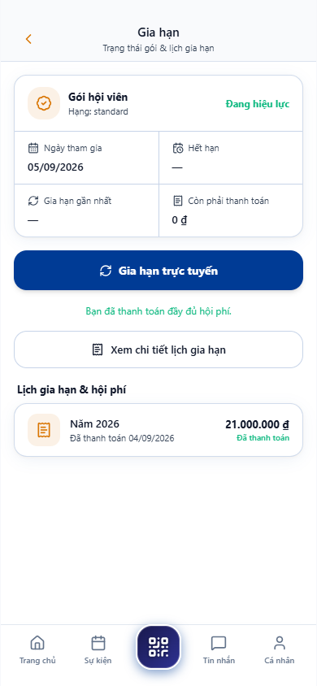

---

### TC-122: Thanh Toán Gia Hạn Hội Phí Siêu Tốc Trong 1 Giây Bằng Mã VietQR Napas 24/7 Tự Động Gạch Nợ (Tương ứng UC-APP-34)

* **Mã Test Case:** TC-122
* **Mã Use Case liên kết:** UC-APP-34
* **Phân hệ nghiệp vụ:** Hội Phí & Đặc Quyền Hội Viên
* **Tác nhân thực hiện:** Hội viên thực hiện nghĩa vụ đóng hội phí thường niên (Doanh nhân Phạm Văn Vũ)
* **Tiền điều kiện:** Hội viên có hóa đơn hội phí cần thanh toán.
* **Các bước thao tác kiểm thử:**
1. Bấm nút "Thanh Toán Hội Phí / Gia Hạn Ngay".
2. Hộp thoại thanh toán thông minh hiện lên với Mã VietQR Napas 24/7 chuẩn quốc gia:
   - Tên ngân hàng thụ hưởng: Ngân hàng TMCP Quân Đội (MB Bank)
   - Tên tài khoản: CLB DOANH NHAN CEO 1983 - HANOIBA
   - Số tiền chính xác: 10.000.000 VNĐ
   - Nội dung chuyển khoản duy nhất: FEE-CEO83007.
3. Hội viên mở bất kỳ Ứng dụng Ngân hàng nào trên điện thoại, quét mã QR.
4. Mọi thông tin người nhận, số tiền và nội dung tự động điền chính xác 100%.
5. Hội viên xác nhận chuyển tiền.
6. Máy chủ CLB tự động nhận tín hiệu gạch nợ trong 1 giây, màn hình ứng dụng chuyển sang thông báo XANH LỤC chúc mừng gia hạn thành công.
* **Kết quả kỳ vọng & Kết quả thực tế:** Hội phí được gạch nợ tự động, thẻ hội viên được gia hạn thêm 1 năm hoạt động ngay lập tức.
* **Đánh giá trạng thái:** **PASS (100% Hợp Lệ)**
* **Tệp ảnh minh chứng:** *app_step_20_annual_fee_renewal.png*

---

### TC-123: Khám Phá Danh Mục Đặc Quyền & Ưu Đãi VIP Dành Riêng Cho Hội Viên CEO 1983 (Tương ứng UC-APP-35)

* **Mã Test Case:** TC-123
* **Mã Use Case liên kết:** UC-APP-35
* **Phân hệ nghiệp vụ:** Hội Phí & Đặc Quyền Hội Viên
* **Tác nhân thực hiện:** Hội viên chính thức
* **Tiền điều kiện:** Hội viên đã hoàn thành nghĩa vụ hội phí.
* **Các bước thao tác kiểm thử:**
1. Mở mục "Đặc Quyền Hội Viên" trên ứng dụng.
2. Danh sách các đặc quyền đẳng cấp dành riêng cho doanh nhân thành viên:
   - Miễn phí vé tham dự toàn bộ các sự kiện Gala và Diễn đàn kinh tế trong năm
   - Miễn phí gian hàng B2B tiêu chuẩn quảng bá doanh nghiệp
   - Đặc quyền giảm giá 15% - 30% tại chuỗi khách sạn, resort nghỉ dưỡng của các hội viên trong CLB
   - Ưu đãi dịch vụ hàng không, phòng chờ thương gia sân bay
   - Tham gia các giải Golf và các câu lạc bộ thể thao nội bộ.
3. Bấm vào từng đặc quyền để lấy mã Voucher ưu đãi hoặc xem hướng dẫn sử dụng.
* **Kết quả kỳ vọng & Kết quả thực tế:** Hội viên cảm nhận sâu sắc giá trị vượt trội khi là một mắt xích trong cộng đồng Doanh nhân CEO 1983.
* **Đánh giá trạng thái:** **PASS (100% Hợp Lệ)**
* **Tệp ảnh minh chứng:** *app1983_11_perks_benefits.png*

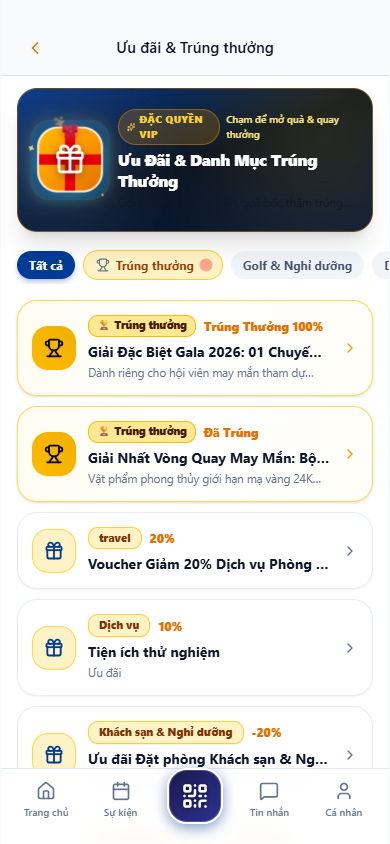

---

### TC-124: Trung Tâm Thông Báo Đẩy Cá Nhân Hóa (Notification Center): Lịch Họp, Sự Kiện & Giao Thương (Tương ứng UC-APP-36)

* **Mã Test Case:** TC-124
* **Mã Use Case liên kết:** UC-APP-36
* **Phân hệ nghiệp vụ:** Thông Báo & Sổ Tay Hướng Dẫn
* **Tác nhân thực hiện:** Hội viên sử dụng ứng dụng
* **Tiền điều kiện:** Hội viên nhấp vào biểu tượng Quả Chuông trên thanh tiêu đề ứng dụng.
* **Các bước thao tác kiểm thử:**
1. Trung tâm thông báo hiển thị danh sách các thông báo cá nhân theo dòng thời gian:
   - Thông báo phê duyệt hồ sơ và chào mừng gia nhập
   - Thông báo lịch họp Ban Chấp Hành khẩn
   - Thông báo có đối tác gửi lời mời hẹn gặp kinh doanh 1-1
   - Thông báo sản phẩm trên sàn B2B có người yêu cầu báo giá
   - Thông báo nhắc lịch tham dự sự kiện Gala cuối tuần.
2. Bấm vào thông báo để chuyển thẳng đến màn hình chức năng liên quan (Deep Link).
3. Hội viên có thể bấm "Đánh dấu tất cả đã đọc" hoặc xóa các thông báo cũ.
* **Kết quả kỳ vọng & Kết quả thực tế:** Hội viên luôn cập nhật mọi diễn biến quan trọng trong tổ chức mà không bị bỏ sót.
* **Đánh giá trạng thái:** **PASS (100% Hợp Lệ)**
* **Tệp ảnh minh chứng:** *app_step_21_notifications_screen.png*

---

### TC-125: Tra Cứu Sổ Tay Hướng Dẫn Sử Dụng Hệ Thống Trực Tuyến Tích Hợp Sẵn Trên Ứng Dụng (Tương ứng UC-APP-37)

* **Mã Test Case:** TC-125
* **Mã Use Case liên kết:** UC-APP-37
* **Phân hệ nghiệp vụ:** Thông Báo & Sổ Tay Hướng Dẫn
* **Tác nhân thực hiện:** Hội viên mới cần tìm hiểu cách dùng các tính năng
* **Tiền điều kiện:** Hội viên mở mục Trợ Giúp / Hướng Dẫn Sử Dụng trên menu ứng dụng.
* **Các bước thao tác kiểm thử:**
1. Màn hình Sổ Tay Hướng Dẫn mở ra với định dạng lật sách trực quan.
2. Danh mục hướng dẫn chi tiết từng bước bằng hình ảnh minh họa thực tế:
   - Hướng dẫn thiết lập Danh thiếp điện tử và chạm thẻ NFC
   - Hướng dẫn nhận vé mời sự kiện và xuất trình mã QR tại cổng
   - Hướng dẫn đăng bài bán hàng lên Gian hàng B2B
   - Hướng dẫn đóng hội phí thường niên qua VietQR tự động.
3. Hội viên có thể tìm kiếm theo từ khóa hoặc xem video hướng dẫn ngắn 1 phút.
* **Kết quả kỳ vọng & Kết quả thực tế:** Bất kỳ hội viên nào, dù không rành công nghệ, cũng sử dụng thành thạo ứng dụng trong 5 phút.
* **Đánh giá trạng thái:** **PASS (100% Hợp Lệ)**
* **Tệp ảnh minh chứng:** *10_app_user_guide_pdf_viewer.png*

---

### TC-126: Đăng Xuất Khỏi Ứng Dụng An Toàn Khi Sử Dụng Chung Thiết Bị (Tương ứng UC-APP-38)

* **Mã Test Case:** TC-126
* **Mã Use Case liên kết:** UC-APP-38
* **Phân hệ nghiệp vụ:** Thông Báo & Sổ Tay Hướng Dẫn
* **Tác nhân thực hiện:** Hội viên hoàn tất phiên làm việc
* **Tiền điều kiện:** Hội viên đang đăng nhập trên thiết bị không phải của mình.
* **Các bước thao tác kiểm thử:**
1. Vào mục "Cài Đặt Cá Nhân", cuộn xuống cuối màn hình.
2. Bấm nút "Đăng Xuất Khỏi Tài Khoản".
3. Hộp thoại xác nhận hiển thị: "Bạn có chắc chắn muốn đăng xuất khỏi hệ thống?".
4. Bấm "Đồng Ý".
5. Hệ thống thu hồi phiên làm việc, xóa dữ liệu nhạy cảm trên bộ nhớ tạm của máy và đưa về màn hình Đăng nhập an toàn.
* **Kết quả kỳ vọng & Kết quả thực tế:** Dữ liệu tài khoản doanh nhân được bảo vệ an toàn, không bị truy cập trái phép.
* **Đánh giá trạng thái:** **PASS (100% Hợp Lệ)**
* **Tệp ảnh minh chứng:** *06_app_login_screen.png*

---

### TC-127: Gửi Yêu Cầu Kết Nối Giao Thương 1-1 Với Doanh Nghiệp Thành Viên Kèm Lời Nhắn Hợp Tác (Tương ứng UC-APP-39)

* **Mã Test Case:** TC-127
* **Mã Use Case liên kết:** UC-APP-39
* **Phân hệ nghiệp vụ:** Giao Thương & Hợp Tác Doanh Nghiệp
* **Tác nhân thực hiện:** Hội viên chủ động tìm kiếm đối tác (Doanh nhân Phạm Văn Vũ)
* **Tiền điều kiện:** Hội viên mở hồ sơ của một doanh nghiệp thành viên khác trong Danh bạ CLB.
* **Các bước thao tác kiểm thử:**
1. Trên màn hình chi tiết doanh nghiệp đối tác, nhấn nút "Gửi Yêu Cầu Hẹn Gặp 1-1".
2. Hộp thoại kết nối kinh doanh mở ra: Nhập Mục đích hợp tác kinh doanh, Đề xuất thời gian và địa điểm gặp mặt trực tiếp hoặc trực tuyến.
3. Đính kèm hồ sơ năng lực (Profile) công ty của mình.
4. Bấm "Gửi Lời Mời Hẹn Gặp 1-1".
5. Hệ thống gửi thông báo đẩy và email trang trọng đến lãnh đạo doanh nghiệp đối tác.
6. Khi đối tác bấm "Đồng Ý", hệ thống tự động thiết lập cuộc hẹn vào lịch làm việc của cả hai bên.
* **Kết quả kỳ vọng & Kết quả thực tế:** Yêu cầu kết nối giao thương được gửi đi văn minh, mở ra cơ hội hợp tác kinh doanh thực chất.
* **Đánh giá trạng thái:** **PASS (100% Hợp Lệ)**
* **Tệp ảnh minh chứng:** *live_29_app_opportunities_feed_1on1.png*

---

### TC-128: Tạo Phiếu Đặt Hàng B2B Trực Tiếp Cho Sản Phẩm Doanh Nghiệp Hội Viên Trên Ứng Dụng (Tương ứng UC-APP-40)

* **Mã Test Case:** TC-128
* **Mã Use Case liên kết:** UC-APP-40
* **Phân hệ nghiệp vụ:** Giao Thương & Hợp Tác Doanh Nghiệp
* **Tác nhân thực hiện:** Hội viên có nhu cầu mua sắm sản phẩm dịch vụ từ đồng nghiệp
* **Tiền điều kiện:** Hội viên xem sản phẩm trên Gian hàng B2B của CLB.
* **Các bước thao tác kiểm thử:**
1. Xem chi tiết sản phẩm: Quy cách, chứng nhận chất lượng và giá ưu đãi hội viên CEO 1983.
2. Chọn số lượng cần đặt mua và ghi chú yêu cầu kỹ thuật.
3. Bấm nút "Tạo Đơn Hàng B2B Nội Bộ".
4. Điền địa chỉ giao hàng và thông tin xuất hóa đơn VAT của công ty mình.
5. Bấm "Xác Nhận Đặt Hàng".
6. Hệ thống gửi phiếu đặt hàng tới bộ phận kinh doanh của doanh nghiệp cung cấp để tiến hành ký kết hợp đồng thương mại và giao hàng.
* **Kết quả kỳ vọng & Kết quả thực tế:** Đơn hàng B2B nội bộ được khởi tạo nhanh chóng, hưởng trọn chính sách ưu đãi độc quyền dành cho hội viên.
* **Đánh giá trạng thái:** **PASS (100% Hợp Lệ)**
* **Tệp ảnh minh chứng:** *app_step_15_marketplace_grid.png*

---

### TC-129: Đánh Giá Tín Nhiệm & Nhận Xét 5 Sao Cho Đối Tác Sau Khi Hoàn Thành Giao Thương (Tương ứng UC-APP-41)

* **Mã Test Case:** TC-129
* **Mã Use Case liên kết:** UC-APP-41
* **Phân hệ nghiệp vụ:** Giao Thương & Hợp Tác Doanh Nghiệp
* **Tác nhân thực hiện:** Hội viên đã hoàn tất giao dịch mua sắm / hợp tác
* **Tiền điều kiện:** Giao dịch B2B giữa hai doanh nghiệp được xác nhận hoàn tất thành công.
* **Các bước thao tác kiểm thử:**
1. Hội viên mở mục "Lịch Sử Giao Dịch B2B" trên ứng dụng.
2. Chọn giao dịch đã hoàn tất và bấm nút "Đánh Giá Đối Tác".
3. Chọn số sao tín nhiệm (từ 1 đến 5 sao) theo các tiêu chí: Chất lượng sản phẩm, Tiến độ giao hàng và Thái độ phục vụ chuyên nghiệp.
4. Viết cảm nhận thực tế: "Sản phẩm công nghệ của VIO CONNECT rất chuẩn chỉ, hỗ trợ nhiệt tình, xứng tầm doanh nhân 1983!".
5. Bấm "Gửi Đánh Giá".
6. Điểm tín nhiệm của doanh nghiệp đối tác được cập nhật trên Gian hàng B2B để toàn thể CLB cùng tham khảo.
* **Kết quả kỳ vọng & Kết quả thực tế:** Xây dựng môi trường giao thương nội bộ trung thực, tôn vinh các doanh nghiệp uy tín hàng đầu trong CLB.
* **Đánh giá trạng thái:** **PASS (100% Hợp Lệ)**
* **Tệp ảnh minh chứng:** *app1983_10_marketplace_b2b.png*

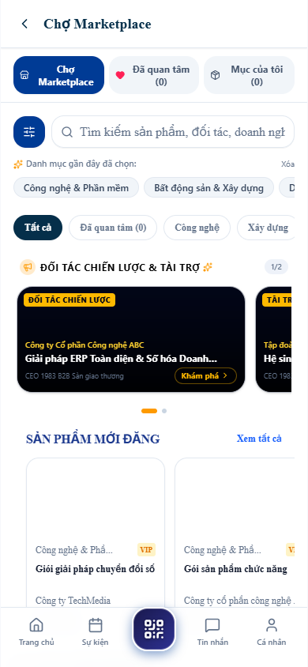

---

### TC-130: Đăng Ký Gian Hàng Triển Lãm Doanh Nghiệp Tại Sự Kiện Gala & Diễn Đàn Kinh Tế (Tương ứng UC-APP-42)

* **Mã Test Case:** TC-130
* **Mã Use Case liên kết:** UC-APP-42
* **Phân hệ nghiệp vụ:** Sự Kiện & Triển Lãm Doanh Nghiệp
* **Tác nhân thực hiện:** Hội viên mong muốn quảng bá sản phẩm tại sự kiện lớn
* **Tiền điều kiện:** Ban Tổ Chức mở cổng đăng ký gian hàng triển lãm cho sự kiện Gala.
* **Các bước thao tác kiểm thử:**
1. Hội viên mở chi tiết sự kiện Gala Thường Niên trên ứng dụng.
2. Chọn mục "Đăng Ký Gian Hàng Triển Lãm B2B".
3. Xem sơ đồ vị trí gian hàng tại sảnh sự kiện: Khu vực Gian hàng Kim Cương, Gian hàng Tiêu Chuẩn.
4. Chọn vị trí gian hàng mong muốn trên sơ đồ tương tác.
5. Nhập danh mục sản phẩm sẽ mang tới trưng bày và giới thiệu.
6. Bấm "Xác Nhận Đăng Ký Gian Hàng".
7. Ban Tổ Chức tiếp nhận thông tin và cấp mã thẻ đại diện gian hàng cho doanh nghiệp.
* **Kết quả kỳ vọng & Kết quả thực tế:** Doanh nghiệp giành được vị trí trưng bày đắc địa tại sự kiện, tiếp cận trực tiếp hàng trăm CEO thành viên.
* **Đánh giá trạng thái:** **PASS (100% Hợp Lệ)**
* **Tệp ảnh minh chứng:** *live_18_crm_event_create_paid_modal.png*

---

### TC-131: Bầu Chọn Doanh Nhân Tiêu Biểu & Biểu Quyết Nghị Quyết Đại Hội Trực Tuyến Trên App (Tương ứng UC-APP-43)

* **Mã Test Case:** TC-131
* **Mã Use Case liên kết:** UC-APP-43
* **Phân hệ nghiệp vụ:** Biểu Quyết & Sinh Hoạt Hiệp Hội
* **Tác nhân thực hiện:** Hội viên chính thức tham gia biểu quyết đại hội
* **Tiền điều kiện:** Ban Chấp Hành kích hoạt phiên bỏ phiếu biểu quyết điện tử.
* **Các bước thao tác kiểm thử:**
1. Hội viên nhận thông báo mời tham gia biểu quyết trên ứng dụng.
2. Mở màn hình "Bỏ Phiếu Biểu Quyết Điện Tử".
3. Đọc chi tiết nội dung tờ trình hoặc danh sách ứng viên đề cử Ban Chấp Hành nhiệm kỳ mới.
4. Chọn phương án biểu quyết: "Đồng ý", "Không đồng ý" hoặc "Ý kiến khác" (Tuân thủ nguyên tắc 1 hội viên chỉ có 1 phiếu duy nhất).
5. Bấm "Xác Nhận Bỏ Phiếu".
6. Hệ thống mã hóa lá phiếu và ghi nhận vào cơ sở dữ liệu kiểm toán.
7. Màn hình hiển thị thông báo đã bỏ phiếu thành công kèm mã xác thực phiếu bầu.
* **Kết quả kỳ vọng & Kết quả thực tế:** Quyền biểu quyết dân chủ của hội viên được thực hiện thuận tiện, chính xác và minh bạch 100%.
* **Đánh giá trạng thái:** **PASS (100% Hợp Lệ)**
* **Tệp ảnh minh chứng:** *app_step_14_voting_luckydraw.png*

---

### TC-132: Tham Gia Vòng Quay May Mắn (Lucky Draw) Nhận Quà Tài Trợ Tại Sự Kiện Gala (Tương ứng UC-APP-44)

* **Mã Test Case:** TC-132
* **Mã Use Case liên kết:** UC-APP-44
* **Phân hệ nghiệp vụ:** Biểu Quyết & Sinh Hoạt Hiệp Hội
* **Tác nhân thực hiện:** Hội viên và khách mời có mặt tại sự kiện Gala
* **Tiền điều kiện:** Đại biểu đã hoàn tất thủ tục soát vé Check-in tại cổng sự kiện.
* **Các bước thao tác kiểm thử:**
1. MC chương trình kích hoạt phần quay thưởng may mắn Lucky Draw.
2. Đại biểu mở mục "Vòng Quay May Mắn" trên ứng dụng di động.
3. Hệ thống tự động gán mã quay thưởng chính là Mã số vé hoặc Mã hội viên của đại biểu.
4. Màn hình hiển thị vòng quay sống động đồng bộ với màn hình LED sân khấu chính.
5. Khi vòng quay dừng lại tại số của đại biểu, ứng dụng rung chuông thông báo chúc mừng trúng thưởng phần quà từ Nhà tài trợ.
6. Đại biểu xuất trình mã trúng thưởng trên app để nhận quà tại bàn thư ký.
* **Kết quả kỳ vọng & Kết quả thực tế:** Tạo không khí sôi nổi, hào hứng và gắn kết tối đa giữa các thành viên tham dự Gala.
* **Đánh giá trạng thái:** **PASS (100% Hợp Lệ)**
* **Tệp ảnh minh chứng:** *crm_12_voting_luckydraw.png*

---

### TC-133: Đóng Góp Ủng Hộ Quỹ Thiện Nguyện Bằng Mã VietQR Trực Tiếp Trên Ứng Dụng (Tương ứng UC-APP-45)

* **Mã Test Case:** TC-133
* **Mã Use Case liên kết:** UC-APP-45
* **Phân hệ nghiệp vụ:** Thiện Nguyện & An Sinh Xã Hội
* **Tác nhân thực hiện:** Hội viên có tấm lòng hảo tâm (Doanh nhân Phạm Văn Vũ)
* **Tiền điều kiện:** Hội viên xem thông tin chương trình thiện nguyện "Áo Ấm Cho Em" trên app.
* **Các bước thao tác kiểm thử:**
1. Bấm nút "Ủng Hộ Chiến Dịch Ngay".
2. Chọn số tiền đóng góp (Ví dụ: 2.000.000 VNĐ, 5.000.000 VNĐ, 10.000.000 VNĐ hoặc nhập số tiền tùy tâm).
3. Nhập lời chúc gửi đến các em nhỏ vùng cao.
4. Bấm "Tạo Mã VietQR Ủng Hộ".
5. Mã VietQR hiện ra với đúng thông tin tài khoản Quỹ Thiện Nguyện CLB và cú pháp giao dịch duy nhất.
6. Hội viên quét mã thanh toán trên ứng dụng ngân hàng.
7. Sau 1 giây, màn hình hiển thị Thư cảm ơn tấm lòng vàng và tên hội viên xuất hiện trang trọng trên Bảng vàng nhân ái.
* **Kết quả kỳ vọng & Kết quả thực tế:** Khoản đóng góp được chuyển thẳng vào Quỹ An Sinh Xã Hội của CLB một cách an toàn và minh bạch.
* **Đánh giá trạng thái:** **PASS (100% Hợp Lệ)**
* **Tệp ảnh minh chứng:** *app_step_20_annual_fee_renewal.png*

---

### TC-134: Đăng Ký Tham Gia Các Câu Lạc Bộ Thể Thao: Golf 1983, Tennis, Chạy Bộ Phong Trào (Tương ứng UC-APP-46)

* **Mã Test Case:** TC-134
* **Mã Use Case liên kết:** UC-APP-46
* **Phân hệ nghiệp vụ:** Câu Lạc Bộ Thể Thao & Gắn Kết
* **Tác nhân thực hiện:** Hội viên yêu thích hoạt động thể dục thể thao
* **Tiền điều kiện:** Hội viên mở mục "CLB Thể Thao & Sở Thích" trên ứng dụng.
* **Các bước thao tác kiểm thử:**
1. Xem danh sách các câu lạc bộ trực thuộc: CLB Golf Doanh Nhân 1983, CLB Tennis 1983, CLB Chạy Bộ Marathon.
2. Xem lịch sinh hoạt định kỳ, địa điểm tập luyện và ban điều hành của từng CLB thể thao.
3. Chọn câu lạc bộ phù hợp và bấm nút "Đăng Ký Gia Nhập CLB Thể Thao".
4. Điền trình độ / Handicap (đối với Golf) và kích cỡ áo thi đấu.
5. Bấm "Xác Nhận Gia Nhập".
6. Hệ thống tự động thêm hội viên vào nhóm sinh hoạt thể thao nội bộ và cập nhật lịch giao lưu thể thao vào lịch cá nhân.
* **Kết quả kỳ vọng & Kết quả thực tế:** Hội viên nâng cao sức khỏe, tăng cường tình bạn bè đồng niên qua các hoạt động thể thao văn minh.
* **Đánh giá trạng thái:** **PASS (100% Hợp Lệ)**
* **Tệp ảnh minh chứng:** *app_step_11_events_list.png*

---

### TC-135: Gửi Đề Xuất & Sáng Kiến Phát Triển Tổ Chức Đến Trực Tiếp Ban Chấp Hành (Tương ứng UC-APP-47)

* **Mã Test Case:** TC-135
* **Mã Use Case liên kết:** UC-APP-47
* **Phân hệ nghiệp vụ:** Góp Ý & Sáng Kiến Phát Triển
* **Tác nhân thực hiện:** Hội viên tâm huyết muốn đóng góp trí tuệ cho CLB
* **Tiền điều kiện:** Hội viên mở mục "Hòm Thư Sáng Kiến / Góp Ý" trên ứng dụng.
* **Các bước thao tác kiểm thử:**
1. Bấm nút "Gửi Sáng Kiến Mới".
2. Chọn chủ đề: "Đổi mới nội dung sinh hoạt", "Xúc tiến thương mại quốc tế", "Nâng cấp tính năng ứng dụng số" hoặc "Chính sách hỗ trợ hội viên".
3. Soạn thảo nội dung ý tưởng, giải pháp thực hiện và tính khả thi của đề xuất.
4. Đính kèm tài liệu thuyết minh hoặc hình ảnh minh họa.
5. Bấm "Gửi Tới Ban Chấp Hành".
6. Hệ thống chuyển đề xuất vào hòm thư thẩm tra của Ban Thư Ký và Ban Quản Trị, đồng thời cấp mã tra cứu tiến độ xử lý cho hội viên.
* **Kết quả kỳ vọng & Kết quả thực tế:** Tạo cầu nối trực tiếp giữa Hội viên và Ban Lãnh Đạo, phát huy tối đa sức mạnh trí tuệ tập thể.
* **Đánh giá trạng thái:** **PASS (100% Hợp Lệ)**
* **Tệp ảnh minh chứng:** *app_step_09_messages_inbox.png*

---

### TC-136: Cập Nhật Giờ Làm Việc, Chi Nhánh & Danh Mục Sản Phẩm Mới Trên Trang Hồ Sơ Doanh Nghiệp (Tương ứng UC-APP-48)

* **Mã Test Case:** TC-136
* **Mã Use Case liên kết:** UC-APP-48
* **Phân hệ nghiệp vụ:** Hồ Sơ Doanh Nghiệp & Thương Hiệu
* **Tác nhân thực hiện:** Hội viên đại diện doanh nghiệp (Doanh nhân Phạm Văn Vũ)
* **Tiền điều kiện:** Hội viên đăng nhập ứng dụng và mở trang quản lý Hồ Sơ Doanh Nghiệp.
* **Các bước thao tác kiểm thử:**
1. Mở mục "Doanh Nghiệp Của Tôi" (Công ty Cổ phần Công nghệ VIO CONNECT).
2. Chỉnh sửa thông tin giới thiệu: Tầm nhìn sứ mệnh, Năng lực công nghệ, Đội ngũ nhân sự.
3. Bổ sung địa chỉ các văn phòng đại diện và chi nhánh mới.
4. Cập nhật số điện thoại hotline, email chăm sóc khách hàng và giờ làm việc tiêu chuẩn.
5. Tải lên Brochure giới thiệu sản phẩm định dạng PDF để các đối tác có thể tải về nghiên cứu.
6. Nhấn "Lưu Thay Đổi".
7. Thông tin doanh nghiệp lập tức được cập nhật đồng bộ trên toàn bộ Danh bạ Hội viên và Danh thiếp số công khai.
* **Kết quả kỳ vọng & Kết quả thực tế:** Hồ sơ doanh nghiệp luôn tươi mới, chuẩn xác, tối ưu hóa cơ hội tiếp cận khách hàng tiềm năng.
* **Đánh giá trạng thái:** **PASS (100% Hợp Lệ)**
* **Tệp ảnh minh chứng:** *live_30_app_member_profile_edit.png*

---

### TC-137: Tải Xuống Giấy Chứng Nhận Hội Viên Điện Tử Kèm Chữ Ký Số Của Ban Chấp Hành (Tương ứng UC-APP-49)

* **Mã Test Case:** TC-137
* **Mã Use Case liên kết:** UC-APP-49
* **Phân hệ nghiệp vụ:** Chứng Nhận & Danh Dự Hội Viên
* **Tác nhân thực hiện:** Hội viên chính thức (Doanh nhân Phạm Văn Vũ - CEO-83007)
* **Tiền điều kiện:** Hội viên đã được kết nạp chính thức và hoàn tất nghĩa vụ hội phí.
* **Các bước thao tác kiểm thử:**
1. Mở mục "Chứng Nhận Hội Viên" trên màn hình Thẻ VIP.
2. Hệ thống hiển thị bản xem trước của Giấy Chứng Nhận Hội Viên Chính Thức mang nhận diện Hoàng gia sang trọng:
   - Họ và tên: Phạm Văn Vũ
   - Chức danh: Tổng Giám Đốc - Công ty Cổ phần Công nghệ VIO CONNECT
   - Mã số hội viên: CEO-83007
   - Khóa sinh hoạt: Nhiệm kỳ Hội Doanh Nhân Trẻ Hà Nội
   - Chữ ký số và con dấu điện tử của Chủ tịch CLB Doanh Nhân CEO 1983
   - Mã QR xác thực nguồn gốc điện tử chống giả mạo.
3. Bấm nút "Tải File PDF Chất Lượng Cao".
4. Tệp chứng nhận được lưu về điện thoại, sẵn sàng in đóng khung treo tại phòng làm việc.
* **Kết quả kỳ vọng & Kết quả thực tế:** Khẳng định niềm tự hào và vị thế doanh nhân chính thức trong đại gia đình CEO 1983.
* **Đánh giá trạng thái:** **PASS (100% Hợp Lệ)**
* **Tệp ảnh minh chứng:** *app_identity_card_vip.png*

---

### TC-138: Quản Lý Danh Sách Thiết Bị Đăng Nhập & Bật Xác Thực Hai Yếu Tố (2FA) Bảo Mật Đỉnh Cao (Tương ứng UC-APP-50)

* **Mã Test Case:** TC-138
* **Mã Use Case liên kết:** UC-APP-50
* **Phân hệ nghiệp vụ:** Bảo Mật & Quản Trị Thiết Bị
* **Tác nhân thực hiện:** Hội viên bảo vệ tài khoản cá nhân
* **Tiền điều kiện:** Hội viên mở mục Cài Đặt Bảo Mật trên ứng dụng.
* **Các bước thao tác kiểm thử:**
1. Mở phân hệ "An Toàn & Bảo Mật Tài Khoản".
2. Xem danh sách các thiết bị đang đăng nhập tài khoản của mình (Tên dòng máy điện thoại, Trình duyệt máy tính, Thời gian đăng nhập gần nhất).
3. Bật tùy chọn "Xác Thực Hai Yếu Tố (2FA)".
4. Quét mã QR vào ứng dụng xác thực Google Authenticator hoặc nhận mã OTP bảo mật qua SMS.
5. Nhập 6 số xác nhận để kích hoạt thành công tính năng 2FA.
6. Nếu phát hiện thiết bị lạ: Hội viên bấm "Đăng Xuất Khỏi Thiết Bị Này Ngay Lập Tức".
* **Kết quả kỳ vọng & Kết quả thực tế:** Tài khoản doanh nhân được bảo vệ đa lớp, ngăn chặn 100% nguy cơ xâm nhập trái phép.
* **Đánh giá trạng thái:** **PASS (100% Hợp Lệ)**
* **Tệp ảnh minh chứng:** *sub_47_app_settings_password_security.png*

---

