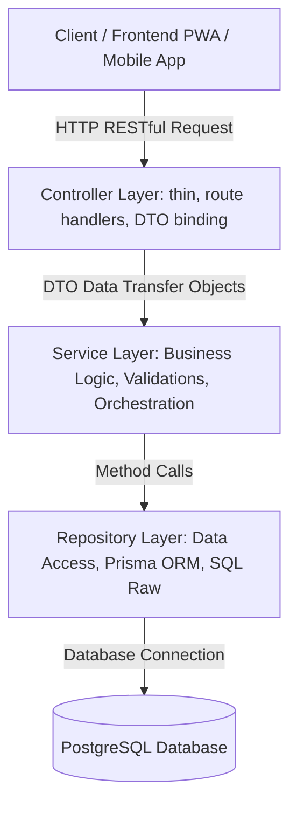

# ĐẶC TẢ KIẾN TRÚC BACKEND: REPOSITORY PATTERN & CHUẨN HÓA DTO RESTFUL API

## 1. Bối Cảnh & Mục Tiêu

Trước đây, mã nguồn của ứng dụng Backend (`apps/ceo1983_app_be`) gặp lỗi kiến trúc:
- **Trộn lẫn tầng dữ liệu và nghiệp vụ**: Logic truy vấn CSDL (các lệnh gọi Prisma Client, SQL queries `$queryRaw`, `$executeRaw`, DDL) bị viết trực tiếp bên trong các lớp `Service`.
- **Inline DTOs**: Nhiều DTO (Data Transfer Objects) được định nghĩa inline trong các file Service hoặc Controller, thiếu tính quy hoạch, khó tái sử dụng và vi phạm nguyên lý Single Responsibility.
- **Khó khăn trong bảo trì & kiểm thử**: Khi tầng nghiệp vụ gắn chặt với cú pháp ORM/SQL, việc viết Unit Test cho Service buộc phải mock toàn bộ Prisma Client phức tạp; đồng thời gây khó khăn khi tối ưu hóa câu lệnh SQL hoặc thay đổi mô hình lưu trữ.

**Mục tiêu giải quyết**:
1. Chuẩn hóa kiến trúc 3 tầng: **Controller $\rightarrow$ Service $\rightarrow$ Repository**.
2. Toàn bộ logic truy vấn CSDL được bóc tách sang các lớp **Repository** tương ứng theo từng module (`<name>.repository.ts`).
3. Toàn bộ DTOs được tách riêng vào thư mục con `dto/` kèm barrel `index.ts`.
4. Đảm bảo 100% tương thích ngược (Backward Compatibility) và Type-Check đạt `Exit code 0 (0 errors)`.

---

## 2. Kiến Trúc 3 Tầng Chuẩn RESTful API

### 2.1. Tầng Controller (`<name>.controller.ts`)
- **Nhiệm vụ**: Nhận HTTP request, bind dữ liệu vào các lớp DTO, xác thực phân quyền qua Guards (`JwtAuthGuard`, `RolesGuard`), gọi Service và trả về HTTP response với status code chuẩn RESTful.
- **Quy tắc**: Tuyệt đối không chứa logic nghiệp vụ phức tạp hoặc truy vấn CSDL.

### 2.2. Tầng Service (`<name>.service.ts`)
- **Nhiệm vụ**: Xử lý logic nghiệp vụ thuần túy, tính toán, kiểm tra quyền hạn, băm mật khẩu (bcrypt), điều phối gọi một hoặc nhiều Repositories, ném các ngoại lệ NestJS (`NotFoundException`, `BadRequestException`, `ForbiddenException`).
- **Quy tắc**: Tuyệt đối KHÔNG inject trực tiếp `PrismaService` để chạy câu lệnh `$queryRaw` hoặc truy vấn model nếu đã có Repository chuyên trách.

### 2.3. Tầng Repository (`<name>.repository.ts`)
- **Nhiệm vụ**: Là nơi duy nhất chịu trách nhiệm tương tác trực tiếp với cơ sở dữ liệu qua `PrismaService` (Prisma Client models, `$queryRaw`, `$executeRaw`).
- **Quy tắc**:
  - Khi sử dụng `$queryRaw`, luôn dùng tagged template strings của Prisma: `this.prisma.$queryRaw\`SELECT ... WHERE id = \${id}::uuid\``.
  - Tuyệt đối không nối chuỗi SQL thủ công nhằm phòng tránh SQL Injection.
  - Xử lý các phép chuyển đổi kiểu CSDL (UUID cast, BigInt/String, JSON parsing).

### 2.4. Tầng DTO (`dto/*.dto.ts` & `dto/index.ts`)
- **Nhiệm vụ**: Định nghĩa cấu trúc dữ liệu đầu vào cho các thao tác Tạo mới (`Create`), Cập nhật (`Update`), Truy vấn (`Query`), Lọc (`Filter`), và Hành vi nghiệp vụ (`Action`).
- **Quy tắc**:
  - Tách riêng mỗi nhóm nghiệp vụ vào một tệp `.dto.ts` độc lập.
  - Sử dụng barrel file `dto/index.ts` để re-export.
  - Sử dụng cú pháp `export type { ... }` khi re-export TypeScript interfaces/types theo chuẩn `isolatedModules`.

---

## 3. Danh Sách Các Module Đã Được Tái Cấu Trúc

| STT | Module | Repository File | DTO Directory & Files | Mô Tả Trách Nhiệm Data Access |
|---|---|---|---|---|
| 1 | `voting` | `voting.repository.ts` | `src/voting/dto/` (`create-poll.dto.ts`, `cast-vote.dto.ts`) | Khảo sát, cuộc bình chọn, các phương án lựa chọn, ghi nhận phiếu bầu, tính toán tỷ lệ phiếu |
| 2 | `reviews` | `reviews.repository.ts` | `src/reviews/dto/` (`create-review.dto.ts`, `update-review.dto.ts`) | Đánh giá hội viên/doanh nghiệp, metrics chấm điểm, kiểm duyệt nội dung đánh giá |
| 3 | `documents` | `documents.repository.ts` | `src/documents/dto/` (`create-document.dto.ts`, `update-document.dto.ts`) | Quản lý văn bản, quy chế, danh mục tài liệu, phân quyền bảo mật tài liệu nội bộ |
| 4 | `sponsors` | `sponsors.repository.ts` | `src/sponsors/dto/` (`sponsor-package.dto.ts`, `sponsor.dto.ts`, `event-prize.dto.ts`) | Gói tài trợ, hồ sơ nhà tài trợ, giải thưởng bốc thăm may mắn sự kiện |
| 5 | `tasks` | `tasks.repository.ts` | `src/tasks/dto/` (`task.dto.ts`) | Vòng đời nhiệm vụ, phân công, đánh giá tiến độ 4 cấp độ, file deliverables, nhắc việc |
| 6 | `business-card` | `business-card.repository.ts` | `src/business-card/dto/` (`business-card.dto.ts`) | Danh thiếp điện tử, cấu hình profile, liên kết thẻ NFC, truy vấn tương tác |
| 7 | `meetings` | `meetings.repository.ts` | `src/meetings/dto/` (`meeting.dto.ts`) | Lịch họp ban bệ, điểm danh, biểu quyết cuộc họp, biên bản kết luận |
| 8 | `users` | `users.repository.ts` | `src/users/dto/` (`user.dto.ts`) | Quản lý bảng `vione_users`, `user_profiles`, `user_roles`, raw SQL migrations & sync |
| 9 | `auth` | Tích hợp UsersRepo | `src/auth/dto/` (`auth.dto.ts`) | Đăng ký, đăng nhập, quên mật khẩu, đặt lại mật khẩu, đổi mật khẩu |
| 10 | `advertisements` | `advertisements.repository.ts` | `src/advertisements/dto/` (`create-advertisement.dto.ts`) | Banner quảng cáo, lượt hiển thị (impression), lượt click, đăng ký gian hàng VIP |
| 11 | `admin` | `admin.repository.ts` | `src/admin/dto/` (`admin.dto.ts`) | Quản trị demo leads, hóa đơn hội phí, thanh toán, nhắc nợ, audit logs hệ thống |
| 12 | `events` | `events.repository.ts` | `src/events/dto/` (`event.dto.ts`) | Sự kiện, hạng vé, đăng ký tham dự, check-in QR code, diễn giả, phiên thảo luận |
| 13 | `members` | `members.repository.ts` | `src/members/dto/` (`member.dto.ts`) | Hồ sơ hội viên, ban chuyên môn, lịch sử sinh hoạt, xác thực danh tính |
| 14 | `connect-app` | `connect-app.repository.ts` | `src/connect-app/dto/` (`connect-app.dto.ts`) | Hội thoại trực tiếp (Direct Message), trạng thái kết nối đối tác |

---

## 4. Chuẩn Quy Ước Mã Nguồn Cho Nhà Phát Triển

Khi bổ sung hoặc mở rộng một tính năng mới trong Backend:
1. **Tạo DTO trong `src/<feature>/dto/<name>.dto.ts`**:
   - Sử dụng `class` kết hợp các decorator validation (`class-validator`, `class-transformer`) hoặc `interface` có kiểu tường minh.
   - Thêm vào file `src/<feature>/dto/index.ts`.
2. **Tạo/Bổ sung Repository trong `src/<feature>/<name>.repository.ts`**:
   - Gắn decorator `@Injectable()`.
   - Inject `PrismaService`.
   - Triển khai các phương thức truy vấn CSDL: `findMany`, `findById`, `create`, `update`, `delete`, `$queryRaw`.
3. **Inject Repository vào Service `src/<feature>/<name>.service.ts`**:
   - Gọi phương thức của Repository thay vì viết trực tiếp `this.prisma...`.
   - Re-export các DTOs nếu cần tương thích ngược cho các module khác.
4. **Khai báo trong Module `src/<feature>/<name>.module.ts`**:
   - Đăng ký Repository vào mảng `providers`.
   - Thêm Repository vào mảng `exports` nếu module khác cần inject.
5. **Kiểm tra biên dịch Type-Check**:
   - Chạy `npx tsc --noEmit -p tsconfig.json` tại `apps/ceo1983_app_be`, đảm bảo không có lỗi type nào trước khi bàn giao.
