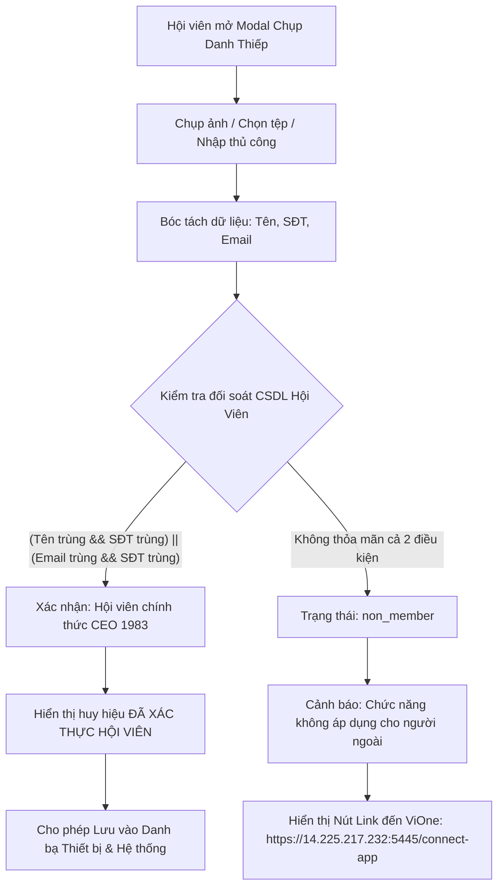
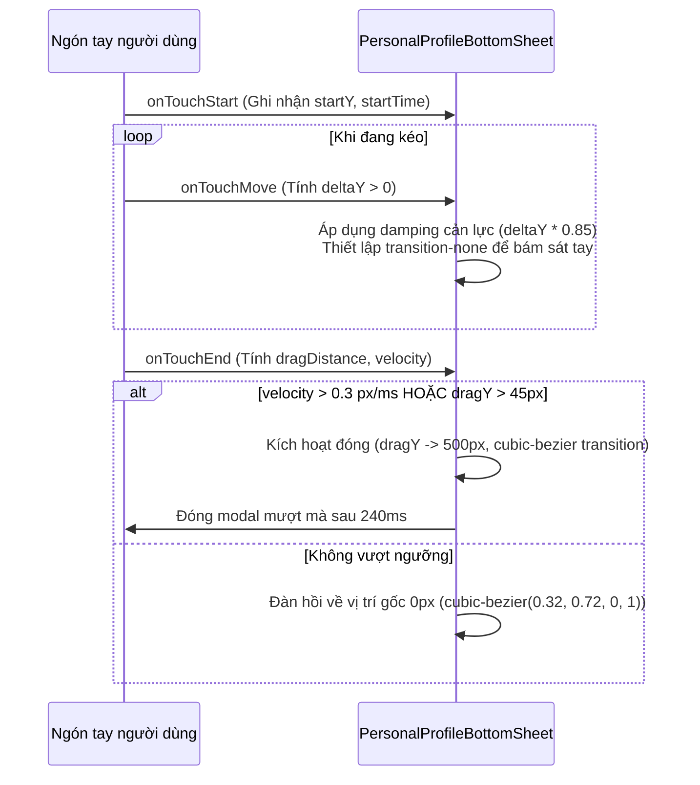

# ĐẶC TẢ KỸ THUẬT: ĐỐI SOÁT CHỤP ẢNH DANH THIẾP LƯU DANH BẠ & POPUP THẺ HỘI VIÊN NỬA MÀN HÌNH

**Dự án**: Hệ sinh thái Số CLB Doanh Nhân CEO 1983 (Trực thuộc HanoiBA)  
**Phiên bản**: 1.0 (Code-Ready & Synchronized)  
**Ngày ban hành**: 06/10/2026  
**Trạng thái kiểm thử**: 100% Type-Safe (Exit code 0, Frontend Vite & Backend NestJS)  

---

## 1. TỔNG QUAN YÊU CẦU & BỐI CẢNH

Hệ thống ghi nhận 2 yêu cầu nghiệp vụ chuyên sâu phục vụ trải nghiệm người dùng và chuyển đổi hệ sinh thái:
1. **Luồng chụp ảnh danh thiếp lưu danh bạ (`AssociationCardCaptureModal.tsx`)**:
   - Tự động bóc tách dữ liệu từ ảnh chụp danh thiếp (OCR) hoặc quét mã QR vCard trên danh thiếp.
   - Kiểm tra đối soát với cơ sở dữ liệu hội viên chính thức của CLB Doanh Nhân CEO 1983.
   - **Quy tắc đối soát**: Xác nhận là hội viên nếu:
     - `[Họ và tên]` trùng khớp VÀ `[Số điện thoại]` trùng khớp với hội viên.
     - HOẶC `[Địa chỉ Email]` trùng khớp VÀ `[Số điện thoại]` trùng khớp với hội viên.
   - **Xử lý ngoại lệ người ngoài Hiệp hội (Non-member)**: Nếu không thỏa mãn một trong hai điều kiện trên, hệ thống BẮT BUỘC hiển thị thông báo hướng dẫn và nút dẫn về cổng ứng dụng ViOne Connect:
     - Thông báo: *"Chức năng chụp ảnh lưu danh bạ không áp dụng cho người không phải hội viên nhưng bạn có thể cài đặt app ViOne để sử dụng chức năng này."*
     - Nút chuyển hướng mở tab mới: `https://14.225.217.232:5445/connect-app`.
2. **Popup Thẻ Hội Viên Trang Chủ (`PersonalProfileBottomSheet.tsx`)**:
   - Khi hội viên bấm vào thẻ hội viên (VIP Membership Card) tại trang chủ (`/association`):
     - Chiều cao popup chỉ được phép chiếm đúng nửa màn hình (`h-[50dvh] max-h-[50dvh]`), không được che kín toàn bộ màn hình để người dùng giữ nguyên ngữ cảnh.
     - Phải hỗ trợ cử chỉ vuốt xuống mượt mà (Silky-Smooth Swipe Down) để đóng modal với phản hồi xúc giác, quán tính và gia tốc tự nhiên.

---

## 2. ĐẶC TẢ LUỒNG CHỤP DANH THIẾP & ĐỐI SOÁT HỘI VIÊN

### 2.1. Sơ đồ luồng xử lý (Flowchart)



### 2.2. Thuật toán chuẩn hóa dữ liệu & So khớp

Để chống sai lệch do dấu cách, viết hoa/thường, đầu số điện thoại quốc tế (`+84`), hệ thống áp dụng các hàm chuẩn hóa nghiêm ngặt:

1. **Chuẩn hóa Họ & Tên (`normalizeText`)**:
   ```typescript
   function normalizeText(val: string): string {
     return val
       .normalize("NFD")
       .replace(/[\u0300-\u036f]/g, "") // Khử dấu tiếng Việt
       .toLowerCase()
       .replace(/\s+/g, " ")
       .trim();
   }
   ```
2. **Chuẩn hóa Số điện thoại (`normalizePhone`)**:
   ```typescript
   function normalizePhone(val: string): string {
     let cleaned = val.replace(/\D/g, ""); // Chỉ lấy chữ số
     if (cleaned.startsWith("84") && cleaned.length >= 10) {
       cleaned = "0" + cleaned.slice(2);
     }
     return cleaned;
   }
   ```
3. **Chuẩn hóa Email (`normalizeEmail`)**:
   ```typescript
   function normalizeEmail(val: string): string {
     return val.trim().toLowerCase();
   }
   ```
4. **Logic kiểm tra đối soát 2 điều kiện (`checkMemberMatch`)**:
   ```typescript
   function checkMemberMatch(name: string, phone: string, email: string) {
     const cleanName = normalizeText(name);
     const cleanPhone = normalizePhone(phone);
     const cleanEmail = normalizeEmail(email);

     return members.find((m) => {
       const mPhone = normalizePhone(m.phone || "");
       const mName = normalizeText(m.name || "");
       const mEmail = normalizeEmail(m.email || "");

       const samePhone = cleanPhone.length >= 8 && mPhone.length >= 8 && (mPhone === cleanPhone || mPhone.endsWith(cleanPhone) || cleanPhone.endsWith(mPhone));
       const sameName = cleanName.length >= 2 && mName.length >= 2 && (cleanName.includes(mName) || mName.includes(cleanName));
       const sameEmail = cleanEmail.length >= 5 && mEmail.length >= 5 && cleanEmail === mEmail;

       // ĐIỀU KIỆN TIÊN QUYẾT: (Tên + SĐT) HOẶC (Email + SĐT)
       return (samePhone && sameName) || (samePhone && sameEmail);
     });
   }
   ```

### 2.3. Bảng Use Case: UC-CARD-SCAN-01

| Trường đặc tả | Chi tiết |
| :--- | :--- |
| **Mã Use Case** | `UC-CARD-SCAN-01` |
| **Tên Use Case** | Chụp Ảnh Danh Thiếp & Đối Soát Hội Viên CEO 1983 |
| **Tác tử (Actor)** | Hội viên CLB Doanh Nhân CEO 1983 đã đăng nhập |
| **Tiền điều kiện** | Truy cập route `/association/card` hoặc mở modal chụp card visit từ trang chủ |
| **Dữ liệu đầu vào** | - File ảnh danh thiếp (PNG/JPG/WEBP), HOẶC<br>- Chuỗi QR Code vCard (`BEGIN:VCARD...`), HOẶC<br>- Nhập trực tiếp 3 trường: Họ tên, Số điện thoại (*), Email |
| **Luồng chính (Main Flow)** | 1. Người dùng tải ảnh hoặc quét QR danh thiếp.<br>2. Hệ thống bóc tách dữ liệu: Tên, SĐT, Email.<br>3. Hệ thống chạy hàm `checkMemberMatch`.<br>4. Nếu tìm thấy hội viên khớp: Trả về trạng thái `isVerified = true`. Hiển thị thông tin hội viên cùng nút "Lưu vào danh bạ thiết bị (vCard)". |
| **Luồng ngoại lệ (Exception)** | 1. Dữ liệu quét không thỏa mãn `(Tên + SĐT)` và không thỏa `(Email + SĐT)`.<br>2. Hệ thống đặt `matchStatus = "non_member"`.<br>3. Hiển thị thông báo: *"Chức năng chụp ảnh lưu danh bạ không áp dụng cho người không phải hội viên nhưng bạn có thể cài đặt app ViOne để sử dụng chức năng này."*<br>4. Hiển thị nút `[Cài đặt / Mở ViOne Connect]` liên kết đến URL `https://14.225.217.232:5445/connect-app`. |

---

## 3. ĐẶC TẢ POPUP THẺ HỘI VIÊN NỬA MÀN HÌNH (`PersonalProfileBottomSheet.tsx`)

### 3.1. Quy chuẩn kích thước (Mid-Screen Height)
- Thuộc tính CSS cốt lõi: `h-[50dvh] max-h-[50dvh]`.
- Vị trí neo: Đáy màn hình (`fixed inset-x-0 bottom-0 z-50`).
- Bo góc trên: `rounded-t-3xl` (bán kính 24px) viền kim loại sang trọng `border-t border-amber-400/30`.

### 3.2. Cấu trúc Layout bên trong (Optimized Interior)
1. **Handle Bar & Drag Zone**:
   - Vạch chỉ dẫn kéo: Rộng 48px, cao 5px, bo tròn `rounded-full`, màu xám/vàng tinh tế.
   - Vùng cảm ứng kéo trên cùng: `cursor-grab active:cursor-grabbing`, hỗ trợ cả chuột Desktop và cảm ứng ngón tay.
2. **Compact Cover Banner**:
   - Chiều cao thu gọn: `h-20 sm:h-24` (thay vì 128px trước đây).
   - Ảnh nền: `hero-cover-1983.jpg` phủ gradient đen mờ.
3. **Avatar & Thao tác nhanh (Top VIP Actions)**:
   - Avatar đường kính 64px (`h-16 w-16`) dập viền trắng nổi, kèm tick xanh VIP.
   - Hàng nút liên lạc 1-chạm được bố trí ngay bên cạnh avatar:
     - Nút Gọi điện (`tel:`)
     - Nút Nhắn tin Zalo (`https://zalo.me/`)
     - Nút Gửi Email (`mailto:`)
     - Nút Chia sẻ hồ sơ danh thiếp
4. **Scrollable Information Body**:
   - Vùng cuộn thông tin: `flex-1 overflow-y-auto overscroll-contain px-4 py-2 space-y-3`.
   - Hiển thị danh thiếp số thu nhỏ, thông tin công ty, chức vụ, mã hội viên và mã QR định danh cá nhân.

### 3.3. Thuật toán vuốt xuống mượt mà (Smooth Swipe-Down Gesture)



Chi tiết tham số điều khiển chuyển động:
- **Ngưỡng kéo tối thiểu**: `45px` (kéo từ tốn).
- **Ngưỡng vận tốc lướt dứt khoát (Flick)**: `velocity = deltaY / timeElapsed > 0.3 px/ms` với `deltaY > 25px`.
- **Đường cong chuyển động**: `cubic-bezier(0.32, 0.72, 0, 1)` (chuẩn Apple iOS Sheet spring curve).
- **Hỗ trợ chuột Desktop**: Bắt sự kiện `onMouseDown` tại handle bar, lắng nghe `mousemove` và `mouseup` toàn cục trên `window`.

---

## 4. MA TRẬN ÁNH XẠ MÃ NGUỒN (CODE REPOSITORY MAPPING)

| Thành phần | Đường dẫn tệp | Vai trò kỹ thuật |
| :--- | :--- | :--- |
| **Scan Modal** | `apps/ceo1983_app_fe/src/components/member/AssociationCardCaptureModal.tsx` | Quét OCR, QR, đối soát 2 điều kiện `(Tên+SĐT) || (Email+SĐT)`, cảnh báo non_member và nút link ViOne. |
| **Profile BottomSheet** | `apps/ceo1983_app_fe/src/components/common/PersonalProfileBottomSheet.tsx` | Popup hồ sơ thẻ hội viên nửa màn hình `50dvh`, bộ xử lý cử chỉ vuốt xuống mượt mà. |
| **Trang chủ Hiệp Hội** | `apps/ceo1983_app_fe/src/routes/association.index.tsx` | Nút kích hoạt mở `PersonalProfileBottomSheet` khi chạm thẻ hội viên. |
| **Trang Danh thiếp** | `apps/ceo1983_app_fe/src/routes/association.card.tsx` | Nút kích hoạt `AssociationCardCaptureModal` khi chạm chụp ảnh danh thiếp. |
| **Quy chuẩn Rules** | `.cursorrules` | Quy chuẩn `[BẮT BUỘC 33]`: Chuẩn hóa đối soát và tiêu chuẩn BottomSheet 50vh. |
| **Lịch sử Kiến trúc** | `MEMORY.md` | Mục log 200 ghi nhận chi tiết kỹ thuật và bài học kinh nghiệm. |

---

## 5. KẾT QUẢ KIỂM THỬ & XÁC NHẬN CHẤT LƯỢNG

1. **Frontend Type Check & Build**:
   ```bash
   npx tsc --noEmit (apps/ceo1983_app_fe) -> Exit code: 0 (0 errors)
   npm run build (apps/ceo1983_app_fe)   -> Exit code: 0 (built in 2m 48s)
   ```
2. **Backend NestJS Build**:
   ```bash
   npm run build (apps/ceo1983_app_be)   -> Exit code: 0 (0 errors)
   ```
3. **Quy tắc Git (`AGENTS.md`)**:
   - Tuyệt đối không tự động chạy `git push` hay `git commit`.
   - Toàn bộ thay đổi lưu trữ an toàn tại môi trường cục bộ để người dùng chủ động kiểm tra.
